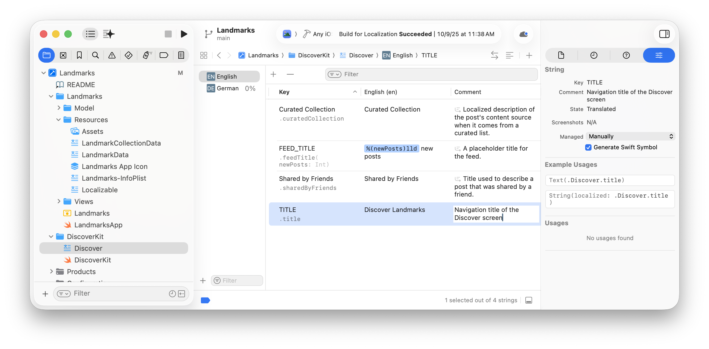
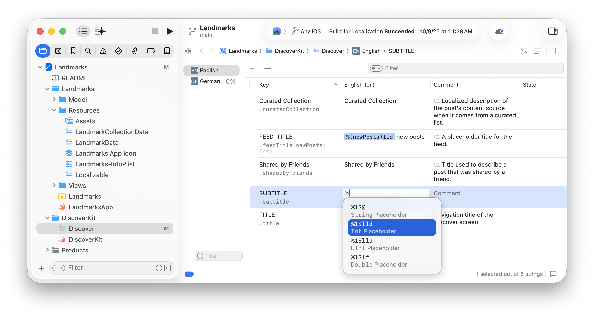
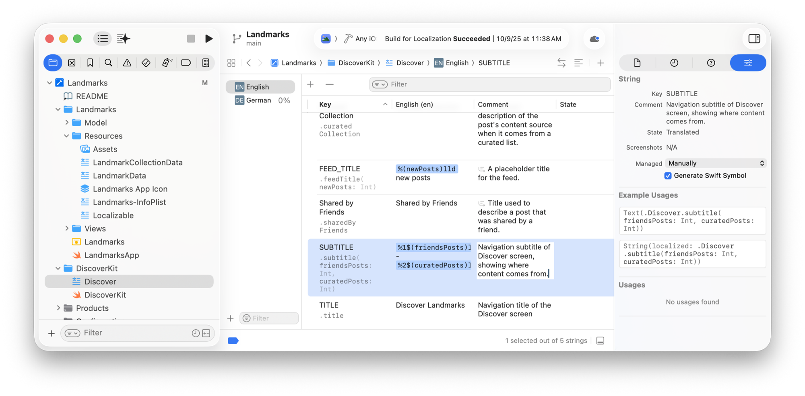
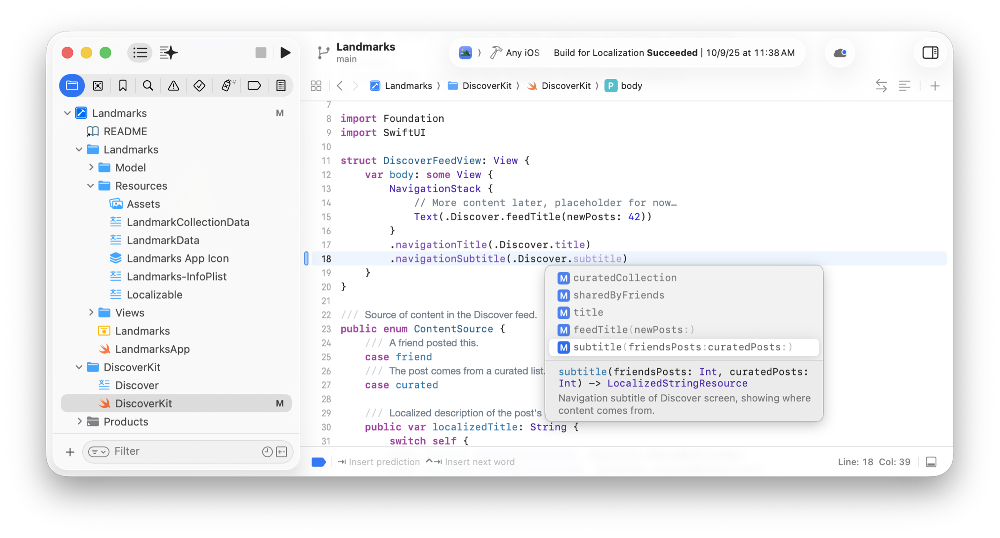
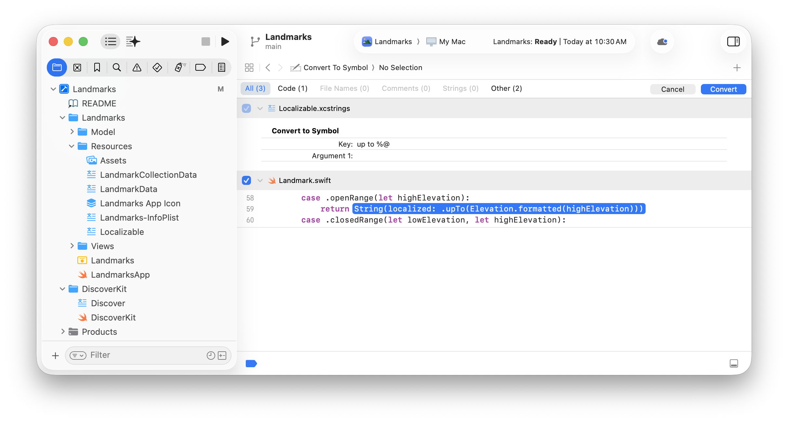

> 导航：[Technologies](../technologies.md) › [Xcode](../xcode.md) › [Localization](localization.md)

# 在代码中使用生成的可本地化符号

文章

直接向字符串目录添加键，并使用 Xcode 生成的可本地化符号在代码中引用这些键。

## 概述

如果你向字符串目录添加键，Xcode 可以自动生成符号，供你在代码中引用可本地化字符串。对于不含格式说明符的字符串，Xcode 会创建静态变量；对于含格式说明符的字符串，Xcode 会创建带参数的函数。

首先，对你的 App 进行国际化，并在代码和界面文件中使用可本地化字符串。构建 target 时填充字符串目录，并自动生成注释，为翻译人员提供更多上下文。然后，你还可以选择生成可本地化符号，将键与其值分离，这样便可迭代文本而无需更改代码。你可以在整个项目中单独使用这两种方法，也可以将它们结合使用。

有关如何根据代码中的可本地化字符串创建字符串目录的更多信息，请参阅[使用字符串目录本地化文本并创建变体](localizing-and-varying-text-with-a-string-catalog.md)。

### 启用自动符号生成

对于较旧的项目，你可能需要在构建设置中启用 Generate String Catalog Symbols。在项目编辑器中，选择边栏中的项目，然后点按编辑器区域中的 Build Settings。在筛选栏中输入“Generate String”，然后在 Localization 下将 Generate String Catalog Symbols 设置为 `Yes`。

### 向字符串目录添加键

你可以直接向字符串目录添加可本地化字符串，然后在代码中使用 Xcode 为其生成的符号。

1. 在字符串目录编辑器中，选择边栏中的源本地化语言（此示例中为英语）或其他语言。
2. 点按字符串目录编辑器工具栏中的添加按钮（+，位于筛选栏最左侧）。
3. 在表格中，输入键名、译文以及供翻译人员参考的注释。

一张 Xcode 截图，其中 Project navigator 选中了 Discover 文件，左侧选中了英语，中间输入了一个不含变量的键，右侧检查器中显示了示例用法。

对于边栏中的其他语言，Xcode 会在 State 列中显示 New 图标。

### 添加带变量的可本地化字符串

要添加带变量的可本地化字符串，请在语言列中输入 `%` 字符，然后从代码补全菜单中选择与变量类型匹配的字符串。例如，从菜单中选择整数或双精度浮点数占位符的格式说明符。接着，在 Xcode 于表格中高亮显示的 `variableName` 占位文本处输入变量名。按下 Return 键完成输入并确认字符串。

一张 Xcode 截图，其中 Project navigator 选中了 Discover 文件，左侧选中了英语，中间的英语列中输入了 % 字符。% 字符下方显示了代码补全菜单，其中选中了整数变量菜单项。

你可以向可本地化字符串添加多个不同类型的变量，但每个变量名只能使用一次。

### 在代码中使用生成的可本地化符号

Xcode 会根据你在字符串目录中输入的键和译文生成符号，以便你从代码中访问这些键。对于不含变量的可本地化字符串，Xcode 会创建静态属性；对于包含格式说明符的可本地化字符串，Xcode 会创建带有相应参数的函数。

对于默认 `Localizable` 文件中的键，符号以句点（.）开头，后跟符号名称。否则，符号会依次包含表名、句点和符号名称，如 `.[table name].[symbol name]` 所示。

例如，对于添加到 `Discover` 字符串目录且不含变量的 `TITLE` 键，Xcode 会创建类型为 [LocalizedStringResource](../foundation/localizedstringresource.md) 的 `.Discover.title` 静态属性。对于译文为 `%1$(friendsPosts)lld - %2$(curatedPosts)lld` 的 `SUBTITLE` 键，Xcode 会创建 `.Discover.subtitle(friendsPosts: Int, curatedPosts: Int)` 函数，该函数返回 `LocalizedStringResource`。

在 SwiftUI 中，凡是使用可本地化字符串的地方都可以使用 `LocalizedStringResource` 类型。其他情况下，可以在 `String` 的 [init(localized:)](<../swift/string/init(localized_).md>) 初始化器或 `AttributedString` 的 [init(localized:)](<../foundation/attributedstring/init(localized_).md>) 初始化器中使用生成的静态属性或函数。

首先，熟悉生成的可本地化符号的样式及其在代码中的用法。在字符串目录中选择键并打开 Attributes 检查器。如果 String 下显示已选中的 Generate Swift Symbol 复选框，则该字符串具有符号。SwiftUI 和非 SwiftUI App 的代码片段都会显示在 Example Usages 下。

一张 Xcode 截图，其中 Project navigator 选中了 Discover 文件，左侧选中了英语源本地化语言，字符串目录编辑器中选中了 SUBTITLE 键，检查器中显示了生成符号的示例用法。

然后，在源代码编辑器中编写代码时，使用代码补全快速输入这些符号。先输入句点，后跟键路径。然后从出现的代码补全菜单中选择符号。对于含格式说明符的字符串，请将占位文本替换为你的变量。

一张 Xcode 截图，其中 Project navigator 选中了一个 Swift 文件；输入 .Discover. 后出现代码补全菜单，其中选中了生成的符号菜单项。

### 重构代码以使用生成的符号

你可以明确地将代码和界面文件中的可本地化字符串转换为生成的符号。

在字符串目录编辑器中，选择表格中的一个或多个键，按住 Control 键点按所选键，然后选取 Refactor \> Convert Strings to Symbols。生成的符号预览会显示字符串目录中键的更改，以及 Xcode 在源代码中添加符号的位置。若要在当前代码和修改后的代码之间切换，请点按高亮显示的代码。若要生成符号并应用代码更改，请点按右上角的 Convert。

一张 Xcode 截图，其中项目编辑器显示了生成符号预览，预览中展示了字符串目录和源代码的更改，右上角显示 Convert 按钮。

你还可以编辑 Convert to Symbol 下显示的可本地化字符串，以更改符号的签名。例如，可根据需要将签名改得更具语义或更符合你的风格。对于含格式说明符的字符串，还可以更改参数名称。

若要撤销更改，请选择一个或多个键，然后从弹出式菜单中选取 Convert Symbols to Strings。你也可以将现有的生成符号改回字符串。

## 另请参阅

### 基础

- [在 App 中支持多种语言](supporting-multiple-languages-in-your-app.md) — 对 App 的字符串、图像和其他资源类型进行国际化，为本地化做好准备。
- [使用智能体本地化你的 App](localizing-your-app-using-agents.md) — 使用智能体式编码工具，将 App 中的字符串翻译为多种语言和区域版本。
- [使用字符串目录本地化文本并创建变体](localizing-and-varying-text-with-a-string-catalog.md) — 使用字符串目录管理可本地化字符串、添加语言、翻译文本、处理复数形式，以及根据设备提供文本变体。
- [本地化 Landmarks](localizing-landmarks.md) — 为 Landmarks 示例代码项目添加本地化内容。
