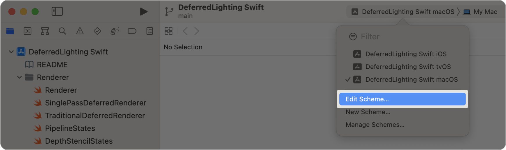
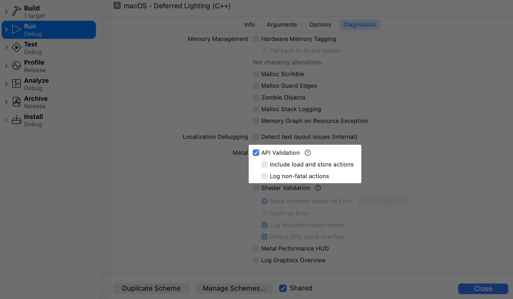

> ???[Technologies](../technologies.md) ? [Xcode](../xcode.md) ? [Debugging](debugging.md) ? [Metal developer workflows](metal-developer-workflows.md)

# ?? App ? Metal API ????

??

?? API Validation ?? Metal App ????????

## ??

API Validation ???????? Metal API ????????????? Metal ????????????????????? Xcode ???????????????? API Validation?

> [!important] ??
> API Validation ??? CPU ??????????????

### ? Xcode ??? API Validation

???????????????????????? API Validation?

1. ? Xcode ?????? Scheme ???? Edit Scheme?????? Product \> Scheme \> Edit Scheme?
2. ??????????? Run?
3. ???????????? Diagnostics?
4. ?? API Validation ????????? Close?

???????????Xcode ???? API Validation?

?????? Diagnostics ??????? API Validation ???

- Include load and store actions????????????????????????????? [MTLLoadAction.dontCare](../metal/mtlloadaction/dontcare.md) ????????? [MTLLoadAction.clear](../metal/mtlloadaction/clear.md)??????? [MTLStoreAction.dontCare](../metal/mtlstoreaction/dontcare.md) ??????????????????????????????????????????????????????????
- Log non-fatal actions????????? App ????????? Metal ??????????????? Metal App?

> [!note] ??
> ?????????????????

### ???????? API Validation

????? Metal App ???????????? API Validation?

- **MTL_DEBUG_LAYER=1** ? ???? API Validation ???
- **MTL_DEBUG_LAYER_ERROR_MODE** ? ?????????????????? `assert`??????`ignore` ? `nslog`?`assert` ?????????????????????`ignore` ?????????????????????`nslog` ??????? [NSLog](../foundation/nslog.md) ?????????????????
- **MTL_DEBUG_LAYER_VALIDATE_LOAD_ACTIONS=1** ? ???????? [MTLLoadAction.dontCare](../metal/mtlloadaction/dontcare.md) ??? [MTLLoadAction.clear](../metal/mtlloadaction/clear.md)?????????????????????? [MTLLoadAction.dontCare](../metal/mtlloadaction/dontcare.md) ????????
- **MTL_DEBUG_LAYER_VALIDATE_STORE_ACTIONS=1** ? ????? [MTLStoreAction.dontCare](../metal/mtlstoreaction/dontcare.md) ???????????????????????????????????????? [MTLStoreAction.dontCare](../metal/mtlstoreaction/dontcare.md) ????????
- **MTL_DEBUG_LAYER_VALIDATE_UNRETAINED_RESOURCES** ? ???????????????????? 0x1????????- **0x1** ? ???????????????????????????????????????????????????????Metal Validation ???????
- **0x2** ? ?????????????????????????????????????????????????????????
- **0x4** ? ???????????????????????????????????????????????????????????????????????
- **MTL_DEBUG_LAYER_WARNING_MODE** ? ?????????????????? `assert`?`ignore`??????`nslog` ? `oslog`?`assert` ?????????????????????`ignore` ??????????`nslog` ??????? [NSLog](../foundation/nslog.md) ?????`oslog` ??????? [os_log](../os/os_log.md) ?????

?????????????????? `man MetalValidation`?

> [!note] ??
> API Validation ??? [MTLCommandBuffer](../metal/mtlcommandbuffer.md) ??????????????? [MTL4CommandBuffer](../metal/mtl4commandbuffer.md) ?????

## ????

### ?????

- [??????????](inspecting-live-resources-at-runtime.md) ? ?? Metal App ?????????????????????
- [?? App ? Metal ???????](validating-your-apps-metal-shader-usage.md) ? ?? Shader Validation ??????????????
- [?? Metal App ?????](monitoring-your-metal-apps-graphics-performance.md) ? ? App ?????? Metal Performance HUD ???????
- [??? Metal Performance HUD](customizing-metal-performance-hud.md) ? ?? Metal ?????????????????
- [?? Metal Performance HUD ??](understanding-metal-performance-hud-metrics.md) ? ?????????????????????
- [?? Metal Performance HUD ??????](gaining-performance-insights-with-metal-performance-hud.md) ? ? App ?????? Metal ???????????????
- [?? Metal Performance HUD ??????](generating-performance-reports-with-metal-performance-hud.md) ? ????????? App ????
