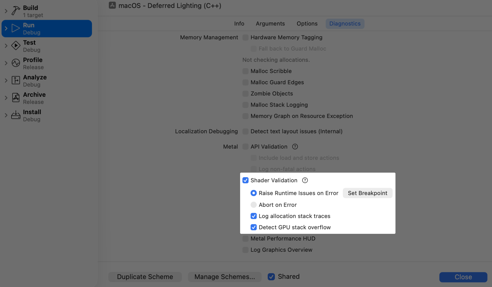
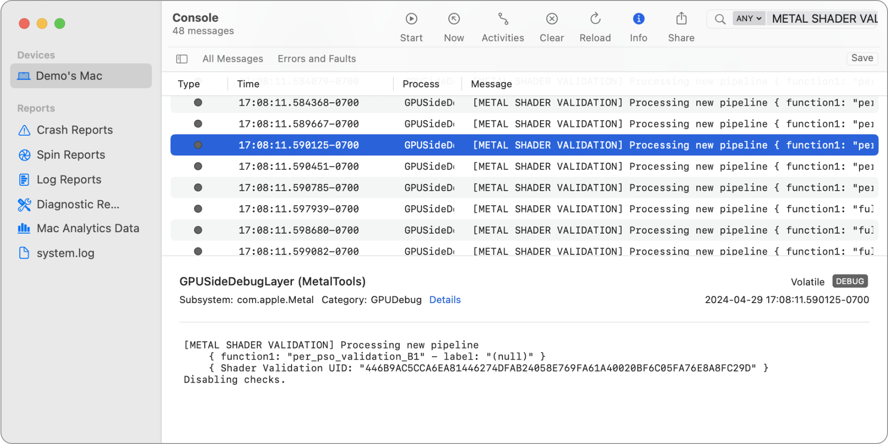
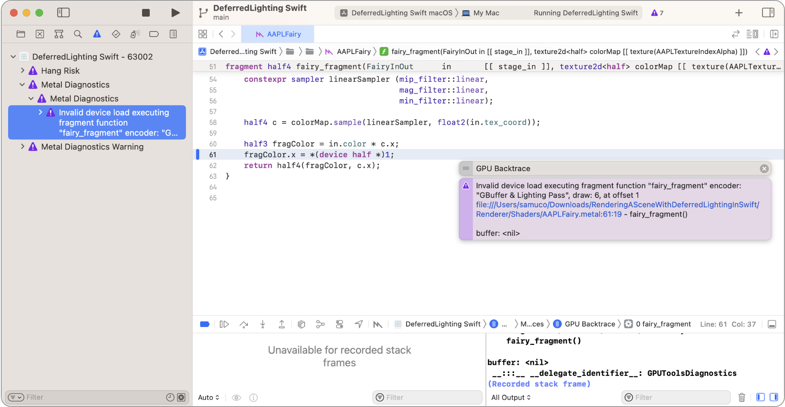
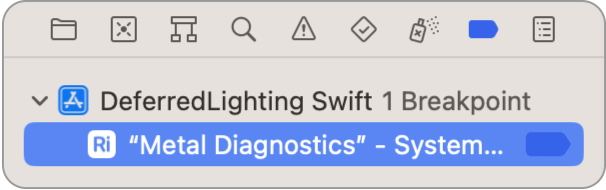

> 导航：[Technologies](../technologies.md) · [Xcode](../xcode.md) · [Debugging](debugging.md) · [Metal developer workflows](metal-developer-workflows.md)

# 验证 App 的 Metal 着色器用法

<sub>文章</sub>

使用 Shader Validation 捕获常见的着色器运行时问题。

## 概述

Metal Shader Validation 可检测只能在着色器执行期间发现的错误，例如访问非驻留资源、越界内存访问、未定义行为，以及尝试访问 `nil` 纹理。

Shader Validation 可在 Metal App 中检测的问题示例包括：

| 问题 | 导致问题的行为 |
|---|---|
| 资源未驻留 | 使用着色器中的资源或 Metal 4 命令，但这些资源既不在任何与命令缓冲区或队列关联的驻留集中，也未出现在 `useResource:usage:[stages:]` 调用中。 |
| 越界内存访问 | 在从主机传递给 GPU 的缓冲区边界之外加载或存储数据，或者访问张量对象中不正确的索引、切片或秩。 |
| 误用 Metal Performance Primitives | 涉及张量秩、对齐、步幅、平面或越界访问的错误。 |
| 未定义的插值变量行为 | 作为顶点着色器输出的一部分，将 `INF` 或 `NaN` 存储到属性不是 `[[position]]` 的成员所对应的顶点插值变量中。 |
| 使用空资源 | 访问空纹理或缓冲区。 |
| 非法的地址空间转换 | 将通用地址空间中的指针转换到错误的特定地址空间。 |
| 绑定错误的纹理类型 | 着色器期望的纹理类型与 App 传入的类型不同。注意：从 GPU 系列 `MTLGPUFamilyApple10` 开始，可以将纹理数组绑定到期望普通纹理的槽位，反之亦然。 |
| 绑定错误的加速结构类型 | 着色器期望实例化加速结构，但 App 绑定了图元加速结构，或反之。 |
| 使用标志不匹配 | 在 Metal 4 之前的 Metal 版本中，着色器使用纹理的方式与传给 `useResource:usage:[stages:]` 的 usage 参数不一致。 |

你可以通过 Xcode 中的运行时诊断选项启用 Shader Validation，并在 Xcode UI 中直观查看问题；也可以使用环境变量，将结果输出到 App 的标准错误流或日志流。

为确保看到最新的调试信息，请将 App 的部署 target 设置为与操作系统版本匹配，即使只是临时设置。你可以在 Xcode 项目设置中更改部署 target。如果只是临时更改，请记得在部署 App 前将其改回。

> [!important] 重要
> Shader Validation 层会相应影响 GPU 性能，着色器在运行时的编译时间也可能更长。此层会向所有 GPU 函数添加插桩代码，从而增加函数执行的工作量和访问内存的次数。

有关更多信息，请参阅 WWDC20 视频[在 Metal 中调试 GPU 端错误](https://developer.apple.com/videos/play/wwdc2020/10616/)和 WWDC21 视频[探索 Metal 调试、性能分析和资产创建工具](https://developer.apple.com/videos/play/wwdc2021/10157?time=770)。

### 在 Xcode 中启用 Shader Validation

按照以下步骤，使用 Scheme 设置中的运行时诊断选项启用 Shader Validation：

1. 在 Xcode 工具栏中，从 Scheme 菜单选取 Edit Scheme。也可以选取 Product \> Scheme \> Edit Scheme。
2. 在 Edit Scheme 对话框中，选择 Run。
3. 点按 Diagnostics 标签页。
4. 选择 Shader Validation 将其启用，然后点按 Close。

每次运行 Scheme 时，Xcode 都会启用 Shader Validation。



<sub>一张 Metal 验证选项的截图，其中启用了 Shader Validation 选项，并高亮显示了快速跳转按钮。</sub>

### 自定义 Shader Validation 选项

你可以在 Diagnostics 标签页中自定义 Shader Validation 的行为：

选择 Raise Runtime Issues on Error，将 Shader Validation 检测到的错误记录到 Issue navigator。指定此选项后，你还可以创建着色器断点。

选择 Abort on Error，让 Shader Validation 在记录错误时停止程序。适用于 GPU 反复重新启动影响系统响应能力的情况。

启用 Log Allocation Stacktraces，跟踪 App 分配 Metal 资源时的 CPU 堆栈回溯。使用此选项可获取错误所涉及资源的 CPU 分配堆栈回溯。此选项会增加内存用量。

选择 Detect GPU Stack Overflow，检查由间接函数调用和递归导致的 GPU 栈溢出。

> [!note] 注意
> 除设置 Xcode 着色器断点外，你可以通过下文“使用环境变量启用 Shader Validation”一节中的环境变量控制这些选项。

### 有选择地启用 Shader Validation

启用 Shader Validation 时，你还可以选择仅对特定管线启用（或停用）Shader Validation。当你希望将调试重点放在特定管线上时，这种高级控制尤其有用。由于减少了插桩管线的数量，它还可以显著提升被调试 App 的性能。

Shader Validation 默认会对所有管线进行插桩（`MTL_SHADER_VALIDATION_DEFAULT_STATE=all`）。若要更改此行为，可以设置 `MTL_SHADER_VALIDATION_DEFAULT_STATE=none`。

接下来，可以设置 `MTL_SHADER_VALIDATION_ENABLE_PIPELINES` 和 `MTL_SHADER_VALIDATION_DISABLE_PIPELINES`，有选择地为指定管线启用和停用插桩。你可以使用管线标签和 Shader Validation 唯一标识符（UID）作为条目（请参阅[输出管线 UID](Print-pipeline-UIDs)）。多个条目需要用逗号分隔，且不能包含空格（有关更多信息，请参阅 `man MetalValidation`）。在以下示例中，标签为 `foo` 的管线是仅有的未由 Shader Validation 插桩的管线。

**Swift**

```swift
let descriptor = MTLRenderPipelineDescriptor()
descriptor.label = "foo"
pipeline = ...
```

**Objective-C**

```obj-c
MTLRenderPipelineDescriptor *descriptor = ...;
descriptor.label = @"foo";
pipeline = ...
```

**C++**

```cpp
MTL::RenderPipelineDescriptor* descriptor = ...;
descriptor->setLabel(MTLSTR("foo"));
pipeline = ...
```

```zsh
> export MTL_SHADER_VALIDATION=1
> export MTL_SHADER_VALIDATION_DEFAULT_STATE=all
> export MTL_SHADER_VALIDATION_DISABLE_PIPELINES="foo"
...

> ./<application>
```

此外，你可以通过编程方式，将管线描述符的 [shaderValidation](https://developer.apple.com/documentation/metal/mtlrenderpipelinedescriptor/4354231-shadervalidation) 属性设置为 `MTLShaderValidationEnabled` 或 `MTLShaderValidationDisabled`。

在以下示例中，`pipe` 是仅有的由 Shader Validation 插桩的管线。

**Swift**

```swift
let descriptor = MTLRenderPipelineDescriptor()
descriptor.shaderValidation = .enabled
pipe = try device.makeRenderPipelineState(descriptor: descriptor)
```

**Objective-C**

```obj-c
MTLRenderPipelineDescriptor *descriptor = ...;
descriptor.shaderValidation = MTLShaderValidationEnabled;
pipe = [device newRenderPipelineStateWithDescriptor:descriptor error:&error];
```

**C++**

```cpp
MTL::RenderPipelineDescriptor* descriptor = ...;
descriptor->setShaderValidation(MTL::ShaderValidationEnabled);
pipe = device->newRenderPipelineState(descriptor, &error);
```

```zsh
> export MTL_SHADER_VALIDATION=1
> export MTL_SHADER_VALIDATION_DEFAULT_STATE=none
> ...

> ./<application>
```

最后，可以通过管线状态对象的 [shaderValidation](https://developer.apple.com/documentation/metal/mtlrenderpipelinestate/4354232-shadervalidation) 属性查询管线的 Shader Validation 状态。

### 输出管线 UID

Shader Validation 会为你处理的所有管线生成 UID，可将其用作 `MTL_SHADER_VALIDATION_ENABLE_PIPELINES` 和 `MTL_SHADER_VALIDATION_DISABLE_PIPELINES` 的条目。当 App 没有管线标签时，这种方式很有用。

若要将 UID 输出到 Console 或 `log stream` 实例，请在终端或 Xcode Environment Variables Scheme 设置中设定 `MTL_SHADER_VALIDATION_DUMP_PIPELINES=1`。

> [!note] 注意
> 若要查看日志，请前往 Action \> Include Debug Messages in Console。



### 在 Xcode 中查看 Shader Validation 错误

启用 Shader Validation 后，如果 Metal 在执行命令缓冲区中的命令时遇到错误，Xcode 会在源代码编辑器中显示错误详情，如下所示：



如果日后想修改或移除断点，可以在 Breakpoint navigator 中找到它。有关更多信息，请参阅[设置断点以暂停正在运行的 App](setting-breakpoints-to-pause-your-running-app.md)。



如果在着色器中发现错误，可以考虑进行捕获，并使用着色器调试器进行调查（请参阅[调查视觉瑕疵](investigating-visual-artifacts.md)）。

### 在终端中查看 Shader Validation 错误

即使无法访问源代码，也可以通过环境变量为任何 Metal App 启用 Shader Validation。

默认情况下，Shader Validation 会将发现的所有问题记录到操作系统日志中。你可以使用 `log stream` 命令直接在终端中查看这些问题：

`log stream -process <appname>`

还可以通过设置环境变量 `MTL_SHADER_VALIDATION=1` 和 `MTL_SHADER_VALIDATION_REPORT_TO_STDERR=1`，将 Shader Validation 配置为把消息复制到 App 的标准错误流。

### 使用环境变量启用 Shader Validation

你还可以在 Metal App 上设置以下环境变量，以启用 Shader Validation 并自定义其行为：

- **`MTL_SHADER_VALIDATION=1`** — 启用所有 Shader Validation 测试。
- **`MTL_SHADER_VALIDATION_ENABLE_ERROR_REPORTING=1`** — 启用 Shader Validation 错误报告。
- **`MTL_SHADER_VALIDATION_REPORT_TO_STDERR=1`** — 将 Shader Validation 消息输出到标准错误流。
- **`MTL_SHADER_VALIDATION_ABORT_ON_FAULT=1`** — 让 Shader Validation 在记录错误时停止程序。适用于 GPU 反复重新启动影响系统响应能力的情况。
- **`MTL_SHADER_VALIDATION_COMPILER_INLINING`** — 确定进行代码内联的程度。可能的值为 `default` 和 `full`。将值设为 `full` 会强制内联。增加内联可能会改善运行时性能，但会牺牲编译时性能。减少内联可能会改善编译时性能，但会牺牲运行时性能。
- **MTL_SHADER_VALIDATION_FAIL_MODE** — 设置处理无效访问的行为。可能的值为 `zerofill`（默认值）和 `allow`。`zerofill` 会让无效读取返回 `0`，并丢弃所有无效写入。`allow` 允许无效读取或写入，但根据平台的不同，可能导致命令缓冲区失败。它还会降低对编译和运行时性能的影响。
- **MTL_SHADER_VALIDATION_GLOBAL_MEMORY=1** — 检查所有全局内存访问。访问无效内存时遵循 `MTL_SHADER_VALIDATION_FAIL_MODE` 指定的行为。
- **MTL_SHADER_VALIDATION_THREADGROUP_MEMORY=1** — 检查所有线程组内存访问。访问无效内存时遵循 `MTL_SHADER_VALIDATION_FAIL_MODE` 指定的行为。
- **`MTL_SHADER_VALIDATION_TEXTURE_USAGE=1`** — 检查所有纹理成员函数，例如 `read`、`write`、`get_width` 等。当 App 触发无效纹理操作时，Metal 会遵循你的 `MTL_SHADER_VALIDATION_FAIL_MODE` 设置；此类操作包括访问 `nil` 纹理实例、有效但非驻留的纹理实例、其类型与着色器签名不匹配的驻留纹理实例，或者未通过 [MTLComputeCommandEncoder](../metal/mtlcomputecommandencoder.md) 或 [MTLRenderCommandEncoder](../metal/mtlrendercommandencoder.md) 实例的某个资源使用方法获得适当 [MTLResourceUsage](../metal/mtlresourceusage.md) 配置的驻留纹理实例（请参阅[参数缓冲区资源准备命令](../metal/argument-buffer-resource-preparation-commands.md)）。
- **`MTL_SHADER_VALIDATION_STACK_OVERFLOW=1`** — 检查所有间接调用（通过函数指针、可见函数、相交函数（intersection function）和动态库进行的调用）以及递归调用。如果这些函数的调用栈深度超过相应阶段中 `maxCallStackDepth` 的值，就会发生错误，系统会跳过该函数调用。
- **`MTL_SHADER_VALIDATION_TENSOR_VALIDATION=1`** — 检查张量操作是否包含无效参数。如果此值设为任何非零值，Shader Validation 会对所有张量进行插桩。`MTL_SHADER_VALIDATION_FAIL_MODE` 决定访问无效内存的结果。默认值为 `1`。设为 `0` 可停用。
- **`MTL_SHADER_VALIDATION_GENERIC_ADDRESS_SPACE=1`** — 检查从通用地址空间到特定地址空间的指针类型静态转换是否正确。默认值为 `1`。
- **`MTL_SHADER_VALIDATION_NAN_INF=1`** — 检查渲染管线状态对象的顶点阶段是否将 `INF` 或 `NaN` 写入任何插值变量。将 `INF` 或 `NaN` 写入插值变量（带 `[[position]]` 属性的插值变量除外）会导致未定义的 GPU 行为。默认值为 `1`。设为 `0` 可停用。

有关完整的设置列表，请在终端中运行 `man MetalValidation`。

如果在着色器中发现错误，可以考虑进行捕获（请参阅[以编程方式捕获 Metal 工作负载](capturing-a-metal-workload-programmatically.md)），并使用 Metal 调试器进行调查（请参阅[调试绘制命令或计算分派中的着色器](debugging-the-shaders-within-a-draw-command-or-compute-dispatch.md)）。

### 查看 Metal Shader Validation 限制

由于 Metal Shader Validation 依赖实时着色器插桩，因此它与 Metal Binary Archives 不兼容。

此外，要将间接命令缓冲区与 Shader Validation 配合使用，请启用管线和缓冲区继承。

Metal Shader Validation 不会跟踪支持 Metal 稀疏资源的页面是否驻留。

## 另请参阅

### 运行时诊断

- [在运行时检查实时资源](inspecting-live-resources-at-runtime.md) — 调试 Metal App 时，通过查看纹理和缓冲区的内容来验证资源。
- [验证 App 的 Metal API 用法](validating-your-apps-metal-api-usage.md) — 使用 API Validation 捕获 Metal App 中的运行时问题。
- [监控 Metal App 的图形性能](monitoring-your-metal-apps-graphics-performance.md) — 在 App 运行时使用 Metal Performance HUD 捕获性能问题。
- [自定义 Metal Performance HUD](customizing-metal-performance-hud.md) — 修改 Metal 抬头显示器的外观，以监控图形性能。
- [了解 Metal Performance HUD 指标](understanding-metal-performance-hud-metrics.md) — 了解抬头显示器报告的各项指标分别表示什么。
- [使用 Metal Performance HUD 获取性能洞察](gaining-performance-insights-with-metal-performance-hud.md) — 在 App 运行时使用 Metal 抬头显示器捕获潜在性能问题。
- [使用 Metal Performance HUD 生成性能报告](generating-performance-reports-with-metal-performance-hud.md) — 使用抬头显示器记录 App 的性能。
