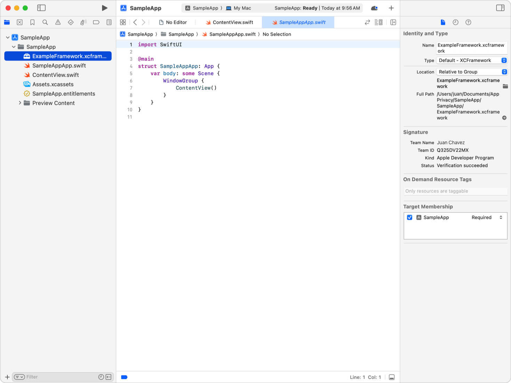
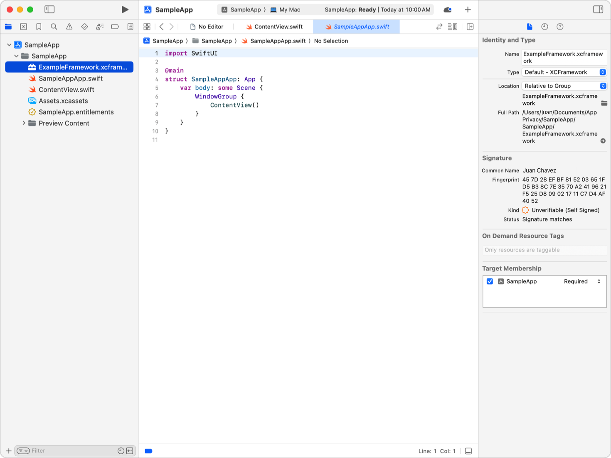
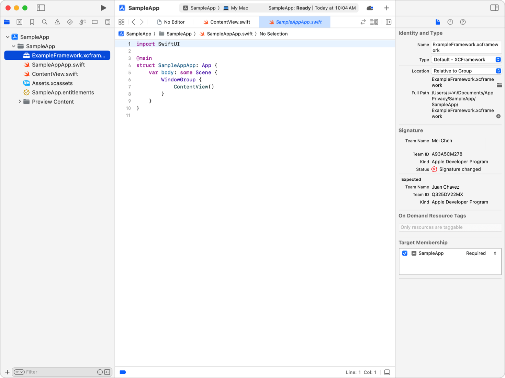
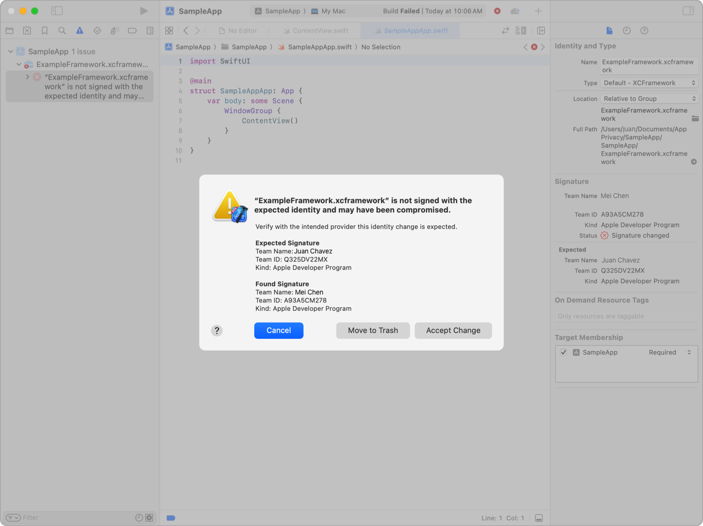
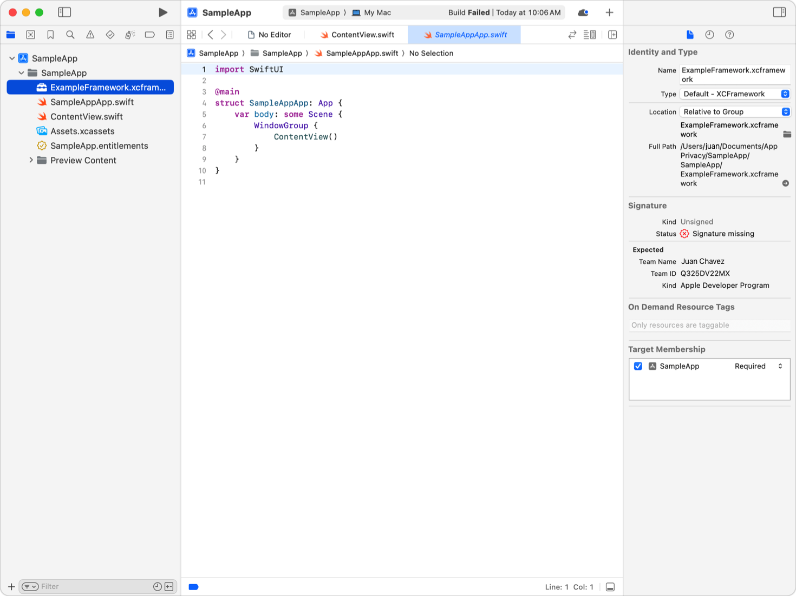
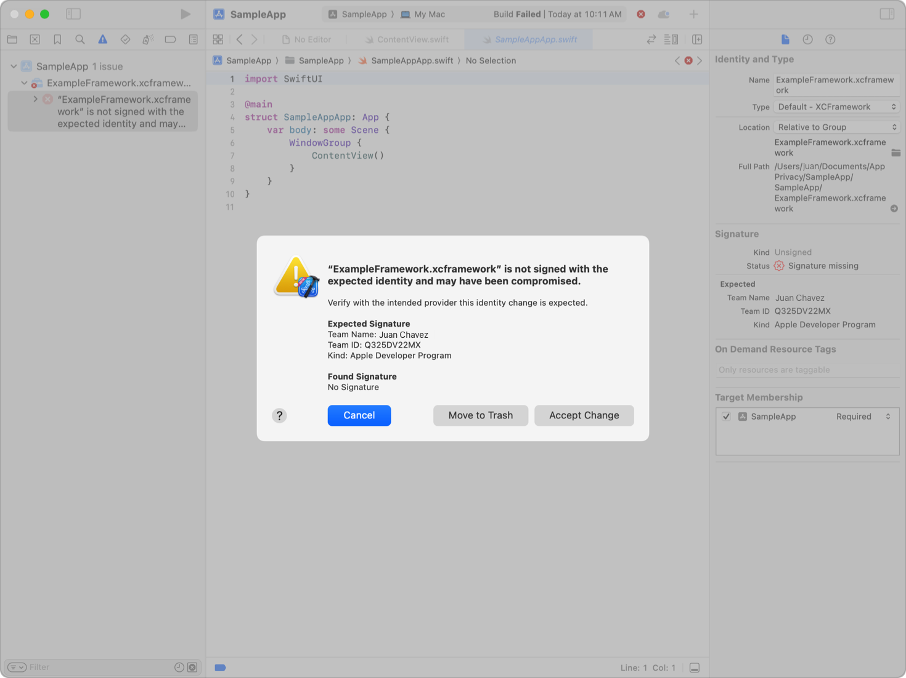

> 导航：[技术](../technologies.md) · [Xcode](../xcode.md) · [构建系统](build-system.md)

# 验证 XCFramework 的来源

文章

了解框架的签名者，并在签名变更时采取行动。

## 概述

当你将第三方二进制 SDK 作为 XCFramework 添加到目标中时，这些软件包的行为会成为你产品行为的一部分。能够将篡改版 SDK 注入你项目的攻击者可能会改变你 App 的行为，并对你的开发者、测试人员以及使用你产品的用户造成安全和隐私问题。

当你将 XCFramework 添加到项目时，使用 Xcode 检查其中嵌入的代码签名（code signing）信息。如果代码签名随后被移除、变得无效，或者由不同的开发者签署了框架的更新，构建系统会报错失败。如果发生任何这些情况，请采取措施解决问题。

### 检查依赖项的代码签名身份

在 Xcode 中，在项目导航器（Project navigator）中选择你的依赖项的 XCFramework 文件夹。文件检查器（File inspector）会显示 XCFramework 的代码签名状态。如果该框架使用 Apple Developer 证书签名，检查器还会显示签署该框架的团队。

Xcode 的截图。项目导航器中选中了一个 XCFramework 文件夹，文件检查器显示该 XCFramework 已签名，并在代码签名中标识了你的团队。

如果 XCFramework 由自签发的代码签名身份（code signing identity）签名，检查器会显示框架代码签名中证书的 SHA-256 指纹。验证该证书指纹与你期望的值是否匹配。

Xcode 的截图。项目导航器中选中了一个 XCFramework 文件夹，文件检查器显示该 XCFramework 使用自签名证书签名，并显示了该证书的 SHA-256 校验和。

### 诊断代码签名变更导致的构建失败

XCFramework 的代码签名可能因合理原因而变更，例如：

- 第三方 SDK 的提供商将 SDK 的所有权转让给另一个组织，后者发布的版本使用新组织的团队 ID 进行签名。
- 你从供应商分发的 XCFramework 切换为你自己构建和签名的版本。

代码签名的变更也可能表明 XCFramework 已被篡改，或者另一个 Actor 将自己的代码注入到你的系统中，并伪装成该 XCFramework 的版本。

如果 XCFramework 的代码签名发生变更，Xcode 会在文件检查器中显示变更后的代码签名信息。

Xcode 的截图。项目导航器中选中了一个 XCFramework 文件夹，文件检查器显示该 XCFramework 代码签名中的团队 ID 已与期望值不符。

如果你尝试在不解决代码签名信息变更的情况下构建软件，构建系统会报错。请与 XCFramework 的提供商合作，确定该更改是否符合预期。如果更改符合预期，请按以下步骤操作：

1. 切换到问题导航器（Issues navigator）。
2. 选择内容为“[XCFramework 名称] 未使用预期身份签名，可能已被篡改”的错误。
3. 在出现的对话框中，点击“接受更改”。

Xcode 的截图。问题导航器报告了一个错误，原因是 XCFramework 的代码签名与期望值不匹配。一个对话框提供了关于代码签名变更的更多信息，并提供了取消、将框架移到废纸篓或接受更改的选项。

如果你的团队和 SDK 提供商无法解释 XCFramework 代码签名的变更，请恢复一个具有期望代码签名的框架版本，或者从项目中移除该框架。要恢复具有期望代码签名的框架版本，请执行以下操作：

1. 在对话框中，点击“移到废纸篓”。
2. 切换到或打开一个新的“访达”窗口。
3. 将来自可信来源的替换版 XCFramework 拖放到包含你删除的副本的访达文件夹中。
4. 切换到 Xcode，并在文件检查器中验证该 XCFramework 的签名是否有效。

> [!warning] 警告
> 如果你在 XCFramework 中遇到意外的代码签名变更，可能是攻击者正在利用你基础设施中的安全漏洞。审计你的 XCFramework 的来源，确保它们来自官方渠道。即使你将 XCFramework 恢复为正确签名的版本，你也需要仔细审计你的软件开发与部署环境。

如果 XCFramework 使用过期或已被吊销的代码签名身份进行签名，即使该身份自你将该 XCFramework 添加到项目以来未发生变化，Xcode 也会发出警告。如果发生这种情况，请与 SDK 提供商合作，获取由有效代码签名身份签名的新版本框架。

### 诊断代码签名被移除导致的失败

如果有人移除了 XCFramework 的代码签名，Xcode 会在文件检查器中显示这一变化。

Xcode 的截图。项目导航器中选中了一个 XCFramework 文件夹，文件检查器显示该 XCFramework 的代码签名缺失，而期望存在代码签名。

如果你尝试在不解决代码签名缺失问题的情况下构建软件，构建系统会报错失败。确定 XCFramework 为何缺少代码签名。如果你不再期望该 XCFramework 被签名，请按以下步骤操作：

1. 切换到问题导航器。
2. 选择内容为“[XCFramework 名称] 未使用预期身份签名，可能已被篡改”的错误。
3. 在出现的对话框中，点击“接受更改”。

Xcode 的截图。问题导航器报告了一个错误，原因是 XCFramework 缺少代码签名。一个对话框提供了关于缺失代码签名的更多信息，并提供了取消、将框架移到废纸篓或接受更改的选项。

## 另请参阅

### 安全与隐私

- [为你的 App 启用增强安全性](enabling-enhanced-security-for-your-app.md) — 检测越界内存访问、使用已释放的内存以及其他潜在漏洞。
- [创建增强安全性的辅助扩展](creating-enhanced-security-helper-extensions.md) — 减少攻击者通过扩展攻击你 App 的机会。
- [采用类型感知的内存分配](adopting-type-aware-memory-allocation.md) — 减少在代码中将指针视为数据的可能性。
- [遵循 Mach IPC 安全限制](conforming-to-mach-ipc-security-restrictions.md) — 避免与 Mach 消息相关的崩溃和潜在的不安全情况。
