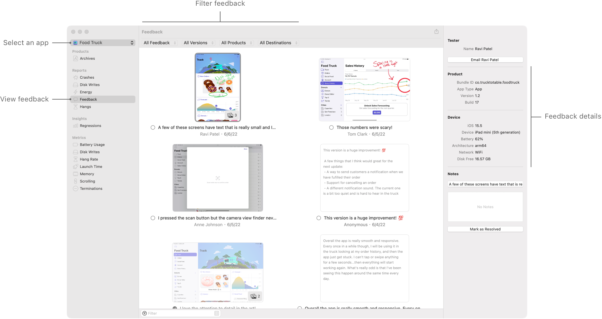
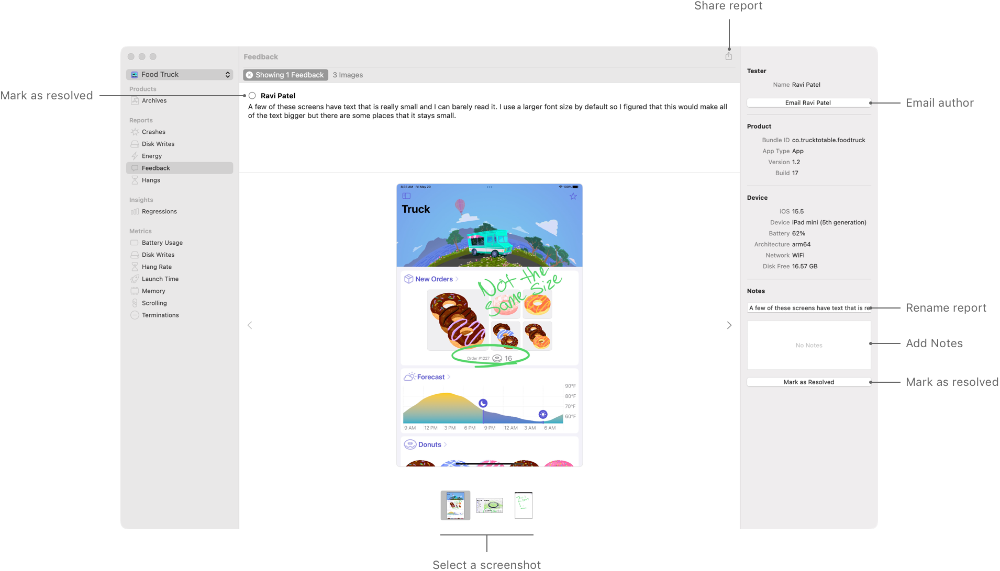

> 导航：[Technologies](../technologies.md) · [Xcode](../xcode.md) · [Distribution](distribution.md)

# 查看并回应 Beta 测试人员的反馈

文章

使用 Feedback organizer 跟进 Beta 测试人员的反馈。

## 概述

通过 TestFlight App 分发 App 的 Beta 版本时，测试人员可以提供屏幕截图和使用体验反馈。这些反馈能让你从重要视角了解 App 在真实场景中的运行情况，并帮助你迭代功能、改进 UI 和处理问题。

你可以在 Xcode 的 Feedback organizer 和 [App Store Connect](https://developer.apple.com/app-store-connect/) 中 App 的 TestFlight 页面上查看用户反馈。Feedback organizer 可让你回复测试人员、在开发团队中共享反馈、处理问题时记录笔记，并在解决项目后将其标记出来。

有关分发 App Beta 版本的更多信息，请参阅[分发 App 以进行 Beta 测试和发布](distributing-your-app-for-beta-testing-and-releases.md)。

> [!note] 注意
> 来自 iOS 12 及更早版本、tvOS 和 watchOS 测试人员的反馈不会出现在 Feedback organizer 中。这些反馈会发送到你在 App Store Connect 的 App“测试信息”页面中“反馈电子邮件”字段所提供的电子邮件地址。

### 查看测试人员的反馈

要查看 App 测试人员的反馈：

1. 在 Xcode 菜单栏中，选取 Window \> Organizer。
2. 在边栏的 Reports 部分选择 Feedback。
3. 从边栏顶部的弹出式按钮中选择你的 App。

Xcode 会显示按平台整理的可用 App 列表。所选 App 的反馈会显示在网格中。要聚焦于特定报告，请使用窗口顶部的筛选栏，按种类、App 版本和构建版本、类型以及运行目的地进行筛选。

网格中的项目会显示反馈预览，包括可用的屏幕截图和反馈文本摘要。网格右侧的检查器会显示所选报告的详细信息。

Feedback organizer 的屏幕截图，边栏 Reports 部分中的 Feedback 选项处于选中状态。App 选择弹出式按钮显示在边栏顶部。Organizer 中央显示反馈预览网格，其中一项处于选中状态，顶部有用于筛选报告的筛选栏。Organizer 右侧的检查器显示所选反馈的详细信息。

双击预览可显示报告的完整文本以及所附屏幕截图的较大版本。

### 跟进并追踪进度

要跟进提供反馈的测试人员，请点按检查器顶部的电子邮件按钮。

> [!note] 注意
> 如果你通过邀请电子邮件邀请测试人员，其电子邮件地址会显示在检查器中。如果通过公共链接邀请测试人员，除非对方提交反馈时输入电子邮件地址，否则会显示为匿名。电子邮件地址只会针对该条特定反馈显示。

要与开发团队的其他成员共享报告链接，请在网格中选择要共享的项目，然后点按窗口工具栏后缘的“共享”按钮。如果团队成员拥有必要的授权，他们可以点按共享链接，在 Xcode 中打开 Feedback organizer 并显示该报告的预览。

要重命名报告以帮助保持条理并添加笔记，请使用检查器底部的控件。使用检查器中的“标记为已解决”按钮或每个预览旁的复选框，在解决问题的过程中追踪进度。

Feedback organizer 的屏幕截图，边栏 Reports 部分中的 Feedback 选项处于选中状态。Organizer 中央显示反馈文本，下方有一张大尺寸屏幕截图。大图下方是一系列屏幕截图缩略图。右侧检查器顶部有向测试人员发送电子邮件的按钮，底部有用于重命名、添加笔记和将反馈标记为已解决的控件。
