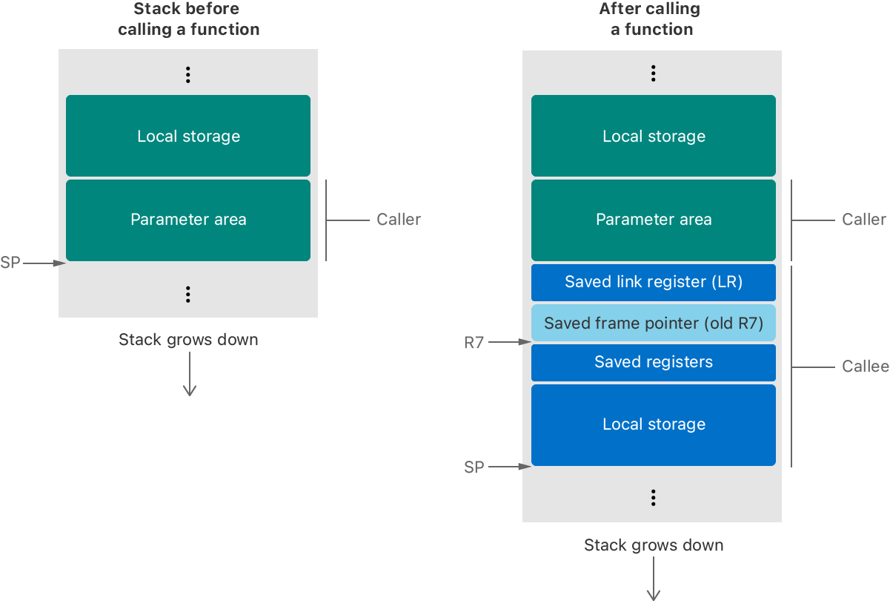

> 导航：[Technologies](../technologies.md) · [Xcode](../xcode.md) · [Application binary interfaces](application-binary-interfaces.md)

# 为 iOS 编写 ARMv6 代码

<sub>文章</sub>

创建符合 iOS 所支持的应用程序二进制接口（ABI）的 ARMv6 汇编语言指令。

## 概述

ARMv6 规范定义了在两个函数之间传递参数和返回值的调用约定。你可以在运行时栈上或寄存器中传递参数，被调用函数则在寄存器或内存中返回结果。在大多数情况下，ARMv6 规范采用了与 ARM 架构过程调用标准（release 1.07）中所定义的相同约定。不过，ARMv6 规范在以下几个方面有所偏离：

- 在函数调用时，栈按 4 字节对齐。
- 大于 4 字节的数据类型按 4 字节对齐。
- 寄存器 R7 用作帧指针。
- 寄存器 R9 是一个易失性的暂存寄存器。

> [!note] 注意
> Apple 为向函数传递参数定义了自己的过程式编程接口。面向对象语言可能会为自身的方法调用使用不同的规则。例如，C++ 虚函数的约定通常与 C 函数的约定不同。

ARM 架构过程调用标准（AAPCS）可在 [https://developer.arm.com](https://developer.arm.com) 获取。

### 在 ARMv6 中保留特定寄存器

下表列出了 ARM 架构寄存器及其在过程调用中的易失性：

| 类型 | 名称 | 是否保留 | 说明 |
|---|---|---|---|
| 通用寄存器 | R0-R3 | 否 | 可在例程内部及函数调用之间使用的通用寄存器。使用这些寄存器传递参数和结果。 |
|  | R4-R6 | 是 |  |
|  | R7 | 是 | 帧指针。该寄存器通常指向之前保存的栈帧和保存的链接寄存器。 |
|  | R8 | 是 |  |
|  | R9 | 否 | 在 iOS 3 及更高版本中是一个易失性的暂存寄存器。 |
|  | R10-R11 | 是 |  |
|  | R12 | 否 | 过程内（IP）暂存寄存器。链接器使用该寄存器，且它在所有函数调用之间都是易失的。不过，你可以在函数调用之间将其用作暂存寄存器。 |
|  | R13 | 特殊 | 栈指针（SP）。 |
|  | R14 | 特殊 | 链接寄存器（LR）。该寄存器存储函数调用的返回地址。 |
|  | R15 | 特殊 | 程序计数器（PC）。 |
| 程序状态寄存器 | CPSR | 特殊 | 程序状态寄存器。函数调用不会保留条件位（27-31）和 GE 位（16-19）。在调用或从函数返回时，E 位必须保持为零（表示小端模式）。只能从分支例程设置 T 位。不要修改任何其他位。 |
| VFP 寄存器 | D0-D7 | 否 | 也称为 S0-S15。这些寄存器在 ARMv6 上无法从 Thumb 模式访问。 |
|  | D8-D15 | 是 | 也称为 S16-S31。这些寄存器在 ARMv6 上无法从 Thumb 模式访问。 |
| VFP 状态寄存器 | FPSCR | 特殊 | VFP 状态寄存器。函数调用不会保留条件码位（28-31）和饱和位（0-4）。只有会直接或通过框架 API 函数影响 App 状态的例程，才能修改异常控制位（8-12）、舍入模式位（22-23）和归零位（24）。短向量长度位（16-18）和步长位（20-21）在函数进入和退出时必须为零。不要修改任何其他位。 |

关于寄存器使用，还需考虑以下附加行为：

- AAPCS 文档将 R7 定义为一个通用的非易失性寄存器，但 iOS 将其用作帧指针。如果不把 R7 用作帧指针，调试工具和性能工具就无法生成有效的回溯。
- 一些 ARM 环境用助记符 FP 来指代 R11。而在 iOS 中，R11 是一个通用的非易失性寄存器。为避免混淆，iOS 不使用 FP 这个说法。
- 不要在 ARMv6 的 Thumb 模式下访问 VFP 寄存器。要访问 VFP 寄存器，请在 ARM 模式下运行你的代码。在 iOS 中，你只能在函数边界处切换 ARM 模式和 Thumb 模式。

### 正确处理数据类型和数据对齐

下表列出了 ANSI C 标量数据类型、它们的大小，以及它们在 ARMv6 环境中的自然对齐方式。自然对齐表示该类型值的默认对齐方式。

| 数据类型 | 大小（字节） | 自然对齐（字节） |
|---|---|---|
| `BOOL`、`bool` | 1 | 1 |
| `unsigned char` | 2 | 2 |
| `char`、`signed char` | 1 | 1 |
| `unsigned short` | 2 | 2 |
| `signed short` | 2 | 2 |
| `unsigned int` | 4 | 4 |
| `signed int` | 4 | 4 |
| `unsigned long` | 4 | 4 |
| `signed long` | 4 | 4 |
| `unsigned long long` | 8 | 8 |
| `signed long long` | 8 | 8 |
| `float` | 4 | 4 |
| `double` | 8 | 4 |
| `long double` | 8 | 4 |
| 指针 | 4 | 4 |

ARMv6 环境使用小端字节序存储数值和指针数据类型。在这种方案下，最低有效字节在前，最高有效字节在后。

作为独立参数时，标量数据类型使用其自然对齐方式。当作为复合数据类型（数组、结构体或联合体）的一部分时，系统会选择对齐值最大的成员，并用该值作为整个类型的对齐方式。数组采用与其元素相同的对齐方式。复合数据类型的总体大小是其对齐值的整数倍，为此可能需要额外的填充。

### 使用正确的约定配置栈帧

在 iOS 中，所有子例程调用和返回序列都必须能在 ARM 状态和 Thumb 状态下工作。具体来说，对于所有对函数指针的调用，你都必须使用适当的 `BLX` 和 `BX` 指令，而不是 `MOV` 指令。ARM 和 Thumb 指令集的主要区别在于如何设置栈和参数列表。

ARMv6 中的栈环境具有以下特征：

- 按 4 字节对齐。
- 向下增长。
- 包含局部变量和函数参数。

在 ARMv6 环境中，栈帧大小不是固定的，栈指针（SP）指向栈的底部。栈帧包含以下区域：

- _参数区_ 存储调用方传递给被调用函数的参数，或为这些参数预留的空间。这块区域位于调用方的栈帧中。参数的类型以及可用寄存器的情况，决定了参数是驻留在栈上还是寄存器中。
- _保存的链接寄存器_ 包含调用方下一条指令的地址。
- _保存的帧指针_（可选）包含调用方栈帧的基地址。
- _保存的寄存器区_ 包含被调用方在返回之前必须恢复的寄存器值。更多信息，参见[在 ARMv6 中保留特定寄存器](writing-armv6-code-for-ios.md#Preserve-specific-registers-in-ARMv6)。
- _局部存储区_ 包含每个子例程的局部变量。



### 为函数创建序言和尾声

当一个函数调用某个子例程时，该子例程必须分配自己的栈帧。它通过序言来完成这项任务，序言是编译器放在函数体之前的一段代码。编译器会在子例程末尾放置一段尾声，用来将进程恢复到之前的状态。

序言执行以下任务：

1. 将链接寄存器（LR）的值压入栈。
2. 将帧指针（R7）的值压入栈。
3. 将帧指针（R7）设置为栈指针（SP）的值。（这一步为调试器提供了一种查找之前栈帧的方式。）
4. 将适当的寄存器值压入栈以保留它们。更多信息，参见[在 ARMv6 中保留特定寄存器](writing-armv6-code-for-ios.md#Preserve-specific-registers-in-ARMv6)。
5. 在栈帧中为局部存储分配空间。

尾声执行以下任务：

1. 释放栈中的局部存储。
2. 恢复任何已保留的寄存器。
3. 弹出保存的帧指针值，并将其放回 R7。
4. 将保存的链接寄存器（LR）值移入程序计数器（PC）。

你不需要包含序言或尾声中与你的代码无关的部分。例如，如果某个函数不使用高位寄存器（R8、R10、R11）或非易失性 VFP 寄存器，就不需要保存它们。叶子函数完全不需要使用栈，除非需要保存非易失性寄存器。

下面的示例展示了 ARM 模式下的一个序言。这个序言保存了 VFP 寄存器的内容，并额外分配了 36 字节的局部存储。

```other
stmfd    sp!, {r4-r7, lr}     // 保存 LR、R7 和 R4-R6。
add      r7, sp, #12          // 调整 R7，使其指向保存的 R7。
stmfd    sp!, {r8, r10, r11}  // 保存其余 GPR（R8、R10、R11）
fstmfdd  sp!, {d8-d15}        // 保存 VFP 寄存器 D8-D15，
                              // 也称为 S16-S31 或 Q4-Q7。
sub      sp, sp, #36          // 为局部存储分配空间
```

下面的示例展示了 ARM 模式下对应的尾声。这段尾声释放局部存储，并恢复序言所保存的寄存器。

```other
add      sp, sp, #36         // 释放局部存储。
fldmfdd  sp!, {d8-d15}       // 恢复 VFP 寄存器。
ldmdd    sp!, {r8, r10, r11} // 恢复 R8-R11。
ldmdd    sp!, {r4-r7, pc}    // 恢复 R4-R6、保存的 R7，
                             // 并返回保存的 LR。
```

下面的示例展示了 Thumb 模式下的一个序言。这个序言不保存 VFP 寄存器，因为 Thumb-1 无法访问这些寄存器。

```other
push   {r4-r7, lr}     // 保存 LR、R7 和 R4-R6。
mov    r6, r11         // 将高位寄存器移至低位寄存器，以便
mov    r5, r10         // 保存它们。（如果例程不使用 R8、R10
mov    r4, r8          // 或 R11，请跳过这一部分。）
push   {r4-r6)         // 保存 R8、R10、R11（现位于 R4-R6）。
add    r7, sp, #24     // 调整 R7，使其指向保存的 R7。
sub    sp, #36         // 为局部存储分配空间。
```

下面的示例展示了 Thumb 模式下对应的尾声。这个示例恢复了序言所保存的寄存器。

```other
add    sp, #36         // 释放局部存储空间
pop    {r4-r6}         // 弹出 R8、R10、R11
mov    r8, r4          // 恢复高位寄存器。
mov    r10, r5
mov    r11, r6
pop    {r4-r7, pc)     // 恢复 R4-R6、保存的 R7，并
                       // 返回保存的 LR。

```

### 向函数传递参数并处理返回值

编译器一般遵循 AAPCS 文档中的参数传递规则，但以下几点值得注意：

- 通常，你会把前四个标量参数放入核心寄存器（R0、R1、R2 和 R3），并把其余参数放在栈上。有关例外情况，参见 [https://developer.arm.com](https://developer.arm.com) 上的 AAPCS 文档。
- 对大于 4 字节的数据类型使用 4 字节对齐。
- 对浮点参数使用过程调用标准的基础标准变体。在该变体中，你需要将浮点和向量参数放入通用寄存器（GPR），而不是 VFP 寄存器。

编译器一般按照标准规则返回结果。具体来说，除非返回值的大小要求采用不同的方式，否则它会将大多数值放在 R0 中返回。

有关参数传递和返回结果行为的完整细节，参见 [https://developer.arm.com](https://developer.arm.com) 上的 AAPCS 文档。

## 另请参阅

### iOS 接口

- [为 iOS 编写 ARMv7 代码](writing-armv7-code-for-ios.md) — 创建符合 iOS 所支持的应用程序二进制接口（ABI）的 ARMv7 汇编语言指令。
