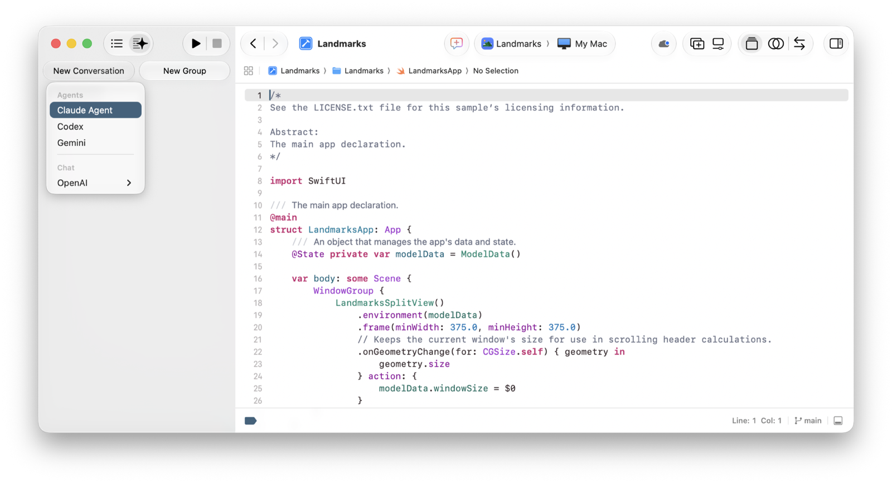
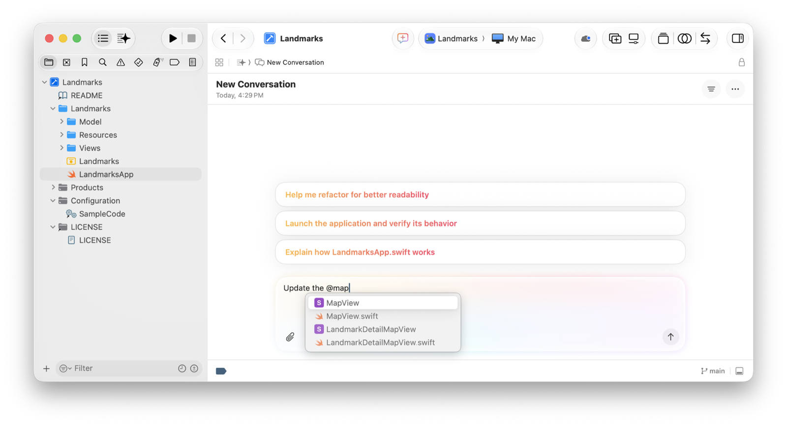
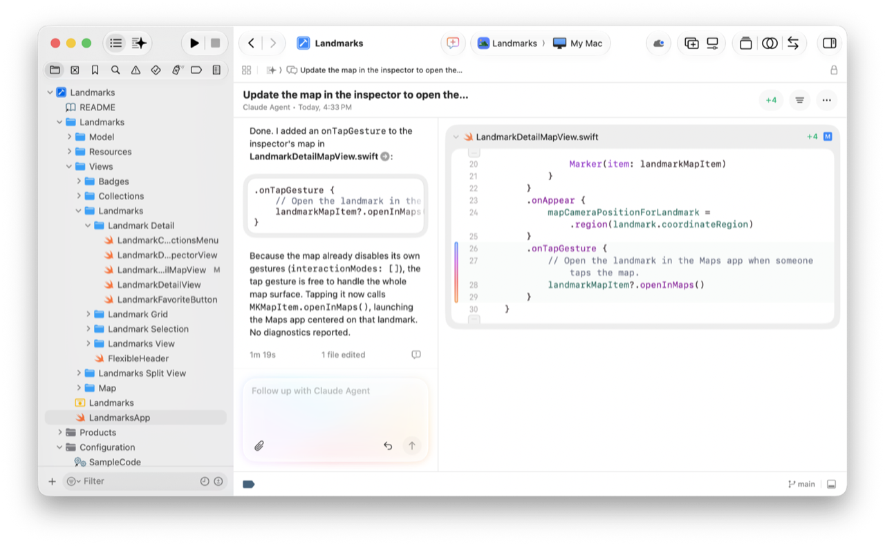
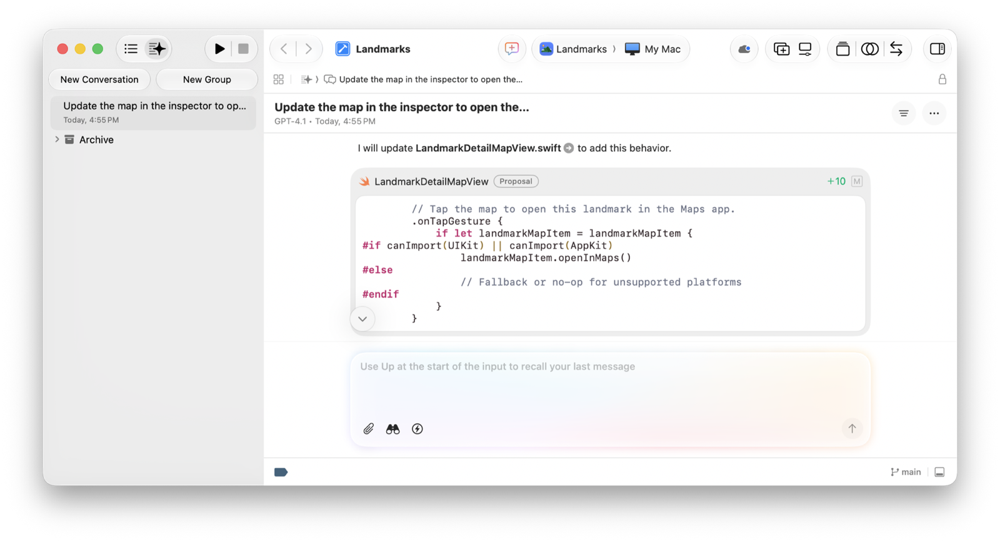
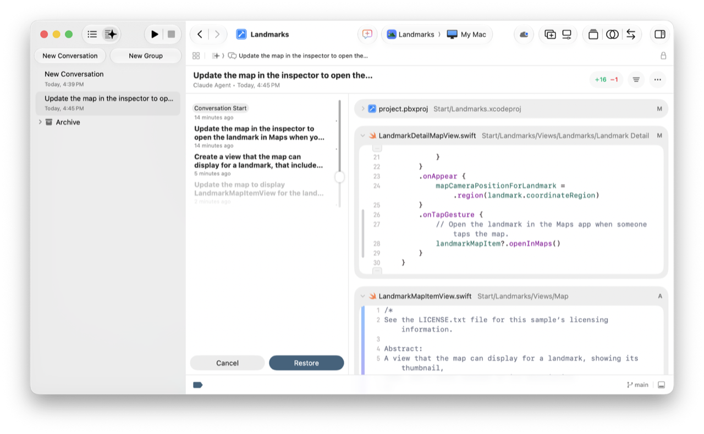

> 导航：[技术](../technologies.md) · [Xcode](../xcode.md) · [编码智能](coding-intelligence.md)

# 在 Xcode 中借助编码智能编写代码

文章

在 Xcode 中与 agent 或模型发起对话，以生成代码、浏览不熟悉的代码库，以及修复或重构现有代码。

## 概述

打开编码助手，输入提示词，然后在对话记录和构件面板中查看结果。你可以撤销更改，也可以借助对话历史记录将更改回滚。然后，在对话边栏中按照功能或实现思路，整理你与 agent 或聊天模型的对话。

若要在开始前于 Intelligence 设置中配置 agent 或聊天提供方，请参阅[设置编码智能](setting-up-coding-intelligence.md)。

## 与 agent 或模型发起对话

启用一个或多个 agent 和聊天模型后，你可以在项目内最方便的位置通过不同方式发起对话。

- 若要与特定 agent 或模型发起对话，请点按 Coding Assistant 按钮或按下 Command-0。然后在对话边栏中点按 New Conversation，并在弹出式菜单的 Agents 下选择一个 agent，或在 Chat 下选择一个模型。
- 若要从项目中的任意位置使用当前 agent 或模型发起对话，请点按项目窗口工具栏中的 New Conversation 按钮。

截屏中，Coding Assistant 按钮处于选中状态，边栏显示对话列表，工具栏的 New Conversation 弹出式菜单中已选中一个 agent，右侧的源代码编辑器中打开了一个文件。

Xcode 会将一项 New Conversation 添加到对话边栏的列表中，并在右侧显示对话记录，其底部带有消息文本栏。占位文本会显示 Xcode 当前使用的 agent 或模型。若要切换 agent 或模型，请按下 Command-0，然后从 New Conversation 弹出式菜单中选择另一个 agent 或模型。

若要从项目中的任意位置显示或隐藏对话边栏，请点按 Coding Assistant 按钮。若要在源代码编辑器中发起对话，请参阅[在源代码编辑器中使用编码智能](using-coding-intelligence-in-the-source-editor.md)。

## 在消息文本栏中输入提示词

在对话记录底部的消息文本栏中输入提示词，或点按其中一个建议的提示词。如果发起新对话，Xcode 会将对话名称更改为你输入的第一个提示词。

例如，你可以向 Xcode 提供有关如何生成或修改代码的具体指令。如果没有获得预期结果，请尝试将问题拆分开来，或添加更详细的指令。

尽管 Xcode 会根据你的提示词和对话历史记录自动收集相关上下文，你也可以向提示词中添加明确的上下文。

- 若要引用项目中的特定符号和文件，请键入 `@` 字符，然后选择符号或文件。
- 若要添加项目内外的文件作为上下文，请从左下角的 Attachments 弹出式菜单中选择 “Add context from project” 或 “Upload files”。

截屏中，边栏显示 Project 导航器，编辑器区域显示一项 New Conversation 的对话记录。消息文本栏中有一个 @ 字符，补全菜单则显示可供用户使用的建议符号和文件名。

使用消息文本栏中的其他按钮来管理请求：

- 若要提交键入的提示词，请按下 Return 或点按右下角的 Submit 按钮。
- 若要停止 Xcode 对提示词的响应，请点按右下角的 Stop 按钮。
- 若要撤销 Xcode 响应提示词后所做的更改，请点按 Undo Changes 按钮。

如果使用聊天产品，消息文本栏左下角会显示 Project Context 按钮，并且默认处于开启状态。这样，Xcode 就能与模型共享项目中的相关代码和其他上下文。若要缩小项目文件的范围，你可以关闭自动搜索功能，改为在提示词中添加对文件和符号的明确引用。

## 在对话记录中审阅响应

提交提示词后，Xcode 会将其附加到消息文本栏上方的对话记录中，项目窗口工具栏中的 Assistant Activity 按钮也会开始旋转。等待期间，你可以在对话记录中观察进度，也可以在项目窗口中执行其他任务。响应完成后，Assistant Activity 按钮会停止旋转，Xcode 也会停止更新对话记录。若要从项目中的任意位置快速跳转到对话记录，请点按 Assistant Activity 按钮。

请审阅对话记录中的响应，因为它可能包含可供交互的内容。例如，如果响应引用了某个文件名，请点按文件名旁边的箭头按钮，在源代码编辑器中将其打开；Xcode 会在其中使用多色更改栏突出显示对代码所做的任何更改。

截屏中，左侧是对话边栏，中间是显示响应的对话记录，右侧的构件面板中显示对文件所做的更改。

在对话记录末尾，Xcode 可能会向你提出后续问题或建议下一步操作。你可以回答问题，也可以在同一个对话中输入新的提示词。Xcode 会将你的所有提示词、对话框和响应附加到对话记录中，以便你获得完整的对话记录。若要发起一项具有全新对话记录的新对话，请点按工具栏中的 New Conversation 按钮。

如果使用 agent，Xcode 可能会迭代响应、构建 App 以验证代码，并自动修复构建警告和错误。如果 Assistant Activity 按钮显示警告图标，则 Xcode 需要你先在对话记录中执行某项操作或回答某个问题，然后才能继续。例如，Xcode 可能会询问能否使用命令行工具来执行任务。如果 Xcode 需要你作出决定才能继续，对话记录中可能会显示问答界面。

若要在对话之间快速导航，请使用工具栏中的跳转栏，或在边栏中选择对话。若要显示或隐藏对话记录，请从筛选器按钮的弹出式菜单中选择 Show Transcript。

有关为 agent 提供更多工具（包括管理你在对话记录中授予的权限）的更多信息，请参阅[扩展和自定义 agent](extending-and-customizing-agents.md)。

## 在构件面板中查看项目更改

Xcode 借助智能功能对项目文件所做的任何更改，都会显示在对话记录右侧或下方的构件面板中。

对于 Xcode 在项目中添加或修改的每个文件，都会显示比较视图或预览。在比较视图中，对文件所做更改的摘要显示在文件名右侧。与源代码编辑器类似，构件面板会显示多色更改栏，以突出显示 Xcode 对文件所做的更改。若要显示或隐藏某个文件，请点按文件名左侧的展开三角形。

若要在希望编辑的位置为代码添加批注，请将指针悬停在线号上，然后点按出现的 `@` 符号。接着在对话框中键入提示词，并按下 Return 或点按右下角的勾号。Xcode 会将提示词连同文件名和行号引用添加到对话记录的消息文本栏中。添加一个或多个批注，然后点按消息文本栏右下角的 Submit 按钮。

若要从构件面板跳转到源代码编辑器中的某个文件，请连按文件名；若要显示或隐藏构件面板，请从筛选器按钮的弹出式菜单中选择 Show Artifacts。

## 准备就绪后将更改应用到代码

如果使用 agent，你可以进入计划模式，对软件设计进行迭代，并在 Xcode 修改任何代码之前批准设计。

如果使用聊天产品，你可以在提交提示词之前，通过消息文本栏控制 Xcode 是否修改项目。如果关闭 “Automatically apply code changes” 按钮，Xcode 会提出代码更改，而不是应用更改，并在对话记录中将它们标记为 “Proposal”。响应可能包含建议的代码，你可以选择性地应用这些代码或将其粘贴到文件中。

截屏中，左侧是对话边栏，右侧的对话记录包含响应中建议的更改。

若要应用建议的更改，请点按响应中的代码片段，然后在出现的对话框中点按 Apply。如果更改会添加新文件，请在对话框中点按 Create New File。

## 使用对话历史记录回滚更改

使用 Xcode 维护的对话历史记录将更改回滚到项目的已知状态，或审阅项目中跨多个文件的更改。

若要按提示词回滚对话中的更改，请在对话边栏中选择该对话。然后从对话记录或构件面板上方工具栏中的 More 按钮选择 History。Xcode 会按时间顺序显示提示词列表，右侧带有滑块。

从下向上移动滑块，按照更改的执行顺序逐步撤销更改。向上移动滑块可移除更改，向下移动滑块则可添加下一条提示词中的更改。若要将项目文件更新为滑块的当前状态，请点按 Restore 按钮；否则，请点按 Cancel。

截屏中，左侧是对话边栏，中间是 History 视图且右侧带有滑块，下方是 Cancel 和 Restore 按钮。当前状态的更改显示在右侧的构件面板中。

Xcode 会将所有编辑保留在对话历史记录中，以便你稍后决定重新应用后续提示词中的更改。

若要隐藏对话历史记录，请从对话记录或构件面板上方工具栏中的 More 按钮选择 Dismiss History。

> [!note] 注意
> 若要使用 History 功能，项目必须具有 Git 仓库。如果没有仓库，请在点按 History 按钮后点按出现的 Create Repository 按钮。

## 将对话整理到群组中

若要更轻松地找到你与 agent 和聊天模型之间的对话，请为对话恰当地命名，并将它们整理到群组中。例如，你可以为正在开发的功能的每个部分创建一项新对话，并为 App 的每项功能创建一个群组。

你可以对对话执行以下操作：

- 若要发起新对话，请点按工具栏中的 New Conversation 按钮，然后选择 agent 或模型。
- 若要显示某项对话的对话记录，请在对话边栏中将其选中。
- 若要更改对话名称，请从对话记录或构件面板上方工具栏中的 More 弹出式菜单中选择 Rename Conversation。
- 若要隐藏对话，请将其拖到对话边栏底部的现有 Archive 文件夹中。

你可以对群组执行以下操作：

- 若要创建群组，请点按对话边栏工具栏中的 New Group。
- 若要更改群组名称，请连按群组并输入名称。
- 若要在群组中排列对话，请将对话拖到群组中，并按照所需顺序排列。
- 若要折叠群组，请点按群组左侧的展开三角形。

若要探索更多对话和群组操作，请按住 Control 键点按某项对话或群组，然后从上下文菜单中选择一个选项。

## 另请参阅

### 相关文档

- [使用 agent 本地化你的 App](localizing-your-app-using-agents.md) — 使用 agent 编码工具，将 App 中的字符串翻译成多种语言并适配多个区域。

### 基础

- [设置编码智能](setting-up-coding-intelligence.md) — 启用你想要在 Xcode 中使用的智能工具。
- [在源代码编辑器中使用编码智能](using-coding-intelligence-in-the-source-editor.md) — 在希望更改代码的位置提交提示词。
