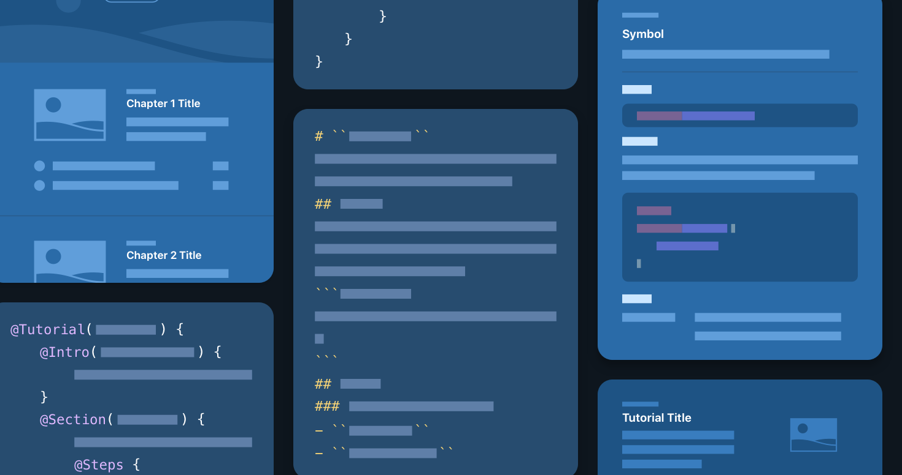

> 导航：[Technologies](../technologies.md) · [Xcode](../xcode.md)

# 编写文档

为你的 App、框架和包生成丰富且引人入胜的开发者文档。

## 概述

DocC 文档编译器可以将基于 Markdown 的文本转换为丰富的文档，供 Swift 和 Objective-C 框架、包及 App 在 Xcode 的文档窗口中显示，或托管在网站上。

DocC 语法（称为文档标记）是 Markdown 的一种自定变体，添加了面向开发者文档特有的功能，比如跨符号链接、术语-定义列表、代码清单和旁注。你可以将文档标记添加到源代码中，使用 Xcode 的「构建文档」功能对其进行编译，从而生成你 API 的参考文档。你还可以将文档标记与一组指示 DocC 如何生成内容的指令结合使用，提供循序渐进的教程，通过交互式编码练习教开发者使用你的 API。

如需更深入地了解 DocC 及其使用指导，请参阅 [DocC Swift.org](https://www.swift.org/documentation/docc) 上提供的 DocC 文档。

左侧的示意图展示了编译后的教程与 Markdown 的示意示例。中间的示意图展示了 Markdown 的示意示例。右侧的示意图展示了编译后的开发者文档的示意示例。

## 主题

### 基础

- [记录 App、框架和包](documenting-apps-frameworks-and-packages.md) — 通过源代码内的注释创建开发者文档，添加带有代码片段的文章，并添加教程以提供引导式学习体验。

### 文档内容

- [在源文件中编写符号文档](writing-symbol-documentation-in-your-source-files.md) — 为你的符号添加参考文档，说明如何使用它们。
- [向文档目录添加补充内容](adding-supplemental-content-to-a-documentation-catalog.md) — 加入文章和扩展文件，以扩展源文档注释或提供辅助性的概念内容。
- [SlothCreator：在 Xcode 中构建 DocC 文档](slothcreator-building-docc-documentation-in-xcode.md) — 为包含 DocC 目录的 Swift 包构建 DocC 文档。

### 结构与格式

- [向文档页面添加结构](adding-structure-to-your-documentation-pages.md) — 通过将符号排列成组和集合，让符号更易于查找。

### 分发

- [向其他开发者分发文档](distributing-documentation-to-other-developers.md) — 直接与 Xcode 用户分享你的文档，或将其托管在网络服务器上。
</content>
