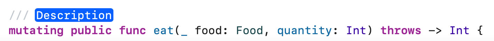
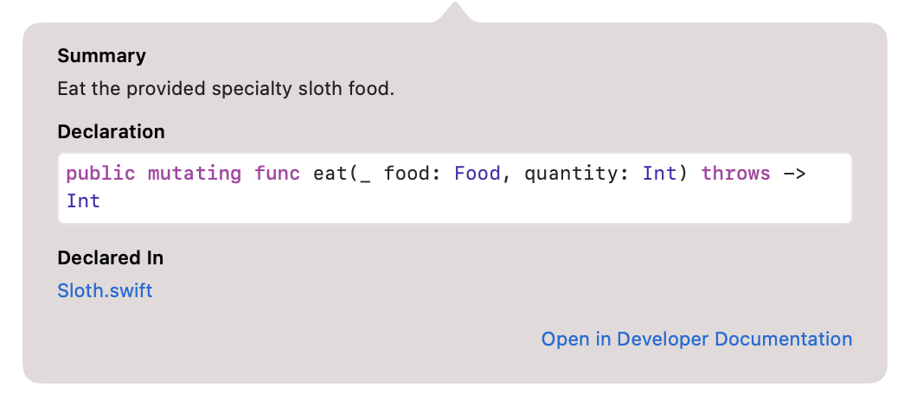
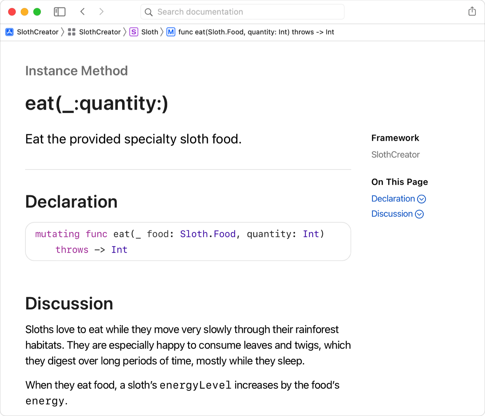
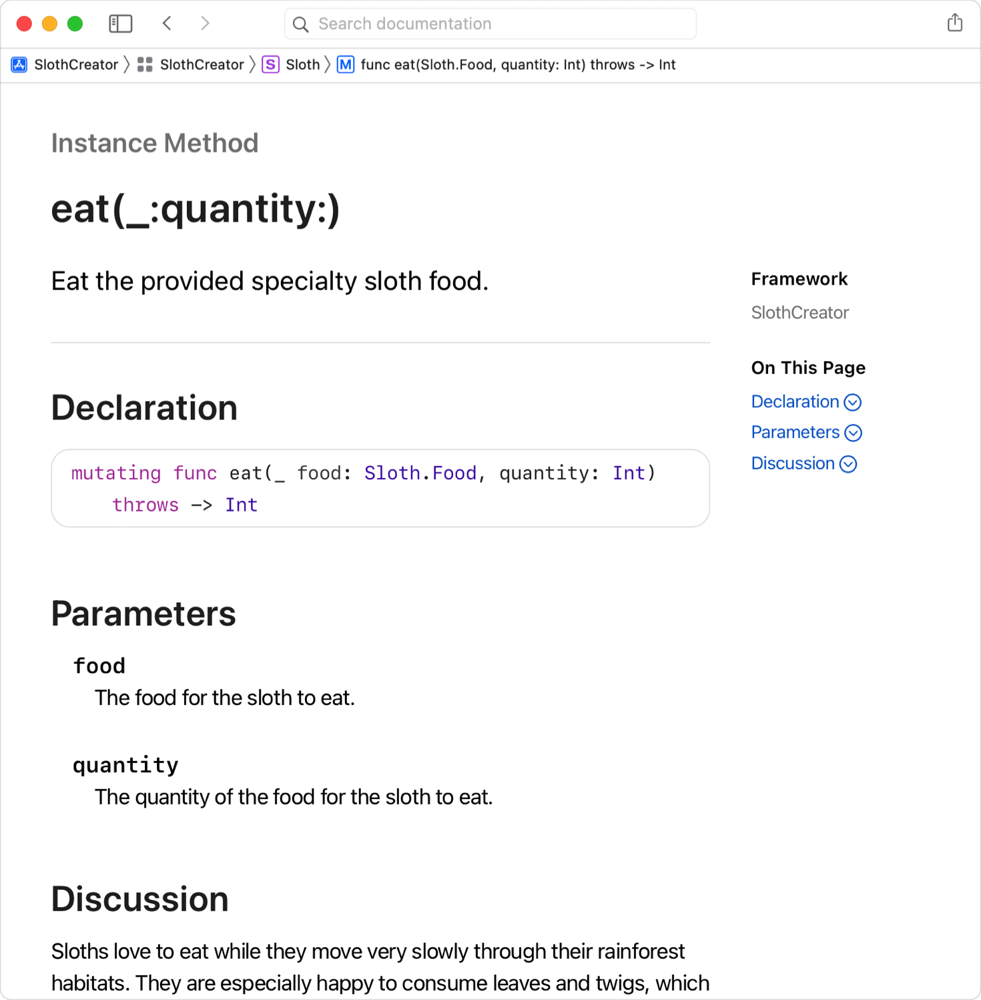
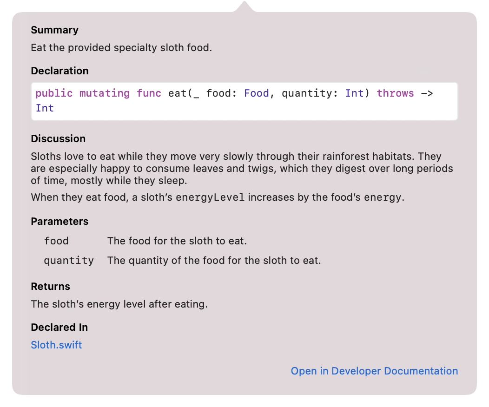
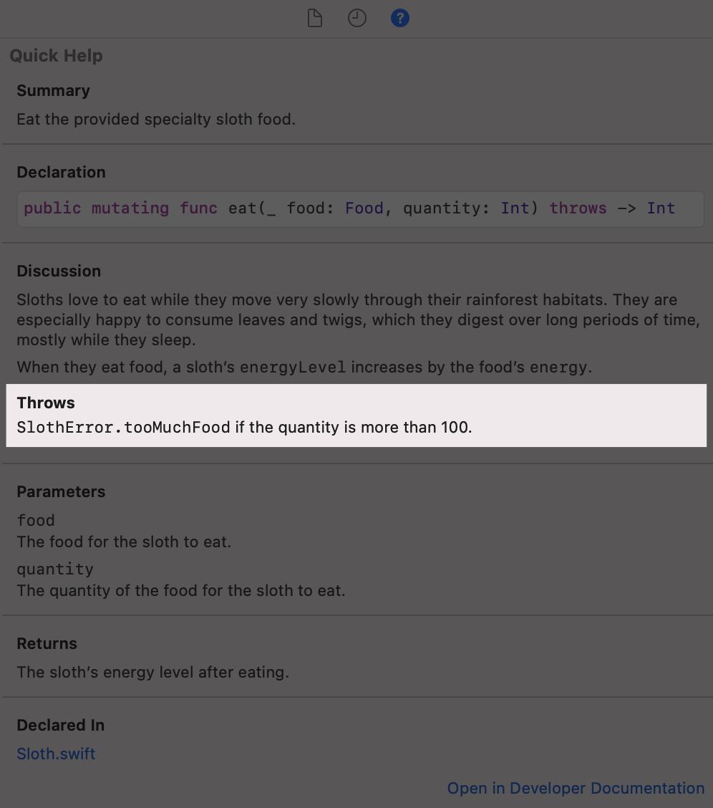

> 导航：[技术](../technologies.md) · [Xcode](../xcode.md) · [编写文档](writing-documentation.md)

# 在源文件中编写符号文档

<sub>文章</sub>

为符号添加参考文档，说明如何使用它们。

## 概述

为了帮助 API 使用者更好地理解它，请按照以下各节中的步骤，为项目中的符号添加文档注释。DocC 会编译这些注释并生成格式化文档，供你与用户共享。对于框架和软件包，请为公开符号添加注释；对于 App，请为内部符号和公开符号都添加注释。

如需更深入地了解如何编写符号文档，请参阅 Swift.org 上的[在源文件中编写符号文档](https://www.swift.org/documentation/docc/writing-symbol-documentation-in-your-source-files)。

### 为每个符号添加基本说明

编写出色文档的第一步，是为每个公开符号添加单句摘要或总结，并在必要时添加 _Discussion_ 部分。

使用 Xcode 中的 Code Actions 菜单生成模板，然后填写模板内容。在源代码编辑器中按住 Control 键点按符号，并从 Code Actions 菜单中选择 Add Documentation。



将 Description 占位符替换为该符号的摘要。

> [!tip] 提示
> Add Documentation 操作会识别符号类型，并生成一个模板，其中包含参数和返回值等所有必要元素的占位符。

添加摘要后，按住 Option 键点按该符号，在 Xcode 的 Quick Help 中查看更改。你添加的文本会直接显示在 Summary 标题下方。



你添加的所有段落都会显示在 Xcode Quick Help 的 Discussion 标题下，以及 DocC 生成的符号参考页面中。

添加 Discussion 部分后，调用 Quick Help 查看更新后的文档注释。或者，选择 Product \> Build Documentation 编译文档，并在文档查看器中打开它。



<sub>Xcode 文档查看器中某个符号的已编译参考页面截图。该页面显示摘要和 Discussion 部分，其中包含符号文档注释中的内容。</sub>

### 说明方法的参数

对于接受参数的方法，请直接在摘要下方记录这些参数；如果包含 Discussion 部分，则写在该部分下方。分别说明每个参数。说明其用途，并在必要时说明可接受值的范围。

```swift
/// - Parameters:
///   - food: 树懒要吃的食物。
///   - quantity: 树懒要吃的食物数量。
mutating public func eat(_ food: Food, quantity: Int) throws -> Int {
```

```swift
/// - Parameter food: 树懒要吃的食物。
/// - Parameter quantity: 树懒要吃的食物数量。
mutating public func eat(_ food: Food, quantity: Int) throws -> Int {
```

为方法参数添加文档后，它会显示在 Xcode 的 Quick Help 中，也会显示在你选择 Product \> Build Documentation 时由 DocC 生成的符号参考页面中。



<sub>Xcode 文档查看器中某个符号的已编译参考页面截图，其中包含 Parameters 部分。该页面显示符号文档注释中的内容。</sub>

### 说明方法的返回值

对于返回值的方法，请在文档注释中加入 _Returns_ 部分来说明返回值。

```swift
/// - Returns: 树懒进食后的能量水平。
mutating public func eat(_ food: Food, quantity: Int) throws -> Int {
```

你可以在 DocC 生成的符号参考页面以及 Xcode 的 Quick Help 中看到 Returns 部分。



<sub>Xcode 的 Quick Help 弹出窗口截图，其中 Returns 部分显示在文档注释的所有其他内容下方。</sub>

### 说明方法抛出的错误

如果方法可能抛出错误，请在文档注释中添加 _Throws_ 部分。说明导致方法抛出错误的情况，并列出可能的错误类型。

```swift
/// - Throws: 如果数量大于 100，则抛出 `SlothError.tooMuchFood`。
mutating public func eat(_ food: Food, quantity: Int) throws -> Int {
```

Throws 部分会显示在符号的参考页面、Quick Help 弹出窗口，以及使用 Command-Option-3 查看的 Quick Help 检查器中。



<sub>Xcode 的 Quick Help 检查器截图，展示它如何显示文档注释中的信息，并突出显示 Throws 部分。</sub>

## 另请参阅

### 文档内容

- [向文档目录添加补充内容](adding-supplemental-content-to-a-documentation-catalog.md) — 加入文章和扩展文件，以扩展源文档注释或提供辅助性的概念内容。
- [SlothCreator：在 Xcode 中构建 DocC 文档](slothcreator-building-docc-documentation-in-xcode.md) — 为包含 DocC 目录的 Swift 软件包构建 DocC 文档。
