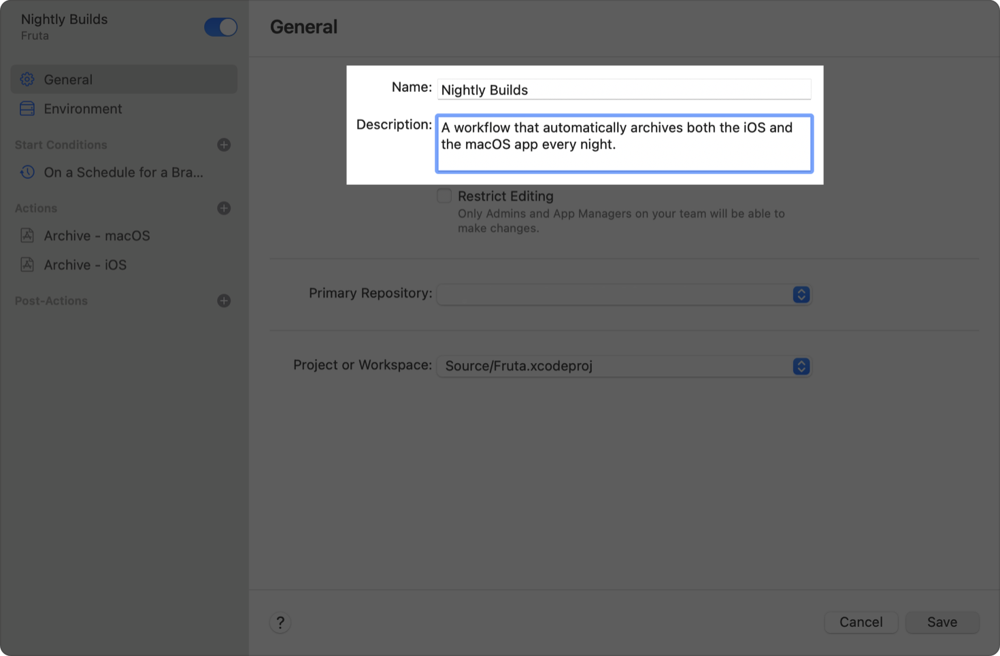

> 导航：[技术](../technologies.md) · [Xcode](../xcode.md) · [Xcode Cloud](xcode-cloud.md)

# Xcode Cloud 工作流参考

配置元数据、开始条件、操作、后置操作等，以创建自定 Xcode Cloud 工作流。

## 概述

通过在 Xcode 中配置第一个工作流，你已经开始使用 Xcode Cloud 实践持续集成与交付（CI/CD）。按照[为 Xcode Cloud 制定工作流策略](developing-a-workflow-strategy-for-xcode-cloud.md)中的说明，了解如何以最佳方式完善 CI/CD 实践后，请创建符合独特需求的自定工作流，以确保 App 或框架的质量。例如，添加元数据来说明工作流的用途，配置开始新构建的条件，添加操作和后置操作，等等。

你需要先使用 Xcode 来初始配置项目或工作区以使用 Xcode Cloud。不过，开始第一次构建后，你既可以在 Xcode 中，也可以在 [App Store Connect](https://appstoreconnect.apple.com) 中编辑和创建工作流。

有关 Xcode Cloud 工作流的更多信息，请参阅[探索 Xcode Cloud 工作流](https://developer.apple.com/wwdc21/10268)和[自定高级 Xcode Cloud 工作流](https://developer.apple.com/wwdc21/10269)。

### 元数据

即使你是独立开发者，也可能创建多个工作流。为帮助区分各个工作流，并使每个工作流的用途易于理解，请打开工作流，并在 General 部分中提供元数据。

- **Name** — 选择一个易于识别的名称。例如，如果某个工作流每晚向团队分发新版 App，可将其命名为“Nightly Builds”。
- **Description** — 提供额外上下文来说明工作流的用途。例如，输入“A workflow that automatically archives both the iOS and the macOS app every night”。

Xcode 中某个工作流的截图。General 部分可见，并显示用户提供的名称和说明。

### 环境

随着时间推移，在开发和维护 App 或框架时，你需要确保当前和即将发布的 Xcode 版本都能成功构建它。如果你的产品是框架，可能还需要确保该框架支持早期 Xcode 版本。

> [!important] 重要
> Xcode Cloud 可能会定期更新可用的 macOS 和 Xcode 版本，并随后要求你更新工作流，以便工作流继续成功构建。

为了减少执行这些验证所需的工作，请配置工作流的临时构建环境。例如，创建一个使用最新公开发布的 Xcode 和 macOS 版本构建项目并运行测试的工作流。然后再创建一个工作流，使用最新 beta 版本的 macOS 和 Xcode 执行相同验证。

要配置工作流的临时构建环境，请导览到工作流的 Environment 部分，然后从可用的 Xcode 和 macOS 版本中进行选择。

> [!note] 注意
> Xcode Cloud 使用的临时构建环境包含 macOS 和 Xcode 自带的工具（例如 Python），此外还包含 [Homebrew](https://brew.sh)，用于支持安装第三方依赖项和工具。有关更多信息，请参阅[使依赖项可用于 Xcode Cloud](making-dependencies-available-to-xcode-cloud.md)。

### 执行无缓存构建

为了缩短构建所需的时间，Xcode Cloud 会以安全、私密的方式存储每次构建的派生数据和其他缓存信息，以便重复使用。不过，你可能需要执行不缓存数据的_无缓存构建（clean build）_。例如，如果你添加一个通过 [TestFlight](https://developer.apple.com/testflight/) 向外部测试人员分发新版本的后置操作，就需要配置工作流来执行无缓存构建。

要配置一个不使用缓存数据开始新构建的工作流：

1. 在 Xcode 或 App Store Connect 中打开工作流，并导览到 Environment 部分。
2. 选择 Clean，然后保存工作流。

> [!note] 注意
> 启用无缓存构建会显著增加构建所需的时间。请仅在必要时执行无缓存构建；例如，通过 TestFlight 向外部测试人员分发新版本时需要无缓存构建。

### 自定环境变量

除了 Xcode 和 macOS 版本外，你还可以在工作流的 Environment 部分中设置自定_环境变量_。这些变量可供你用于扩展工作流的自定构建脚本使用。例如，设置一个 secret 环境变量，让它包含自定构建脚本将工作流构件上传到服务器时使用的 API 密钥。

> [!important] 重要
> 要安全地存储环境变量并确保它不出现在任何日志中，请选中“Keep value redacted”（Xcode）或 Secret（App Store Connect）复选框。

### 开始条件

创建新工作流时，Xcode 会建议使用 Branch Changes 条件，在 Git 仓库的默认分支每次发生更改时开始新构建。刚开始使用 CI 时，此条件很有用。不过，每次默认分支发生更改都开始构建，可能并不适合你。例如，在许多模拟设备上运行 UI 测试的工作流可能需要很长时间才能完成，因此每次分支更改都开始构建并不实际。在这种情况下，请更改工作流的开始条件或添加开始条件，让 Xcode Cloud 降低执行工作流的频率。

有关配置开始条件的更多信息，请参阅[配置开始条件](configuring-start-conditions.md)。

### 自动取消构建

默认情况下，每个开始条件都会启用工作流的 Auto-cancel Builds 设置。因此，如果工作流为同一工作流将新构建加入队列，Xcode Cloud 会自动取消正在进行的构建。这可以缩短验证最新代码更改所需的时间；如果你在短时间内连续向某个分支推送更新，这项设置会很有用。

例如，假设你在五分钟内向一个分支推送了五项更改。因为每项更改都符合 Branch Changes 开始条件，Xcode Cloud 会检测到每项更改并开始构建，从而产生五次构建。要知道第五项更改是否通过配置的验证，你必须等待每次构建完成，尽管第五项更改已经取代其他更改。启用 Auto-cancel Builds 后，Xcode Cloud 会取消前四次构建，并立即为最新更改开始构建。

> [!tip] 提示
> 如果不希望自动取消构建，请在开始条件的 Options 部分中，为一个、多个或每个开始条件关闭 Auto-cancel Builds。

### 操作

自动且频繁地构建项目和验证更改，是 CI/CD 实践的关键。因此，配置工作流的操作是你在 Actions 部分中执行的一项基本任务。工作流可以执行以下操作：

- Build
- Test
- Analyze
- Archive

请注意，这些操作与项目或工作区的方案操作相匹配。要创建符合需求的工作流，请根据需要向工作流添加任意数量的操作。例如，创建一个为 App 执行测试和归档操作的工作流。

有关为 Xcode Cloud 工作流配置操作的详细信息，请参阅[配置 Xcode Cloud 工作流的操作](configuring-your-xcode-cloud-workflow-s-actions.md)。有关使用 Xcode Cloud 运行测试的更多信息，请参阅[为 Xcode Cloud 编写快速可靠的测试](https://developer.apple.com/wwdc22/110361)。

### 后置操作

执行操作是工作流的核心。不过，与为方案配置后置操作类似，你也可以为工作流配置后置操作，使其在 Xcode Cloud 执行工作流操作之后发生。

通过添加后置操作，你可以：

- 配置自定通知设置。例如，将电子邮件通知限制为特定构建状态，让 Xcode Cloud 向其他同事发送电子邮件，或配置 Xcode Cloud 向 [Slack](https://slack.com) 发送通知。
- 使用 [TestFlight](https://developer.apple.com/testflight/) 向测试人员分发新版 App。
- 将某个 App 版本上传到 App Store Connect，之后可以提交该版本进行 App 审核。

有关向 Slack 发送通知的更多信息，请参阅[将 Xcode Cloud 连接到 Slack](connecting-xcode-cloud-to-slack.md)

### 自定构建脚本

Xcode Cloud 使用项目中配置的方案，并提供各种各样的工作流设置。不过，你可能希望执行无法使用方案或工作流配置的其他自定任务。例如，你可能需要安装其他工具来构建项目，将 App 归档上传到存储空间，为每夜构建使用不同的 App 图标，等等。

为满足这些用例，你可以创建 Xcode Cloud 在构建期间的特定时刻运行的 shell 脚本，称为_自定构建脚本_。有关更多信息，请参阅[编写自定构建脚本](writing-custom-build-scripts.md)。

### 自动化工作流管理

你可以使用 Xcode 或 App Store Connect 创建自定工作流，以验证 App 或框架的质量。不过，你可能需要进一步自动化 Xcode Cloud 的使用，为多个 App 创建和管理大量工作流，企业环境下尤其如此。如果你有此需求，请使用 App Store Connect API 管理工作流、开始构建并访问 Xcode Cloud 数据。有关更多信息，请参阅 [Xcode Cloud 工作流和构建](../appstoreconnectapi/xcode-cloud-workflows-and-builds.md)。

## 主题

### 开始条件

- [配置开始条件](configuring-start-conditions.md) — 配置 Xcode Cloud，使其在你更新分支、拉取请求或 Git 标签时，或按照时间表开始构建。

### 操作

- [配置 Xcode Cloud 工作流的操作](configuring-your-xcode-cloud-workflow-s-actions.md) — 向 Xcode Cloud 工作流添加操作，以便执行构建时对你的 App 或框架进行构建、测试、分析和归档。

## 另请参阅

### 工作流

- [为 Xcode Cloud 制定工作流策略](developing-a-workflow-strategy-for-xcode-cloud.md) — 了解如何以最佳方式创建自定 Xcode Cloud 工作流，以完善持续集成与交付实践。
- [创建用于构建 App 以供分发的工作流](creating-a-workflow-that-builds-your-app-for-distribution.md) — 配置工作流来构建并签名你的 App，以通过 TestFlight、App Store 或作为经过公证的 App 分发给测试人员。
- [了解 Xcode Cloud 基础设施验证构建](understanding-infrastructure-validation-builds.md) — 了解基础设施验证构建，以及你是否需要选择退出。
