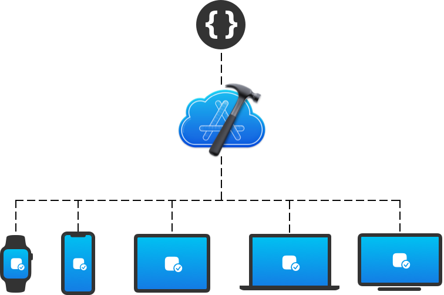

> 导航：[技术](../technologies.md) · [Xcode](../xcode.md)

# Xcode Cloud

使用 Xcode Cloud 自动构建、测试和分发你的 App，以验证更改并创建高质量 App。

## 概述

Xcode Cloud 让你可以采用持续集成和交付（continuous integration and delivery，CI/CD），这是一种标准的软件开发实践，可帮助你开发和维护代码，并将 App 交付给测试人员和用户。Xcode Cloud 是一个 CI/CD 系统，它结合了你用来为 Apple 平台创建 App 和框架的工具：[Xcode](https://developer.apple.com/xcode/)、[TestFlight](https://developer.apple.com/testflight/) 和 [App Store Connect](https://appstoreconnect.apple.com)。

借助 Xcode Cloud，你可以自动且频繁地：

- 构建你的项目。
- 运行测试并进行验证。
- 向测试人员分发构建版本，并通过 [TestFlight](https://developer.apple.com/testflight/) 收集他们的反馈，同时保护用户隐私。

在使用 Xcode Cloud 和 TestFlight 成功验证了 App 的新版本后，你可以快速将其发布到 App Store。

有关持续集成和交付的更多信息，请参阅[关于使用 Xcode Cloud 进行持续集成和交付](about-continuous-integration-and-delivery-with-xcode-cloud.md)。要详细了解如何配置你的项目或工作区以使用 Xcode Cloud，请参阅[配置你的第一个 Xcode Cloud 工作流](configuring-your-first-xcode-cloud-workflow.md)。

> [!note] 注意
> 有关 Xcode Cloud 的更多信息（包括来自 WWDC21 和 WWDC22 的视频），请参阅 [Xcode Cloud 工具箱](https://developer.apple.com/news/?id=076p6dmy)。

## 主题

### 基础

- [Xcode Cloud 入门](getting-started-with-xcode-cloud.md) — 在开发过程中使用 Xcode Cloud 在云端构建和测试你的 App。
- [通过 TestFlight 分发你的 Xcode Cloud 构建版本](distributing-your-xcode-cloud-builds-through-testflight.md) — 为内部测试人员创建 TestFlight 分发工作流。
- [关于使用 Xcode Cloud 进行持续集成和交付](about-continuous-integration-and-delivery-with-xcode-cloud.md) — 了解通过 Xcode Cloud 进行持续集成和交付如何帮助你创建高质量的 App 和框架。
- [设置你的项目以使用 Xcode Cloud](setting-up-your-project-to-use-xcode-cloud.md) — 在配置你的项目或工作区以使用 Xcode Cloud 之前，审查账户、项目和源代码管理要求。
- [配置你的第一个 Xcode Cloud 工作流](configuring-your-first-xcode-cloud-workflow.md) — 设置你的项目或工作区以使用 Xcode Cloud 并采用持续集成和交付。

### 设置与维护

- [让 Xcode Cloud 能够获取所需依赖项](making-dependencies-available-to-xcode-cloud.md) — 在配置项目以使用 Xcode Cloud 之前，审查依赖项并让 Xcode Cloud 能够获取它们。
- [为你的团队配置 Xcode Cloud](configuring-xcode-cloud-for-your-team.md) — 以团队形式开始使用 Xcode Cloud 进行持续集成和交付。
- [跨 Xcode Cloud 工作流共享 macOS 和 Xcode 版本](sharing-custom-aliases-across-xcode-cloud-workflows.md) — 使用自定义别名在多个工作流之间共享配置。
- [跨 Xcode Cloud 工作流共享环境变量](sharing-environment-variables-across-xcode-cloud-workflows.md) — 使用共享的环境变量将通用配置应用于多个工作流。
- [使用 Xcode Cloud 构建 Swift 软件包和 Swift Playgrounds App 项目](building-swift-packages-or-swift-playground-app-projects-with-xcode-cloud.md) — 将你的 Swift 软件包或 Swift Playgrounds App 项目添加到 Xcode 项目中，以便在 Xcode Cloud 中构建它。
- [为 Xcode Cloud 构建版本设置下一个构建版本号](setting-the-next-build-number-for-xcode-cloud-builds.md) — 为你现有的 Mac App 从一个自定义的构建版本号开始编号，以避免版本冲突。
- [在 App 的 Beta 版本中加入给测试人员的说明](including-notes-for-testers-with-a-beta-release-of-your-app.md) — 向你的 Xcode 项目添加文本文件，以便向 Beta 测试人员提供有关要测试哪些内容的说明。
- [从 Xcode Cloud 中移除你的项目](removing-your-project-from-xcode-cloud.md) — 从 Xcode Cloud 中移除你的项目，以删除 App 和工作流数据、断开 Git 仓库连接并移除 Slack 集成。
- [更改 Bundle Identifier](changing-the-bundle-identifier.md) — 修改你的 App 的 Bundle Identifier，并在所有出现它的地方进行更新。

### 用量数据

- [审查 Xcode Cloud 用量数据](reviewing-xcode-cloud-usage-data.md) — 访问 Xcode Cloud 用量信息，以了解你和你的团队如何使用 Xcode Cloud。

### 工作流

- [为 Xcode Cloud 制定工作流策略](developing-a-workflow-strategy-for-xcode-cloud.md) — 审查如何最好地创建自定义 Xcode Cloud 工作流来完善你的持续集成和交付实践。
- [Xcode Cloud 工作流参考](xcode-cloud-workflow-reference.md) — 通过配置元数据、启动条件、操作、后置操作等来创建自定义 Xcode Cloud 工作流。
- [创建一个构建 App 以供分发的工作流](creating-a-workflow-that-builds-your-app-for-distribution.md) — 配置一个工作流来构建和签名你的 App，以便通过 TestFlight、App Store 或作为经过公证的 App 分发给测试人员。
- [了解 Xcode Cloud 基础设施验证构建](understanding-infrastructure-validation-builds.md) — 了解基础设施验证构建，以及你是否需要选择退出。

### 源代码管理

- [源代码管理设置](source-code-management-setup.md) — 允许 Xcode Cloud 访问你的 Git 仓库。
- [配置合并拉取请求的要求](configuring-requirements-for-merging-a-pull-request.md) — 通过要求必须先有一个成功的 Xcode Cloud 构建或操作才能合并拉取请求，来保护稳定分支。

### 自定义构建脚本

- [编写自定义构建脚本](writing-custom-build-scripts.md) — 使用执行自定义任务或安装额外工具的自定义构建脚本来扩展你的 Xcode Cloud 工作流。
- [环境变量参考](environment-variable-reference.md) — 审查你在自定义构建脚本中使用的预定义环境变量。

### 故障诊断

- [解决常见的配置和构建问题](resolving-common-configuration-and-build-issues.md) — 审查常见的配置和构建问题，并了解如何解决它们。
- [解决 GitHub Enterprise 连接问题](resolve-github-enterprise-connection-issues.md) — 验证 Xcode Cloud 能否访问你的 GitHub Enterprise 仓库并修复配置问题。
- [为 Xcode Cloud 报告反馈](reporting-feedback-for-xcode-cloud.md) — 针对你在使用 Xcode Cloud 进行构建时遇到的问题提供反馈。

### 通知

- [在 Xcode Cloud 中配置 Webhook](configuring-webhooks-in-xcode-cloud.md) — 配置将 Xcode Cloud 连接到其他服务和工具的 Webhook。
- [Xcode Cloud Webhook 有效负载参考](webhook-payload.md) — 审查 Xcode Cloud 发送的 Webhook 有效负载的详细信息，包括与之关联的产品、工作流、构建、操作、结果和 SCM 元数据。
- [将 Xcode Cloud 连接到 Slack](connecting-xcode-cloud-to-slack.md) — 将 Xcode Cloud 连接到 Slack，让你的团队随时了解最新的 Xcode Cloud 构建情况。

### REST API

- [Xcode Cloud 工作流和构建](../appstoreconnectapi/xcode-cloud-workflows-and-builds.md) — 自动读取 Xcode Cloud 数据、管理工作流以及启动构建。

## 另请参阅

### 分发与持续集成

- [分发](distribution.md) — 准备好你的 App，并与你的团队、Beta 测试人员和客户分享。
