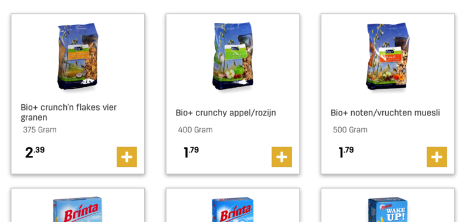
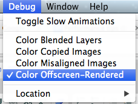

> 原文：[iOS Performance tips (I): Drawing shadows](http://angelolloqui.com/blog/30-iOS-Performance-tips-I-Drawing-shadows)

不同 App 中经常可以看到阴影。很多情况下，阴影只是通过使用预先绘制好阴影的图片来渲染的，它的性能表现基本上和任何其他 `UIImageView` 一样。但是，有时你可能需要用代码来绘制阴影。到了那个时候，你就会遇到性能问题——如果使用频繁（尤其是在 iPad 上与表格视图（Table View）或集合视图（Collection View）配合使用时），它可能会让你的 UI 变慢。

这可能看起来微不足道，但如果你的视图是由多个应用了阴影的视图组合而成的，你就会实际体验到非常严重的 UI 性能下降。例如，在我最新的一个项目中，我遇到了一个带有像这样带阴影单元格的网格视图（Grid View）：



仅仅因为增加了阴影，**帧率就从标准的 60FPS 骤降至不到 15FPS**（性能非常差）。这当然是因为我没用对方法，而使用本文中介绍的技巧后，一切恢复到了正常的 60FPS，即使是带阴影的情况下也是如此。

#### 标准阴影绘制

如果你之前渲染过阴影，你可能写过类似下面的代码：

```
// 请记得 #import <QuartzCore/QuartzCore.h>
myView.layer.shadowOpacity = 0.3f;
```

很简单，对吧？但在底层究竟发生了什么？一个很有趣的点是，**阴影是基于图层（Layer）的 Alpha 通道逐像素应用的**。这意味着如果你有一个包含透明区域的 `UIView`（在 `UIImageView` 和 `UILabel` 中很常见），阴影会随之调整并按照完全相同的形状进行绘制。这让你可以实现像这样的漂亮效果：


但是，如果你的阴影要简单得多呢？在大多数情况下，你要绘制的只是一个简单的阴影，也许是一个矩形形状或稍微复杂一点的东西，但依然简单到可以沿着路径（Path）来绘制。如果是这种情况，那么你可能正在浪费宝贵的 GPU 能力去毫无意义地检查 Alpha 通道。

#### 基于路径的阴影绘制

如果标准方式绘制阴影很慢，那么肯定有一种方法可以定义阴影的形状，并节省计算每个像素 Alpha 通道所需的计算能力。确实，这种方法存在，它被称为“**shadowPath**”。

为矩形设置阴影路径非常简单：

```
myView.layer.shadowPath = [[UIBezierPath bezierPathWithRect:self.centerView.bounds] CGPath];
```

当然，你也可以定义[许多其他具有更复杂形状的不同路径](http://nachbaur.com/blog/fun-shadow-effects-using-custom-calayer-shadowpaths)，对于大多数情况来说应该足够了。

使用阴影路径时，请牢记以下几点：

- **它非常快！** 显卡不需要读取像素，甚至不需要从图片加载外部内存。它所要做的就是使用 Alpha 颜色填充整个表面，并在角落应用一些渐变。在示例应用中，使用阴影路径绘制的速度感觉就像没有阴影一样快，帧率恒定在 60FPS。
- **它不会随视图一起调整大小**，即使你使用了自动布局（Auto Layout）或自动调整大小蒙版（Autoresizing Mask）。这意味着如果你的视图大小改变了，你也必须显式地更改路径的形状。这可以通过子类化你的视图并在 `- (void)layoutSubviews` 方法中重置路径来轻松实现。如果你是从视图控制器（View Controller）中设置阴影（你不应该这样做），那么你可以在 `viewWillLayoutSubviews` 方法中做类似的事情。
- **它是可动画的**，所以如果需要，你可以使用 `CAKeyframeAnimation` 以相当直接的方式对它们进行动画。

#### 使用光栅化的阴影绘制

如果你的视图有复杂的阴影，那么阴影路径就不是一个选择。在这种情况下，你仍然可以通过谨慎选择用于离屏渲染（Offscreen Rendering）的视图来提高 App 的性能。但什么是离屏渲染和光栅化（Rasterization）？[objc.io 的第 3 期](http://www.objc.io/issue-3/moving-pixels-onto-the-screen.html)有一篇精彩的文章详细解释了整个过程，但让我做一个非常简短的说明。

##### 离屏渲染简介

当你的 App 需要在屏幕上绘制某些内容时，GPU 会获取你的图层层次结构（`UIView` 只是 `CALayer` 之上的一个封装，而 `CALayer` 最终是 OpenGL 纹理），并根据它们的 x、y、z 位置一层一层地叠加应用。在常规渲染中，整个操作发生在特殊的帧缓冲区（Frame Buffer）中，显示器会直接读取该缓冲区以在屏幕上进行渲染，并以每秒约 60 次的速度重复该过程。

如果你的视图由太多图层组成，每秒多次合成所有视图的计算成本可能过高，以至于 GPU 无法处理，这将导致部分帧丢失。当然，如果你的视图变化不大，你可以通过将一些中间合成结果存储在额外的内存插槽中，以便在后续帧中重用来节省时间。这种**缓存合成后图层**的过程被称为离屏渲染（名称本身已经暗示渲染不是在屏幕缓冲区中进行的，而是在其他地方，现在你明白为什么了），而在 CoreGraphics 中触发它的方法是将图层的 '**shouldRasterize**' 属性设置为 YES，如下所示：

```
    cell.layer.shouldRasterize = YES;
    cell.layer.rasterizationScale = [UIScreen mainScreen].scale;
```

_请注意，缩放比例很重要，否则你会在视网膜显示屏（Retina Display）上得到一个非视网膜渲染的图层，导致视图模糊。_

当然，这个过程也有一些缺点。主要一点是离屏渲染**需要上下文切换**（GPU 必须切换到不同的内存区域来执行绘制），然后将合成后的结果图层复制到帧缓冲区。每当任何一个合成的**图层发生变化时，缓存都需要重新绘制**。这就是为什么在很多情况下离屏渲染不是一个好主意，因为它需要额外的计算才能重新渲染。此外，该图层需要**额外的视频内存**，而这当然是有限的，所以要谨慎使用。

但是，如果你的视图变化不大，那么对带阴影的视图使用离屏渲染可能是一个好主意，因为与每帧都重新计算阴影的计算成本相比，进行离屏渲染的额外成本可能是值得的。

但是，你如何知道你的光栅化视图会在帧之间被重用呢？嗯，我们知道当光栅化视图发生变化时，缓存的合成结果需要更新，但如果它保持不变呢？看看 `shouldRasterize` 属性文档头部的这部分：

> 作为一个实现细节，渲染引擎可能会尝试缓存并从一帧到下一帧重复使用位图。

这个陈述意味着即使视图没有变化，**是否在一帧到下一帧之间重用缓存完全取决于渲染引擎**。因此，实际上确保你的 App 行为符合预期的唯一方法是对其进行分析（Profiling）。为了帮助做到这一点，在模拟器（Simulator）和 Instruments 中都有一个名为“**Color Offscreen-Rendered**”的选项，它可以将离屏渲染的区域着色。红色表示你的视图被重新渲染，因此光栅化只会拖慢速度。绿色表示你的合成视图在帧之间被重用，可能获得了性能提升（特别是对于像阴影这样计算量大的操作）。



#### 总结

如果你的阴影简单到可以用多边形来定义，那么阴影路径是最好的方式。但是，当你的视图调整大小时，你需要额外正确地设置路径。

如果你需要复杂的形状或逐像素的阴影，那么你不能使用阴影路径，但你仍然可以在大多数情况下通过光栅化视图来提高性能。但是，请记住需要分析你的应用程序，因为如果光栅化命中率太低，它的性能甚至可能比常规阴影更差。

如你所见，没有一个通用的解决方案，但牢记这些选择，你应该能够在几乎所有情况下解决性能问题。
