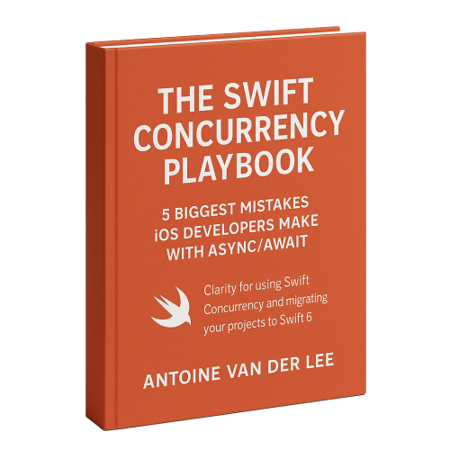

> 原文：[App Launch Time: 7 tips to increase performance](https://www.avanderlee.com/optimization/launch-time-performance-optimization/)

App 启动时间（App Launch Time）是指 App 启动后到变得可响应的时长。作为用户的首次体验，流畅且尽可能快的启动过程至关重要。较慢的启动速度可能意味着失去大量用户，从而导致 App 的活跃度下降。

即使如今的设备速度极快，我们仍然需要注意尽可能缩短启动时间。如果不密切监控，你可能会无意中加入一些延迟，从而拖慢启动速度。好消息是，通过遵循一些最佳实践，你应该能够使 App 启动时间保持足够高的性能。

## 1：设定启动时长目标

在开始优化之前，最好先了解当前的状况。你的 App 表现如何？是启动速度确实很慢，还是你对当前阈值已经很满意？

在测量之后，为你的 App 设定一个切合实际的启动时间目标非常重要。在 WWDC 2019 上，[Apple 建议](https://developer.apple.com/videos/play/wwdc2019/423/?time=305) App 渲染第一帧的时间最多为 400 毫秒。这对你的 App 来说可能有些乐观，但这至少应该是你的目标。

## 2：编写测试以实现持续监控并防止性能衰退

没有什么比花费大量精力改善 App 启动时间后又轻易将其浪费掉更令人沮丧的了。即使你了解关于启动时间的最新最佳实践，你的同事也未必了解。

通过编写一个经常运行的测试，你将确保能捕获性能衰退，并防止启动时间在不知不觉中变长。理想情况下，你应该在每个拉取请求（pull request）上运行这个测试。

在度量测试（measure test）中使用 `XCTApplicationLaunchMetric` 可以轻松编写用于启动性能的测试。你可以通过将以下测试类添加到 UI 测试目标来实现：

```swift
import XCTest

final class AppLaunchTimeTests: XCTestCase {

    /// 测量热启动，进行 5 次迭代（在一次丢弃性启动后）
    func testLaunchPerformance() throws {
        // 这句代码测量启动你的 App 所需的时间。
        measure(metrics: [XCTApplicationLaunchMetric(waitUntilResponsive: true)]) {
            XCUIApplication().launch()
        }
    }
}
```

这个 UI 测试会启动你的 App 6 次，但只使用最后 5 次测量结果。第一次启动会被跳过，因为它被视为“冷启动（cold launch）”，此时需要设置缓存。

为了充分理解这一点，有必要指出三种不同类型的启动：

- 冷启动 —— 发生在重启后，或者你的 App 已经很久没有被启动时。
- 热启动 —— 在冷启动之后的每一次启动。你的 App 仍然需要被生成，但它已经被加载到内存中，系统端服务也已经启动。
- 恢复启动 —— 从主屏幕或 App 切换器重新打开你的 App。由于你的 App 已经在运行，这将是一次快速的启动。

为了创建一致的测量结果，你理想上应在以下条件下进行测试：

- 始终测量热启动
- 在真机上测试，重启设备，让系统静置 2-3 分钟
- 在该设备上使用固定不变的 iCloud 账户，或完全不登录 iCloud 账户。否则，可能会导致后台进行大量操作，从而拖慢你的 App 启动时间
- 使用你的 App 的 release 构建，以减少调试工具的开销并利用编译时优化
- 开启飞行模式或模拟网络，以使启动期间发生的网络调用性能保持一致

显然，这些条件对于自动化测试来说并不现实。然而，将自动化测试与手动测试相结合，应该能使你在 5 次启动中获得一致的测量结果。



免费 5 日电子邮件课程：The Swift Concurrency Playbook

一个**免费的 5 天电子邮件课程**，揭示 iOS 开发者在 async/await 方面容易导致 App Store 拒绝和迁移项目花费数月而非数天的 **5 大错误**（即使你已经编写 Swift 多年）。

[获取课程](https://www.swiftconcurrencyplaybook.com?utm_source=swiftlee&utm_medium=article&utm_campaign=inline-banner&source=swiftlee&ref=swiftlee-inline-banner)


## 3：使用 Xcode 的 Organizer 获取 App 启动时间性能统计数据

Xcode 的 Organizer 中的“指标”标签为我们带来了来自真实用户的许多洞察。除了电池和内存统计数据外，我们还可以跨 App 版本了解启动性能。这是查看你的改进在发布后是否带来了更好性能的好方法。


<sub>Xcode Organizer 中的 App 启动性能统计数据。</sub>

理想情况下，你希望在每个 App 版本和每个操作系统上获得相同的结果。Apple 在主要更新中会改进 App 启动性能，例如在 iOS 13 中通过为自定义动态库引入缓存来实现。Xcode Organizer 中的这些统计数据并未按操作系统进行过滤，这可能意味着你最慢的启动时间是由运行较旧操作系统的设备导致的。

像 Firebase 这样的工具允许你按操作系统获取这些见解，但这确实意味着增加另一个依赖项，这可能导致更慢的启动时间。相反，你可以决定过滤到一个特定的较新设备，以确保其运行 iOS 13 或更高版本。通过每次测量时都使用相同的设备，你仍然可以保持一致的输入源。然而，这些是性能更好的较新设备，可能会导致更好的启动时间。因此，请谨慎选择如何使用 Xcode Organizer 中的这些数据。

## 4：使用 DYLD 统计数据管理框架

DYLD 是动态链接器（dynamic linker），它在你的 App 执行时加载和链接共享库。当你的 App 有许多以动态库形式添加的依赖项时，这个过程很容易拖慢启动时间。

为了了解 App 启动这个阶段的情况，我们可以通过将 `DYLD_PRINT_STATISTICS` 环境变量设置为 `1` 来使用它：


<sub>使用 DYLD 统计数据，我们可以深入了解框架的加载性能。</sub>

使用这个环境变量运行你的 App，控制台将打印出以下统计数据：

```swift
Total pre-main time: 1.4 seconds (100.0%)
         dylib loading time: 632.54 milliseconds (44.0%)
        rebase/binding time: 132.96 milliseconds (9.2%)
            ObjC setup time: 245.92 milliseconds (17.1%)
           initializer time: 425.90 milliseconds (29.6%)
           slowest intializers :
             libSystem.B.dylib :  18.32 milliseconds (1.2%)
    libMainThreadChecker.dylib :  51.72 milliseconds (3.5%)
                         Okapi : 354.62 milliseconds (24.6%)
                 ContentViewer :  56.55 milliseconds (3.9%)
```

这些是我在日常工作中开发的 [Collect by WeTransfer](https://collect.bywetransfer.com) 的示例统计数据。我们也在调查自己的启动时间，并使用这些统计数据来改进。根据统计数据，Okapi 和 ContentViewer 都是我们自己的框架，它们对启动性能有很大影响。

在我们的案例中，我们有办法将这些框架从动态库改为静态库。我们通过使用 [Swift Package Manager](https://www.avanderlee.com/swift/creating-swift-package-manager-framework/) 而不是 GIT 子模块来加载它们，并明确将框架类型设置为静态：

```swift
products: [
    // 产品定义了包生成的可执行文件和库，并使它们对其他包可见。
    .library(
        name: "Okapi",
        type: .static, // Explicitly mark as static.
        targets: ["Okapi"]),
]
```

对于第三方依赖来说，这不一定总是可行，但每个你掌控之下的框架都可以通过将其改为静态库来帮助减少启动时间。静态库在编译时被包含，而动态库则在运行时加载。

尽管 iOS 13 为自定义动态框架引入了缓存，但我们通过将依赖项作为静态库加载，仍然获得了性能提升。

## 5：尽可能替换或移除依赖项

我们刚刚了解了如何通过将依赖项作为静态库加载来优化它们。然而，获得性能提升的最佳方式是替换或移除依赖项。

有些框架可以被系统库替代，从而获得更好的 App 启动性能。例如，可以将 RxSwift 替换为 Combine，或者将任何加密框架替换为 SwiftCrypto。这可能需要将最低部署目标提高到 iOS 13 或更高版本，但如果这不是问题，那么这是获得更好启动时间的好方法。

移除第三方依赖项也是一个选择。可能是某段代码不再被使用，或者你可能只使用了该框架的一小部分功能，而这些功能相对容易自己重写。这是一种需要针对具体情况，由你为自己的项目决定最佳做法的情况。

## 6：将逻辑推迟到第一帧渲染之后

使用 Xcode Instruments 中的“App 启动时间”模板，你可以深入了解自己的代码如何影响启动时间。

该模板本身为我们提供了启动期间 App 生命周期的洞察。


<sub>Xcode Instruments 中的 App 生命周期统计数据。</sub>

这是尽早了解哪些阶段导致最多延迟的好方法。

Instruments 特别擅长深入分析导致性能损耗的你自己的代码。


<sub>时间分析器提供了 App 启动期间性能较慢代码的洞察。</sub>

你可以看到我选择了代表 `didFinishLaunchingWithOptions` 方法的绿色范围。如果你在使用 scene delegate，你会在这里找到其他方法，但至少你需要深入查看的是绿色阶段。使用调用树（Call Tree）过滤器按线程分离、反转调用树，并隐藏系统库，我们可以更容易地找出导致延迟的自身代码。

在我们的案例中，我们通过仅加载渲染第一帧所需的数据来获得性能提升。你可以通过限制任何网络调用中请求的项目数量来实现（如果可能）。此外，某些刷新方法可能不需要在启动时立即执行。请将这些操作推迟到 App 成功启动之后再进行。

使用此模板进行性能分析时，务必使用 release 方案并遵循本文第 2 条中给出的说明。然而，一旦你开始深入研究导致性能缓慢的代码，你可能需要使用 debug 方案来符号化符号（symbolicate symbols）。否则，将无法知道是哪些方法实际导致了性能缓慢。

有时无法推迟逻辑。相反，你可能需要研究关键方法，看看如何改进它们。你可以保持启动逻辑不变，但优化其运行或计算的方式。

有很多方法可以做到这一点，但一切都始于深入研究 Instruments，并找出哪些方法可以改进。

我们通过为获取请求（fetch request）设置批处理大小（batch size）来优化 App，以降低为初始屏幕加载的 Core Data 实体的数量，从而获得了[更好的获取性能](https://www.avanderlee.com/swift/core-data-performance/)。你应该找出最慢的方法，并了解如何改进它们以获得更好的结果。

### 结论

App 启动性能受许多因素影响。一切始于测量和设定启动时长目标。Xcode Instruments 和 DYLD 统计数据为我们指明了改进 App 启动时间的正确方向。

如果你想为更多优化做准备，请查看[优化分类页面](https://www.avanderlee.com/category/workflow/)。如果你有任何额外的技巧或反馈，请随时[联系我](https://www.avanderlee.com/cdn-cgi/l/email-protection#f5969a9b81949681b59483949b919087999090db969a98)或在 [Twitter](https://www.twitter.com/twannl) 上向我发推。

谢谢！
