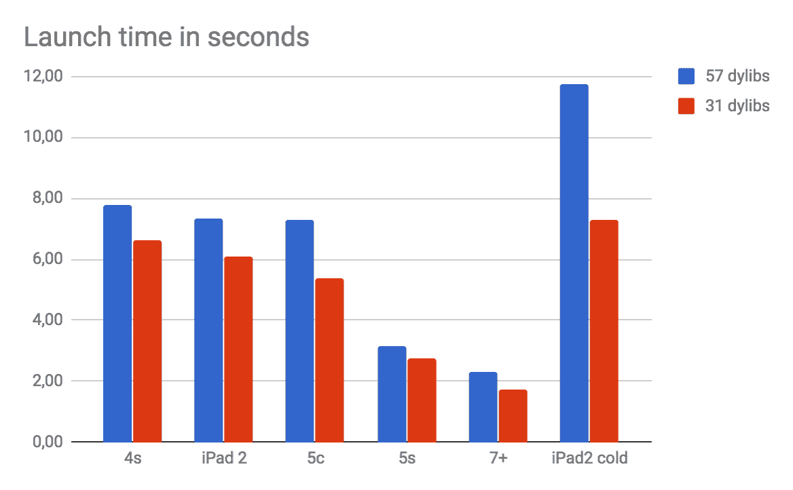

> 原文：[Static linking vs dyld3](https://blog.allegro.tech/2018/05/Static-linking-vs-dyld3.html)


[Kamil Borzym](https://blog.allegro.tech/authors/kamil.borzym)

**5 月 28 日** 2018

# 静态链接 vs dyld3

本文分为两部分。第一部分描述了通过采用静态链接来改善 [Allegro iOS App](https://itunes.apple.com/pl/app/allegro/id305659772?l=pl&mt=8) 的启动时间，并辅以加速分析进行总结。第二部分介绍了我是如何利用尚未完全发布的 dyld3 [动态链接器](https://en.wikipedia.org/wiki/Dynamic_linker)（dynamic linker）来启动一个自定义 macOS App，并同样附上了 App 启动加速分析。

## 改善 iOS App 启动时间 [#](#improving-ios-app-launch-time)

启动移动 App 需要一些时间，尤其是在移动 CPU 性能有限的系统上。Apple 建议 [400ms](https://developer.apple.com/videos/play/wwdc2016/406) 作为一个良好的启动时间。[iOS](https://en.wikipedia.org/wiki/IOS) 在 App 启动期间会执行缩放动画——从而创造了执行所有 CPU 密集型任务的机会。理想情况下，iOS 上的整个启动过程应在 App 打开动画结束时完成。

Apple 工程师在 [WWDC 2016 - Session 406: Optimizing App Startup Time](https://developer.apple.com/videos/play/wwdc2016/406) 中描述了一些改善启动时间的技术。但这还不够，就在第二年，他们在 [WWDC 2017 - Session 413: App Startup Time: Past, Present, and Future](https://developer.apple.com/videos/play/wwdc2017/413/) 中宣布了一个全新的动态链接器。回顾 dyld 的历史，可以看到 Apple 一直在努力使其操作系统更快。

在 Allegro，我们也努力让我们的 App 尽可能快。除了使用 Swift（Swift 在启动时间和 App 速度方面比 ObjC 表现更好），我们还使用[静态链接](https://en.wikipedia.org/wiki/Static_library)来构建我们的 iOS App。

## 静态链接 [#](#static-linking)

Allegro iOS App 使用了**大量**库。该 App 具有模块化架构，每个模块都是一个单独的库。除此之外，Allegro App 还使用了许多第三方库，通过 [CocoaPods](https://cocoapods.org/) 包管理器集成。所有这些库过去都是以[框架](https://developer.apple.com/library/content/documentation/MacOSX/Conceptual/BPFrameworks/Concepts/WhatAreFrameworks.html)的形式集成的——这是在 Apple 生态系统中分发 dylib（动态库）的标准方式。57 个嵌套框架这个数量已经足以影响 App 启动时间。iOS 有 20 秒的 App 启动时间限制。任何达到该限制的 App 都会被立即杀掉。Allegro App 在老旧 iPad 2 上经常被杀掉，特别是当设备刚启动且所有缓存都为空时。

动态链接器在搜索依赖项时执行大量磁盘 I/O。静态链接消除了所有这些 dylib 搜索的需要——依赖项和可执行文件合二为一。我们决定尝试一下，将至少一部分库静态链接到主可执行文件中，从而减少框架数量。

我们希望逐步进行，一个框架一个框架地处理。我们还希望万一出现任何意外问题，能够关闭静态链接。

我们决定采用两步方法：

- 将框架代码编译为静态库，
- 将框架（动态库包）转换为资源包（resource bundle）。

### 将框架代码编译为静态库 [#](#compiling-framework-code-as-a-static-library)

Xcode 9 提供了 `MACH_O_TYPE = staticlib` 构建设置——当设置了该标志时，[链接器](https://en.wikipedia.org/wiki/Linker_(computing))会生成静态库。对于通过 CocoaPods 集成的库，我们必须在 [Podfile](https://guides.cocoapods.org/syntax/podfile.html) 中创建一个自定义脚本，以便在 `pod install` 期间仅为选定的外部库设置此标志（即在依赖项安装期间，因为 CocoaPods 每次重新安装都会为管理的库创建新的项目结构）。

`MACH_O_TYPE` 做得很好，但我们在 Xcode 9 发布之前就已经在执行静态链接了。尽管 Xcode 8 不支持静态 Swift 链接，但有一种方法可以使用 [`libtool`](https://www.manpagez.com/man/1/libtool/) 来执行静态链接。在那些艰难时期，我们只是为选定的库添加了带有 [buildstatic](https://github.com/aliceatlas/buildstatic) 脚本的自定义构建阶段。这看起来可能像是一种 hack，但实际上它只是对文档齐全的工具集的强力使用……而且它完美地工作。

这样，我们用静态库替换了动态库，但这是工作中较容易的部分。

### 将框架转换为资源包 [#](#converting-framework-to-resource-bundle)

除了动态库之外，框架还可以包含资源（图片、[nib](https://developer.apple.com/library/content/documentation/Cocoa/Conceptual/LoadingResources/CocoaNibs/CocoaNibs.html) 等）。我们摆脱了动态库，但不能只留下仅包含资源的框架。资源包是在 Apple 生态系统中包装资源的标准方式，因此我们创建了 [`framework_to_bundle.sh`](https://gist.github.com/kam800/7e9b0fd55a3fbcd455695aab3ffa08ac) 脚本，它接收 `*.framework` 并输出包含所有资源的 `*.bundle`。

处理资源的代码被重新设计，以自动使用正确的资源位置。Allegro iOS App 有一个 [`Bundle.resourcesBundle(forModuleName:)`](https://gist.github.com/kam800/ae364706988526abf5b09bf959c5646e) 方法，无论使用何种链接类型，它总能找到正确的包。

### 结果 [#](#results)

上次测量 Allegro iOS App 启动时间时，它仍然有 31 个动态库——因此只有 45% 的库被静态链接，结果已经非常有希望。我们的静态链接革命工作尚未完成，目标是 100%。

我们在不同设备上测量了两个 App 版本的启动时间：一个版本所有库都是动态链接的，另一个版本有 26 个库是静态链接的。我们使用了什么测量方法？秒表……是的，真正的秒表。`DYLD_PRINT_STATISTICS=1` 变量是一个可以帮助识别动态链接器变慢原因的工具，但它并不能测量整个启动时间。我们使用秒表和慢动作摄像机来测量从点击 App 图标到 App 主屏幕完全可见的时间。

下表中的每次测量都是 6 个样本的平均值。

|  | iPhone 4s | iPad 2 | iPhone 5c | iPhone 5s | iPhone 7+ | iPad 2 冷启动 |
|---|---|---|---|---|---|---|
| 57 个 dylib App 启动时间 [秒] | 7.79 | 7.33 | 7.30 | 3.14 | 2.31 | 11.75 |
| 31 个 dylib App 启动时间 [秒] | 6.62 | 6.08 | 5.39 | 2.75 | 1.75 | 7.27 |
| 启动加速 [%] | 15.02 | 17.05 | 26.16 | 12.42 | 24.24 | 38.13 |

Allegro iOS App 在 iPhone 5c 上的启动时间减少了大约 2 秒——这是一个显著的提升。在刚开机的 iPad 2 上，App 启动时间甚至改善得更多——差异约为 4.5 秒，大约是所有库动态链接时启动时间的 38%。



### 静态链接陷阱 [#](#static-linking-pitfall)

如果你有静态链接的库，请注意不要将其链接到多个动态库中——这将导致静态库对象在不同动态库之间重复，这可能是一个严重的问题。我们创建了一个 [`check_duplicated_classes.sh`](https://gist.github.com/kam800/0d04917b4f051c1dd906d629d685f571) 脚本，作为最终的构建阶段运行。

这是我们遇到的唯一主要障碍。

## Dyld3 [#](#dyld3)

全新的[动态链接器](https://en.wikipedia.org/wiki/Dynamic_linker) dyld3 大约一年前在 [WWDC 2017](https://developer.apple.com/videos/play/wwdc2017/413/) 上发布。在撰写本文时，我们即将迎来 WWDC 2018，而 dyld3 仍然无法用于第三方 App。目前只有[系统 App 使用 dyld3](https://twitter.com/lgerbarg/status/882055176298704896)。我再也等不下去了，我对它的真正实力太好奇了。我决定尝试使用 dyld3 启动我自己的 App。

### 寻找 dyld3 [#](#looking-for-dyld3)

我想知道：是什么让系统 App 如此特殊，以至于它们能用 dyld3 启动？

第一个猜测：`LC_LOAD_DYLINKER` 加载命令指向 dyld3 可执行文件……

```
$ otool -l /Applications/Calculator.app/Contents/MacOS/Calculator | grep "cmd LC_LOAD_DYLINKER" -A 2
          cmd LC_LOAD_DYLINKER
      cmdsize 32
         name /usr/lib/dyld (offset 12)
```

这是个糟糕的猜测。查看其余的加载命令和所有 App 节区，没有发现任何特别之处。系统应用程序到底有没有使用 dyld3？让我们尝试使用 [lldb](https://lldb.llvm.org/) 调试器检查一下：

```
$ lldb /Applications/Calculator.app/Contents/MacOS/Calculator
(lldb) rbreak dyld3
Breakpoint 1: 887 locations.
(lldb) r
Process 92309 launched: '/Applications/Calculator.app/Contents/MacOS/Calculator' (x86_64)
Process 92309 stopped
* thread #1, stop reason = breakpoint 1.154
    frame #0: 0x00007fff72bf6296 libdyld.dylib`dyld3::AllImages::applyInterposingToDyldCache(dyld3::launch_cache::binary_format::Closure const*, dyld3::launch_cache::DynArray<dyld3::loader::ImageInfo> const&)
libdyld.dylib`dyld3::AllImages::applyInterposingToDyldCache:
->  0x7fff72bf6296 <+0>: pushq  %rbp
    0x7fff72bf6297 <+1>: movq   %rsp, %rbp
    0x7fff72bf629a <+4>: pushq  %r15
    0x7fff72bf629c <+6>: pushq  %r14
Target 0: (Calculator) stopped.
```

lldb 在系统 App 启动期间命中了某些 dyld3 符号，而在任何自定义 App 启动期间都没有命中。检查回溯和汇编显示，`/usr/lib/dyld` 同时包含了旧的 dyld2 和全新的 dyld3。一定存在某个 `if` 来决定应该使用哪个 dyldX。

阅读汇编代码通常是一个非常困难的过程。幸运的是，我记得 Apple 的某些代码是开源的，包括 [dyld](https://opensource.apple.com/source/dyld/)。我本地的二进制文件有 `LC_SOURCE_VERSION = 551.3`，而最新的可用 dyld 源码是 `519.2.2`。这些版本相差很大吗？我花了几个晚上查看本地 dyld 汇编和相应的 dyld 源码，没有看到任何显著差异。事实上，我有一种奇怪的感觉，源码与汇编完全匹配——这是调试的完美指南。

我最终得到了什么？隐藏的 dyld3 可以通过以下两种方法之一在 macOS High Sierra 上激活：

1. 设置 `dyld`sEnableClosures`：

    - 需要通过例如使用 lldb `memory write` 来设置 `dyld`sEnableClosures`（不幸的是，未文档化的 `DYLD_USE_CLOSURES=1` 变量只适用于 Apple 内部系统），
    - 需要从 [dyld 源码](https://opensource.apple.com/source/dyld/) 编译 `/usr/libexec/closured`（它需要一些修改才能编译），
    - 需要修复 `callClosureDaemon` 中的 `read` 调用（我已为此问题提交了 [bug 报告](https://openradar.appspot.com/40522089)）；为了测试，我使用 lldb `breakpoint
       command` 和一个自定义的 [lldb 脚本](https://gist.github.com/kam800/e1f1fa143257c733a20aea2974929ab8)（该脚本循环调用 `read` 直到返回 0）来修复它，或者
2. 需要生成 dyld closure 并将其保存到 dyld 缓存中……但是……什么是 dyld closure？

### Dyld closure [#](#dyld-closure)

[Louis Gerbarg](https://twitter.com/lgerbarg) 在 [WWDC 2017](https://developer.apple.com/videos/play/wwdc2017/413/) 上提到了 dyld closure 的概念。Dyld closure 包含启动 App 所需的所有信息。Dyld closure 可以被缓存，因此 dyld 可以通过恢复它们节省大量时间。

[Dyld 源码](https://opensource.apple.com/source/dyld/) 包含 `dyld_closure_util`——一个可用于创建和转储 dyld closure 的工具。看起来 Apple 开源项目很少能在非 Apple 内部系统上编译，因为它有很多 Apple 私有依赖项（例如 `Bom/Bom.h` 等等……）。我很幸运——`dyld_closure_util` 只需进行一些简单的修改就能编译。

我创建了一个 macOS App 只是为了检验 dyld3 的实际表现。`TestMacApp.app` 包含 20 个框架、1000 个 ObjC 类，每个类约有 1000~10000 个方法。我尝试为这个 App 创建一个 dyld closure，它的 [JSON 表示形式 (36.5 MB)](https://raw.githubusercontent.com/kam800/dyld3-samples/master/sample_dyld_closure.txt) 非常长——接近一百万行：

```
$ dyld_closure_util -create_closure ~/tmp/TestMacApp.app/Contents/MacOS/TestMacApp | wc -l
  832363
```

dyld closure 的基本 JSON 表示形式如下所示：

```
{
  "dyld-cache-uuid": "9B095CC4-22F1-3F88-8821-8DFD979AB7AD",
  "images": [
    {
      "path": "/Users/kamil.borzym/tmp/TestMacApp.app/Contents/MacOS/TestMacApp",
      "uuid": "D5BDC1D3-D09E-36D5-96E9-E7FFA7EE955E"
      "file-inode": "0x201D8F8BC", // used to check if dyld closure is still valid
      "file-mod-time": "0x5B032E9A", // used to check if dyld closure is still valid
      "dependents": [
        {
          "path": "/Users/kamil.borzym/tmp/TestMacApp.app/Contents/Frameworks/Frm1.framework/Versions/A/Frm1"
        },
        {
          "path": "/Users/kamil.borzym/tmp/TestMacApp.app/Contents/Frameworks/Frm2.framework/Versions/A/Frm2"
        },
        /* ... */
      ],
      /* ... */
    },
    {
      "path": "/Users/kamil.borzym/tmp/TestMacApp.app/Contents/Frameworks/Frm1.framework/Versions/A/Frm1",
      "dependents": [ /* ... */ ]
    },
    /* ... */
  ],
  /* ... */
}
```

Dyld closure 包含完全解析的 dylib 依赖关系树。这意味着：不再有昂贵的 dylib 搜索。

### Dyld3 closure 缓存 [#](#dyld3-closure-cache)

为了测量 dyld3 的启动速度提升，我必须使用 dyld3 激活方法 #2——提供一个有效的 App dyld closure。虽然设置 `dyld`sEnableClosures` 会在 App 启动期间创建一个 dyld closure，但该 closure 目前不会被缓存。

[Dyld 源码](https://opensource.apple.com/source/dyld/) 包含 `update_dyld_shared_cache` 工具的源代码。不幸的是，这个工具使用了一些 Apple 私有库，我无法在我的系统上编译它。纯属偶然，我发现这个工具在每个 macOS High Sierra 中都可用，位于 `/usr/bin/update_dyld_shared_cache`。同时 [`man update_dyld_shared_cache`](https://www.manpagez.com/man/1/update_dyld_shared_cache/) 也存在——这使得重建缓存更加简单。

`update_dyld_shared_cache` 源码显示，它只为一组预定义的系统 App 生成 dyld closure 缓存。我可以修改这个工具二进制文件以考虑 `TestMacApp.app`，但我最终将测试 App 重命名为 `Calculator.app` 并移到了 `/Applications`——简单但有效。

我更新了 dyld closure 缓存：

```
sudo update_dyld_shared_cache -force
```

然后重启了我的系统（正如 `man update_dyld_shared_cache` 所述）。之后，我的测试 App 使用 dyld3 启动了！我用 lldb 验证了这一点。同时设置 `DYLD_PRINT_WARNINGS=1` 变量显示，dyld closure 不是生成的，而是从 dyld 缓存中获取的：

```
dyld: found closure 0x7fffef8f278c in dyld shared cache
```

### Dyld3 性能 [#](#dyld3-performance)

如前所述，测试 App 包含 20 个框架，每个框架有 1000 个 ObjC 类和 1000~10000 个方法。我还在这些框架之间创建了一个简单的依赖网络：主 App 依赖于所有框架，第 1 个框架依赖于 19 个框架，第 2 个框架依赖于 18 个框架，第 3 个框架依赖于 17 个框架，依此类推……启动后，App 只是调用了 `exit(0)`。我使用 [`time`](https://www.manpagez.com/man/1/time/) 来测量从发出启动命令到 App 退出之间的时间。我没有使用 `DYLD_PRINT_STATISTICS=1`，因为除了上面给出的原因外，dyld3 也[尚未](https://openradar.appspot.com/40593547)支持这个变量。

测试平台是 MacBook Pro Retina, 13-inch, Early 2015 (3.1 GHz Intel Core i7)，运行 macOS High Sierra 10.13.4 (17E202)。不幸的是，我无法访问任何明显更慢的机器。下表中的每次测量都是 6 个样本的平均值。测量了两种类型的启动：

- 热启动——不重启系统，
- 冷启动——每个测量时间样本之间重启系统。

静态链接的 App 启动总是非常快，但我没有看到 dyld2 和 dyld3 加载时间之间有显著差异。

| 启动类型 | dyld2 | dyld3 | 静态 |
|---|---|---|---|
| 热启动 | 0.737s | 0.726s | 0.676s |
| 冷启动 | 1.166s | 1.094s | 0.871s |

我尝试从更慢的磁盘配置启动 App——一个旧的 USB 驱动器（顺序读取速度极低，为 17.1 MB/s）。磁盘 I/O 应该是 dyld2 加载的瓶颈。我使用 `ln -s /Volumes/USB/Calculator.app` 伪造了 `/Application/Calculator.app` 路径，并重新生成了 dyld 缓存。

随后的测量结果好得多。热启动时没有区别，但在冷启动时，dyld3 比 dyld2 快 20%。实际上，dyld3 的冷启动时间正好位于 dyld2 启动时间和静态链接 App 启动时间之间。

| 启动类型 | dyld2 | dyld3 | 静态 |
|---|---|---|---|
| 热启动 | 0.722s | 0.731s | 0.679s |
| 冷启动 | 3.687s | 2.947s | 2.276s |

### dyld3 状态 [#](#dyld3-status)

请注意，dyld3 仍在开发中，尚未向第三方 App 发布。我猜它目前可用于系统 App，主要目的不是为了提高它们的速度，而是为了测试 dyld3 的稳定性。

[Louis Gerbarg](https://twitter.com/lgerbarg) 说过 dyld3 有其守护进程。在 macOS High Sierra 上没有 dyld3 守护进程。`closured` 目前由 dyld3 作为命令行工具通过 `fork`+`execve` 调用。它甚至不缓存创建的 dyld closure。在不久的将来，我们肯定会看到很多变化。

你想知道我的看法吗？我认为一个带有完整 `closured` 守护进程的 dyld3 将会随下一个主要 macOS 版本一起发布。我认为这个新版本的 dyld3 将会实现更快速的内存中 closure 缓存。每个人都将在所有 Apple 平台上感受到 App 启动时间的巨大改进——启动时间将更接近静态链接的 App，而不是当前的 dyld2。我衷心期盼这一点。

[mobile](https://blog.allegro.tech/tag/mobile) [ios](https://blog.allegro.tech/tag/ios) [macos](https://blog.allegro.tech/tag/macos) [static linking](https://blog.allegro.tech/tag/static-linking) [dyld](https://blog.allegro.tech/tag/dyld) [dyld3](https://blog.allegro.tech/tag/dyld3)

## 讨论
