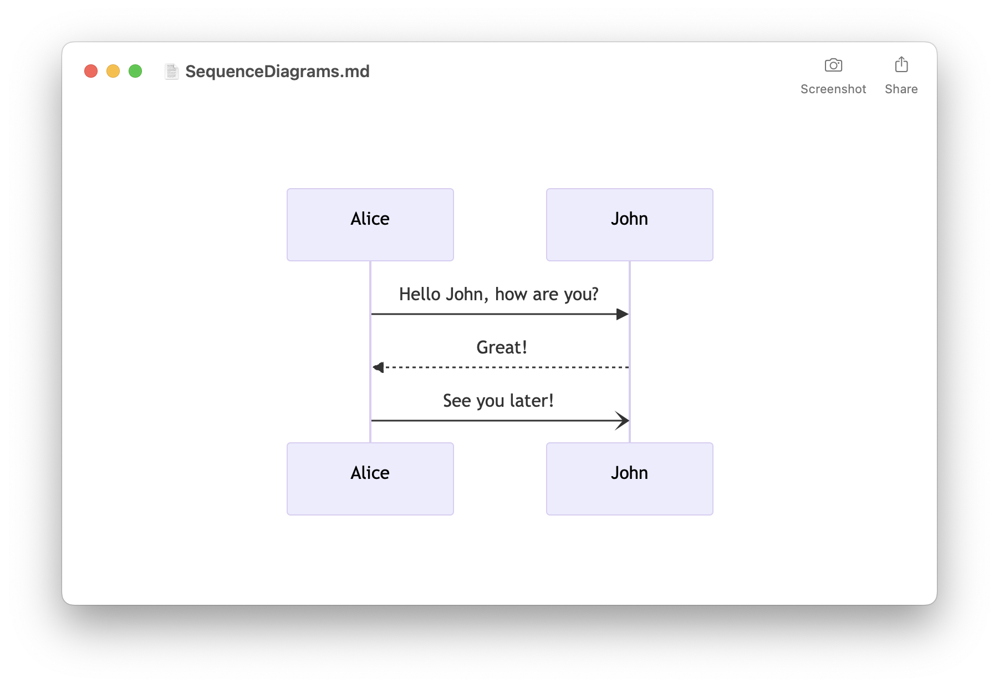
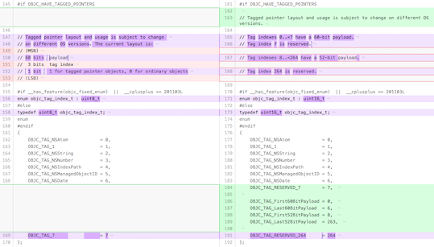
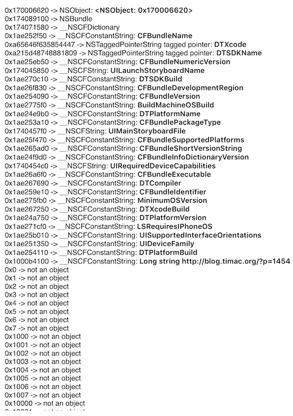

> 原文：[Testing if an arbitrary pointer is a valid Objective-C object](https://blog.timac.org/2016/1124-testing-if-an-arbitrary-pointer-is-a-valid-objective-c-object/)

假设你随便选了一个指针。我们能知道它是否指向一个有效的 Objective-C 对象吗？当然，还不能让它崩溃……嗯，没有简单的解决方案。这篇文章里，我给出一个面向 64 位架构的解决方案。提供的代码仅在 macOS 10.12.1 和 iOS 10.1.1 上配合现代 Objective-C 运行时测试过。

想支持这个博客吗？请看看

 [MarkChart - Mermaid 编辑器](https://apps.apple.com/app/apple-store/id6475648822?pt=120357958&ct=blog.timac.org&mt=8)

- 轻松预览 Mermaid 图
- 序列图、流程图……
- 内置编辑器
- 导出为 PDF、PNG 和 SVG
- 快速查看（Quick Look）集成
- 支持 macOS、iOS 和 iPadOS
- [在 App Store 免费下载](https://apps.apple.com/app/apple-store/id6475648822?pt=120357958&ct=blog.timac.org&mt=8)

[](https://apps.apple.com/app/apple-store/id6475648822?pt=120357958&ct=blog.timac.org&mt=8)

关于这个主题的文档不多。有一篇 2010 年由 [Matt Gallagher](https://www.cocoawithlove.com/2010/10/testing-if-arbitrary-pointer-is-valid.html) 撰写的文章，但内容已经过时，不再能正常工作。本文中的大部分信息来自：

- [macOS 10.12 中的 objc4-706](https://opensource.apple.com/source/objc4/objc4-706/)
- [LLDB git 仓库（2016 年 11 月）](http://lldb.llvm.org/source.html)

# 免责声明

本文内容——以及源代码——依赖于 Objective-C 运行时的内部结构。不保证其正确性，并且可能会在 macOS/iOS 的任何更新中失效。不要在实际的 App 中使用这些代码！

事实上，我刚开始是基于 objc4-680 源码（mac OS 10.11.6）撰写这篇文章的。但就在发布之前，Apple 发布了 objc4-706（macOS 10.12）的源码。正如下面图片所示，我所依赖的一些内部结构已经发生了变化：

[](https://blog.timac.org/2016/1124-testing-if-an-arbitrary-pointer-is-a-valid-objective-c-object/objc4-680_objc4-706.png)

# 什么是指针？

指针只是一个引用内存位置的整数。然而，在 iOS 和 macOS 上，有两种指针：常规指针和 Tagged Pointer。让我们先从解决 Tagged Pointer 的问题开始。

# Tagged Pointer

Tagged Pointer（tagged pointer）是在 iOS 7 和 Mac OS X 10.7 中为 64 位架构引入的。Tagged Pointer 是一种特殊的指针，数据直接存储在指针中，而非进行内存分配。这具有明显的性能优势。

Tagged Pointer 在 [objc-internal.h](https://opensource.apple.com/source/objc4/objc4-706/runtime/objc-internal.h) 中声明。在 macOS 10.11 及更早版本中，Tagged Pointer 很简单：

- 60 位用于负载数据（payload）
- 3 位用于标签索引（tag index）
- 1 位用于区分 Tagged Pointer 对象与普通对象

在 macOS 10.12 中，Tagged Pointer 的布局发生了变化，还支持 52 位负载数据和更多标签索引：

```c
// Tag indexes 0..<7 have a 60-bit payload.
// Tag index 7 is reserved.
// Tag indexes 8..<264 have a 52-bit payload.
// Tag index 264 is reserved.
```

标签索引告诉你 Tagged Pointer 所代表的类：

```c
{
    OBJC_TAG_NSAtom            = 0,
    OBJC_TAG_1                 = 1,
    OBJC_TAG_NSString          = 2,
    OBJC_TAG_NSNumber          = 3,
    OBJC_TAG_NSIndexPath       = 4,
    OBJC_TAG_NSManagedObjectID = 5,
    OBJC_TAG_NSDate            = 6,
    OBJC_TAG_RESERVED_7        = 7,

    OBJC_TAG_First60BitPayload = 0,
    OBJC_TAG_Last60BitPayload  = 6,
    OBJC_TAG_First52BitPayload = 8,
    OBJC_TAG_Last52BitPayload  = 263,

    OBJC_TAG_RESERVED_264      = 264
};
```

检查一个指针是否是 Tagged Pointer 非常简单，可以使用 objc-internal.h 中声明的函数：

```c
static inline bool
_objc_isTaggedPointer(const void *ptr)
{
    return ((intptr_t)ptr & _OBJC_TAG_MASK) == _OBJC_TAG_MASK;
}

static inline objc_tag_index_t
_objc_getTaggedPointerTag(const void *ptr)
{
    // assert(_objc_isTaggedPointer(ptr));
    uintptr_t basicTag = ((uintptr_t)ptr >> _OBJC_TAG_INDEX_SHIFT) & _OBJC_TAG_INDEX_MASK;
    uintptr_t extTag =   ((uintptr_t)ptr >> _OBJC_TAG_EXT_INDEX_SHIFT) & _OBJC_TAG_EXT_INDEX_MASK;
    if (basicTag == _OBJC_TAG_INDEX_MASK) {
        return (objc_tag_index_t)(extTag + OBJC_TAG_First52BitPayload);
    } else {
        return (objc_tag_index_t)basicTag;
    }
}
```

遗憾的是这些函数是静态内联（static inline）的，并未导出，我们别无选择，只能将它们的实现复制到我们的源代码中。

另一方面，用于获取给定标签已注册类的函数是导出的，可以直接使用：

```c
/**
 Returns the registered class for the given tag.
 Returns nil if the tag is valid but has no registered class.

 This function searches the exported function: _objc_getClassForTag(objc_tag_index_t tag)
 declared in https://opensource.apple.com/source/objc4/objc4-706/runtime/objc-internal.h
 */
static Class _objc_getClassForTag(objc_tag_index_t tag)
{
    static bool _objc_getClassForTag_searched = false;
    static Class (*_objc_getClassForTag_func)(objc_tag_index_t) = NULL;
    if(!_objc_getClassForTag_searched)
    {
        _objc_getClassForTag_func = (Class(*)(objc_tag_index_t))dlsym(RTLD_DEFAULT, "_objc_getClassForTag");
        _objc_getClassForTag_searched = true;
        if(_objc_getClassForTag_func == NULL)
        {
            fprintf(stderr, "*** Could not find _objc_getClassForTag()!\n");
        }
    }

    if(_objc_getClassForTag_func != NULL)
    {
        return _objc_getClassForTag_func(tag);
    }

    return NULL;
}
```

现在创建一个函数，检查某个指针是否为 Tagged Pointer，进而也就是一个有效的 Objective-C 对象，就很简单了：

```c
/**
 Test if a pointer is a tagged pointer

 @param inPtr is the pointer to check
 @param outClass returns the registered class for the tagged pointer.
 @return true if the pointer is a tagged pointer.
 */
bool IsObjcTaggedPointer(const void *inPtr, Class *outClass)
{
    bool isTaggedPointer = _objc_isTaggedPointer(inPtr);
    if(outClass != NULL)
    {
        if(isTaggedPointer)
        {
            objc_tag_index_t tagIndex = _objc_getTaggedPointerTag(inPtr);
            *outClass = _objc_getClassForTag(tagIndex);
        }
        else
        {
            *outClass = NULL;
        }
    }

    return isTaggedPointer;
}
```

如果你想了解更多关于 Tagged Pointer 的信息，可以阅读 Mike Ash 的这两篇文章：

- [Friday Q&A 2013-09-27: ARM64 and You](https://www.mikeash.com/pyblog/friday-qa-2013-09-27-arm64-and-you.html)
- [Friday Q&A 2012-07-27: Let’s Build Tagged Pointers](https://www.mikeash.com/pyblog/friday-qa-2012-07-27-lets-build-tagged-pointers.html)

现在我们处理完了 Tagged Pointer，接下来看看“常规”指针。

# 对齐

有效的指针必须按指针大小对齐。LLDB 在 [objc_runtime.py](http://llvm.org/svn/llvm-project/lldb/trunk/examples/summaries/cocoa/objc_runtime.py) 中尝试打印指针时，会在 python 函数 `is_valid_pointer` 里做这项检查：

```python
@staticmethod
def is_valid_pointer(pointer, pointer_size, allow_tagged=0, allow_NULL=0):
    logger = lldb.formatters.Logger.Logger()
    if pointer is None:
        return 0
    if pointer == 0:
        return allow_NULL
    if allow_tagged and (pointer % 2) == 1:
        return 1
    return ((pointer % pointer_size) == 0)
```

最后这一步检查验证了指针是否按指针大小对齐。我们可以实现同样的检查：

```python
if (((uintptr_t)inPtr % sizeof(uintptr_t)) != 0)
{
  return false;
}
```

# 使用到的位

LLDB 源代码在 [objc_runtime.py](http://llvm.org/svn/llvm-project/lldb/trunk/examples/summaries/cocoa/objc_runtime.py) 中还有另一个有趣的函数：

```python
# Objective-C runtime has a rule that pointers in a class_t will only have bits 0 thru 46 set
# so if any pointer has bits 47 thru 63 high we know that this is not a
# valid isa
@staticmethod
def is_allowed_pointer(pointer):
    logger = lldb.formatters.Logger.Logger()
    if pointer is None:
        return 0
    return ((pointer & 0xFFFF800000000000) == 0)
```

同样，我们可以轻松实现相同的检查：

```python
if(((uintptr_t)inPtr & 0xFFFF800000000000) != 0)
{
  return false;
}
```

# 有效且可读的内存

要想有效，指针应该指向有效且可读的内存。我们可以用 `vm_region_64()` 确保内存可读，并用 `vm_read()` 确保内存有效：

```c
/**
 Test if the pointer points to readable and valid memory.

 @param inPtr is the pointer
 @return true if the pointer points to readable and valid memory.
 */
static bool IsValidReadableMemory(const void *inPtr)
{
    kern_return_t error = KERN_SUCCESS;

    // Check for read permissions
    bool hasReadPermissions = false;

    vm_size_t vmsize;
    vm_address_t address = (vm_address_t)inPtr;
    vm_region_basic_info_data_t info;
    mach_msg_type_number_t info_count = VM_REGION_BASIC_INFO_COUNT_64;

    memory_object_name_t object;

    error = vm_region_64(mach_task_self(), &address, &vmsize, VM_REGION_BASIC_INFO, (vm_region_info_t)&info, &info_count, &object);
    if(error != KERN_SUCCESS)
    {
        // vm_region/vm_region_64 returned an error
        hasReadPermissions = false;
    }
    else
    {
        hasReadPermissions = (info.protection & VM_PROT_READ);
    }

    if(!hasReadPermissions)
    {
        return false;
    }

    // Read the memory
    vm_offset_t readMem = 0;
    mach_msg_type_number_t size = 0;
    error = vm_read(mach_task_self(), (vm_address_t)inPtr, sizeof(uintptr_t), &readMem, &size);
    if(error != KERN_SUCCESS)
    {
        // vm_read returned an error
        return false;
    }

    return true;
}
```

# 验证 isa 指针并获取 Class 指针

既然我们已经知道地址指向有效且可读的内存，就可以提取出可能的 isa 指针，并获取类的指针。Greg Parker 在 [[objc explain]: Non-pointer isa](http://www.sealiesoftware.com/blog/archive/2013/09/24/objc_explain_Non-pointer_isa.html) 中有相关描述：

> 如果你正在编写类似调试器的工具，Objective-C 运行时会导出一些变量来帮助解码 isa 字段。`objc_debug_isa_class_mask` 描述了哪些位是类指针：`(isa & class_mask) == class pointer`。`objc_debug_isa_magic_mask` 和 `objc_debug_isa_magic_value` 描述了一些位，帮助区分有效的 isa 字段与其他无效值：对于不是原始类指针的 isa 字段，`(isa & magic_mask) == magic_value` 成立。这些变量将来可能会发生变化，所以不要把它们用在应用代码里。

以下是验证 isa 指针并提取 Class 指针的实现：

```c
uintptr_t isa = (*(uintptr_t *)inPtr);
Class ptrClass = NULL;

if ((isa & ~ISA_MASK) == 0)
{
    ptrClass = (Class)isa;
}
else
{
    if ((isa & ISA_MAGIC_MASK) == ISA_MAGIC_VALUE)
    {
        ptrClass = (Class)(isa & ISA_MASK);
    }
    else
    {
        ptrClass = (Class)isa;
    }
}

if(ptrClass == NULL)
{
    return false;
}
```

# 验证类是否存在

现在我们拿到了类，就可以检查 Objective-C 运行时是否知道这个类：

```c
bool isKnownClass = false;

unsigned int numClasses = 0;
Class *classesList = objc_copyClassList(&numClasses);
for (int i = 0; i < numClasses; i++)
{
    if (classesList[i] == ptrClass)
    {
        isKnownClass = true;
        break;
    }
}
free(classesList);

if(!isKnownClass)
{
    return false;
}
```

# 过滤掉一些误判

Greg Parker 有一个[好技巧](https://twitter.com/gparker/status/801894068502433792)，就是通过检查指针的 malloc 分配大小是否大于类的实例大小，来过滤掉一些误判：

```c
size_t pointerSize = malloc_size(inPtr);
if(pointerSize > 0 && pointerSize < class_getInstanceSize(ptrClass))
{
    return false;
}
```

# 总结

现在我们拥有了构建一个函数的所有要素，这个函数会返回一个布尔值，表示某个指针是不是 Objective-C 对象：

```c
/**
 Test if a pointer is an Objective-C object

 @param inPtr is the pointer to check
 @return true if the pointer is an Objective-C object
 */
bool IsObjcObject(const void *inPtr)
{
    //
    // NULL pointer is not an Objective-C object
    //
    if(inPtr == NULL)
    {
        return false;
    }

    //
    // Check for tagged pointers
    //
    if(IsObjcTaggedPointer(inPtr, NULL))
    {
        return true;
    }

    //
    // Check if the pointer is aligned
    //
    if (((uintptr_t)inPtr % sizeof(uintptr_t)) != 0)
    {
        return false;
    }

    //
    // From LLDB:
    // Objective-C runtime has a rule that pointers in a class_t will only have bits 0 thru 46 set
    // so if any pointer has bits 47 thru 63 high we know that this is not a valid isa
    // See http://llvm.org/svn/llvm-project/lldb/trunk/examples/summaries/cocoa/objc_runtime.py
    //
    if(((uintptr_t)inPtr & 0xFFFF800000000000) != 0)
    {
        return false;
    }

    //
    // Check if the memory is valid and readable
    //
    if(!IsValidReadableMemory(inPtr))
    {
        return false;
    }

    //
    // Get the Class from the pointer
    // From http://www.sealiesoftware.com/blog/archive/2013/09/24/objc_explain_Non-pointer_isa.html :
    // If you are writing a debugger-like tool, the Objective-C runtime exports some variables
    // to help decode isa fields. objc_debug_isa_class_mask describes which bits are the class pointer:
    // (isa & class_mask) == class pointer.
    // objc_debug_isa_magic_mask and objc_debug_isa_magic_value describe some bits that help
    // distinguish valid isa fields from other invalid values:
    // (isa & magic_mask) == magic_value for isa fields that are not raw class pointers.
    // These variables may change in the future so do not use them in application code.
    //

    uintptr_t isa = (*(uintptr_t *)inPtr);
    Class ptrClass = NULL;

    if ((isa & ~ISA_MASK) == 0)
    {
        ptrClass = (Class)isa;
    }
    else
    {
        if ((isa & ISA_MAGIC_MASK) == ISA_MAGIC_VALUE)
        {
            ptrClass = (Class)(isa & ISA_MASK);
        }
        else
        {
            ptrClass = (Class)isa;
        }
    }

    if(ptrClass == NULL)
    {
        return false;
    }

    //
    // Verifies that the found Class is a known class.
    //
    bool isKnownClass = false;

    unsigned int numClasses = 0;
    Class *classesList = objc_copyClassList(&numClasses);
    for (int i = 0; i < numClasses; i++)
    {
        if (classesList[i] == ptrClass)
        {
            isKnownClass = true;
            break;
        }
    }
    free(classesList);

    if(!isKnownClass)
    {
        return false;
    }


    //
    // From Greg Parker
    // https://twitter.com/gparker/status/801894068502433792
    // You can filter out some false positives by checking malloc_size(obj) >= class_getInstanceSize(cls).
    //
    size_t pointerSize = malloc_size(inPtr);
    if(pointerSize > 0 && pointerSize < class_getInstanceSize(ptrClass))
    {
        return false;
    }

    return true;
}
```

# 测试

为了测试这个函数，我构建了一个简单的 iOS App，对多种指针进行检查。以下是在 iOS 10.1.1（64 位）上运行时的输出：



# 下载

- [IsObjcObject.c](https://blog.timac.org/2016/1124-testing-if-an-arbitrary-pointer-is-a-valid-objective-c-object/IsObjcObject.c)
- [测试 App 的源码](https://blog.timac.org/2016/1124-testing-if-an-arbitrary-pointer-is-a-valid-objective-c-object/IsObjcObject.zip)

# 参考资料

- [objc4-706](https://opensource.apple.com/source/objc4/objc4-706/) 来自 macOS 10.12
- [LLDB git 仓库](http://lldb.llvm.org/source.html)（2016 年 11 月）
- [Testing if an arbitrary pointer is a valid object pointer](https://www.cocoawithlove.com/2010/10/testing-if-arbitrary-pointer-is-valid.html) 来自 Matt Gallagher
- [Friday Q&A 2013-09-27: ARM64 and You](https://www.mikeash.com/pyblog/friday-qa-2013-09-27-arm64-and-you.html) 来自 Mike Ash
- [Friday Q&A 2012-07-27: Let’s Build Tagged Pointers](https://www.mikeash.com/pyblog/friday-qa-2012-07-27-lets-build-tagged-pointers.html) 来自 Mike Ash
- [[objc explain]: Non-pointer isa](http://www.sealiesoftware.com/blog/archive/2013/09/24/objc_explain_Non-pointer_isa.html) 来自 Greg Parker

# 更新记录

**24.11.2016**：根据 Greg Parker 的反馈做了两处更改：

- 过滤掉一些误判
- 使用 `objc_copyClassList()` 替代 `objc_getClassList()`
