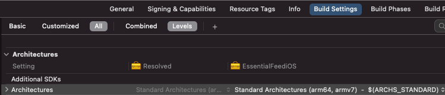

> 原文：[Introduction to Static vs Dynamic libraries and frameworks on iOS (and macOS)](https://bpoplauschi.github.io/2021/10/24/Intro-to-static-and-dynamic-libraries-frameworks.html)

# iOS（及 macOS）静态与动态库和框架简介

2021 年 10 月 24 日

## 简介

在任何平台（包括 Apple 平台）上构建 App 时，我们都必须处理系统框架、打包自己的代码、使用第三方代码等诸多事宜。许多开发者会使用静态和/或动态框架/库，但并不完全理解它们，因此无法充分发挥其优势。所以我决定分享我的知识，希望能帮助澄清这些概念。

我们先快速了解一下本文的结构：

- 定义：什么是库、什么是框架、什么是链接、静态链接和动态链接的含义
- iOS 与 macOS 的链接差异
- _使用静态与动态方式对 App 二进制大小和启动时间的影响（第二部分）_
- _集成第三方代码的最常见方式以及静态与动态链接如何应用其中（第二部分）_

在深入探讨之前，我们先明确所使用的术语：**我们将从打包和链接的角度来讨论库和框架**。

另一种看待库与框架的视角关注流程控制：_你的代码调用库，框架调用你的代码（在向其注册之后）。_ 目前我们不关心这第二种解释。

## 什么是库

[库（Library）](https://en.wikipedia.org/wiki/Library_(computing))是计算机程序使用的非易失性资源的集合。它可以包含源代码。我们在 macOS 或 iOS 上看到的大多数库都包含代码（为一个或多个架构编译）。库可以静态链接（称为静态库）或动态链接（动态库）。稍后我们将介绍链接的含义。

在尝试分发资源（如字符串文件、图像等）时，iOS / macOS 库会与包含这些资源的 bundle 一起交付。我不知道如何在 iOS / macOS 库中直接包含资源。

### 示例

静态库通常看起来像 `lib*.a` 文件，例如：`libGoogleAnalytics.a`（你可能用过这个）。动态库使用 `*.dylib` 扩展名。

## 什么是（CPU）架构

在 iOS / macOS 编译二进制的上下文中，架构指的是 [CPU 架构](https://docs.elementscompiler.com/Platforms/Cocoa/CpuArchitectures/)。我们需要为二进制将运行的所有不同 CPU 架构进行编译。

目前，macOS 支持两种架构：

- `x86_64`：Intel 64 位 CPU 的架构。它是 2005 年至 2021 年间出货的所有 Intel Mac 的架构。
- `arm64`：基于 Apple Silicon（2020+）的新款 Mac 使用的架构。

iOS 模拟器运行在 macOS 上，因此它们使用相同的架构。

iOS 随着时间的推移支持了更多架构：

- 2009 年之前出货的旧款 iOS 设备搭载 `armv6` CPU，当前 iOS SDK 已不再支持。
- `armv7`：32 位 ARM CPU 的旧变体，用于 A5 及更早芯片。
- `armv7s`：用于 iPhone 5、iPhone 5C 和 iPad 4 的 Apple A6 和 A6X 芯片。
- `arm64`：当前 64 位 ARM CPU 架构，自 iPhone 5S 及以后（SE、6、7 等）、iPad Air、Air 2 和 Pro（搭载 A7 及更新芯片）开始使用。

你可以通过查看 Build Settings -> Architectures (`ARCHS`) 来了解 Xcode target 设置的架构。Xcode 预设为 `Standard Architectures`（在 Xcode 12.5 和 iOS target 上，这解析为 `arm64 armv7`）。



## 什么是框架

[框架（Framework）](https://en.wikipedia.org/wiki/Software_framework)是一个可以包含诸如预编译代码（库）、字符串文件、图像、storyboard 等资源的包（如果它包含其他框架，则称为 _umbrella framework_）。Apple 的框架被组织成 bundle（在磁盘上有预定义的文件夹结构）。可以通过代码中的 `Bundle` 类访问它们，并且与大多数 bundle 文件不同，它们可以在文件系统中浏览（便于开发者检查内容）。

查看 [Apple 的 Bundle 编程指南](https://developer.apple.com/library/archive/documentation/CoreFoundation/Conceptual/CFBundles/BundleTypes/BundleTypes.html#//apple_ref/doc/uid/10000123i-CH101-SW1)。


_框架_也是以 `.framework` 扩展名结尾的 bundle。注意：从 Xcode 11 开始，Apple 添加了 `xcframework` 扩展名，这也是包含多种架构和平台的 bundle。

### 静态框架

嵌入静态库的框架必须静态链接，因此我们称之为静态框架。

### 动态框架

嵌入动态库的框架必须动态链接，因此我们称之为动态框架。

### Umbrella 框架

内部嵌入了其他框架的框架。它在 iOS 上未获得官方支持，因此**不建议**开发者创建它们 [官方文档](https://developer.apple.com/library/archive/technotes/tn2435/_index.html#//apple_ref/doc/uid/DTS40017543-CH1-PROJ_CONFIG-APPS_WITH_DEPENDENCIES_BETWEEN_FRAMEWORKS)。

### 示例

它们都看起来像 `*.framework` 文件夹，例如：`FirebaseAnalytics.framework`（你可能用过这个）。

## 链接

[**链接器（Linker）**或**链接编辑器**](https://en.wikipedia.org/wiki/Linker_(computing))是一个程序，它接受一个或多个目标文件（由编译器或汇编器生成）并将它们组合成一个可执行文件、库文件或另一个“目标”文件。

通常，链接阶段发生在编译阶段之后，即使它们是不同的并由独立的组件执行，我们通常将这两个过程简称为“编译”或“构建”。

如果你查看构建日志，会看到类似“Build target MyApp”的部分包含几个步骤，其中之一可能是“Compile Swift source files”，紧接着是“Link MyApp”（如果展开 Link 命令，你会看到一个 `Ld ...` 长命令）。

## 动态链接

许多操作系统环境允许动态链接，将某些未定义符号的解析推迟到程序运行时。简而言之，动态链接意味着从一个模块（你的 App）向另一个模块（库/框架）添加引用。这个依赖关系将在运行时提供和解析。大多数系统框架都是这样工作的——当你使用 `UIKit` 构建 App 时，App 的二进制文件引用了 `UIKit`，但并未包含其符号。系统“知道”某个版本的 `UIKit` 将在运行时可用（并使用 `dyld` 加载它）。这个版本由所有 App 共享，并作为操作系统的一部分提供。

当然，有可能引用的二进制文件在系统中不存在，因此尝试解析它会导致崩溃。我没在 iOS 或 macOS 上见过这种情况，但使用 Windows 的人可能还记得 `msvcrt.dll was not found` 的崩溃，尤其是在玩游戏时（动态链接出错的例子）。

## 静态链接

静态链接是链接器将 App 使用的模块（库/框架）的所有例程复制到可执行文件中的结果。静态链接的一个优点是链接器可以确定 App 需要哪些符号，并且只包含这些符号（而不是模块中的所有符号）。

## iOS / macOS 上的静态与动态链接

iOS / macOS 上的静态链接与其他平台非常相似——链接器会将二进制文件所需的所有符号复制到该二进制文件中。这意味着将你的 App 从其他（静态）模块中需要的所有符号复制到你的 App 二进制文件中。

### macOS 上的动态链接

macOS 上的动态链接也与其他平台类似，操作系统拥有共享的动态库/框架，用户也可以安装自己的动态模块并在 App 之间共享。

### iOS 上的动态链接

在 iOS 上，所有系统模块都是动态链接的。例如：`Foundation`、`UIKit`、`CoreGraphics`、`libsqlite` 等。

这意味着它们由所有 App 共享，并且每个操作系统版本都嵌入了这些模块的特定版本。

与其他平台的不同之处在于，开发者无法将他们的动态模块安装到共享位置并从不同 App 中使用它们。这是因为 App 在“沙盒”中运行，无法将模块安装到系统的其他部分。

此限制的影响是：你可以使用动态模块，但必须将它们嵌入到你的 App 二进制文件中。

### 在 App 二进制中嵌入模块

通过选择将模块嵌入到你的 App 中（Target - General - Frameworks, Libraries, and Embedded Content），你可以启用 `Embed Frameworks` 构建阶段，该阶段会将模块复制到你的 App 二进制文件中（`.app` 将包含一个包含它们的 `Frameworks` 文件夹）。


### 如何判断库/框架（第三方）是静态还是动态

如果你看到一个二进制库/框架（也许是第三方预编译的）并想知道它是静态还是动态二进制文件，只需使用 `file` 命令加上二进制文件的路径即可。示例（静态框架）——静态二进制文件通常标记为 `ar archive` 或类似字样。

```
file FirebaseAnalytics.framework/FirebaseAnalytics
FirebaseAnalytics.framework/FirebaseAnalytics: Mach-O universal binary with 2 architectures: [arm_v7:current ar archive] [arm64:current ar archive]
FirebaseAnalytics.framework/FirebaseAnalytics (for architecture armv7):	current ar archive
FirebaseAnalytics.framework/FirebaseAnalytics (for architecture arm64):	current ar archive
```

示例（动态框架）——通常提及为 dynamically linked。

```
file SDWebImage.framework/SDWebImage
SDWebImage.framework/SDWebImage: Mach-O universal binary with 2 architectures: [x86_64:Mach-O 64-bit dynamically linked shared library x86_64] [arm64:Mach-O 64-bit dynamically linked shared library arm64]
SDWebImage.framework/SDWebImage (for architecture x86_64):	Mach-O 64-bit dynamically linked shared library x86_64
SDWebImage.framework/SDWebImage (for architecture arm64):	Mach-O 64-bit dynamically linked shared library arm64
```

## 最后思考

这应该能让你更好地理解库和框架是什么以及它们是如何被链接的。如果你想深入了解，[本文的第二部分](https://bpoplauschi.github.io/2021/10/25/Advanced-static-vs-dynamic-libraries-and-frameworks.html)会涉及更高级的概念，例如动态/静态链接对性能的影响、依赖管理器如何处理这些等等。

标签：静态 动态 框架 库 链接器 iOS macOS
