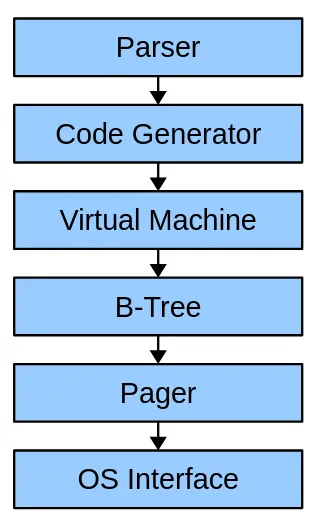
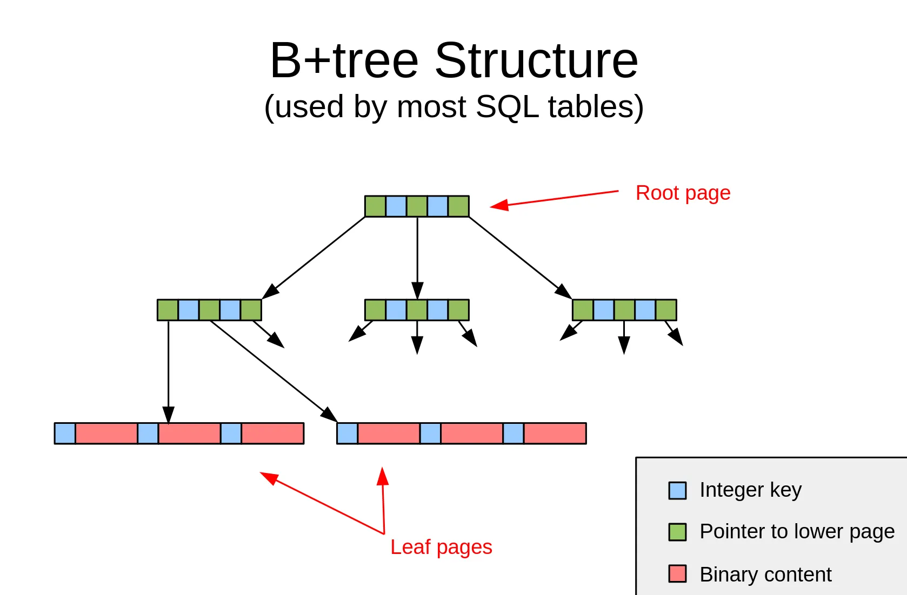
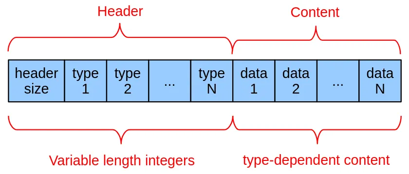
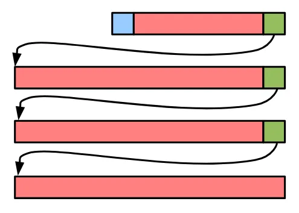

> 原文：[Exploring SQLite's Internals](https://www.bswanson.dev/blog/exploring-sqlite-internals/)


2024 年 12 月 31 日

# 探索 SQLite 的内部机制

以下是我从其创建者 Dr. Richard Hipp 的一次最新讲座、几场其他演讲以及官方文档中学到的关于 SQLite 底层工作原理的知识。

---

**SQLite 是我最喜欢的数据库。**它如此简单、快速，并且可以在构建中小型服务的过程中陪伴你走很远。

几天前，我有幸在 YouTube 的推荐中偶然看到了 Dr. Richard Hipp（SQLite 的创建者）的[讲座](https://www.youtube.com/watch?v=ZSKLA81tBis)。以下是我从那场讲座以及随后浏览官方文档和收听两个[播客](https://changelog.com/podcast/201)[节目](https://changelog.com/podcast/454)中学到的众多知识的一部分。

我们将从一些较大的概念开始，最后以一些短小有趣的知识点收尾。

## SQLite 技术栈

SQLite 可以分解为 6 个子系统，每个子系统对其他子系统的实现细节一无所知。这允许用户替换系统的某些部分以用于自己的目的；例如，Bloomberg 在其 [Comdb2 项目](https://bloomberg.github.io/comdb2/overview_home.html) 中使用 SQLite 的前端（顶部 3 层）和自定义存储引擎（底部 3 层）。



<sub>[来源](https://sqlite.org/talks/howitworks-20240624.pdf)（第 19 页）</sub>

| 系统 | 作用 |
|---|---|
| 解析器 | 将查询字符串转换为抽象语法树 |
| 代码生成器 | 生成一个以字节码形式执行查询的程序 |
| 虚拟机 | 解释生成的字节码 |
| B-树 | 在磁盘上存储和定位 B-树节点 |
| 分页器 | 处理事务、磁盘缓存和并发（concurrency） |
| 操作系统接口 | 提供特定操作系统的文件系统访问和锁定（[文档](https://sqlite.org/vfs.html)） |

我们将从 B-树和分页器层开始，然后逐步向上学习。

## SQLite 如何表示数据库

SQLite 数据库被构造为 B-树。

- 每个分支（“内部”）节点包含整数键（key）和指向其他节点的指针。
- 叶节点包含“单元格”（cell），这些单元格由与表行（table row）关联的一个键和一些任意数据组成。在下图中，一个单元格是一个蓝色方块和一个红色矩形的组合。

在 SQLite 文件中可能出现两种不同类型的 B-树：表（table）和索引（index）。

- 表使用 B+ 树，这是一种特殊类型的 B-树，其中数据仅存储在叶节点中。这些叶节点存储：

    1.  64 位整数键，包含行的 `ROWID` 和/或主键
    2.  任意 blob 内容，包含行的所有其他值
- 索引使用标准 B-树。每个分支/内部节点包含键和指向其他节点的指针，每个叶节点仅包含一个键。

    - 该键是一个任意 blob，包含索引为保持排序所需的所有数据（即行值）以及行的主键值（以便在索引中找到行后，在表中查找该行）。
    - 索引 B-树在键之后不持有任意 blob 内容，这使其与表 B-树不同。
- 做出这种区分是因为表行应仅按其 `ROWID` 进行聚簇，因此这是构成键的唯一部分。对于索引，它们需要按构成索引的每一列进行排序，因此所有这些列都包含在键中。

SQLite 内存中 B-树实现的[头文件](https://github.com/sqlite/sqlite/blob/master/src/btreeInt.h)中有关于其工作原理的非常好的文档。



<sub>[来源](https://sqlite.org/talks/howitworks-20240624.pdf)（第 65 页）</sub>

### 那么，为什么这很酷？

使用 B-树允许 SQLite 非常快速地查找你的数据，即使在极大的表中也是如此。通过 `ROWID` 或其他索引值查找行是一种二分查找，因此其时间复杂度为 `O(log(N))`，其中 `N` 是表或索引中的行数——因此，随着表的增长，只要你拥有合适的索引，查询速度就不会显著减慢。不错！

### 全是树，从上到下（或者从下到上？）

SQLite 知道所有表在磁盘上的位置，因为它们的根页号作为值存储在 `sqlite_schema` 表中——这是一个总是从第 1 页开始的 B-树。

在这个表中，你还可以找到用于创建数据库中每个表的 `CREATE TABLE` 语句。你现在就可以尝试！在你的终端中打开 `sqlite`。

```
❯ sqlite3
SQLite version 3.46.1 2024-08-13 09:16:08
Enter ".help" for usage hints.
Connected to a transient in-memory database.
Use ".open FILENAME" to reopen on a persistent database.
sqlite> CREATE TABLE test(a, b);
sqlite> .mode box
sqlite> select * from sqlite_schema;
┌───────┬──────┬──────────┬──────────┬─────────────────────────┐
│ type  │ name │ tbl_name │ rootpage │           sql           │
├───────┼──────┼──────────┼──────────┼─────────────────────────┤
│ table │ test │ test     │ 2        │ CREATE TABLE test(a, b) │
└───────┴──────┴──────────┴──────────┴─────────────────────────┘
```

`sqlite_schema` 表占用第 1 页，因此我们创建的新表从第 2 页开始。实际上，你可以通过将页号乘以页面大小来计算它在文件中的位置。请记住，页号从 1 开始，因此第 1 页位于文件的开头。

假设我们使用默认的 4096 字节页面大小，我们可以通过寻址到 4096 * (2 - 1) = **4096** 字节并读取接下来的 **4096** 字节来读取 `test` 表的根页。

### 元组格式

表 B-树上的叶节点包含行的主键，这些主键始终是 64 位整数，以及一些任意 blob 数据。这些任意 blob 数据使用 SQLite 的元组（tuple）格式存储。



这些类型是常量，表示 SQLite 应如何解释数据：

| 类型 | 含义 | 数据长度（字节） |
|---|---|---|
| 0 | NULL | 0 |
| 1 | 有符号整数 | 1 |
| 2 | 有符号整数 | 2 |
| 3 | 有符号整数 | 3 |
| 4 | 有符号整数 | 4 |
| 5 | 有符号整数 | 6 |
| 6 | 有符号整数 | 8 |
| 7 | IEEE 浮点数 | 8 |
| 8 | 整数零 | 0 |
| 9 | 整数一 | 0 |
| 10,11 | 未使用 |  |
| N>=12 且为偶数 | BLOB | (N-12)/2 |
| N>=13 且为奇数 | 字符串 | (N-13)/2 |

我觉得有意思的是，有整数 0 和 1 的常量，因为它们是最常见的整数，这样可以节省存储空间。

此外，在元组格式以及文件格式的许多其他地方，SQLite 使用可变长整数（variable-length integer），因此较小的整数占用更少的存储空间。这里有关于 SQLite 当前 VarInt 格式的[更多信息](https://www.sqlite.org/fileformat2.html#varint)，以及一个[已废弃的提案](https://sqlite.org/src4/doc/trunk/www/varint.wiki)，旨在重新设计 VarInt 以使其更节省空间。我还找到了一个[很棒的 YouTube 视频](https://www.youtube.com/watch?v=7MpsHqCQcUg)，解释了如何解码 SQLite VarInt。

有趣的事实：由于 SQLite 是行存储（row store），文件格式技术上允许同一表中的不同行具有不同数量的列。

### 溢出

如果一行的内容超过其所在页面的大小，则将其存储为链表。尽管这可能看起来慢，但对于高达约 100 KB 的 blob，通过 SQLite 读取多个 blob 仍然比文件系统快，因为后者的 `fopen` 调用有开销。



### 深入探索

如果你想了解更多，请查看 SQLite 的[文件格式文档](https://www.sqlite.org/fileformat.html)。

## 查询是如何运行的

还记得本文前面部分的 SQLite 技术栈示意图吗？本节将涵盖解析器、代码生成器和虚拟机。

当你查询 SQLite 数据库时，查询字符串被转换为字节码，然后在基于寄存器的虚拟机上运行。这不只是一个查询，而是一个_程序_。这是来自谷歌一场[非常古老的技术演讲](https://youtu.be/f428dSRkTs4?t=1453)中我喜欢的一句话：

> “你真的需要将 SQLite 视为一种奇特的编程语言 […] 你不是指定要用来做某事的算法，而是指定你希望最终结果是什么，然后让数据库引擎为你找出算法。”

关于解析器的有趣事实：如果在应该出现标识符的地方看到关键字，它会允许该标记作为标识符使用（只要不产生解析歧义）。这就是为什么你可以编写如下语句：

```
CREATE TABLE BEGIN(REPLACE, PRAGMA, END);
```

无论如何，解析器将你的查询转换为抽象语法树（AST）。然后，代码生成器查看你的 AST，并将其转换为一些字节码，这些字节码在底层定义了 SQLite 运行查询的方式。我们可以通过在查询开头添加 `EXPLAIN` 来查看这些字节码。

```
SQLite version 3.46.1 2024-08-13 09:16:08
Enter ".help" for usage hints.
Connected to a transient in-memory database.
Use ".open FILENAME" to reopen on a persistent database.
sqlite> .mode box
sqlite> CREATE TABLE t1(a, b, c);
sqlite> EXPLAIN SELECT * FROM t1 WHERE a = :a;
addr  opcode         p1    p2    p3    p4             p5  comment
----  -------------  ----  ----  ----  -------------  --  -------------
0     Init           0     11    0                    0   Start at 11
1     OpenRead       0     2     0     3              0   root=2 iDb=0; t1
2     Rewind         0     10    0                    0
3       Column         0     0     1                    0   r[1]= cursor 0 column 0
4       Ne             2     9     1     BINARY-8       81  if r[1]!=r[2] goto 9
5       Column         0     0     3                    0   r[3]= cursor 0 column 0
6       Column         0     1     4                    0   r[4]= cursor 0 column 1
7       Column         0     2     5                    0   r[5]= cursor 0 column 2
8       ResultRow      3     3     0                    0   output=r[3..5]
9     Next           0     3     0                    1
10    Halt           0     0     0                    0
11    Transaction    0     0     1     0              1   usesStmtJournal=0
12    Variable       1     2     0                    0   r[2]=parameter(1)
13    Goto           0     1     0                    0
```

让我们更仔细地看看这个：

| 地址 | 作用 |
|---|---|
| 1 | 打开一个游标以从表读取数据，从表的根页（2）开始 |
| 2, 9 | 包含一个遍历表中行的循环 |
| 4 | 将 `a` 的值与参数进行比较，如果值不相等则跳转到地址 9（重新开始循环） |
| 5-7 | 将列 `a`、`b` 和 `c` 添加到结果行 |
| 8 | 输出一个结果行 |

因为我们没有添加任何索引，这个查询需要全表扫描。

当执行到达指令 #8（ResultRow）时，**虚拟机暂停**，直到我们的应用程序需要另一行。这允许我们等到需要时才请求更多的行。

如果我们添加一个索引，查询计划如下所示：

```
sqlite> CREATE INDEX i1 ON t1(a);
sqlite> EXPLAIN SELECT * FROM t1 WHERE a = :a;
addr  opcode         p1    p2    p3    p4             p5  comment
----  -------------  ----  ----  ----  -------------  --  -------------
0     Init           0     14    0                    0   Start at 14
1     OpenRead       0     2     0     3              0   root=2 iDb=0; t1
2     OpenRead       1     3     0     k(2,,)         2   root=3 iDb=0; i1
3     Variable       1     1     0                    0   r[1]=parameter(1)
4     IsNull         1     13    0                    0   if r[1]==NULL goto 13
5     SeekGE         1     13    1     1              0   key=r[1]
6       IdxGT          1     13    1     1              0   key=r[1]
7       DeferredSeek   1     0     0                    0   Move 0 to 1.rowid if needed
8       Column         1     0     2                    0   r[2]= cursor 1 column 0
9       Column         0     1     3                    0   r[3]= cursor 0 column 1
10      Column         0     2     4                    0   r[4]= cursor 0 column 2
11      ResultRow      2     3     0                    0   output=r[2..4]
12    Next           1     6     1                    0
13    Halt           0     0     0                    0
14    Transaction    0     0     2     0              1   usesStmtJournal=0
15    Goto           0     1     0                    0
```

这个程序使用索引（如 `SeekGE` 和 `IdxGT` 指令所示）以时间复杂度 `O(log(n))` 找到该值，因此它将比之前的查询快得多，尤其是在表包含大量行时。

| 地址 | 作用 |
|---|---|
| 1 | 打开一个游标以从表 `t1` 读取数据 |
| 2 | 打开一个游标以从索引 `i1` 读取数据 |
| 5 | 在索引中找到第一个大于或等于参数值（`:a`）的键 |
| 6 | 如果索引键大于参数值（`:a`），则跳转到指令 13 |
| 7 | 将表游标（游标 0）移动到与索引游标（游标 1）相同的行 |
| 8-10 | 将列 `a`、`b` 和 `c` 添加到结果行 |
| 11 | 输出一个结果行 |

如果我们只需要列 `a` 的值，SQLite 就不需要为表打开游标，因为 `a` 的值可以从索引中获得。这被称为[覆盖索引（covering index）](https://www.sqlite.org/queryplanner.html#covidx)。

```
sqlite> EXPLAIN SELECT a FROM t1 WHERE a = :a;
addr  opcode         p1    p2    p3    p4             p5  comment
----  -------------  ----  ----  ----  -------------  --  -------------
0     Init           0     10    0                    0   Start at 10
1     OpenRead       1     3     0     k(2,,)         2   root=3 iDb=0; i1
2     Variable       1     1     0                    0   r[1]=parameter(1)
3     IsNull         1     9     0                    0   if r[1]==NULL goto 9
4     SeekGE         1     9     1     1              0   key=r[1]
5       IdxGT          1     9     1     1              0   key=r[1]
6       Column         1     0     2                    0   r[2]= cursor 1 column 0
7       ResultRow      2     1     0                    0   output=r[2]
8     Next           1     5     1                    0
9     Halt           0     0     0                    0
10    Transaction    0     0     2     0              1   usesStmtJournal=0
11    Goto           0     1     0                    0
```

如果你想了解更多，SQLite 文档在此处包含了操作码列表：[https://sqlite.org/opcode.html](https://sqlite.org/opcode.html)。

## SQLite 事务如何实现原子性

本节涵盖文章开头 SQLite 技术栈示意图中的分页器层。

也许你以前见过这样的语句：

```
PRAGMA journal_mode = WAL;
```

这个 pragma 允许你更改 SQLite 的**日志模式（journal mode）**，这是它实现原子提交和回滚操作的方式。两种最常用的日志模式是**回滚（rollback）**和**预写式日志（WAL）**。让我们看看它们是如何工作的。

### 回滚

默认的日志模式是回滚。你可以通过以下 pragma 激活它：

```
PRAGMA journal_mode = DELETE;
```

在一个事务中，在将新页面写入磁盘之前，旧页面会被复制到一个单独的文件中，该文件与你的数据库文件并存，命名为 `*-journal`，其中 `*` 是你的数据库名称。然后，更改后的页面从内存写入数据库文件。如果此操作失败，数据库文件中已更改的页面可能会损坏。

然而，页面的先前版本仍然存在于日志文件中。当打开一个新连接时，SQLite 会看到这个日志文件，并且（如果满足某些[条件](https://www.sqlite.org/atomiccommit.html#_hot_rollback_journals)）尝试将页面的旧版本复制回数据库文件，从而回滚失败的事务。

即使此回滚操作失败，数据仍然安全地保存在日志文件中，因此可以根据需要多次尝试以撤销失败的事务。当所有旧页面成功复制到数据库文件中后，日志文件被删除，这被认为是一个[原子操作](https://www.sqlite.org/atomiccommit.html#:~:text=Deleting%20a%20file%20is%20not%20really%20an%20atomic%20operation,%20but%20it%20appears%20to%20be%20from%20the%20point%20of%20view%20of%20a%20user%20process)，尽管实际上可能并非如此。

#### 回滚模式下的并发

回滚日志在任何给定时间支持多个并发读取者或多个之一，但**不能同时**有多个写入者：任何时刻要么只有一个写入者，要么有多个读取者。

读取者获取一个共享锁（Shared lock），这保证了没有正在进行的对数据库文件的写入。共享锁可以被多个并发读取者获取。当它们完成读取后，共享锁被释放。

写入者首先获取一个保留锁（Reserved lock）。一次只能有一个保留锁处于活动状态，并且在持有保留锁期间，仍然可以获取新的共享锁。使用这个锁，写入者创建一个包含将要更新的页面先前内容的日志文件。然后，写入者获取一个排他锁（Exclusive lock），这可以防止任何其他并发的读取或写入。这可能需要等待其他读取者完成。一旦获取了排他锁，更改后的页面被写入并刷新到磁盘，日志文件被删除，排他锁被释放。

在此处了解更多关于锁类型的信息：[https://www.sqlite.org/lockingv3.html#locking](https://www.sqlite.org/lockingv3.html#locking)，或在此处了解回滚模式写入是如何执行的：[https://www.sqlite.org/lockingv3.html#writing](https://www.sqlite.org/lockingv3.html#writing)。

### 预写式日志（WAL）

当事务提交时，WAL 模式会将所有更新的页面追加到日志文件中。然后，当日志文件总计达到 1000 个更改的页面时，数据库文件会在一个称为**检查点（checkpoint）**的操作期间使用新内容进行更新。当读取者在磁盘上查找页面时，它们会首先检查日志文件，以确保读取的是最新的内容。

在 WAL 模式下，多个读取者和一个写入者可以同时访问数据库，并且大多数写入事务速度更快，因为它们需要更少的磁盘写入和 `fsync` 调用。出于这些原因（以及[其他一些原因](https://www.sqlite.org/wal.html#overview)），在大多数情况下你应该优先选择 WAL 模式。

一个例外是在网络文件系统上。WAL 模式下的 SQLite 使用 `mmap` 在一个与你的数据库文件并存的 [`*-shm`](https://www.sqlite.org/walformat.html#shm) 文件中创建一些共享内存。然而，共享内存仅在客户端位于同一主机设备上时才有效，因此除非你[禁用共享内存](https://www.sqlite.org/wal.html#noshm)，否则 WAL 模式无法正常工作。

请注意，对于大多数用户来说，缺少同时写入者通常不是问题。如果你在单个节点上运行像 MySQL 或 Postgres 这样的客户端-服务器数据库，那么你很可能仍然缺乏同时写入者，因为你的文件系统或磁盘可能只能处理一个并发写入者。瓶颈只是在操作系统/硬件层面，而 SQLite 在用户空间强制执行这一点。

你可以通过以下 pragma 启用 WAL 模式：

```
PRAGMA journal_mode = WAL;
```

#### 关于 WAL 模式需要了解的重要事项

- 长时间运行的读取事务会延迟对事务启动后写入的任何页面进行检查点操作，直到该事务结束。
- 随着 WAL 文件大小的增加，读取速度会变慢。这就是为什么允许一些没有读取的时间段以便检查点操作能够完成是很重要的。
- 读取操作无法看到在其开始之后追加到 WAL 的任何页面。
- 写入事务将非常快，直到 WAL 文件达到其阈值。然后，由于检查点操作，将有一个非常慢的提交。

## 快速一览：你可能想知道的其它事情

### 为什么 SQLite 的贡献者这么少？

SQLite 源代码已经发布到公共领域。这是一个复杂的法律过程，尤其是在欧洲，这就是为什么只有少数贡献者的原因。该项目的[网站](https://sqlite.org/copyright.html)说：

> 为了保持 SQLite 完全免费且不受版权限制，该项目不接受补丁。如果你想建议一个更改，并且你包含一个补丁作为概念验证，那太好了。但是，如果我们从头重写你的补丁，请不要介意。

### 你怎么读 SQLite？

Dr. Richard Hipp，SQLite 的创建者，将它读作“S-Q-L-ite”，像一种矿物。他也将 Gigabyte 读作“Jigabyte”。

然而，[他说](https://youtu.be/KgcqPYahSQg?t=165)没有正确的读法，所以按照你内心的想法读就好。我想我暂时会坚持读作“sequel-lite”。

### SQLite 数据库文件的最大大小

SQLite [列出](https://www.sqlite.org/limits.html#max_page_count)其最大大小限制为 256 TiB；然而，这个数字假设你使用的页面大小为 65,536 字节。使用默认的 4096 字节页面大小，你的数据库可以达到 16 TiB，这可能远远超过你所需。如果你需要超过数据库文件大小限制，你可以将数据拆分到多个数据库文件中，并 `ATTACH` 它们以利用多达 11 倍的数据（一次只能附加 10 个数据库）。

### SQLite 如何分发

大多数最终用户安装的是预构建的 SQLite 二进制文件，但你也可以在一个 C 文件中下载整个 SQLite。它被称为[合并（amalgamation）](https://sqlite.org/amalgamation.html)，目前大小约为 9 MB，大约有 163,000 行源代码（SLOC）。

### 分页的缺点

SQLite 中 I/O 的最小单位是**页面（page）**，默认页面大小为 4096 字节。

当 SQLite 中的一行被更新时，_整个页面_必须写入磁盘。根据你的页面大小或行的聚集方式，这可能会造成大量额外的写入！

## 结论与学习资源

更深入地研究你使用的软件的内部机制是改进你用其构建的软件的好方法。对我来说，这次探索也是对 B-树的很好介绍，我学到了大量关于二进制存储格式、ACID 以及数据库索引工作原理的知识。我希望你也学到了一些新东西 :)

以下是我准备本文所用的资源。我建议你使用它们继续探索你感兴趣的主题。

- 2024 年 7 月在萨尔兰大学的讲座：[https://www.youtube.com/watch?v=ZSKLA81tBis](https://www.youtube.com/watch?v=ZSKLA81tBis)

    - 这是我最喜欢的资源，也是我写这篇文章的原因。这是一个金矿，它包含的参考文献可以让你更深入地学习和了解特定主题。
    - 幻灯片：[https://sqlite.org/talks/howitworks-20240624.pdf](https://sqlite.org/talks/howitworks-20240624.pdf)
- 2006 年 5 月在谷歌的技术演讲：[https://www.youtube.com/watch?v=f428dSRkTs4](https://www.youtube.com/watch?v=f428dSRkTs4)

    - 这是一个关于 SQLite 以及为什么和如何使用它的很好的概述。自这次演讲以来，一些细节发生了变化，比如缺少外键支持和虚拟机的实现细节，但大部分信息仍然相关。
- 与 The Changelog 的第一次访谈：[https://changelog.com/podcast/201](https://changelog.com/podcast/201)

    - 这个播客讲述了 SQLite 的早期开发以及为什么它今天如此受欢迎。
- 与 The Changelog 的第二次访谈：[https://changelog.com/podcast/454](https://changelog.com/podcast/454)

    - 这个播客主要关于 Dr. Richard Hipp 的其他项目，比如 Fossil（版本控制系统）和 Althttpd（一个轻量级 Web 服务器）。
- SQLite 官方文档：[https://www.sqlite.org/docs.html](https://www.sqlite.org/docs.html)
