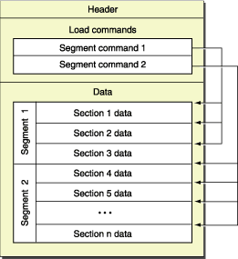
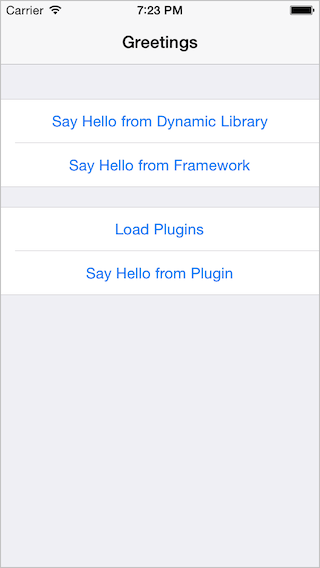
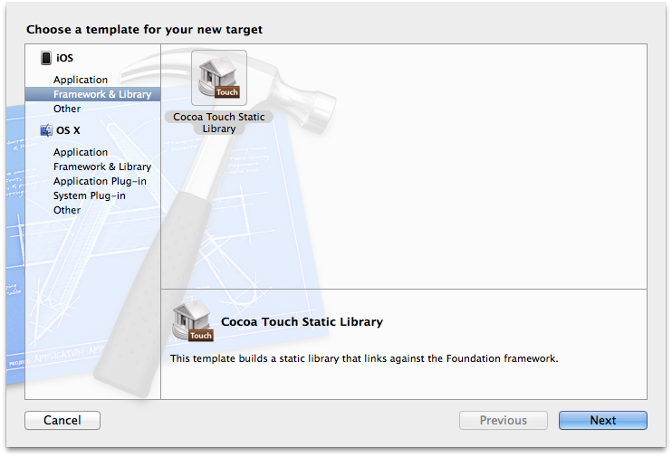
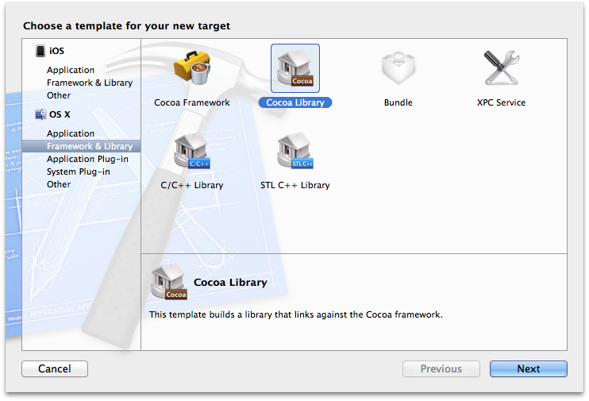
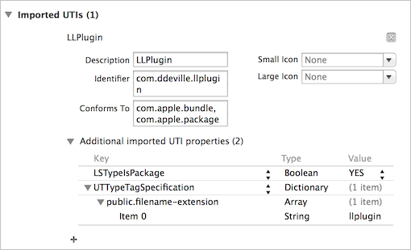
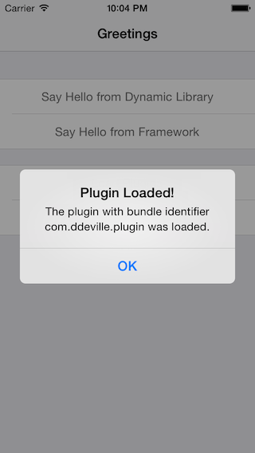

> 原文：[iOS 上的动态链接](https://ddeville.me/2014/04/dynamic-linking/)

_本文是我发表在 Realmac Software 博客上的一篇文章的[转载](http://realmacsoftware.com/blog/dynamic-linking)。_

iOS 经常因不支持动态库而受到批评。无论你是否同意，思考一下为什么会这样以及这条规则最终是如何强制执行的，是一件有趣的事。在这篇文章中，我们将了解这些库是什么、它们在实践中如何呈现、如果它们在 iOS 上得到完全支持将如何工作，以及是什么导致你无法在 iOS App 中打包一个动态库。

# 库的链接

App 很少被构建成一个巨大的单体可执行文件，而是通过组装各种通常称为库的代码块来构建。从实践角度来看，库可以被视为可执行代码以及一些公共头文件和资源的聚合体，这些资源被方便地打包，以便链接到 App 中并被 App 使用。

虽然这个通用定义适用于大多数类型的库，但有一个方面它们有所不同：链接。基于这个区别，库分为两类：静态库和动态库。我将快速总结一下两者之间的区别，不过，如果你想了解更多关于这个主题的信息，我建议阅读 Apple 网站上的[动态库编程主题](https://developer.apple.com/library/mac/documentation/DeveloperTools/Conceptual/DynamicLibraries/100-Articles/OverviewOfDynamicLibraries.html)指南。

## 静态库

静态库可以被视为目标文件的归档。当将这样的库链接到 App 时，_静态链接器_会从库中收集目标文件，并将它们与 App 的目标代码打包到一个可执行文件中。这意味着 App 可执行文件的大小会随着添加的库的数量而增长。此外，当 App 启动时，App 代码（包括库代码）会一次性全部加载到程序的地址空间中。

## 动态库

动态库允许 App 在真正需要时将代码加载到其地址空间中。这可以发生在启动时，也可以发生在运行时。动态库不是 App 可执行文件的一部分。

当 App 启动时，App 的代码首先被加载到进程的地址空间中。_动态加载器_——在 Apple 平台上通常是 _dyld_——接管进程并加载依赖库。这涉及到根据其安装名称解析它们在文件系统上的位置，然后解析 App 所需的未定义外部符号。_动态加载器_还会在运行时根据需要加载额外的库。

## 框架（Framework）

在 Apple 的世界中，Framework 是一个包（bundle）或软件包，包含动态库、头文件和资源。Framework 是一种非常简洁的方式来将相关资源分组，在一个易于安装的包中提供一个可执行文件以及公共头文件。

需要注意的重要一点是，虽然 Framework 需要包含一个动态库，但为 iOS 创建一个静态 Framework 也非常容易。这里我不打算深入细节，但我强烈推荐阅读 Landon Fuller 的“[iPhone Framework Support - Shipping Libraries](http://landonf.bikemonkey.org/code/iphone/iPhone_Framework_Support.20081202.html)”和“[iOS Static Libraries Are, Like, Really Bad, And Stuff](http://landonf.bikemonkey.org/code/ios/Radar_15800975_iOS_Frameworks.20140112.html)”。

# iOS 上的动态库

那么，iOS 上真的不能使用动态库吗？嗯，这实际上有点误解。你链接到 App 中的每个 Apple 框架都包含一个动态共享库。你能想象如果你必须将 _UIKit_ 和其他框架静态链接到每一个 App 中，可执行文件会变得多大吗？事实上，动态库在 iOS 上被广泛使用。当你的 `applicationDidFinishLaunching:` 中的代码开始执行时，_dyld_ 已经加载了超过 150 个库！

如果我们能找出 App 运行时正在加载哪些库，那就太好了。幸运的是，_dyld_ 提供了一些钩子（Hook），让 App 在添加或移除镜像（image）时得到通知。让我们创建一个 `LLImageLogger` 类，并在该类加载时设置一些回调函数。让我们来看看这个类的实现。如果你想运行它，可以在 [GitHub](https://github.com/ddeville/ImageLogger) 上找到代码；它附带了一些 iOS 和 OS X 的示例 App。

## 记录已加载的动态库

`mach-o/dyld.h` 声明了两个非常有用的函数：`_dyld_register_func_for_add_image` 和 `_dyld_register_func_for_remove_image`。这些函数的文档如下：

> 以下函数允许你安装回调，当镜像加载或卸载时，这些回调将被 dyld 调用。在调用 `_dyld_register_func_for_add_image()` 期间，会为每个已存在的镜像调用回调函数。之后，会在每个新镜像被加载和绑定（但初始化器尚未运行）时调用。使用 `_dyld_register_func_for_remove_image()` 注册的回调会在镜像中的任何终结器运行之后、镜像被取消内存映射之前被调用。

我们可以很容易地在类加载时添加几个回调。

```objc
#import <mach-o/dyld.h>

@implementation LLImageLogger

+ (void)load
{
	_dyld_register_func_for_add_image(&image_added);
	_dyld_register_func_for_remove_image(&image_removed);
}
@end
```

现在我们来实现这两个函数。请注意，回调函数的签名如下：

```c
void callback_function(const struct mach_header *mh, intptr_t vmaddr_slide);
```

理想情况下，我们会希望将有关已加载镜像的一些信息记录到控制台。最熟悉的方式是尝试模仿崩溃报告的格式。崩溃报告通常包含程序崩溃时已加载的镜像列表。每个镜像的信息包含可执行路径、基地址、可执行文本段大小（或结束地址）以及镜像 UUID。这些信息在符号化崩溃报告时非常有用。

```objc
0x2fd23000 - 0x2ff0dfff Foundation armv7s  <b75ca4f9d9b739ef9b16e482db277849> /System/Library/Frameworks/Foundation.framework/Foundation
0x31c2c000 - 0x3239ffff UIKit armv7s  <f725ad0982673286911bff834295ec99> /System/Library/Frameworks/UIKit.framework/UIKit
```

由于回调函数将指向 Mach-O 头部的指针作为第一个参数传递，因此检索这些信息应该相当容易。让我们实现这两个回调函数，并简单地调用一个公共函数，通过一个额外参数来确定镜像是被添加还是被移除。

```objc
#import <mach-o/loader.h>

static void image_added(const struct mach_header *mh, intptr_t slide)
{
	_print_image(mh, true);
}

static void image_removed(const struct mach_header *mh, intptr_t slide)
{
	_print_image(mh, false);
}
```

现在我们将研究实现 `_print_image` 函数。关于 Mach-O 头部的大部分信息可以通过 `dlfcn.h` 中定义的一个函数 `dladdr` 来获取。通过传递指向 Mach-O 头部的指针和对 `Dl_info` 结构体的引用，我们可以检索到关于镜像的一些关键信息。`Dl_info` 结构体包含以下成员：

```objc
typedef struct dl_info {
	const char  *dli_fname;     /* Pathname of shared object */
	void        *dli_fbase;     /* Base address of shared object */
	const char  *dli_sname;     /* Name of nearest symbol */
	void        *dli_saddr;     /* Address of nearest symbol */
} Dl_info;
```

记住这一点，我们现在可以看看 `_print_image` 函数的实现：

```objc
#import <dlfcn.h>

static void _print_image(const struct mach_header *mh, bool added)
{
	Dl_info image_info;
	int result = dladdr(mh, &image_info);

	if (result == 0) {
		printf("Could not print info for mach_header: %p\n\n", mh);
		return;
	}

	const char *image_name = image_info.dli_fname;

	const intptr_t image_base_address = (intptr_t)image_info.dli_fbase;
	const uint64_t image_text_size = _image_text_segment_size(mh);

	char image_uuid[37];
	const uuid_t *image_uuid_bytes = _image_retrieve_uuid(mh);
	uuid_unparse(*image_uuid_bytes, image_uuid);

	const char *log = added ? "Added" : "Removed";
	printf("%s: 0x%02lx (0x%02llx) %s <%s>\n\n", log, image_base_address, image_text_size, image_name, image_uuid);
}
```

如你所见，这并不复杂。我们首先检索 Mach-O 头部的 `Dl_info` 结构体，然后填充所需信息。虽然基地址和镜像路径可以直接从结构体中获得，但我们不得不手动从二进制文件中检索镜像文本段大小和镜像 UUID。这正是 `_image_retrieve_uuid` 和 `_image_text_segment_size` 所做的事情。

对于这两个函数，我们将不得不遍历 Mach-O 文件的加载命令。我建议阅读 Apple 的 [OS X ABI Mach-O 文件格式参考](https://developer.apple.com/library/mac/documentation/DeveloperTools/Conceptual/MachORuntime/Reference/reference.html)，以获得对 Mach-O 文件格式的良好概述。简而言之，Mach-O 文件由头部、一系列加载命令和由多个段组成的数据构成。关于段的信息（例如它们的偏移量和大小）可以在段加载命令中找到。



我们将首先创建一个访问者函数，以便能够在两个函数中重用。

```objc
static uint32_t _image_header_size(const struct mach_header *mh)
{
	bool is_header_64_bit = (mh->magic == MH_MAGIC_64 || mh->magic == MH_CIGAM_64);
	return (is_header_64_bit ? sizeof(struct mach_header_64) : sizeof(struct mach_header));
}

static void _image_visit_load_commands(const struct mach_header *mh, void (^visitor)(struct load_command *lc, bool *stop))
{
	assert(visitor != NULL);

	uintptr_t lc_cursor = (uintptr_t)mh + _image_header_size(mh);

	for (uint32_t idx = 0; idx < mh->ncmds; idx++) {
		struct load_command *lc = (struct load_command *)lc_cursor;

		bool stop = false;
		visitor(lc, &stop);

		if (stop) {
			return;
		}

		lc_cursor += lc->cmdsize;
	}
}
```

这个函数接受一个指向 Mach-O 头部的指针和一个访问者 block。然后为找到的每个加载命令调用该 block。注意，有一个辅助函数用来获取 Mach-O 头部的大小，我们需要它来找到第一个加载命令的地址。这是因为根据架构是 64 位还是 32 位，Mach-O 头部有两种不同的结构体：`mach_header` 和 `mach_header_64`。幸运的是，头部结构体中的第一个字段是一个提供架构信息的魔数。

有了这个辅助函数，我们应该能够实现 `_image_retrieve_uuid` 和 `_image_text_segment_size` 函数。

```objc
static const uuid_t *_image_retrieve_uuid(const struct mach_header *mh)
{
	__block const struct uuid_command *uuid_cmd = NULL;

	_image_visit_load_commands(mh, ^ (struct load_command *lc, bool *stop) {
		if (lc->cmdsize == 0) {
			return;
		}
		if (lc->cmd == LC_UUID) {
			uuid_cmd = (const struct uuid_command *)lc;
			*stop = true;
		}
	});

	if (uuid_cmd == NULL) {
		return NULL;
	}

	return &uuid_cmd->uuid;
}
```

这个函数也非常简单。它查找 `LC_UUID` 命令，并在找到后检索 `uuid_t`。`_print_image` 函数随后会通过 `uuid_unparse` 将 `uuid_t` 转换为字符串。

最后，这里是 `_image_text_segment_size` 函数的实现：

```objc
static uint64_t _image_text_segment_size(const struct mach_header *mh)
{
	static const char *text_segment_name = "__TEXT";

	__block uint64_t text_size = 0;

	_image_visit_load_commands(mh, ^ (struct load_command *lc, bool *stop) {
		if (lc->cmdsize == 0) {
			return;
		}
		if (lc->cmd == LC_SEGMENT) {
			struct segment_command *seg_cmd = (struct segment_command *)lc;
			if (strcmp(seg_cmd->segname, text_segment_name) == 0) {
				text_size = seg_cmd->vmsize;
				*stop = true;
				return;
			}
		}
		if (lc->cmd == LC_SEGMENT_64) {
			struct segment_command_64 *seg_cmd = (struct segment_command_64 *)lc;
			if (strcmp(seg_cmd->segname, text_segment_name) == 0) {
				text_size = seg_cmd->vmsize;
				*stop = true;
				return;
			}
		}
	});

	return text_size;
}
```

这里也没有什么复杂的。访问者 block 简单地查找段命令（32 位上的 `LC_SEGMENT` 和 64 位上的 `LC_SEGMENT_64`），并检查当前加载段是否为 `__TEXT` 段。如果是，则检索 `vmsize` 并将其作为文本大小返回。

通过在 iOS 模拟器上运行 App，会记录以下内容：

```objc
Added: 0x10000b000 (0x2a8000) /Applications/Xcode.app/Contents/Developer/Platforms/iPhoneSimulator.platform/Developer/SDKs/iPhoneSimulator7.1.sdk/System/Library/Frameworks/Foundation.framework/Foundation <C299A741-488A-3656-A410-A7BE59926B13>
…
Added: 0x110527000 (0x385000) /Applications/Xcode.app/Contents/Developer/Platforms/iPhoneSimulator.platform/Developer/SDKs/iPhoneSimulator7.1.sdk/System/Library/Frameworks/AudioToolbox.framework/AudioToolbox <57B61C9C-8767-3B3A-BBB5-8768A682383A>
```

启动一个非常简单的 iOS App 时，加载了 147 个镜像！

因此，我们证明了动态库确实被加载到了我们的 iOS App 中。那么关于 _iOS 不支持动态库_ 的说法呢？好吧，让我们尝试构建一个看看会发生什么！

## 在 iOS 上构建动态库

在接下来的部分中，我们将尝试构建三种在 Mac 上常见但在 iOS 上不受支持的产品：

- 一个被 App 链接的简单动态库
- 一个 Framework（一个合法的 Framework，包含一个动态共享库）
- 一个插件（plugin，即一个包含可执行文件的 Bundle，不与 App 打包在一起，而是在运行时加载）



像往常一样，你可以在 [GitHub](https://github.com/ddeville/Dynamic-iOS) 上找到示例项目。

### iOS 上的动态库

让我们首先为我们的 iOS App 创建一个动态库目标。哦，等等……



Xcode（合乎逻辑地）没有为 iOS 上的动态库提供配置模板。幸运的是，我们可以从 OS X 部分选择一个库，然后简单地更改构建设置中的部署目标和架构。



但是，如果你这样做并创建你的库，尝试构建时会出现一个错误：

> 检查依赖关系：
>
> 目标指定了产品类型 'com.apple.product-type.library.dynamic'，但 'iphoneos' 平台没有这种产品类型

为了解决这个问题，你需要更新 iPhone 模拟器和 iPhone OS 的 PackageTypes 和 ProductTypes 的 Xcode 规范。关于如何执行此操作的说明可以在[这里](http://mysteri0uss.diandian.com/post/2013-06-06/40050450784)找到。

考虑到这一点，我们可以创建一个简单的类，添加一个 `sayHello` 方法，其实现仅创建并显示一个警告视图，并将该类添加到库目标。然后我们可以将库添加到 App 的 _Link Binary with Library_ 构建阶段。最后，我们必须添加一个 Copy 构建阶段，并将动态库复制到 App Bundle 中。有关如何设置的更多信息，请参见示例项目。

然后我们可以导入库的头文件（我们将其标记为公共，并确保它在头文件搜索路径中），实例化一个对象并调用 `sayHello` 方法。如果你在 iOS 模拟器中运行该 App，应该会看到警告视图弹出。等等，我们刚刚从 iOS 上的一个动态库加载并运行了一些代码？看起来是的……（现在不要尝试在设备上运行，我们稍后会讨论）。

### iOS 上的 Framework

既然我们已经看到可以加载和使用动态库，那么如果我们能在其周围构建一个 Framework，以便更容易地打包额外的资源，而不必担心头文件搜索路径，那就太棒了。

类似于动态库的情况，我们可以通过使用 Mac 模板并更改部署目标和构建架构来创建一个 Framework。我们还将创建一个 plist，它将作为资源复制到 Framework Bundle 中。我们将从 plist 加载警告视图消息，主要是为了演示资源加载可以从 Framework Bundle 中正常工作。

确保头文件已被标记为公共后，我们可以简单地在 App 中导入 Framework：

```objc
#import "Framework/Framework.h"
```

最后，我们可以实例化该类并调用方法。我们应该看到警告，其消息是从 Framework Bundle 中的一个资源加载的。它起作用了！

### iOS 上的插件

最后这一个是最有趣的。Mac 上的 App 可以通过支持插件以一种非常简洁的方式进行扩展。简单来说，插件和 Framework 一样，是一个包含可执行文件和资源的 Bundle。插件在其 `Info.plist` 中声明其主类。通常，主类是 App 定义的抽象类的子类，或者遵循 App 提供的协议。

为了在运行时加载插件，宿主 App 会为插件位置实例化一个 `NSBundle` 实例，预先检测 Bundle 以检查它确实可以被加载，然后最终加载它。加载 Bundle 会将 Bundle 的可执行代码动态加载到正在运行的程序中。一旦 Bundle 被加载，宿主 App 就可以检索主类并实例化它。

那么，让我们尝试为 iOS 构建这个。我们可以通过使用 Bundle 模板创建一个新目标。在更改部署目标和构建架构后，我们创建一个新类，并将其设置为 `Info.plist` 中的 `NSPrincipalClass`。类似于 Framework，我们将创建一个 plist 并在运行时从中加载警告消息。我们还需要确保为 Bundle 指定一个自定义扩展——这里我们将使用 `llplugin`。

然后我们可以构建插件，并将产品保存在安全的地方。然后我们将把它复制到 iOS App 的 Documents 目录中（你可以在 `~/Library/Application Support/iPhone Simulator/7.1-64/Applications` 下找到该 App。你可能需要根据你的平台更改 SDK 版本）。

在宿主 App 中，我们需要为插件添加一个导入的 UTI，以便我们能够识别其文件类型。



声明了插件类型后，我们现在可以遍历 Documents 目录的内容，查找插件，并通过使用 `UTTypeConformsTo` 检查每个找到项是否符合该类型。对于每个找到的插件，我们可以加载 Bundle，检索主类并实例化它。

```objc
- (void)_loadPluginAtLocation:(NSURL *)pluginLocation
{
	NSBundle *plugin = [[NSBundle alloc] initWithURL:pluginLocation];

	NSError *preflightError = nil;
	BOOL preflight = [plugin preflightAndReturnError:&preflightError];
	if (!preflight) {
		return;
	}

	BOOL loaded = [plugin load];
	if (!loaded) {
		return;
	}

	Class pluginClass = [plugin principalClass];
	if (pluginClass == nil) {
		return;
	}

	id pluginInstance = [[pluginClass alloc] init];
	if (![pluginInstance respondsToSelector:@selector(sayHello)]) {
		return;
	}

	[pluginInstance sayHello];
}
```

如果我们把构建好的插件复制到 Documents 目录并运行 App，应该会看到一个打招呼的警告。通过使用 `LLImageLogger`，我们还可以注意到 `LLPlugin` 镜像仅在调用 `-[NSBundle load]` 时才被加载。

我们能够链接并加载一个在模拟器中运行的 iOS App 中的动态库和 Framework。我们还能够在运行时动态加载一个插件并运行其部分代码，同样是在模拟器中。你可能已经猜到了一个陷阱。到目前为止，我们只在模拟器中运行我们的 App。如果我们在设备上运行会发生什么？

# 在设备上运行呢？

如果你尝试构建以在真实设备上运行，Xcode 很可能会报错说库需要代码签名。即使你对它们进行了代码签名，在启动 App 时也会遇到问题（这可能在调试 App 时不会发生，因为在启用了开发者模式的设备上调试时，App 的行为略有不同）。

## 链接的动态库

当尝试在设备上运行包含动态库的 App 时，Xcode 会提示你必须对动态库进行代码签名。我们可以简单地使用与 App 相同的代码签名身份来签名它。然而，在设备上运行时，在 _dyld_ 引导期间你会收到以下消息，并且程序将被终止。

> dyld: Library not loaded: @executable_path/Library.dylib Referenced from: /var/mobile/Applications/DC816A37-F0D4-4F72-9EC8-A642A03C0ABC/Dynamic.app/Dynamic Reason: no suitable image found. Did find: /var/mobile/Applications/DC816A37-F0D4-4F72-9EC8-A642A03C0ABC/Dynamic.app/Library.dylib: code signature invalid for '/var/mobile/Applications/DC816A37-F0D4-4F72-9EC8-A642A03C0ABC/Dynamic.app/Library.dylib'

所以看起来 _dyld_ 基于其签名无效而拒绝了库的加载。

这发生在程序加载期间，确切地说是在 _dyld_ 引导期间。但是，在运行时加载插件 Bundle 呢？

## 运行时加载的插件

让我们看看加载插件时会发生什么。当尝试在运行时加载插件时，App 很可能会崩溃，并出现以下回溯：

```objc
Exception Type:  EXC_CRASH (SIGKILL - CODESIGNING)

Thread 0 Crashed:
0   dyld 0x2be50c40 ImageLoaderMachO::crashIfInvalidCodeSignature + 72
1   dyld 0x2be5557a ImageLoaderMachOCompressed::instantiateFromFile + 286
2   dyld 0x2be50b44 ImageLoaderMachO::instantiateFromFile + 204
3   dyld 0x2be48036 dyld::loadPhase6 + 390
4   dyld 0x2be4b9b0 dyld::loadPhase5stat + 296
5   dyld 0x2be4b7c6 dyld::loadPhase5 + 390
6   dyld 0x2be4b61c dyld::loadPhase4 + 128
7   dyld 0x2be4b53c dyld::loadPhase3 + 1000
8   dyld 0x2be4afd0 dyld::loadPhase1 + 108
9   dyld 0x2be47e0a dyld::loadPhase0 + 162
10  dyld 0x2be47bb4 dyld::load + 208
11  dyld 0x2be4d1b2 dlopen + 790
12  libdyld.dylib 0x3a09a78a dlopen + 46
13  CoreFoundation 0x2f392754 _CFBundleDlfcnLoadBundle + 120
14  CoreFoundation 0x2f3925a4 _CFBundleLoadExecutableAndReturnError + 328
15  Foundation 0x2fd7f674 -[NSBundle loadAndReturnError:] + 532
16  Foundation 0x2fd8f51e -[NSBundle load] + 18
17  Dynamic 0x000f64be -[LLViewController _loadPluginAtLocation:]
```

当 _dyld_ 尝试加载 Bundle 时，App 被终止。这里我们只能看到用户态的情况，但堆栈顶部的函数应该给我们一个很好的提示：`ImageLoaderMachO::crashIfInvalidCodeSignature`。值得注意的是，我们复制到 Documents 文件夹中的插件没有经过代码签名。在尝试对它进行代码签名之前，让我们快速分析一下是什么导致程序在加载插件时被终止。

## 用户空间

幸运的是，[_dyld_](http://opensource.apple.com/source/dyld/dyld-239.3) 是开源的，所以我们可以快速查看一下 `ImageLoaderMachO::crashIfInvalidCodeSignature` 函数的实现，以尝试弄清楚发生了什么。相关的文件是 [ImageLoaderMachO.cpp](http://opensource.apple.com/source/dyld/dyld-239.3/src/ImageLoaderMachO.cpp)，它的实现非常简单：

```objc
int ImageLoaderMachO::crashIfInvalidCodeSignature()
{
// 现在段已映射，尝试从第一个可执行段读取
// 如果启用了代码签名，内核将在换入页面时验证代码签名，
// 如果无效则终止进程
	for (unsigned int i = 0; i < fSegmentsCount; ++i) {
		if ((segFileOffset(i) == 0) && (segFileSize(i) != 0)) {
		// 返回读取的值以确保编译器不会优化掉加载
			int* p = (int*)segActualLoadAddress(i);
			return *p;
		}
	}
	return 0;
}
```

这是一种相当简单（但有效！）的检查签名并在签名无效或不存在时崩溃的方法：尝试从可执行文件的第一个可执行段读取数据，让内核在分页时发现代码签名无法验证时终止进程。

## 内核

[内核](http://opensource.apple.com/source/xnu/xnu-2422.1.72)本身也是开源的，所以我们可以看看它，并尝试弄清楚代码签名是在哪里以及如何被验证的。我应该在这里指出，阅读内核代码稍微超出了我的舒适区，我在 Charlie Miller 的 SyScan'11 演讲 [Don't Hassle The Hoff: Breaking iOS Code Signing](http://reverse.put.as/wp-content/uploads/2011/06/syscan11_breaking_ios_code_signing.pdf) 和书籍 [iOS Hacker's Handbook](http://www.amazon.com/iOS-Hackers-Handbook-Charlie-Miller/dp/1118204123) 中找到了一些极大的帮助。

虽然这是一个引人入胜的主题，但可能会变得相当冗长，所以我在这里不再深入细节。

简而言之，当代码签名时，Mach-O 可执行文件会包含一个 `LC_CODE_SIGNATURE` 加载命令，该命令指向二进制文件中的一个代码签名段。我们可以使用 _otool_ 在已签名的二进制文件上进行验证：

```bash
> otool -l Plugin.llplugin/Plugin
…
Load command 17
      cmd LC_CODE_SIGNATURE
  cmdsize 16
  dataoff 9968
 datasize 9616
…
```

在内核中，Mach-O 文件在 `parse_machfile` 函数中被加载和解析，签名在 `load_code_signature` 中被加载，两者都在 [mach_loader.c](http://opensource.apple.com/source/xnu/xnu-2422.1.72/bsd/kern/mach_loader.c) 中。最终，签名被检查，其有效性被存储在进程的内核 [`proc`](http://opensource.apple.com/source/xnu/xnu-2422.1.72/bsd/sys/proc_internal.h) 结构体的 `csflags` 成员中。

之后，每当发生页错误时，会调用 [vm_fault.c](http://opensource.apple.com/source/xnu/xnu-2422.1.72/osfmk/vm/vm_fault.c) 中的 `vm_fault` 函数。在页错误期间，如果需要，会对签名进行验证。如果页面映射在用户空间，如果页面属于代码签名的对象，如果页面将是可写的，或者仅仅如果它之前没有被验证过，都需要验证签名。验证发生在 [vm_fault.c](http://opensource.apple.com/source/xnu/xnu-2422.1.72/osfmk/vm/vm_fault.c) 内的 `vm_page_validate_cs` 函数中（验证过程以及它是如何持续执行的，而不仅仅是在加载时，这些都很有趣，有关更多详细信息，请参阅 Charlie Miller 的书）。

如果由于某种原因页面无法被验证，内核会检查 `CS_KILL` 标志是否已设置，并在必要时终止进程。iOS 和 OS X 在这个标志上有一个主要区别。所有 iOS 进程都设置了此标志，而在 OS X 上，虽然会检查代码签名，但该标志未设置，因此不会强制执行。

在我们的案例中，我们可以安全地假设（缺失的）代码签名无法被验证，导致内核终止了进程。

## 对插件进行代码签名时的情况

很明显，_dyld_ 拒绝加载插件可执行文件，因为它缺少代码签名。我们可以改变这一点。

```bash
codesign --sign "iPhone Developer" --force --verbose=4 Plugin.llplugin
```

通过使用 `codesign` 终端工具对插件 Bundle 进行代码签名，_dyld_ 在运行时正确地加载了该文件，并且插件代码正确执行，即使在设备上也是如此。



因此，我们在运行时动态加载包含可执行代码的外部插件 Bundle 没有问题，即使在设备上也是如此。这里有一个很大的警告：考虑到我们的设备存在于描述文件中，我们能够使用我们的开发者证书对插件进行签名。对于发货的 App 来说，要出现这种情况，插件需要像任何提交到 App Store 的 App 一样由 Apple 签名。

虽然我不认为 Apple 会在短期内支持 iOS 上的（经过签名和批准的）插件，但我认为动态库的限制有可能被放宽。通过要求任何包含的可执行文件使用与主 App 相同的证书进行签名——就像 Mac App Store 一样——Apple 可以将它们作为 App Store 审批流程的一部分进行审查。动态库（特别是当打包在 Framework 中时）将使库的分发变得如此清晰，并将淘汰我们为了共享代码而创建的众多 hack。

# 结论

- 由 Apple 签名的动态库可以被（并且正在被！）iOS App 加载
- 一个简单的 iOS App 在启动时会加载超过 150 个动态库
- Xcode 不支持在 iOS 上创建动态库、Framework 或插件，但很容易绕过这一点
- 如果代码签名不是问题，我们可以像在 Mac 上一样，在 iOS 上加载动态库、Framework 并在运行时加载插件
- 在实践中，内核会终止任何尝试加载未签名或其签名无法验证的动态库的 App
- 一个发货的动态库需要由 Apple 使用与 App Store App 相同的证书进行签名
- 最后但并非最不重要的一点是，App Store 政策不允许动态库，即使技术上可行，也无法通过 App Store 验证

你可以在 GitHub 上找到 [Image Logger](https://github.com/ddeville/ImageLogger) 和 [Dynamic iOS](https://github.com/ddeville/Dynamic-iOS) 项目的源代码。

如果你有任何问题，可以在 [Twitter](https://twitter.com/damiendeville) 上找到我。
