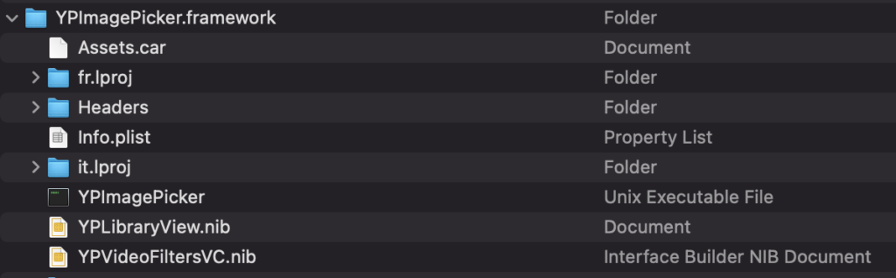
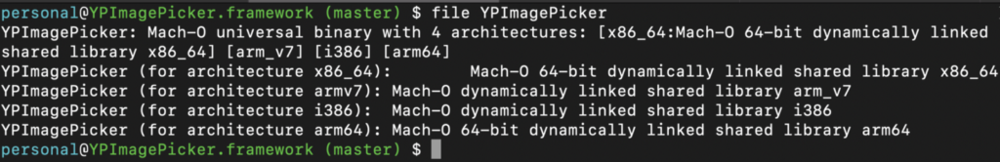
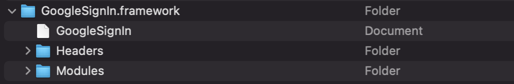
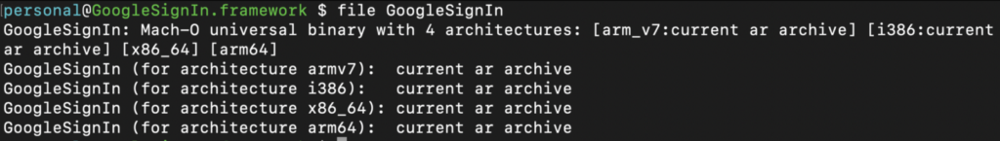
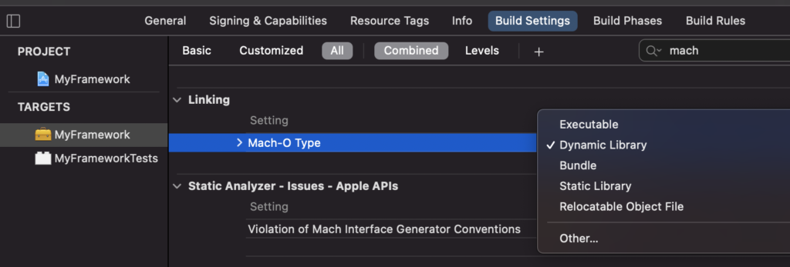
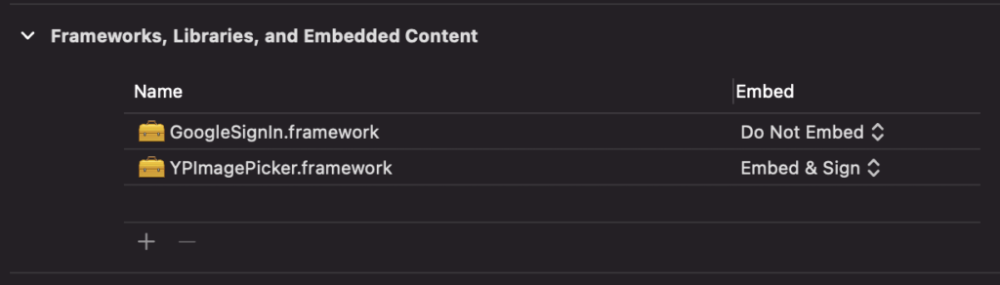
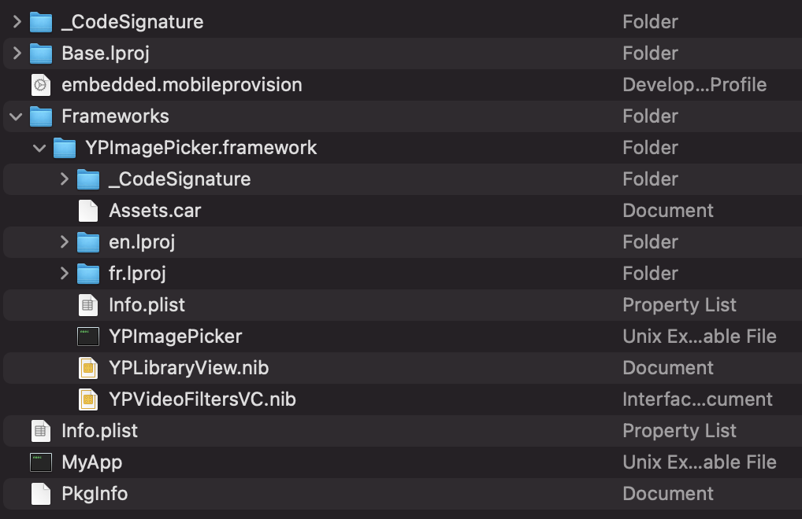

> 原文：[存在所谓的静态框架吗？——monday AI 工程](https://engineering.monday.com/is-there-such-a-thing-as-a-static-framework/)


Mobile

# 存在所谓的静态框架吗？


在 Apple 支持论坛中，他们对此话题的态度相当明确：根本不存在所谓的[“静态框架”](https://developer.apple.com/forums/thread/105062)。另一方面，互联网上却充斥着许多比较静态框架与动态框架的讨论。本文试图通过分析两个概念来澄清这一歧义：其一是 Bundle 编程（Bundle programming），这是 macOS 和 iOS 的一项技术；其二是动态链接与静态链接（dynamic vs static linking），这是计算机科学中更通用的概念。

### 一种 Bundle 类型

框架的含义可能因看待它的角度不同而有所差异。从 Swift 开发者的角度看，框架是一个模块（module），也就是一段可通过 `import` 语句访问的可重用代码。从 Xcode 的视角看，框架是 target 可用的产品类型之一，其他类型还包括 App、插件（plug-in）和库（library）。

这两种观点都揭示了框架的某些方面，但最简单地说，框架是一个包含平台特定内容的层级目录。Apple 将这种结构化文件夹称为 Bundle。框架是 Bundle 的一种类型。其他类型的 Bundle 包括 App Bundle 和插件 Bundle。与 App Bundle（.app 文件）不同，Framework Bundle 不是一个包，它不会以不透明文件的形式呈现给用户，而是一个常规的目录文件。这实际上是邀请框架的使用者去查看其内容。

让我们窥探一下 [YPImagePicker](https://github.com/Yummypets/YPImagePicker) 开源框架的内部：



<sub>YPImagePicker 框架</sub>

我们可以看到框架解决了一个什么问题。它将可执行文件及其所依赖的资源（如图片、本地化字符串、xib 文件）打包在一起，使得整个实体易于共享和复用。

### 让我们检查一下可执行文件

macOS 和 iOS 对其二进制文件使用 Mach-O 可执行格式。Mach-O 二进制文件可以有多种类型：可执行文件、归档文件（archive）或动态共享库。

`file` 命令可以告诉我们关于二进制 Mach-O 类型的相关信息。



<sub>file YPImagePicker</sub>

YPImagePicker 框架包含一个动态链接的共享库文件，也就是动态库。在这种情况下，“动态框架”这个标签似乎确实很合适。（实际上，该二进制文件将四种不同的架构叠放在一个文件中。这曾经是一种便捷的方式，可以分发一个二进制文件，让开发者在构建过程中移除不需要的架构。xcFramework 已经使这种方式过时了。）

并非所有框架都包含动态库。现在让我们窥探一下 [GoogleSignIn](https://developers.google.com/identity/sign-in/ios/sdk#download_the_google_sign-in_sdk) 框架的内部：



<sub>GoogleSignIn 框架</sub>

并在二进制文件上运行 `file` 命令：



<sub>file GoogleSignIn</sub>

GoogleSignIn 框架包含一个归档文件，也就是静态库，这是一种将多个可重定位目标文件打包在一起的便捷方式。

框架包含静态库并没有什么特别之处。去你的 Xcode 项目的构建设置里，检查一下 Mach-O 类型设置：



正如所料，Framework 项目的默认 Mach-O 类型是动态库，Static Library 项目是静态库，而 Application 项目是可执行文件。但你完全可以自由地修改它。

### Xcode 归档

有些框架封装的是动态库，有些则是静态库。因此，将前者称为动态框架，后者称为静态框架，似乎很自然。然而，动态框架在被使用的方式上有一个根本性的区别。

动态框架及其动态共享库在构建过程结束时，不会完全链接到 App 可执行文件中。因此，它们需要嵌入到 App Bundle 中。相反，当静态链接器完成工作后，所有符号都已解析。代码段和数据段已被合并为一个自包含的可执行文件。



Xcode 构建过程的输出是一个 Xcode 归档（archive，这是 macOS 和 iOS 特有的一种包类型，不要与静态归档混淆！）。如果我们按照上图所示的框架设置对 App 进行 Xcode 归档，我们将得到一个具有以下配置的 App Bundle：



App Bundle 包含 MyApp 可执行文件以及嵌入到 App 中的框架，所有这些都位于 Frameworks 文件夹中。但是 App Bundle 不会保留任何关于未嵌入框架（即包含静态库的框架）的痕迹。GoogleSignIn 可执行文件现在已成为 MyApp 可执行文件的一部分。

### 访问资源

如果框架是一种将源代码及其依赖的资源一起分发的便捷方式，那么 Apple 很可能已经让从源代码中访问这些资源变得容易了。确实如此！作为 Bundle 的一种类型，框架可以使用 Foundation 框架中的 `Bundle` 类来访问其内容，而无需担心底层结构。

考虑在一个图像视图（image view）上设置图片的场景，其中源代码和资源本身都是框架的一部分：

```
public class MyView {
    let imageView = UIImageView()

    func setImage() {
        let frameworkBundle = Bundle(identifier: "com.myframework")
        let image = UIImage(named: "my_image", in: frameworkBundle, with: nil)
        imageView.image = image
    }
}
```

这段代码在嵌入到 App Bundle 中的动态框架情况下工作良好。但如果框架的可执行文件是静态链接的，则会崩溃。确实，在后一种情况下，框架编译后的源代码已经是 App 可执行文件的一部分，框架 Bundle 并没有嵌入到 App Bundle 中，因此第 5 行的 `frameworkBundle` 变量在运行时返回 `nil`。

一种部分修复该问题的方法是使用 `Bundle` 类的另一个初始化方法：

```
private class BundleFinder {}

public class MyView {
    let imageView = UIImageView()

    func setImage() {
        let frameworkBundle = Bundle(for: BundleFinder.self)
        let image = UIImage(named: "my_image", in: frameworkBundle, with: nil)
        imageView.image = image
    }
}
```

这里我们假设源代码和资源会放在一起。对于动态嵌入式框架来说，这总是成立的。但对于静态框架的使用者来说，则需要额外步骤。使用者需要将框架的资源复制到主 App Bundle 中。这就是为什么依赖资源的静态框架通常会附带特定的资源 Bundle。

尽管框架可以包含静态链接的二进制文件，但其 Bundle 并不会成为最终 App Bundle 的一部分。源代码无法假设资源是框架 Bundle 的一部分，而这也正是框架存在的主要“理由”之一。静态框架试图融合两个概念，但最终，静态链接的特性会压倒框架 Bundle 的概念。
