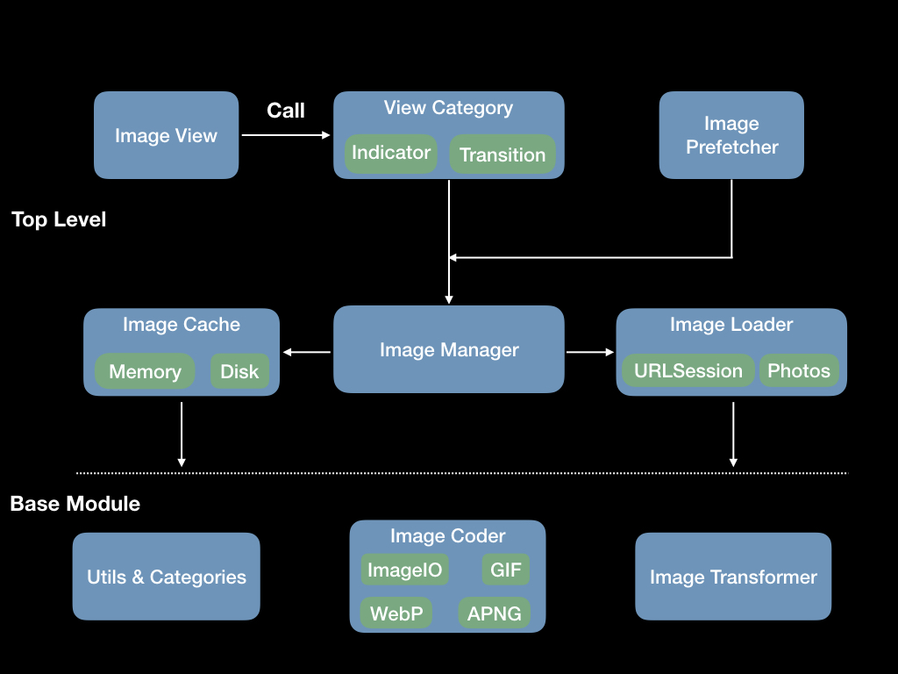
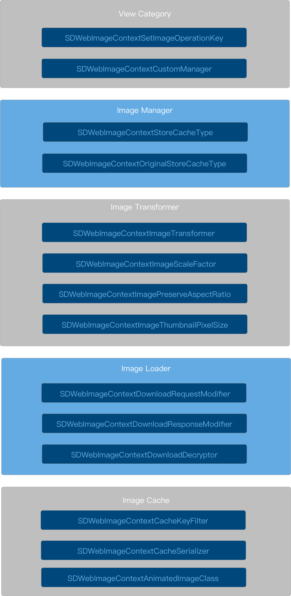

> 原文：[The Architecture of SDWebImage v5.6](https://looseyi.github.io/post/sourcecode-ios/source-code-sdweb-en1/)

本文基于 SDWebImage 5.6。之所以写这篇文章，是因为我发现 SD 的 API 在不断迭代，很多结构已经与早期版本不同了。在此做个记录。我们将从下面 API 层级列表的顶层开始，重点关注整个框架的数据流。



## 5.0 迁移指南

强烈建议阅读官方的[迁移文档](https://github.com/SDWebImage/SDWebImage/wiki/5.0-Migration-guide)，其中提到了 5.0 版本的主要特性。

- 全新的动画图像视图（Animated Image View）（4.0 中是 `FLAnimatedImageView`）；
- 提供图像变换（Image Transform），可以轻松对下载后的图像进行缩放、旋转、圆角等操作；
- 可定制性：你可以基于协议定制[缓存（cache）](https://github.com/SDWebImage/SDWebImage/wiki/Advanced-Usage#custom-cache-50)、[加载器（loader）](https://github.com/SDWebImage/SDWebImage/wiki/Advanced-Usage#custom-loader-50)、[编解码器（coder）](https://github.com/SDWebImage/SDWebImage/wiki/Advanced-Usage#custom-coder-420)；
- 新增视图指示器（View Indicator），用于标识图像的加载状态；

可以说，核心类的协议化（protocolization）是 5.x SD 版本最大的变化，这意味着图像请求、加载、解码、缓存等操作都是可插拔、可按需替换的。

那么，我们先来看主要部分：

| 4.x | 5.x |
|---|---|
| SDWebImageCacheSerializerBlock | id\<SDWebImageCacheSerializer\> |
| SDWebImageCacheKeyFilterBlock | id\<SDWebImageCacheKeyFilter\> |
| SDWebImageDownloader | id\<SDImageLoader\> |
| SDImageCache | id\<SDImageCache\> |
| SDWebImageDownloaderProgressBlock | id\<SDWebImageIndicator\> |
| FLAnimatedImageView | id\<SDAnimatedImage\> |

## 视图分类

所有用于图像操作的视图便捷方法都基于 `UIView + WebCache`，包括以下内容：

- UIImageView+HighlightedWebCache
- UIImageView+WebCache
- UIView+WebCacheOperation
- UIButton+WebCache
- NSButton+WebCache

首先，来看一下 [SDWebImageCompat.h](https://github.com/SDWebImage/SDWebImage/blob/09f06159a3284f6981d5495728e5c3cb3dfb82fa/SDWebImage/Core/SDWebImageCompat.h)，它定义了 **SD_MAC、SD_UIKIT、SD_WATCH** 宏，用于简化系统定义，并统一不同平台的 API，例如使用 `# define UIImage NSImage` 将 NSImage 重新定义为 UIImage。还有一点值得注意：

```objective
1#ifndef dispatch_main_async_safe
2#define dispatch_main_async_safe(block)\
3    if (dispatch_queue_get_label(DISPATCH_CURRENT_QUEUE_LABEL) == dispatch_queue_get_label(dispatch_get_main_queue())) {\
4        block();\
5    } else {\
6        dispatch_async(dispatch_get_main_queue(), block);\
7    }
8#endif
```

与早期版本不同：

```objective
1#define dispatch_main_async_safe(block)\
2    if ([NSThread isMainThread]) {\
3        block();\
4    } else {\
5        dispatch_async(dispatch_get_main_queue(), block);\
6    }
7#endif
```

- 使用 `#ifndef` 防止 `dispatch_main_async_safe` 重复定义；
- 主线程检测从 `isMainThread` 变为 `dispatch_queue_t` 标签。

关于第二点，这里有 SD 的[讨论](https://github.com/SDWebImage/SDWebImage/pull/781)，以及另一篇解释 [GCD 的主队列 vs 主线程](http://blog.benjamin-encz.de/post/main-queue-vs-main-thread/)。

> 如果某个库（如 VektorKit）依赖于检查是否在主队列上执行，那么从非主队列但在主线程上执行时调用其 API 会导致问题。

因为**主队列的任务必须放到主线程中执行**。

与 UIImageView 的分类相比，UIButton 需要存储不同 `UIControlState` 和 backgroundImage 下的图像，SD 通过关联对象为它维护了一个内部字典 `(NSMutableDictionary <NSString *, NSURL *> *) sd_imageURLStorage` 来存储图像。

所有视图分类的 `setImageUrl:` 最终都会调用以下方法：

```objective
1- (void)sd_internalSetImageWithURL:(nullable NSURL *)url
2                  placeholderImage:(nullable UIImage *)placeholder
3                           options:(SDWebImageOptions)options
4                           context:(nullable SDWebImageContext *)context
5                     setImageBlock:(nullable SDSetImageBlock)setImageBlock
6                          progress:(nullable SDImageLoaderProgressBlock)progressBlock
7                         completed:(nullable SDInternalCompletionBlock)completedBlock;
```

此方法的实现相当长，简要描述如下：

1. 复制并转换 `SDWebImageContext` 为不可变对象，获取 `validOperationKey` 的值作为校验 ID，默认值是当前视图的类名；
2. 调用 `sd_cancelImageLoadOperationWithKey` 取消上一次任务，确保当前没有正在进行的异步下载操作，并且不会与即将到来的操作发生冲突；
3. 设置占位图像；
4. 初始化 `SDWebImageManager`、`SDImageLoaderProgressBlock`，重置 `NSProgress`、`SDWebImageIndicator`；
5. 开始下载，调用 `loadImageWithURL:` 并将返回的 `SDWebImageOperation` 保存到 `sd_operationDictionary` 中，其键为 `validOperationKey`；
6. 获取图像后，调用 `sd_setImage:` 并为新图像添加过渡动画；
7. 动画结束后停止指示器。

一个小提示，`SDWebImageOperation` 是一个**强-弱** NSMapTable，也是通过关联值添加的：

```objective
1// key is strong, value is weak because operation instance is retained by SDWebImageManager's runningOperations property
2// we should use lock to keep thread-safe because these method may not be acessed from main queue
3typedef NSMapTable<NSString *, id<SDWebImageOperation>> SDOperationsDictionary;
```

使用弱引用是因为 operation 实例存储在 SDWebImageManager 的 runningOperations 中，这里的引用是为了方便取消任务。

### SDWebImageContext

> SDWebImageContext 对象，持有来自顶层 API 的原始上下文选项。

图像上下文贯穿图像处理的整个工作流。它把数据逐步传递给每个处理任务。ImageContext 有两种类型：

```objectivec
1typedef NSString * SDWebImageContextOption NS_EXTENSIBLE_STRING_ENUM;
2typedef NSDictionary<SDWebImageContextOption, id> SDWebImageContext;
3typedef NSMutableDictionary<SDWebImageContextOption, id>SDWebImageMutableContext;
```

SDWebImageContextOption 是一个可扩展的字符串枚举，目前有 15 种类型。基本上，只看名字就能猜到它的功能，这里有[文档](https://github.com/SDWebImage/SDWebImage/blob/5c3c40288f7e465ba94db9736e624f663831951a/SDWebImage/Core/SDWebImageDefine.h)，总结如下：



## ImagePrefetcher

Prefetcher 与 SD 的整个处理流程无关。它主要使用 imageManger 进行批量图像下载。以下是核心方法：

```objective
1- (nullable SDWebImagePrefetchToken *)prefetchURLs:(nullable NSArray<NSURL *> *)urls
2                                          progress:(nullable SDWebImagePrefetcherProgressBlock)progressBlock
3                                         completed:(nullable SDWebImagePrefetcherCompletionBlock)completionBlock;
```

它将已下载的 URL 作为 `transactions` 存储在 `SDWebImagePrefetchToken` 中，这样做不会取消之前的请求，并且会区分不同的预取过程。当你为不同的 URL 列表调用 `prefetchURLs` 时，你可以为不同的完成回调（completion block）获得回调。

每个下载任务都在 autoreleasepool 中，并且会使用 `SDAsyncBlockOperation` 包装实际的下载任务，以实现任务的可取消操作：

```objective
 1@autoreleasepool {
 2    @weakify(self);
 3    SDAsyncBlockOperation *prefetchOperation = [SDAsyncBlockOperation blockOperationWithBlock:^(SDAsyncBlockOperation * _Nonnull asyncOperation) {
 4        @strongify(self);
 5        if (!self || asyncOperation.isCancelled) {
 6            return;
 7        }
 8        /// load Image ...
 9    }];
10    @synchronized (token) {
11        [token.prefetchOperations addPointer:(__bridge void *)prefetchOperation];
12    }
13    [self.prefetchQueue addOperation:prefetchOperation];
14}
```

最后，任务存储在 prefetchQueue 中，默认限制最大下载数为 3。实际的 URL 下载任务在 `token.loadOperations` 中：

```objective
1NSPointerArray *operations = token.loadOperations;
2id<SDWebImageOperation> operation = [self.manager loadImageWithURL:url options:self.options context:self.context progress:nil completed:^(UIImage * _Nullable image, NSData * _Nullable data, NSError * _Nullable error, SDImageCacheType cacheType, BOOL finished, NSURL * _Nullable imageURL) {
3    /// progress handler
4}];
5NSAssert(operation != nil, @"Operation should not be nil, [SDWebImageManager loadImageWithURL:options:context:progress:completed:] break prefetch logic");
6@synchronized (token) {
7    [operations addPointer:(__bridge void *)operation];
8}
```

`loadOperations` 和 `prefetchOperations` 都使用 **NSPointerArray**，它利用了其 [NSPointerFunctionsWeakMemory](apple-reference-documentation://hcx77yk4jV) 特性，并可以存储 `Null` 值，尽管其性能不是很好，详见：[基本集合类](https://objccn.io/issue-7-1/)

另一个重要之处在于，PrefetchToken 使用 [c++11 memory_order_relaxed](https://zhuanlan.zhihu.com/p/45566448) 来保证线程安全。

```c++
1atomic_ulong _skippedCount;
2atomic_ulong _finishedCount;
3atomic_flag  _isAllFinished;
4
5unsigned long _totalCount;
```

简而言之，它利用内存顺序和原子操作实现了无锁并发，提高了效率。

## ImageLoader

ImageLoader 是 `SDImageLoader` 协议的默认实现，提供了通过 HTTP/HTTPS/FTP 或本地 URL 的 NSURLSession 源图像获取能力。并且它最大化了整个下载过程的可配置性。主要接口如下：

```objective
 1@interface SDWebImageDownloader : NSObject
 2
 3@property (nonatomic, copy, readonly, nonnull) SDWebImageDownloaderConfig *config;
 4@property (nonatomic, strong, nullable) id<SDWebImageDownloaderRequestModifier> requestModifier;
 5@property (nonatomic, strong, nullable) id<SDWebImageDownloaderResponseModifier> responseModifier;
 6@property (nonatomic, strong, nullable) id<SDWebImageDownloaderDecryptor> decryptor;
 7/* ... */
 8
 9-(nullable SDWebImageDownloadToken *)downloadImageWithURL:(nullable NSURL *)url
10    options:(SDWebImageDownloaderOptions)options
11    context:(nullable SDWebImageContext *)context
12   progress:(nullable SDWebImageDownloaderProgressBlock)progressBlock
13  completed:(nullable SDWebImageDownloaderCompletedBlock)completedBlock;
14
15@end
```

**downloaderConfig** 支持 NSCopy 协议，下面提供了主要的配置项：

```objective
 1/// The maximum number of concurrent downloads.
 2@property (nonatomic, assign) NSInteger maxConcurrentDownloads;
 3/// The timeout value (in seconds) for each download operation.
 4@property (nonatomic, assign) NSTimeInterval downloadTimeout;
 5/// The session configuration, it's immutable after the downloader instance initialized.
 6@property (nonatomic, strong, nullable) NSURLSessionConfiguration *sessionConfiguration;
 7/// Passing `NSOperation<SDWebImageDownloaderOperation>` to set as default. Passing `nil` will revert to `SDWebImageDownloaderOperation`.
 8@property (nonatomic, assign, nullable) Class operationClass;
 9/// The download operations execution order, default is FIFO
10@property (nonatomic, assign) SDWebImageDownloaderExecutionOrder executionOrder;
```

**requestModifier**，在下载请求前提供修改：

```objective
1/// Modify the original URL request and return a new one instead. You can modify the HTTP header, cachePolicy, etc for this URL.
2@protocol SDWebImageDownloaderRequestModifier <NSObject>
3
4- (nullable NSURLRequest *)modifiedRequestWithRequest:(nonnull NSURLRequest *)request;
5
6@end
```

类似地，**responseModifier** 提供返回值的修改：

```objective
1/// Modify the original URL response and return a new response. You can use this to check MIME-Type, mock server response, etc.
2
3@protocol SDWebImageDownloaderResponseModifier <NSObject>
4
5- (nullable NSURLResponse *)modifiedResponseWithResponse:(nonnull NSURLResponse *)response;
6
7@end
```

最后一个 **decryptor** 用于图像解密，默认提供 imageData 的 base64 转换。

```objective
1/// Decrypt the original download data and return a new data. You can use this to decrypt the data using your perfereed algorithm.
2@protocol SDWebImageDownloaderDecryptor <NSObject>
3
4- (nullable NSData *)decryptedDataWithData:(nonnull NSData *)data response:(nullable NSURLResponse *)response;
5
6@end
```

通过这些协议化的对象来处理数据，源于**[策略模式](https://www.wikiwand.com/en/Strategy_pattern)**。通过配置获取协议对象，调用者只需关心协议对象提供的方法，而无需关心其内部实现，从而达到解耦的目的。

### DownloadImageWithURL

下载前，检查 URL 是否存在。

如果不存在，直接抛出错误并返回。获取 URL 后，尝试重用之前生成的 operation：

```objective
1NSOperation<SDWebImageDownloaderOperation> *operation = [self.URLOperations objectForKey:url];
```

如果 operation 存在，则调用：

```objective
1@synchronized (operation) {
2    downloadOperationCancelToken = [operation addHandlersForProgress:progressBlock completed:completedBlock];
3}
```

并设置 queuePriority。这里使用 `@synchronized (operation)` 是为了与 operation 内部使用的 `@synchronized (self)` 区分开来，以确保 operation 在两个不同类之间的线程安全。因为 operation 可能会被传递到解码或委托（delegate）队列。

然后，`addHandlersForProgres` 方法会将 progressBlock 和 completedBlock 保存到 `NSMutableDictionary <NSString *, id> SDCallbacksDictionary` 中，然后返回并保存到 downloadOperationCancelToken。

此外，`addHandlersForProgress` 方法中的 operation 不会清除之前存储的回调。它们会被增量保存，这意味着所有回调将在下载完成后按顺序执行。

如果 operation 为 nil、isFinished 或 isCancelled，则调用 `createDownloaderOperationWithUrl:options:context:` 创建一个新的 operation，将其存储在 URLOperations 中，并配置 completionBlock。这样，当任务完成时，URLOperations 可以被清除。然后调用 `addHandlersForProgress:completed:` 保存 progressBlock 和 completedBlock。最后将 operation 提交到 downloadQueue。

最终的 operation、url、request 和 downloadOperationCancelToken 被封装到 **SDWebImageDownloadToken** 中，后者是下载任务的终点。

### CreateDownloaderOperation

下载后，我们来谈谈 operation 是如何创建的。首先是生成一个 URLRequest：

```objective
1// In order to prevent from potential duplicate caching (NSURLCache + SDImageCache) we disable the cache for image requests if told otherwise
2NSURLRequestCachePolicy cachePolicy = options & SDWebImageDownloaderUseNSURLCache ? NSURLRequestUseProtocolCachePolicy : NSURLRequestReloadIgnoringLocalCacheData;
3NSMutableURLRequest *mutableRequest = [[NSMutableURLRequest alloc] initWithURL:url cachePolicy:cachePolicy timeoutInterval:timeoutInterval];
4mutableRequest.HTTPShouldHandleCookies = SD_OPTIONS_CONTAINS(options, SDWebImageDownloaderHandleCookies);
5mutableRequest.HTTPShouldUsePipelining = YES;
6SD_LOCK(self.HTTPHeadersLock);
7mutableRequest.allHTTPHeaderFields = self.HTTPHeaders;
8SD_UNLOCK(self.HTTPHeadersLock);
```

主要通过获取 SDWebImageDownloaderOptions 中的参数进行配置。超时时间由 downloader 的 `config.downloadTimeout` 决定，默认为 15 秒。

然后从 imageContext 中取出 `id <SDWebImageDownloaderRequestModifier> requestModifier` 来转换请求。

```objective
1// Request Modifier
2id<SDWebImageDownloaderRequestModifier> requestModifier;
3if ([context valueForKey:SDWebImageContextDownloadRequestModifier]) {
4    requestModifier = [context valueForKey:SDWebImageContextDownloadRequestModifier];
5} else {
6    requestModifier = self.requestModifier;
7}
```

需要注意，对 requestModifier 的访问具有**优先级**，通过 imageContext 获取的优先级高于 downloader。这种方式既满足了调用方的可控制性，又支持全局配置，老少咸宜。

类似地，`id <SDWebImageDownloaderResponseModifier> responseModifier` 和 `id <SDWebImageDownloaderDecryptor> decryptor` 也采用同样的方式。

之后，确认后的 responseModifier 和 decryptor 会再次保存到 imageContext 中以备后用。

最后，从 downloaderConfig 中取出 operationClass 来创建 operation：

```objective
1Class operationClass = self.config.operationClass;
2if (operationClass && [operationClass isSubclassOfClass:[NSOperation class]] && [operationClass conformsToProtocol:@protocol(SDWebImageDownloaderOperation)]) {
3    // Custom operation class
4} else {
5    operationClass = [SDWebImageDownloaderOperation class];
6}
7NSOperation<SDWebImageDownloaderOperation> *operation = [[operationClass alloc] initWithRequest:request inSession:self.session options:options context:context];
```

设置 _credential、minimumProgressInterval、queuePriority、pendingOperation。

默认情况下，每个任务按 FIFO 顺序添加到 downloadQueue。如果设置为 LIFO，则在添加到队列前会修改任务优先级：

```objective
1if (self.config.executionOrder == SDWebImageDownloaderLIFOExecutionOrder) {
2    // Emulate LIFO execution order by systematically, each previous adding operation can dependency the new operation
3    // This can gurantee the new operation to be execulated firstly, even if when some operations finished, meanwhile you appending new operations
4    // Just make last added operation dependents new operation can not solve this problem. See test case #test15DownloaderLIFOExecutionOrder
5    for (NSOperation *pendingOperation in self.downloadQueue.operations) {
6        [pendingOperation addDependency:operation];
7    }
8}
```

### 数据处理

SDWebImageDownloaderOperation 也是一个协议化的类，它遵循 NSURLSessionTaskDelegate、NSURLSessionDataDelegate。它处理 URL 请求数据、支持后台下载、支持 responseData 修改（通过 responseModifier），以及支持下载 ImageData 解密（通过 decryptor）。主要的内部属性如下：

```objective
 1@property (assign, nonatomic, readwrite) SDWebImageDownloaderOptions options;
 2@property (copy, nonatomic, readwrite, nullable) SDWebImageContext *context;
 3@property (strong, nonatomic, nonnull) NSMutableArray<SDCallbacksDictionary *> *callbackBlocks;
 4
 5@property (strong, nonatomic, nullable) NSMutableData *imageData;
 6@property (copy, nonatomic, nullable) NSData *cachedData; // for `SDWebImageDownloaderIgnoreCachedResponse`
 7@property (assign, nonatomic) NSUInteger expectedSize; // may be 0
 8@property (assign, nonatomic) NSUInteger receivedSize;
 9
10@property (strong, nonatomic, nullable) id<SDWebImageDownloaderResponseModifier> responseModifier; // modifiy original URLResponse
11@property (strong, nonatomic, nullable) id<SDWebImageDownloaderDecryptor> decryptor; // decrypt image data
12// This is weak because it is injected by whoever manages this session. If this gets nil-ed out, we won't be able to run
13// the task associated with this operation
14@property (weak, nonatomic, nullable) NSURLSession *unownedSession;
15// This is set if we're using not using an injected NSURLSession. We're responsible of invalidating this one
16@property (strong, nonatomic, nullable) NSURLSession *ownedSession;
17
18@property (strong, nonatomic, nonnull) dispatch_queue_t coderQueue; // the queue to do image decoding
19#if SD_UIKIT
20@property (assign, nonatomic) UIBackgroundTaskIdentifier backgroundTaskId;
21
22- (nonnull instancetype)initWithRequest:(nullable NSURLRequest *)request
23                              inSession:(nullable NSURLSession *)session
24                                options:(SDWebImageDownloaderOptions)options
25                                context:(nullable SDWebImageContext *)context;
```

初始化没什么特别之处。需要注意的是，这里传入的 `nullable session` 用 unownedSessin 保存，这与内部默认生成的 **ownedSession** 不同。如果在初始化时 session 为空，ownedSession 将在 `start` 时创建。

那么问题来了，因为我们需要观察 session 的各种状态，所以需要设置委托（delegate）。

```objective
1[NSURLSession sessionWithConfiguration:delegate:delegateQueue:];
```

ownedSession 的委托（delegate）无疑是 operation 内部，而 unownedSessin 的委托（delegate）是 downloader。它将通过 taskID 检索 operation，并通过 operation 的委托（delegate）转发回调。代码如下：

```objective
1- (void)URLSession:(NSURLSession *)session task:(NSURLSessionTask *)task didCompleteWithError:(NSError *)error {
2
3    // Identify the operation that runs this task and pass it the delegate method
4    NSOperation<SDWebImageDownloaderOperation> *dataOperation = [self operationWithTask:task];
5    if ([dataOperation respondsToSelector:@selector(URLSession:task:didCompleteWithError:)]) {
6        [dataOperation URLSession:session task:task didCompleteWithError:error];
7    }
8}
```

然后，作为实际的消费者 operation 触发下载任务。整个下载过程包括开始、结束和取消，都会发送相应的通知。

1. 在 **didReceiveResponse** 中，`response.expectedContentLength` 将被保存为 expectedSize。然后调用 `modifiedResponseWithResponse:` 保存编辑后的响应。
2. 每次 **didReceiveData** 都会将数据追加到 imageData：`[self.imageData appendData: data]`，更新 receivedSize `self.receivedSize = self.imageData.length`。最后，当 receivedSize 大于 expectedSize 时，表示下载任务完成，进入下一阶段。如果你支持 `SDWebImageDownloaderProgressiveLoad`，你可以在 coderQueue 中一边下载一边解码：

```objective
 1// progressive decode the image in coder queue
 2dispatch_async(self.coderQueue, ^{
 3    @autoreleasepool {
 4        UIImage *image = SDImageLoaderDecodeProgressiveImageData(imageData, self.request.URL, finished, self, [[self class] imageOptionsFromDownloaderOptions:self.options], self.context);
 5        if (image) {
 6            // We do not keep the progressive decoding image even when `finished`=YES. Because they are for view rendering but not take full function from downloader options. And some coders implementation may not keep consistent between progressive decoding and normal decoding.
 7
 8            [self callCompletionBlocksWithImage:image imageData:nil error:nil finished:NO];
 9        }
10    }
11});
```

​ 否则，解码操作将在 **didCompleteWithError** 时完成：`SDImageLoaderDecodeImageData`，但解码前需要先解密：

```objective
1if (imageData && self.decryptor) {
2    imageData = [self.decryptor decryptedDataWithData:imageData response:self.response];
3}
```

​ 3. 处理完成回调；

_我们最终会讨论解码的逻辑。_

## ImageCache

缓存类的设计与 ImageLoader 一致。会用 **SDImageCacheConfig** 来配置缓存过期时间、容量、读写权限，并动态指定 MemoryCache / DiskCache 类。

SDImageCacheConfig 的主要属性如下：

```objective
 1@property (assign, nonatomic) BOOL shouldDisableiCloud;
 2@property (assign, nonatomic) BOOL shouldCacheImagesInMemory;
 3@property (assign, nonatomic) BOOL shouldUseWeakMemoryCache;
 4@property (assign, nonatomic) BOOL shouldRemoveExpiredDataWhenEnterBackground;
 5@property (assign, nonatomic) NSDataReadingOptions diskCacheReadingOptions;
 6@property (assign, nonatomic) NSDataWritingOptions diskCacheWritingOptions;
 7@property (assign, nonatomic) NSTimeInterval maxDiskAge;
 8@property (assign, nonatomic) NSUInteger maxDiskSize;
 9@property (assign, nonatomic) NSUInteger maxMemoryCost;
10@property (assign, nonatomic) NSUInteger maxMemoryCount;
11@property (assign, nonatomic) SDImageCacheConfigExpireType diskCacheExpireType;
12/// Defaults to built-in `SDMemoryCache` class.
13@property (assign, nonatomic, nonnull) Class memoryCacheClass;
14/// Defaults to built-in `SDDiskCache` class.
15@property (assign ,nonatomic, nonnull) Class diskCacheClass;
```

MemoryCache 和 DiskCache 的实例化依赖于 SDImageCacheConfig：

```objective
1/// SDMemoryCache
2- (nonnull instancetype)initWithConfig:(nonnull SDImageCacheConfig *)config;
3/// SDDiskCache
4- (nullable instancetype)initWithCachePath:(nonnull NSString *)cachePath config:(nonnull SDImageCacheConfig *)config;
```

作为缓存协议，它们的接口声明基本相同，都是对数据的 CURD 操作。不同之处在于，MemoryCache 协议操作的是 **id** 类型（NSCache 的限制），而 DiskCache 操作的是 NSData。

### SDMemoryCache

```objective
1/**
2 A memory cache which auto purge the cache on memory warning and support weak cache.
3 */
4@interface SDMemoryCache <KeyType, ObjectType> : NSCache <KeyType, ObjectType> <SDMemoryCache>
5
6@property (nonatomic, strong, nonnull, readonly) SDImageCacheConfig *config;
7
8@end
```

内部使用 **NSCache** 作为 SDMemoryCache 的实现，并添加了 **NSMapTable \<KeyType, ObjectType\> * weakCache** 属性，使用信号量锁来保证线程安全。弱缓存（weak-cache）是仅在 _iOS / tvOS_ 平台上添加的特性，因为在 macOS 上，NSCache 在收到系统内存警告时不会清除相应的缓存。WeakCache 使用强-弱引用，没有额外的内存开销，并且不影响对象的生命周期。

weakCache 的作用是恢复缓存。它由 CacheConfig 的 **shouldUseWeakMemoryCache** 开关控制。详情可查看 [CacheConfig](https://github.com/SDWebImage/SDWebImage/blob/master/SDWebImage/Core/SDImageCacheConfig.h)。

首先，看看 _objectForKey_ 是如何实现的：

```objective
 1- (id)objectForKey:(id)key {
 2    id obj = [super objectForKey:key];
 3    if (!self.config.shouldUseWeakMemoryCache) {
 4        return obj;
 5    }
 6    if (key && !obj) {
 7        // Check weak cache
 8        SD_LOCK(self.weakCacheLock);
 9        obj = [self.weakCache objectForKey:key];
10        SD_UNLOCK(self.weakCacheLock);
11        if (obj) {
12            // Sync cache
13            NSUInteger cost = 0;
14            if ([obj isKindOfClass:[UIImage class]]) {
15                cost = [(UIImage *)obj sd_memoryCost];
16            }
17            [super setObject:obj forKey:key cost:cost];
18        }
19    }
20    return obj;
21}
```

由于 NSCache 遵循 [`NSDiscardableContent`](apple-reference-documentation://hcnVx1bA-q) 来存储临时对象。当内存紧张时，缓存的对象可能被系统清除。此时，一旦应用程序访问 MemoryCache 并缓存未命中，就会转到 diskCache 查询操作。这可能导致图像闪烁。而当 shouldUseWeakMemoryCache 为 true 时，由于 weakCache 持有了对象的弱引用（当对象被 NSCache 清除但尚未释放时），我们可以通过 weakCache 获取缓存并将其塞回 NSCache，从而减少磁盘 I/O。

### SDDiskCache

这个更简单，内部使用 NSFileManager 来管理图像数据的读写，并调用 SDDiskCacheFileNameForKey 将 key 的 MD5 处理为 fileName，存储在 diskCachePath 目录中。另一个作用是清除过期的缓存：

1. 根据 SDImageCacheConfigExpireType 排序获取 `NSDirectoryEnumerator * fileEnumerator` 并开始过滤；
2. 使用 `cacheConfig.maxDiskAage` 判断是否过期，并将过期的 URL 存储在 urlsToDelete 中；
3. 调用 `[self.fileManager removeItemAtURL: fileURL error: nil];`
4. 根据 `cacheConfig.maxDiskSize` 删除磁盘上缓存的数据，清理到 maxDiskSize 的 1/2。

顺便说一下，SDDiskCache 像 **[YYKVStorage](https://github.com/ibireme/YYCache/blob/master/YYCache/YYKVStorage.h)** 一样，也支持向 UIImage 添加 extendData 来存储额外信息，例如图片的缩放比例、[URL 富链接](https://sspai.com/post/55279)、时间等数据。

但是，**YYKVStorage** 通过数据库中的 _**manifest**_ 表存储 extended_data 字段。SDDiskCache 解决方案采用不同的方式，通过系统 API `<sys/xattr.h>` 的 **setxattr**、**getxattr**、**listxattr** 来保存 extendData，这确实令人惊叹。还有一点，对应的 key 是 _SDDiskCacheExtendedAttributeName_。

### SDImageCache

它也是一个协议化的类，负责调度 SDMemoryCache 和 SDDiskCache，其属性如下：

```objective
1@property (nonatomic, strong, readwrite, nonnull) id<SDMemoryCache> memoryCache;
2@property (nonatomic, strong, readwrite, nonnull) id<SDDiskCache> diskCache;
3@property (nonatomic, copy, readwrite, nonnull) SDImageCacheConfig *config;
4@property (nonatomic, copy, readwrite, nonnull) NSString *diskCachePath;
5@property (nonatomic, strong, nullable) dispatch_queue_t ioQueue;
```

> 注意：memoryCache 和 diskCache 实例根据 CacheConfig 中定义的类生成，默认分别为 SDMemoryCache 和 SDDiskCache。

让我们看看它的核心方法：

```objective
1- (void)storeImage:(nullable UIImage *)image
2         imageData:(nullable NSData *)imageData
3            forKey:(nullable NSString *)key
4          toMemory:(BOOL)toMemory
5            toDisk:(BOOL)toDisk
6        completion:(nullable SDWebImageNoParamsBlock)completionBlock;
```

1. 确保 image 和 key 存在；
2. 当 **shouldCacheImagesInMemory** 为 YES 时，调用 `[self.memoryCache setObject:image forKey:key cost:cost]` 写入 memoryCache；
3. 写入 diskCache，将操作逻辑放入 ioQueue 和 autoreleasepool 中。

  ```objective
   1dispatch_async(self.ioQueue, ^{
   2    @autoreleasepool {
   3        NSData *data = ... // 根据 SDImageFormat 对 image 进行编码获取
   4        /// data = [[SDImageCodersManager sharedManager] encodedDataWithImage:image format:format options:nil];
   5        [self _storeImageDataToDisk:data forKey:key];
   6        if (image) {
   7            // Check extended data
   8            id extendedObject = image.sd_extendedObject;
   9            // ... get extended data
  10            [self.diskCache setExtendedData:extendedData forKey:key];
  11        }
  12    }
  13    // call completionBlock in main queue
  14});
  ```

另一个重要的方法是图像查询，在 SDImageCache 协议中定义：

```objective
 1- (id<SDWebImageOperation>)queryImageForKey:(NSString *)key options:(SDWebImageOptions)options context:(nullable SDWebImageContext *)context completion:(nullable SDImageCacheQueryCompletionBlock)completionBlock {
 2    SDImageCacheOptions cacheOptions = 0;
 3    if (options & SDWebImageQueryMemoryData) cacheOptions |= SDImageCacheQueryMemoryData;
 4    if (options & SDWebImageQueryMemoryDataSync) cacheOptions |= SDImageCacheQueryMemoryDataSync;
 5    if (options & SDWebImageQueryDiskDataSync) cacheOptions |= SDImageCacheQueryDiskDataSync;
 6    if (options & SDWebImageScaleDownLargeImages) cacheOptions |= SDImageCacheScaleDownLargeImages;
 7    if (options & SDWebImageAvoidDecodeImage) cacheOptions |= SDImageCacheAvoidDecodeImage;
 8    if (options & SDWebImageDecodeFirstFrameOnly) cacheOptions |= SDImageCacheDecodeFirstFrameOnly;
 9    if (options & SDWebImagePreloadAllFrames) cacheOptions |= SDImageCachePreloadAllFrames;
10    if (options & SDWebImageMatchAnimatedImageClass) cacheOptions |= SDImageCacheMatchAnimatedImageClass;
11
12    return [self queryCacheOperationForKey:key options:cacheOptions context:context done:completionBlock];
13}
```

**queryImageForKey** 将 SDWebImageOptions 转换为 SDImageCacheOptions，然后调用 `queryCacheOperationForKey:`，其逻辑如下：

首先，如果查询的 key 存在，则从 imageContext 中获取 transformer 并转换查询 key：

```objective
1key = SDTransformedKeyForKey(key, transformerKey);
```

尝试从内存缓存中获取 image，如果存在：

1. 如果满足 SDImageCacheDecodeFirstFrameOnly 并遵循 SDAnimatedImage 协议，则取出 CGImage 进行转换

  ```objective
  1// Ensure static image
  2Class animatedImageClass = image.class;
  3if (image.sd_isAnimated || ([animatedImageClass isSubclassOfClass:[UIImage class]] && [animatedImageClass conformsToProtocol:@protocol(SDAnimatedImage)])) {
  4#if SD_MAC
  5    image = [[NSImage alloc] initWithCGImage:image.CGImage scale:image.scale orientation:kCGImagePropertyOrientationUp];
  6#else
  7    image = [[UIImage alloc] initWithCGImage:image.CGImage scale:image.scale orientation:image.imageOrientation];
  8#endif
  9}
  ```
2. 如果满足 SDImageCacheMatchAnimatedImageClass，则强制检查图像类型是否匹配，否则 data 为 nil：

  ```objective
  1// Check image class matching
  2Class animatedImageClass = image.class;
  3Class desiredImageClass = context[SDWebImageContextAnimatedImageClass];
  4if (desiredImageClass && ![animatedImageClass isSubclassOfClass:desiredImageClass]) {
  5    image = nil;
  6}
  ```

当可以从内存缓存中获取图像并且是 SDImageCacheQueryMemoryData 时，直接返回，否则继续；

开始读取 diskCache，并使用 shouldQueryDiskSync 指定查询缓存的同步/异步行为。

```objective
1// Check whether we need to synchronously query disk
2// 1. in-memory cache hit & memoryDataSync
3// 2. in-memory cache miss & diskDataSync
4BOOL shouldQueryDiskSync = ((image && options & SDImageCacheQueryMemoryDataSync) ||
5                            (!image && options & SDImageCacheQueryDiskDataSync));
```

整个 diskQuery 存储在 queryDiskBlock 中，并用 autorelease 包装：

```objective
 1void(^queryDiskBlock)(void) =  ^{
 2    if (operation.isCancelled) {
 3        // call doneBlock & return
 4    }
 5    @autoreleasepool {
 6        NSData *diskData = [self diskImageDataBySearchingAllPathsForKey:key];
 7        UIImage *diskImage;
 8        SDImageCacheType cacheType = SDImageCacheTypeNone;
 9        if (image) {
10            // the image is from in-memory cache, but need image data
11            diskImage = image;
12            cacheType = SDImageCacheTypeMemory;
13        } else if (diskData) {
14            cacheType = SDImageCacheTypeDisk;
15            // decode image data only if in-memory cache missed
16            diskImage = [self diskImageForKey:key data:diskData options:options context:context];
17            if (diskImage && self.config.shouldCacheImagesInMemory) {
18                NSUInteger cost = diskImage.sd_memoryCost;
19                [self.memoryCache setObject:diskImage forKey:key cost:cost];
20            }
21        }
22        // call doneBlock
23        if (doneBlock) {
24            if (shouldQueryDiskSync) {
25                doneBlock(diskImage, diskData, cacheType);
26            } else {
27                dispatch_async(dispatch_get_main_queue(), ^{
28                    doneBlock(diskImage, diskData, cacheType);
29                });
30            }
31        }
32    }
33}
```

对于大量临时内存操作，SD 会将其放入 autoreleasepool 中，以确保内存能够及时释放。

**特别强调**，一旦代码执行到这里，必定会有磁盘查询操作，所以如果不需要获取 imageData，可以使用 **SDImageCacheQueryMemoryData** 来提高查询效率。

还有一点，`SDTransformedKeyForKey` 的转换逻辑是 **SDImageTransformer** 的 transformerKey，按顺序拼接在图像 key 后面。例如：

```objective
1'image.png' |> flip(YES,NO) |> rotate(pi/4,YES)  =>
2'image-SDImageFlippingTransformer(1,0)-SDImageRotationTransformer(0.78539816339,1).png'
```

## SDImageManaer

SDImageManger 充当整个库的调度中心，是上述各种逻辑的主宰者。它将组件串联起来，从 View > 下载 > 解码 > 缓存。它暴露的唯一核心方法是 **loadImage**：

```objective
 1@property (strong, nonatomic, readonly, nonnull) id<SDImageCache> imageCache;
 2@property (strong, nonatomic, readonly, nonnull) id<SDImageLoader> imageLoader;
 3@property (strong, nonatomic, nullable) id<SDImageTransformer> transformer;
 4@property (nonatomic, strong, nullable) id<SDWebImageCacheKeyFilter> cacheKeyFilter;
 5@property (nonatomic, strong, nullable) id<SDWebImageCacheSerializer> cacheSerializer;
 6@property (nonatomic, strong, nullable) id<SDWebImageOptionsProcessor> optionsProcessor;
 7
 8@property (nonatomic, class, nullable) id<SDImageCache> defaultImageCache;
 9@property (nonatomic, class, nullable) id<SDImageLoader> defaultImageLoader;
10
11- (nullable SDWebImageCombinedOperation *)loadImageWithURL:(nullable NSURL *)url
12                                                   options:(SDWebImageOptions)options
13                                                   context:(nullable SDWebImageContext *)context
14                                                  progress:(nullable SDImageLoaderProgressBlock)progressBlock
15                                                 completed:(nonnull SDInternalCompletionBlock)completedBlock;
```

我们来简单谈谈左侧的三个 API：cacheKeyFilter、cacheSerializer 和 optionsProcessor，其余已在上面提到过。

**SDWebImageCacheKeyFilter**

默认情况下，使用 `URL.absoluteString` 作为 cacheKey，如果设置了 filter，cacheKey 将被 `cacheKeyForURL:` 替换。

**SDWebImageCacheSerializer**

默认情况下，ImageCache 会直接缓存 downloadData，当我们使用其他图像格式进行传输时，例如 WEBP 格式，那么 WEBP 格式的数据将直接存储到磁盘。这会导致一个问题：每次从磁盘查询图像时，我们都得重复解码操作。CacheSerializer 可以直接将 downloadData 转换为 JPEG / PNG 格式的 NSData 缓存，从而提高访问效率。

**SDWebImageOptionsProcessor**

用于控制 SDWebImageOptions 和 SDWebImageContext 中的全局参数。例如：

```objective
 1SDWebImageManager.sharedManager.optionsProcessor = [SDWebImageOptionsProcessor optionsProcessorWithBlock:^SDWebImageOptionsResult * _Nullable(NSURL * _Nullable url, SDWebImageOptions options, SDWebImageContext * _Nullable context) {
 2     // Only do animation on `SDAnimatedImageView`
 3     if (!context[SDWebImageContextAnimatedImageClass]) {
 4        options |= SDWebImageDecodeFirstFrameOnly;
 5     }
 6     // Do not force decode for png url
 7     if ([url.lastPathComponent isEqualToString:@"png"]) {
 8        options |= SDWebImageAvoidDecodeImage;
 9     }
10     // Always use screen scale factor
11     SDWebImageMutableContext *mutableContext = [NSDictionary dictionaryWithDictionary:context];
12     mutableContext[SDWebImageContextImageScaleFactor] = @(UIScreen.mainScreen.scale);
13     context = [mutableContext copy];
14
15     return [[SDWebImageOptionsResult alloc] initWithOptions:options context:context];
16 }];
```

### LoadImage

该方法的第一个参数，**url**，作为 SD 的连接核心，被设计为可为空。这种设计可能是为了方便用户。内部通过对 url 的 nil 判断以及 NSString 类型的兼容（强制转换为 NSURL）来确保后续流程顺利进行，否则调用结束。

下载开始后，该方法被拆分为以下 6 个方法：

- callCacheProcessForOperation
- callDownloadProcessForOperation
- callStoreCacheProcessForOperation
- callTransformProcessForOperation
- callCompletionBlockForOperation
- safelyRemoveOperationFromRunning

它们分别是缓存查询、下载、存储、转换、执行回调和清理回调。你可以发现，每个方法都通过 operation 传递，operation 在 loadImage 加载时准备好，然后触发缓存查询。

```objective
 1SDWebImageCombinedOperation *operation = [SDWebImagCombinedOperation new];
 2operation.manager = self;
 3
 4///  1
 5BOOL isFailedUrl = NO;
 6if (url) {
 7    SD_LOCK(self.failedURLsLock);
 8    isFailedUrl = [self.failedURLs containsObject:url];
 9    SD_UNLOCK(self.failedURLsLock);
10}
11
12if (url.absoluteString.length == 0 || (!(options & SDWebImageRetryFailed) && isFailedUrl)) {
13    [self callCompletionBlockForOperation:operation completion:completedBlock error:[NSError errorWithDomain:SDWebImageErrorDomain code:SDWebImageErrorInvalidURL userInfo:@{NSLocalizedDescriptionKey : @"Image url is nil"}] url:url];
14    return operation;
15}
16
17SD_LOCK(self.runningOperationsLock);
18[self.runningOperations addObject:operation];
19SD_UNLOCK(self.runningOperationsLock);
20
21// 2. Preprocess the options and context arg to decide the final the result for manager
22SDWebImageOptionsResult *result = [self processedResultForURL:url options:options context:context];
```

**loadImage** 的实现相对简单，核心是生成一个 operation，然后将其传递到缓存查询。

operation 初始化后，会检查 failedURLs 是否包含当前 url：

- 如果包含，并且 options 是 SDWebImageRetryFailed，则直接返回 operation；
- 如果通过，则将 operation 存储在 `runningOperations` 中。将 options 和 imageContext 封装在 **SDWebImageOptionsResult** 中。

然后会更新 imageContext，主要存储 transformer、cacheKeyFilter、cacheSerializer 作为全局默认设置，然后调用 **optionsProcessor** 来实现用户的自定义选项，再次修改 imageContext。

如果你从前面看到这里，应该对这个套路有印象了。前面 ImageLoader 中 requestModifer 的优先级逻辑与此类似，但实现方式略有不同。最后，进入 CacheProcess。

**loadImage** 的 operation 是一个 combineOperation，它是缓存和加载器操作任务的组合，这样它可以一步清理缓存查询和下载任务。声明如下：

```objective
1@interface SDWebImageCombinedOperation : NSObject <SDWebImageOperation>
2/// imageCache queryImageForKey: 的 operation
3@property (strong, nonatomic, nullable, readonly) id<SDWebImageOperation> cacheOperation;
4/// imageLoader requestImageWithURL: 的 operation
5@property (strong, nonatomic, nullable, readonly) id<SDWebImageOperation> loaderOperation;
6/// Cancel the current operation, including cache and loader process
7- (void)cancel;
8@end
```

它提供的 cancel 方法会逐步检查两种类型的 operation，然后逐一调用取消操作。

#### CallCacheProcessForOperation

首先检查 **SDWebImageFromLoaderOnly** 的值，以确定是否需要直接启动下载任务。

如果是，则转发到 downloadProcess。

否则，通过 `imageCache` 创建一个查询任务，并保存到 combineOperation 的 cacheOperation 中：

```objective
1operation.cacheOperation = [self.imageCache queryImageForKey:key options:options context:context completion:^(UIImage * _Nullable cachedImage, NSData * _Nullable cachedData, SDImageCacheType cacheType) {
2   if (!operation || operation.isCancelled) {
3    	/// 1
4   }
5  	/// 2
6}];
```

缓存查询的结果需要处理两种情况：

1. 当 operation 在队列中执行且被标记为已取消时，将结束下载任务；
2. 否则，转发到 downloadProcess。

#### CallDownloadProcessForOperation

6 个方法中最复杂的一个。首先，我们需要决定是否需要创建一个新的下载任务，这由三个变量控制：

```objective
1BOOL shouldDownload = !SD_OPTIONS_CONTAINS(options, SDWebImageFromCacheOnly);
2    shouldDownload &= (!cachedImage || options & SDWebImageRefreshCached);
3    shouldDownload &= (![self.delegate respondsToSelector:@selector(imageManager:shouldDownloadImageForURL:)] || [self.delegate imageManager:self shouldDownloadImageForURL:url]);
4    shouldDownload &= [self.imageLoader canRequestImageForURL:url];
```

- 检查 options 的值是否设置为 SDWebImageFromCacheOnly 或 SDWebImageRefreshCached；
- 检查委托（delegate）方法 **shouldDownloadImageForURL** 的值；
- 检查 imageLoader 的 **canRequestImageForURL**；

1. 如果 shouldDownload 为 NO，则关闭下载任务。并执行 **callCompletionBlockForOperation** 和 **safelyRemoveOperationFromRunning**。顺便说一下，如果 cacheImage 存在，它将随 completionBlock 一起返回。
2. 如果 shouldDownload 为 YES，则创建一个新的下载任务并保存到 combineOperation 的 loaderOperation 中。在创建新任务之前，如果 cacheImage 存在且设置了 SDWebImageRefreshCached，则 cacheImage 将被存储在 imageContext 中（如果没有，则创建一个 imageContext）。
3. 下载完成后，回到回调，有几种情况需要处理：

    - 如果 operation 被取消，则丢弃下载的图像和数据。并调用完成回调，关闭下载任务；
    - 由请求被取消引起的错误，调用完成回调并关闭下载任务；
    - 图像刷新命中 NSURLCache 缓存，不调用完成回调；
    - 发生错误，调用 **callCompletionBlockForOperation** 并将 url 添加到 failedURLs；
    - 如果以上条件均不满足，且通过重试成功，则首先从 failedURLs 中移除 url，然后调用 **storeCacheProcess**；

最后，调用 **safelyRemoveOperation** 移除标记为已完成的 operation。

#### CallStoreCacheProcessForOperation

从 imageContext 中取出 storeCacheType、originalStoreCacheType、transformer、cacheSerializer。

检查是否需要存储转换后的图像数据、原始数据，并等待缓存存储结束：

```objective
1BOOL shouldTransformImage = downloadedImage && (!downloadedImage.sd_isAnimated || (options & SDWebImageTransformAnimatedImage)) && transformer;
2BOOL shouldCacheOriginal = downloadedImage && finished;
3BOOL waitStoreCache = SD_OPTIONS_CONTAINS(options, SDWebImageWaitStoreCache);
```

如果 shouldCacheOriginal 为 NO，则直接转到 **transformProcess**。否则，首先确认存储类型是否为原始数据：

```objective
1// normally use the store cache type, but if target image is transformed, use original store cache type instead
2SDImageCacheType targetStoreCacheType = shouldTransformImage ? originalStoreCacheType : storeCacheType;
```

如果在存储过程中 cacheSerializer 存在，则会先转换数据格式，最后调用 `[self stroageImage: ...]`

当存储结束时，进入最后一步，**transformProcess**。

#### CallTransformProcessForOperation

在转换开始之前，会例行判断是否需要转换。

```objective
1id<SDImageTransformer> transformer = context[SDWebImageContextImageTransformer];
2id<SDWebImageCacheSerializer> cacheSerializer = context[SDWebImageContextCacheSerializer];
3BOOL shouldTransformImage = originalImage && (!originalImage.sd_isAnimated || (options & SDWebImageTransformAnimatedImage)) && transformer;
4BOOL waitStoreCache = SD_OPTIONS_CONTAINS(options, SDWebImageWaitStoreCache);
```

如果需要转换，它会进入全局队列开始处理：

```objective
 1dispatch_async(dispatch_get_global_queue(DISPATCH_QUEUE_PRIORITY_HIGH, 0), ^{
 2    @autoreleasepool {
 3        UIImage *transformedImage = [transformer transformedImageWithImage:originalImage forKey:key];
 4        if (transformedImage && finished) {
 5				/// 1
 6        } else {
 7				callCompletionBlock
 8        }
 9    }
10});
```

转换成功后，将根据以下方式存储图像：

```objective
1cacheData = [cacheSerializer cacheDataWithImage: originalData: imageURL:];
```

存储后，调用完成回调。结束。

## 结语

很荣幸你能读到这里。希望你能对 SD 的工作流有一些大致的了解，以及一些处理细节和思考。在 SD 5.x 中，个人感觉最值得学习的是其架构的设计。

- 如何设计一个稳定、可扩展且能安全支持动态参数添加的 API？
- 如何设计一个解耦且动态可插拔的架构？

最后，本文实际上缺少了 **SDImageCoder**，这部分将留给下一篇关于 SDWebImage 插件及其扩展的文章。
