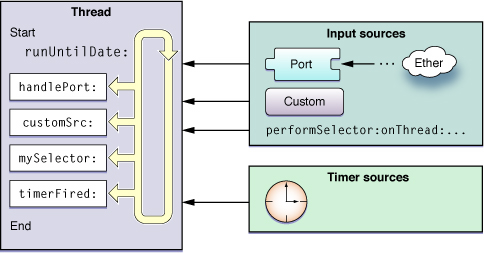
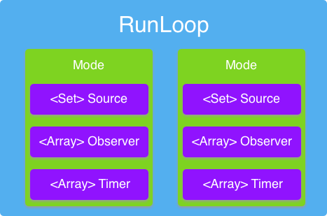
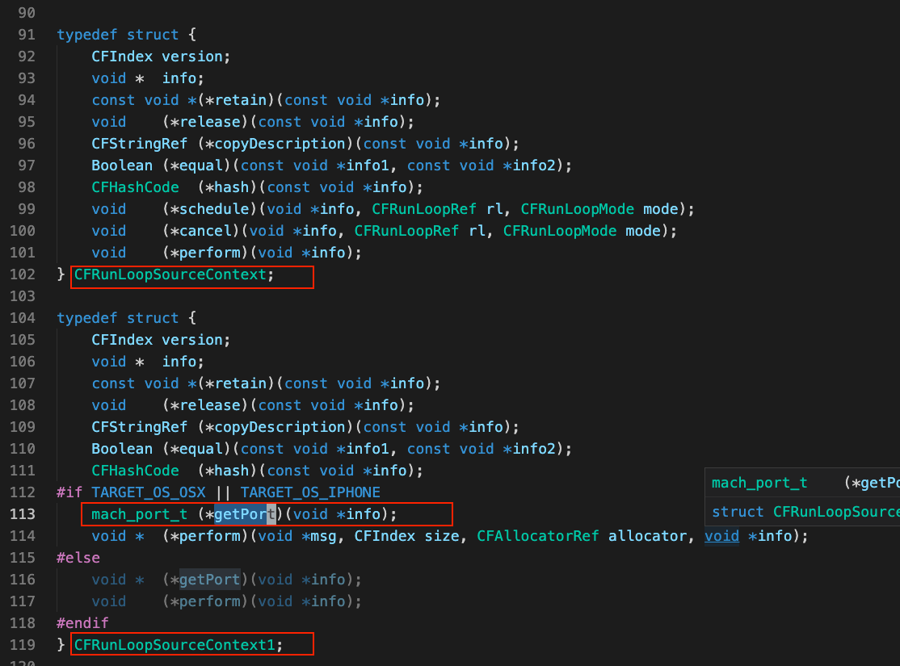
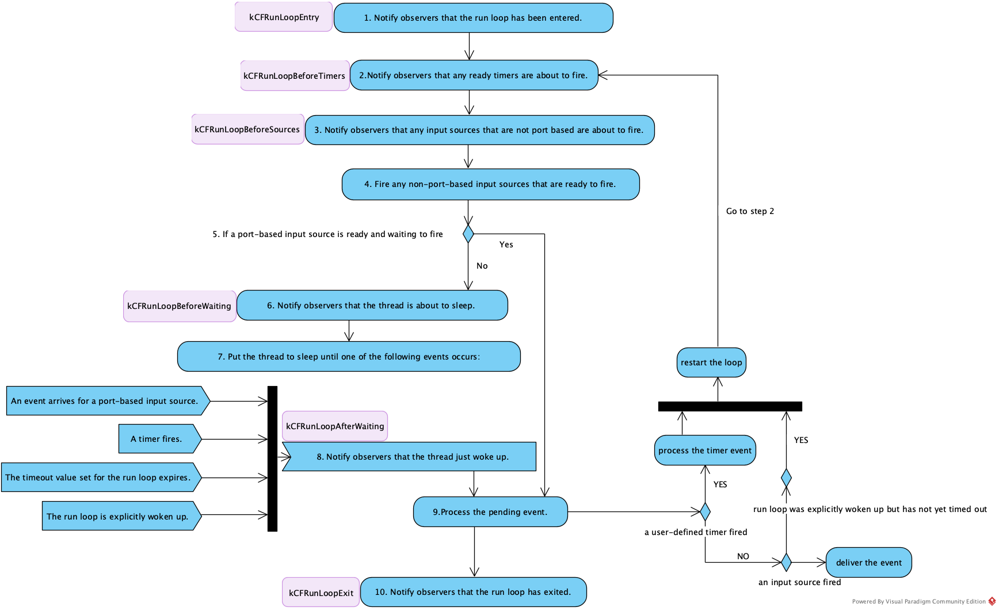

> 原文：[深入理解 CFRunLoop](https://suelan.github.io/2021/02/13/20210213-dive-into-runloop-ios/)

## 背景

有时，你可能希望在主线程上收集设备端性能指标，以了解 App 的表现，并帮助你找到更多线索来分析性能问题。[MetricKit](https://suelan.github.io/2021/02/13/20210213-dive-into-runloop-ios/MetricKit) 是一个实用的工具框架，可以实现这一目标。它在首次被调用后开始为你的 App 累积报告，并且每天最多递送一次报告。报告包含过去 24 小时的指标以及之前任何未递送的每日报告。然后，你可以前往 `Xcode->Organizer->Metric` 面板查看这些信息。然而，你可能希望自己的内部 App 性能监控框架在何时收集指标、如何上传或收集什么内容方面拥有更多控制权。早些时候，`Tencent` 发布了一个名为 [matrix](https://github.com/Tencent/matrix) 的 iOS 框架来监控 App 性能指标。在探索这个库时，我看到他们使用 `CFRunLoop` 来检测线程（如主线程）中的卡顿（hitch）。这引起了我的兴趣。因此，我深入研究了 `CFRunLoop` 以了解更多。

## iOS 中的 RunLoop 是什么？

在讨论 iOS 中的 RunLoop 之前，我们可能需要先了解一些关于事件循环（event loop）和线程（thread）的知识。在 1967 年的 [OS/360 多道程序设计与可变任务数量系统](https://en.wikipedia.org/wiki/OS/360_and_successors#MVT)（MVT）中，线程以“任务（task）”的名称早期出现。计算机科学中的**线程**是_执行线程_的简称。一旦一个线程中的任务全部完成，该线程就结束工作并退出。有时，我们需要一种方式来保持线程存活并处理事件。于是，事件循环应运而生。事件循环的伪代码如下：

```js
function loop
    initialize()
    while message != quit
        message := get_next_message()
        process_message(message)
    end while
end function
```

在维基百科中，事件循环是一种编程结构或[设计模式](https://en.wikipedia.org/wiki/Software_design_pattern)，它在[程序](https://en.wikipedia.org/wiki/Computer_program)中等待并分发[事件](https://en.wikipedia.org/wiki/Event-driven_programming)或[消息](https://en.wikipedia.org/wiki/Message_Passing_Interface)。在这个事件循环中，它持续执行 `等待事件 -> 接收事件 -> 处理事件`，直到满足退出条件。

> 运行循环（run loop）是与线程相关的基础设施的一部分。运行循环是一个事件处理循环，你用它来调度工作并协调传入事件的接收。运行循环的目的是在有工作时让线程保持忙碌，在没有工作时让线程进入休眠。

> CFRunLoop 对象监视任务的输入源（source），并在这些输入源准备好处理时调度控制。

一个运行循环从两种不同类型的源接收事件。`输入源（Input source）`递送异步事件，通常是来自另一个线程或不同应用程序的消息。`定时器源（Timer source）`递送同步事件，这些事件在预定的时间或重复间隔触发。

它可以处理：

- 用户输入设备
- 端口对象
- 网络连接
- 周期性或延时事件
- 异步回调

  

根据 Apple 文档，这种事件循环在底层由 `CFRunLoop` 实现。在 Cocoa 中，该对象是 `NSRunLoop` 的一个实例。每个线程恰好有一个运行循环。

Apple 提供了两个 API 来获取运行循环对象：

- `CFRunLoopGetMain()` // 主 CFRunLoop 对象
- `CFRunLoopGetCurrent()` // 当前线程的 CFRunLoop 对象

## RunLoop 模式

> 运行循环模式（run loop mode）是一组要监视的输入源和定时器，以及一组要通知的运行循环观察者（observer）。每次运行运行循环时，你需要指定（显式或隐式）一个特定的“模式”来运行。在该次运行循环中，只有与该模式关联的源才会被监视并被允许递送它们的事件。 — [文档](https://developer.apple.com/library/archive/documentation/Cocoa/Conceptual/Multithreading/RunLoopManagement/RunLoopManagement.html#//apple_ref/doc/uid/10000057i-CH16-SW23)

一个运行循环模式包含一组 `CFRunLoopSource`、一个 `CFRunLoopTimer` 列表和 `CFRunLoopObserver` 列表。这些都是运行循环的输入。



## 输入

运行循环可以监视三种输入：

- CFRunLoopSource
- CFRunLoopTimer
- CFRunLoopObserver

### 输入源 - CFRunLoopSource

[CFRunLoopSource](https://developer.apple.com/documentation/corefoundation/cfrunloopsource-rhr)

> CFRunLoopSource 对象是一种输入源的抽象，它可以被放入运行循环中。输入源通常生成异步事件，例如到达网络端口的消息或用户执行的操作。

```c++
struct __CFRunLoopSource {
    CFRuntimeBase _base;
    uint32_t _bits;
    pthread_mutex_t _lock;
    CFIndex _order;			/* immutable */
    CFMutableBagRef _runLoops;
    union {
	      CFRunLoopSourceContext version0;	/* immutable, except invalidation */
        CFRunLoopSourceContext1 version1;	/* immutable, except invalidation */
    } _context;
};
```

`_context` 是一个 `union` 类型。联合（union）看起来像结构体，但它只会为其定义中的某一个字段分配内存空间。因此 `_context` 要么是 `CFRunLoopSourceContext` 结构体，要么是 `CFRunLoopSourceContext1` 结构体。

#### 输入源的两个类别

正如[这篇文档](https://developer.apple.com/library/archive/documentation/Cocoa/Conceptual/Multithreading/RunLoopManagement/RunLoopManagement.html#//apple_ref/doc/uid/10000057i-CH16-SW23)中提到的，我们主要关心两个类别：`基于端口（port-base）`的输入源，即 source1；以及`非基于端口（non-port-based）`的输入源，即 source0，也称为自定义源。

- 版本 0 源，之所以这样命名是因为其上下文（context）结构的 `version` 字段为 0，由`应用程序`手动管理。
    - 当一个源准备好触发时，`应用程序`的某部分代码（可能是等待事件的单独`线程`上的代码）必须调用 [`CFRunLoopSourceSignal(_:)`](https://developer.apple.com/documentation/corefoundation/1543700-cfrunloopsourcesignal) 来告诉运行循环该源已准备好触发。
    - 自定义输入源，允许你在任何线程上执行选择器（selector）。例如 `performSelectorOnMainThread:withObject:waitUntilDone:`、`performSelector:withObject:afterDelay:`。查看更多
    - [定义自定义输入源](https://developer.apple.com/library/archive/documentation/Cocoa/Conceptual/Multithreading/RunLoopManagement/RunLoopManagement.html#//apple_ref/doc/uid/10000057i-CH16-SW3)
- 版本 1 源由运行循环和内核管理。
    - 这些源使用 `Mach 端口` 来指示源何时准备好触发。
    - 当消息到达源的 Mach 端口时，该源会自动`由内核发送信号`。
    - 查看[配置基于端口的输入源](https://developer.apple.com/library/archive/documentation/Cocoa/Conceptual/Multithreading/RunLoopManagement/RunLoopManagement.html#//apple_ref/doc/uid/10000057i-CH16-131281)

      

#### `bits` 字段

`bits` 字段似乎用于标记 `CFRunLoopSourceRef` 的状态。

```c++
CF_INLINE Boolean __CFRunLoopSourceIsSignaled(CFRunLoopSourceRef rls) {
    return (Boolean)__CFBitfieldGetValue(rls->_bits, 1, 1);
}

CF_INLINE void __CFRunLoopSourceSetSignaled(CFRunLoopSourceRef rls) {
    __CFBitfieldSetValue(rls->_bits, 1, 1, 1);
}

CF_INLINE void __CFRunLoopSourceUnsetSignaled(CFRunLoopSourceRef rls) {
    __CFBitfieldSetValue(rls->_bits, 1, 1, 0);
}
```

[CFRunLoopSourceSignal](https://developer.apple.com/documentation/corefoundation/1543700-cfrunloopsourcesignal) 用于向`版本 0 源`发送信号，将其标记为已准备好触发。它实际上更新了 `CFRunLoopSourceRef` 结构体中的 `bits`。

```c++
void CFRunLoopSourceSignal(CFRunLoopSourceRef rls) {
    CHECK_FOR_FORK();
    __CFRunLoopSourceLock(rls);
    if (__CFIsValid(rls)) {
	__CFRunLoopSourceSetSignaled(rls);
    }
    __CFRunLoopSourceUnlock(rls);
}
```

### CFRunLoopTimer

除了 `CFRunLoopSource`，运行循环还有另一种输入：定时器源 `CFRunLoopTimer`，它代表一种专门的运行循环源，会在未来预设的时间触发。查看 [CFRunLoopTimer 文档](https://developer.apple.com/documentation/corefoundation/cfrunlooptimer-rhk)

定时器触发有两个条件：

- 该定时器被添加到的其中一个运行循环模式正在运行
- 定时器的触发时间已过

#### 定时器不是实时机制

1. 与输入源一样，定时器与运行循环的特定模式相关联。如果定时器不在运行循环当前监视的模式中，则在你以定时器支持的某个模式运行运行循环之前，它不会触发。
2. 如果定时器在运行循环正在执行处理程序例程（handler routine）时触发，定时器会等到下一次运行循环时才调用其处理程序例程。
3. 如果运行循环根本没有运行，定时器永远不会触发。

在 Cocoa 中，你可以使用以下类方法之一一次性创建和调度定时器：

```plaintext
scheduledTimerWithTimeInterval:target:selector:userInfo:repeats:
scheduledTimerWithTimeInterval:invocation:repeats:
```

你也可以创建 `NSTimer` 对象，然后使用 `NSRunLoop` 的 `addTimer:forMode:` 方法将其添加到运行循环中。
查看[如何在此处配置定时器源](https://developer.apple.com/library/archive/documentation/Cocoa/Conceptual/Multithreading/RunLoopManagement/RunLoopManagement.html#//apple_ref/doc/uid/10000057i-CH16-SW6)

### RunLoopObserver

#### 如何使用观察者

1. 我们可以使用这两个 API 来创建 RunLoopObserver 并将其与处理程序关联。

- CFRunLoopObserverCreate(_:_:_:_:_:_:)
- CFRunLoopObserverCreateWithHandler(_:_:_:_:_:)

1. 将观察者添加到运行循环中

  ```plaintext
    CFRunLoopObserverRef runloopObserver = CFRunLoopObserverCreateWithHandler(kCFAllocatorDefault, kCFRunLoopBeforeWaiting, YES, 0, ^(CFRunLoopObserverRef observer, CFRunLoopActivity activity) {
     // 在此编写处理程序代码
  });

    CFRunLoopAddObserver(CFRunLoopGetMain(), runloopObserver, kCFRunLoopDefaultMode);
  ```
2. 观察特定的 RunLoop Activity

## RunLoop 活动

> 在创建观察者时，使用 [`CFRunLoopObserverCreate`](https://developer.apple.com/documentation/corefoundation/1541546-cfrunloopobservercreate?language=objc) 选择观察者被调度的运行循环阶段（stage）。 -[文档](https://developer.apple.com/documentation/corefoundation/cfrunloopactivity?language=objc)

CFRunLoop 有几种 RunLoop Activity。你可以将运行循环观察者与这些 RunLoopActivity 关联起来。

```c
/* Run Loop Observer Activities */
typedef CF_OPTIONS(CFOptionFlags, CFRunLoopActivity) {
    kCFRunLoopEntry = (1UL << 0), // The entrance of the run loop, before entering the event processing loop. This activity occurs once for each call to CFRunLoopRun() and CFRunLoopRunInMode(_:_:_:).
    kCFRunLoopBeforeTimers = (1UL << 1), // Inside the event processing loop before any timers are processed.
    kCFRunLoopBeforeSources = (1UL << 2), // Inside the event processing loop before any sources are processed.
    kCFRunLoopBeforeWaiting = (1UL << 5),
    kCFRunLoopAfterWaiting = (1UL << 6),  // Inside the event processing loop after the run loop wakes up, but before processing the event that woke it up. This activity occurs only if the run loop did in fact go to sleep during the current loop.
    kCFRunLoopExit = (1UL << 7), // The exit of the run loop, after exiting the event processing loop. This activity occurs once for each call to CFRunLoopRun() and CFRunLoopRunInMode(_:_:_:).
    kCFRunLoopAllActivities = 0x0FFFFFFFU
};
```

[https://developer.apple.com/documentation/corefoundation/cfrunloopactivity](https://developer.apple.com/documentation/corefoundation/cfrunloopactivity)

### 运行循环的事件序列

根据 [Apple 文档](https://developer.apple.com/library/archive/documentation/Cocoa/Conceptual/Multithreading/RunLoopManagement/RunLoopManagement.html#//apple_ref/doc/uid/10000057i-CH16-SW1)，当运行循环在线程中运行时，它会处理待处理事件并为附加的观察者生成通知。简而言之，其工作原理如下图所示。



该实现位于 `CFRunloop.c` 的 `CFRunLoopRunSpecific` 和 `__CFRunLoopRun` 中。

## 使用案例

### 检测主线程中的卡顿（hitch）阻塞

在 [Tencent matrix](https://github.com/Tencent/matrix) 中，它利用运行循环通知来记录这些通知发送时的时间戳。

1. 创建 RunLoopObserver 并将其添加到当前运行循环 [CFRunLoopAddObserver](https://github.com/Tencent/matrix/blob/c7fd99237af189fb060f90d1272350db19182dbf/matrix/matrix-iOS/Matrix/WCCrashBlockMonitor/CrashBlockPlugin/Main/BlockMonitor/WCBlockMonitorMgr.mm#L831)
2. 在观察者运行时触发的回调函数中[记录时间戳](https://github.com/Tencent/matrix/blob/c7fd99237af189fb060f90d1272350db19182dbf/matrix/matrix-iOS/Matrix/WCCrashBlockMonitor/CrashBlockPlugin/Main/BlockMonitor/WCBlockMonitorMgr.mm#L858)
3. 启动一个[监控线程](https://github.com/Tencent/matrix/blob/c7fd99237af189fb060f90d1272350db19182dbf/matrix/matrix-iOS/Matrix/WCCrashBlockMonitor/CrashBlockPlugin/Main/BlockMonitor/WCBlockMonitorMgr.mm#L478)，然后[定期检查](https://github.com/Tencent/matrix/blob/c7fd99237af189fb060f90d1272350db19182dbf/matrix/matrix-iOS/Matrix/WCCrashBlockMonitor/CrashBlockPlugin/Main/BlockMonitor/WCBlockMonitorMgr.mm#L498)
4. 获取[时间戳差值](https://github.com/Tencent/matrix/blob/c7fd99237af189fb060f90d1272350db19182dbf/matrix/matrix-iOS/Matrix/WCCrashBlockMonitor/CrashBlockPlugin/Main/BlockMonitor/WCBlockMonitorMgr.mm#L612)，判断其是否大于阈值，[g_RunLoopTimeOut](https://github.com/Tencent/matrix/blob/c7fd99237af189fb060f90d1272350db19182dbf/matrix/matrix-iOS/Matrix/WCCrashBlockMonitor/CrashBlockPlugin/Main/BlockMonitor/WCBlockMonitorMgr.mm#L630)

我做了一个小实验来更好地理解它。我在主线程的运行循环中添加了一个 RunLoop Observer。然后计算连续两次循环中 `kCFRunLoopBeforeTimers` 通知之间的时间间隔。

```c++
// 1. 创建运行循环观察者
CFRunLoopObserverRef beginObserver = CFRunLoopObserverCreate(kCFAllocatorDefault, kCFRunLoopAllActivities, YES, LONG_MIN, &myRunLoopCallback, &context);
// 2. 将观察者添加到主线程的运行循环中
CFRunLoopAddObserver([[NSRunLoop mainRunLoop] getCFRunLoop], beginObserver, kCFRunLoopCommonModes);
```

```c++
// 3. 实现运行循环观察者的回调
static void myRunLoopCallback(CFRunLoopObserverRef observer, CFRunLoopActivity activity, void *info)
{
     switch (activity) {
        case kCFRunLoopEntry:
             self.isRunloopRunning = YES;
             break;
        case kCFRunLoopBeforeTimers:
             NSLog(@"[RY]kCFRunLoopBeforeTimers called %@", @(getCurrentMilliTimestamp() - monitor.runloopMilliTimestamp));
             self.runloopMilliTimestamp = getCurrentMilliTimestamp();
             self.isRunloopRunning = YES;
             break;
        case kCFRunLoopBeforeSources:
             self.isRunloopRunning = YES;
             break;
        case kCFRunLoopBeforeWaiting:
             self.isRunloopRunning = NO;
             break;
        case kCFRunLoopAfterWaiting:
             self.isRunloopRunning = YES;
             break;
        case kCFRunLoopExit:
             self.isRunloopRunning = NO;
             break;b
        default:
            break;
    }
}
```

理论上，连续两次 `kCFRunLoopBeforeTimers` 通知之间的时间差应该在 `16.67ms` 以内，才能在主线程上获得流畅的用户体验，这意味着 `RunLoop` 每秒运行 60 次。在下面的日志中，一帧（frame）执行耗时约 `72ms`。
然而，由于我将日志记录放在了 `kCFRunLoopBeforeTimers` 中，这可能并不是一个卡顿。它可能是因为没有事件到来时线程处于休眠状态所导致的。

```plaintext
 [RY]kCFRunLoopBeforeTimers called 3.628173828125
 [RY]kCFRunLoopBeforeTimers called 17.784912109375
 [RY]kCFRunLoopBeforeTimers called 0.041015625
 [RY]kCFRunLoopBeforeTimers called 1.23388671875
 [RY]kCFRunLoopBeforeTimers called 72.05419921875
 [RY]kCFRunLoopBeforeTimers called 5.138916015625
 [RY]kCFRunLoopBeforeTimers called 0.072021484375
ers called 1.296875
 [RY]kCFRunLoopBeforeTimers called 0.070068359375
 [RY]kCFRunLoopBeforeTimers called 0.035888671875
 [RY]kCFRunLoopBeforeTimers called 0.051025390625
 [RY]kCFRunLoopBeforeTimers called 0.057861328125
 [RY]kCFRunLoopBeforeTimers called 0.01806640625
 [RY]kCFRunLoopBeforeTimers called 0.260009765625
 [RY]kCFRunLoopBeforeTimers called 0.03515625
 [RY]kCFRunLoopBeforeTimers called 0.43212890625
```

### React Native 中的 RunLoop

#### 使 JSThread 长期存活

- [创建 JSThread](https://github.com/facebook/react-native/blob/1bc06f18c613f9a85d5b631493a09682524016f2/React/CxxBridge/RCTCxxBridge.mm#L407)，名为 `com.facebook.react.JavaScript`。在 React Native 中，这是主线程之外的一个辅助线程，JavaScript 代码在此运行，对原生实现的函数调用也在这里进行。
- [在 JSThread 中显式运行运行循环](https://github.com/facebook/react-native/blob/1bc06f18c613f9a85d5b631493a09682524016f2/React/CxxBridge/RCTCxxBridge.mm#L326)以使其长期存活

#### 在给定的运行循环上入队一个 block 对象

- [使用 `CFRunLoopPerformBlock` 将一个 block 入队到当前运行循环的 `kCFRunLoopCommonModes` 模式中](https://github.com/facebook/react-native/blob/1bc06f18c613f9a85d5b631493a09682524016f2/React/CxxBridge/RCTMessageThread.mm#L41)。此函数类似于 [Cocoa 的 performSelector:onThread:withObject:waitUntilDone:](https://developer.apple.com/documentation/objectivec/nsobject/1414476-performselector?language=objc)
- [唤醒运行循环。当运行循环在 `kCFRunLoopCommonModes` 模式下运行时，该 block 将被执行](https://github.com/facebook/react-native/blob/1bc06f18c613f9a85d5b631493a09682524016f2/React/CxxBridge/RCTMessageThread.mm#L48)

## 扩展阅读

- [https://developer.apple.com/library/archive/documentation/Cocoa/Conceptual/Multithreading/RunLoopManagement/RunLoopManagement.html#//apple_ref/doc/uid/10000057i-CH16-SW1](https://developer.apple.com/library/archive/documentation/Cocoa/Conceptual/Multithreading/RunLoopManagement/RunLoopManagement.html#//apple_ref/doc/uid/10000057i-CH16-SW1)
- [https://blog.ibireme.com/2015/05/18/runloop/](https://blog.ibireme.com/2015/05/18/runloop/)
- [https://opensource.apple.com/tarballs/CF/](https://opensource.apple.com/tarballs/CF/)
- [https://developer.apple.com/documentation/corefoundation](https://developer.apple.com/documentation/corefoundation)
- [https://github.com/apple/swift-corelibs-foundation/](https://github.com/apple/swift-corelibs-foundation/)

标签： [热门文章](https://suelan.github.io/tags#Popular Article)

[←  React Native 中 Image Loader 和 Cache 的工作原理](https://suelan.github.io/2020/12/24/20201224-How-Image-Loader-and-Cache-work-in-React-Native/) [在 React Native 中确保 JS Bundle 以空字符结尾  →](https://suelan.github.io/2021/02/13/20210213-ensure-null-terminated-string/)

扫描二维码并分享这篇文章
