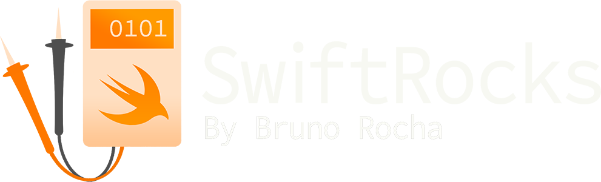
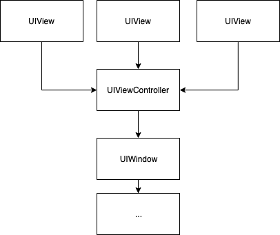

> 原文：[iOS Responder Chain: UIResponder, UIEvent, UIControl and uses](https://swiftrocks.com/understanding-the-ios-responder-chain)

[](https://swiftrocks.com)

[博客](https://swiftrocks.com/blog)

[关于](https://swiftrocks.com/about)

[演讲](https://swiftrocks.com/talks)

[项目](https://swiftrocks.com/projects)

[书籍推荐](https://swiftrocks.com/software-engineering-book-recommendations)

[游戏推荐](https://swiftrocks.com/games)

[博客](https://swiftrocks.com/blog)

[关于](https://swiftrocks.com/about)

[演讲](https://swiftrocks.com/talks)

[项目](https://swiftrocks.com/projects)

[书籍推荐](https://swiftrocks.com/software-engineering-book-recommendations)

[游戏推荐](https://swiftrocks.com/games)

iOS 响应者链：UIResponder、UIEvent、UIControl 及其用途

# iOS 响应者链：UIResponder、UIEvent、UIControl 及其用途

发布于 2019 年 3 月 1 日

_当我在处理 UITextField 时，这个“第一响应者”到底是什么东西？__为什么 UIView 要继承像 UIResponder 这样的类？__这有什么意义？_

在 iOS 中，**响应者链（Responder Chain）** 是 UIKit 生成的一个由 `UIResponder` 对象组成的链表，它是 iOS 中所有事件（例如触摸和运动）的基础。

响应者链是你在 iOS 开发中经常打交道的东西，虽然除了 `UITextField` 键盘相关操作之外，你很少需要直接处理它，但了解其工作原理可以让你用非常简单/创意的方式解决与事件相关的问题——你甚至可以构建依赖响应者链的架构。

## UIResponder、UIEvent 和 UIControl

简单来说，`UIResponder` 的实例代表了能够处理并响应任意事件的对象。iOS 中的许多东西都是 `UIResponder`，包括 `UIView`、`UIViewController`、`UIWindow`、`UIApplication` 和 `UIApplicationDelegate`。

相应地，一个 `UIEvent` 代表一个单一的 UIKit 事件，它包含一个类型（触摸、运动、远程控制和按压）和一个可选的子类型（如特定的设备运动晃动）。当检测到屏幕触摸等系统事件时，UIKit 会在内部创建 `UIEvent` 实例，并通过调用 `UIApplication.shared.sendEvent()` 将其分派到系统事件队列。当事件从队列中取出时，UIKit 会在内部确定能够处理该事件的第一个 `UIResponder`，并将其发送给选中的那个。选择过程因事件类型而异——触摸事件直接发送到被触摸的视图本身，而其他类型的事件则会被分派给所谓的**第一响应者（first responder）**。

为了处理系统事件，`UIResponder` 的子类可以通过重写特定事件类型的方法，将自己注册为能够处理特定 `UIEvent` 类型的对象：

```
open func touchesBegan(_ touches: Set<UITouch>, with event: UIEvent?)
open func touchesMoved(_ touches: Set<UITouch>, with event: UIEvent?)
open func touchesEnded(_ touches: Set<UITouch>, with event: UIEvent?)
open func touchesCancelled(_ touches: Set<UITouch>, with event: UIEvent?)
open func pressesBegan(_ presses: Set<UIPress>, with event: UIPressesEvent?)
open func pressesChanged(_ presses: Set<UIPress>, with event: UIPressesEvent?)
open func pressesEnded(_ presses: Set<UIPress>, with event: UIPressesEvent?)
open func pressesCancelled(_ presses: Set<UIPress>, with event: UIPressesEvent?)
open func motionBegan(_ motion: UIEvent.EventSubtype, with event: UIEvent?)
open func motionEnded(_ motion: UIEvent.EventSubtype, with event: UIEvent?)
open func motionCancelled(_ motion: UIEvent.EventSubtype, with event: UIEvent?)
open func remoteControlReceived(with event: UIEvent?)
```

在某种程度上，你可以将 `UIEvent` 看作增强版的“通知（Notification）”。但是，尽管 `UIEvent` 可以被继承，并且 `sendEvent` 可以被手动调用，但它们实际上并不打算让你随意玩弄——至少不能通过常规方式。因为你无法创建自定义类型，分派自定义事件是有问题的，因为你的事件很可能被非预期的响应者错误地“处理”。不过，还是有办法使用它们——除了系统事件，`UIResponder` 还可以以 `Selector` 的形式响应任意的“动作（action）”。

这种能力是为了给 macOS App 提供一种简单的方式来响应“菜单”操作（如选择、复制、粘贴）而创建的，因为在 macOS 中存在多个窗口，简单的委托（delegate）模式很难适用。无论如何，它们在 iOS 上也可用，并可用于自定义动作——这正是 `UIButton` 之类的 `UIControl` 在被触摸后能够分派动作的方式。考虑下面的按钮：

```
let button = UIButton(type: .system)
button.addTarget(myView, action: #selector(myMethod), for: .touchUpInside)
```

尽管 `UIResponder` 可以完全检测触摸事件，但处理它们并非易事。如何区分不同类型的触摸？

这就是 `UIControl` 擅长的领域——这些 `UIView` 的子类抽象了处理触摸事件的过程，并提供了将动作分配给特定触摸事件的能力。

在内部，触摸这个按钮会导致以下过程：

```
let event = UIEvent(...) //An UIKit-generated touch event containing the touch position and properties.
// 分派一个触摸事件。
// 通过 `hitTest()`，确定哪个 UIView 被“选中”。
// 因为选中了一个 UIControl，所以直接调用它的 target：
UIApplication.shared.sendAction(#selector(myMethod), to: myView, from: button, for: event)
```

当向 `sendAction` 传递了特定的 target 时，UIKit 会直接尝试在目标对象上调用所需的 `selector`（如果该对象没有实现，App 会崩溃）——但如果 target 是 `nil` 会怎样？

```
final class MyViewController: UIViewController {
    @objc func myCustomMethod() {
        print("SwiftRocks!")
    }

    func viewDidLoad() {
        UIApplication.shared.sendAction(#selector(myCustomMethod), to: nil, from: view, for: nil)
    }
}
```

如果你运行这段代码，你会看到，即使这个动作是从一个普通的 `UIView` 发送的，且没有指定 target，`MyViewController` 的 `myCustomMethod` 仍然会被触发！

当没有指定 target 时，UIKit 会像前面的普通 `UIEvent` 示例一样，搜索能够处理此动作的 `UIResponder`。在这种情况下，能够处理动作与下面的 `UIResponder` 方法有关：

```
open func canPerformAction(_ action: Selector, withSender sender: Any?) -> Bool
```

默认情况下，这个方法只是检查响应者是否实现了实际的方法。“实现”方法可以通过三种方式，取决于你想要多少信息（这适用于 iOS 中任何原生的 action/target 组件！）：

```
func myCustomMethod()
func myCustomMethod(sender: Any?)
func myCustomMethod(sender: Any?, event: UIEvent?)
```

现在，如果响应者没有实现这个方法呢？在这种情况下，UIKit 会使用以下 `UIResponder` 方法来决定如何处理：

```
open func target(forAction action: Selector, withSender sender: Any?) -> Any?
```

默认情况下，这会返回**另一个** `UIResponder`，这个响应者**可能能够也可能不能够**处理所需的动作。这个过程会重复，直到动作被处理，或者 App 没有更多的选择。但是，响应者是如何知道将动作路由给谁的呢？

## 响应者链

正如开头提到的，UIKit 通过动态管理一个 `UIResponder` 的链表来处理这个问题。所谓的**第一响应者**就是链表中的根元素，如果某个响应者不能处理特定的动作/事件，该动作就会被递归地发送给链表中的下一个响应者，直到某个响应者能够处理该动作，或者链表结束。

虽然在 `UIWindow` 中检查实际的“第一响应者”被一个私有的 `firstResponder` 属性保护，但你可以通过检查 `next` 属性来查询任何给定响应者的响应者链：

```
extension UIResponder {
    func responderChain() -> String {
        guard let next = next else {
            return String(describing: self)
        }
        return String(describing: self) + " -> " + next.responderChain()
    }
}

myViewController.view.responderChain()
// MyView -> MyViewController -> UIWindow -> UIApplication -> AppDelegate
```



在之前的例子中，动作由 `UIViewController` 处理，UIKit 首先将动作发送给 `UIView` 这个第一响应者——但由于它没有实现 `myCustomMethod`，视图将动作转发给了下一个响应者——`UIViewController`，而这个响应者恰好实现了那个方法。

虽然在大多数情况下，响应者链只是子视图的顺序，但你可以自定义它来改变通用流程顺序。除了可以重写 `next` 属性使其返回其他内容，你还可以通过调用 `becomeFirstResponder()` 强制一个 `UIResponder` 成为第一响应者，并通过调用 `resignFirstResponder()` 让它在链中恢复原位。这通常与 `UITextField` 一起使用来显示键盘——`UIResponder` 可以定义一个可选的 `inputView` 属性，该属性仅在响应者是第一响应者时显示，此时指的就是键盘。

## 响应者链的自定义用途

虽然响应者链完全由 UIKit 处理，但你可以利用它来解决通信/委托问题。

在某种程度上，你可以将 `UIResponder` 的动作视为一次性通知。考虑一个 App，其中几乎每个视图都支持一个“闪烁”动作，用于帮助用户在教程中进行导航。如何确保当这个动作被触发时，只有当前“活跃”的视图闪烁？可能的解决方案包括让每个视图都继承一个委托，或者使用一个普通的通知，但所有人都需要忽略它，除了 `"currentActiveView"`。然而，响应者动作允许你干净利落地实现这一点，无需任何委托，且编码量极小：

```
final class BlinkableView: UIView {
    override var canBecomeFirstResponder: Bool {
        return true
    }

    func select() {
        becomeFirstResponder()
    }

    @objc func performBlinkAction() {
        //闪烁动画
    }
}

UIApplication.shared.sendAction(#selector(BlinkableView.performBlinkAction), to: nil, from: nil, for: nil)
//将精确地闪烁最后一个调用了 select() 的 BlinkableView。
```

这的工作原理很像常规的通知，区别在于，通知会触发所有注册了它的对象，而这里的实现会高效地遍历响应者链，并在找到第一个 BlinkableView 时停止。

如前所述，甚至可以基于此构建架构。以下是一个 Coordinator 结构的骨架，它定义了一种自定义的事件类型，并将自己注入到响应者链中：

```
final class PushScreenEvent: UIEvent {

    let viewController: CoordenableViewController

    override var type: UIEvent.EventType {
        return .touches
    }

    init(viewController: CoordenableViewController) {
        self.viewController = viewController
    }
}

final class Coordinator: UIResponder {

    weak var viewController: CoordenableViewController?

    override var next: UIResponder? {
        return viewController?.originalNextResponder
    }

    @objc func pushNewScreen(sender: Any?, event: PushScreenEvent) {
        let new = event.viewController
        viewController?.navigationController?.pushViewController(new, animated: true)
    }
}

class CoordenableViewController: UIViewController {

    override var canBecomeFirstResponder: Bool {
        return true
    }

    private(set) var coordinator: Coordinator?
    private(set) var originalNextResponder: UIResponder?

    override var next: UIResponder? {
        return coordinator ?? super.next
    }

    override func viewDidAppear(_ animated: Bool) {
        //在 viewDidAppear 中填充信息，以确保 UIKit
        //已配置好此视图的 next 响应者。
        super.viewDidAppear(animated)
        guard coordinator == nil else {
            return
        }
        originalNextResponder = next
        coordinator = Coordinator()
        coordinator?.viewController = self
    }
}

final class MyViewController: CoordenableViewController {
    //...
}

//从 App 中的任何位置：

let newVC = NewViewController()
UIApplication.shared.push(vc: newVC)
```

其工作原理是，每个 `CoordenableViewController` 持有对它的原始下一个响应者（即窗口）的引用，但重写了 `next` 属性，使其指向 `Coordinator`，而 `Coordinator` 又将窗口作为它的下一个响应者。

```
// MyView -> MyViewController -> **Coordinator** -> UIWindow -> UIApplication -> AppDelegate
```

这使得 `Coordinator` 能够接收系统事件，并且通过定义一个包含新视图控制器信息的新的 `PushScreenEvent`，我们可以分派一个 `pushNewScreen` 动作，并由这些 `Coordinator` 来处理，以推送新的屏幕。

有了这个结构，就可以从 App 中的**任何位置**调用 `UIApplication.shared.push(vc: newVC)`，而不需要任何一个委托或单例，因为 UIKit 会确保只有当前的 `Coordinator` 被通知到这个动作——这都要归功于响应者链。

这里展示的例子非常理论化，但我希望这能帮助你理解响应者链的用途和作用。

欢迎关注我的 Twitter - [@rockbruno_](https://twitter.com/rockbruno_)，如果你有任何建议或更正想要分享，请告诉我。

## 参考和延伸阅读

[使用响应者和响应者链处理事件](https://developer.apple.com/documentation/uikit/touches_presses_and_gestures/using_responders_and_the_responder_chain_to_handle_events)
[UIResponder](https://developer.apple.com/documentation/uikit/uiresponder)
[UIEvent](https://developer.apple.com/documentation/uikit/uievent)
[UIControl](https://developer.apple.com/documentation/uikit/uievent)

[https://swiftrocks.com/rss.xml](https://swiftrocks.com/rss.xml) [https://hachyderm.io/@rockbruno](https://hachyderm.io/@rockbruno) [https://twitter.com/rockbruno_](https://twitter.com/rockbruno_) [https://github.com/rockbruno](https://github.com/rockbruno)

© 2026 Bruno Rocha

[首页](https://swiftrocks.com) / [查看所有文章](https://swiftrocks.com/blog)

本博客从未使用任何人工智能。从 HTML 到 CSS 的一切都是由我亲手制作的。
