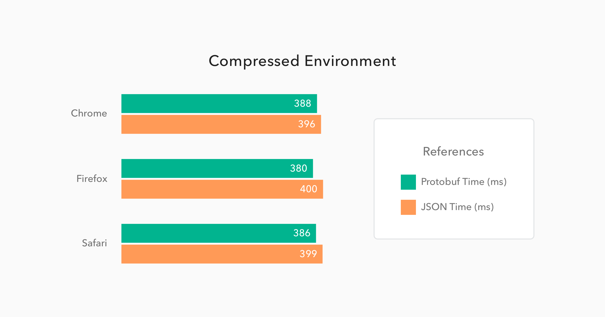
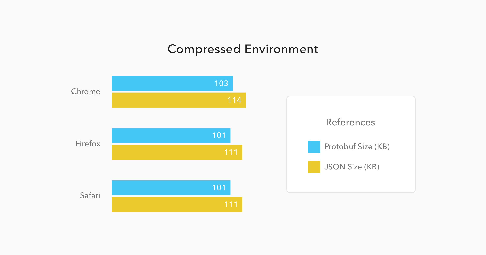
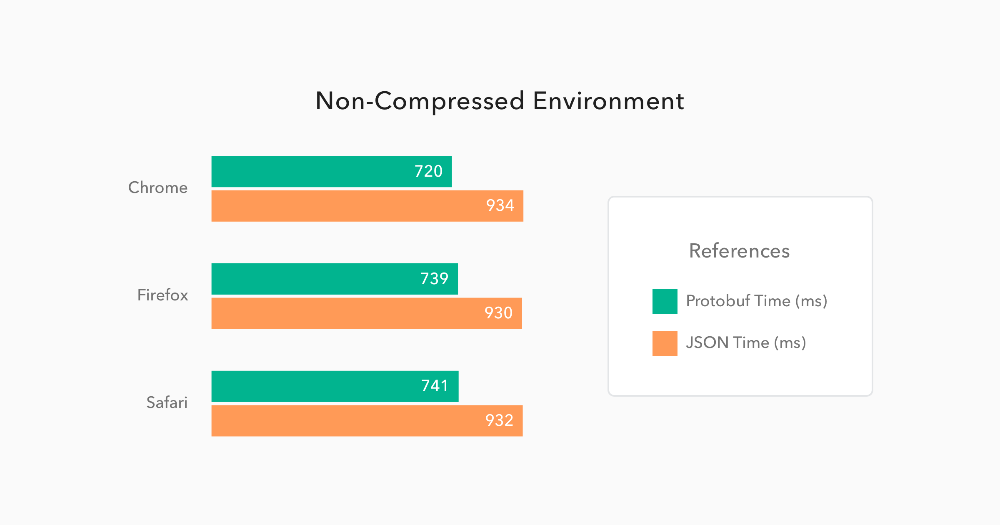
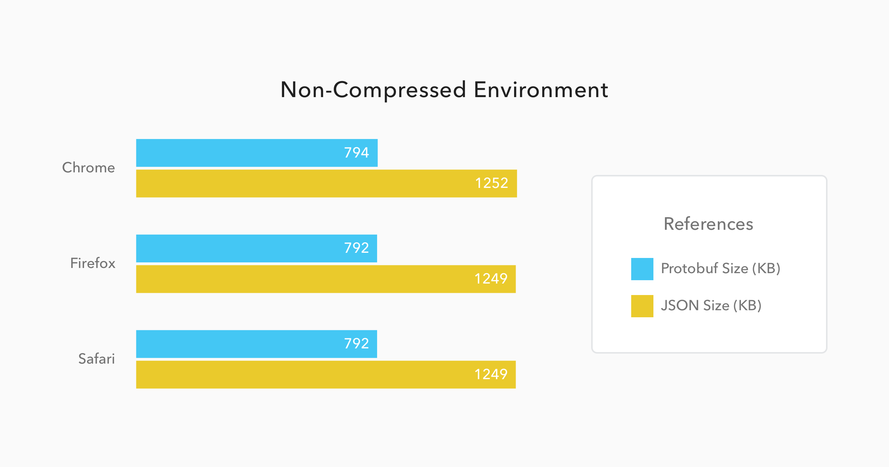
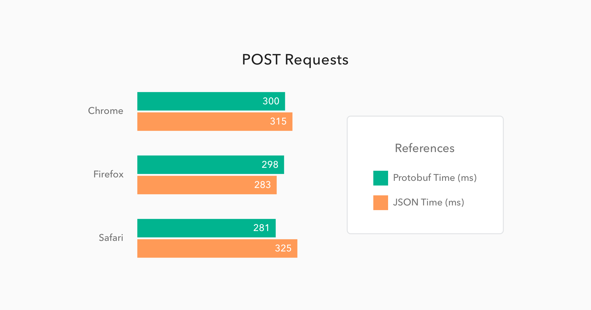
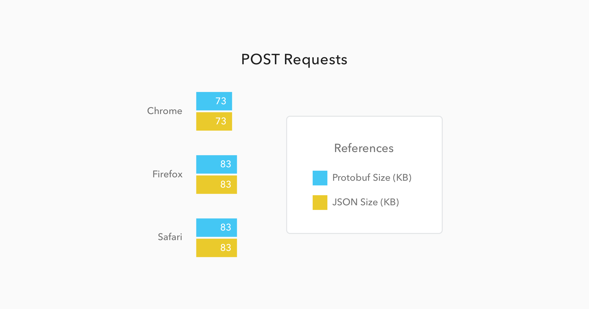
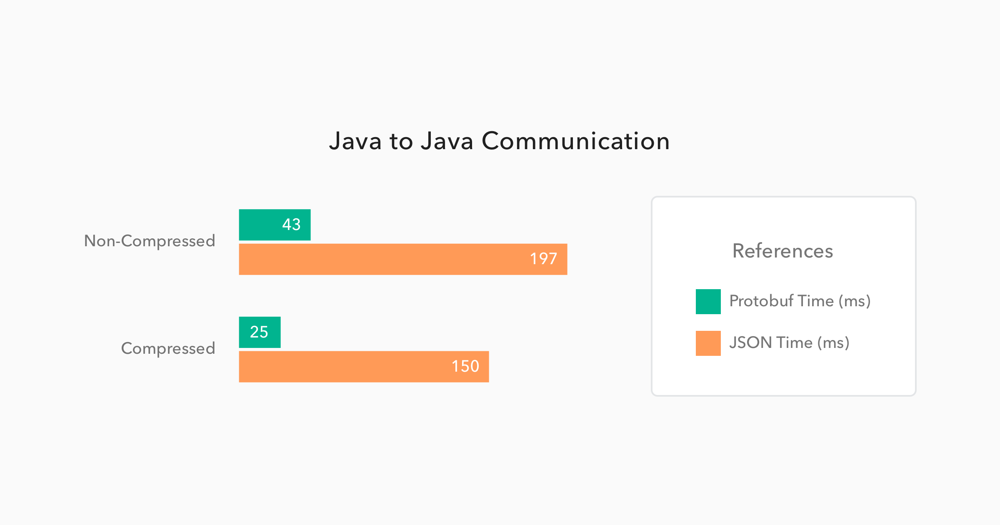
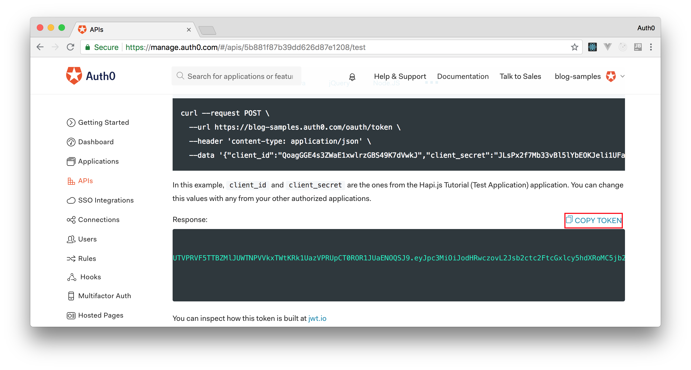

> 原文：[Beating JSON performance with Protobuf](https://auth0.com/blog/beating-json-performance-with-protobuf/)

**TL;DR**

Protocol buffers, or Protobuf, is a binary format created by Google to serialize data between different services. Google made this protocol open source and now it provides support, out of the box, to the most common languages, like JavaScript, Java, C#, Ruby and others. In our tests, it was demonstrated that this protocol performed up to **6 times faster** than JSON.

> “Protobuf performs up to 6 times faster than JSON.”
> 
> [Tweet This](https://twitter.com/intent/tweet?text="Protobuf%20performs%20up%20to%206%20times%20faster%20than%20JSON." via @auth0 https://auth0.com/blog/beating-json-performance-with-protobuf)

## What is Protobuf

[Protocol buffers](https://developers.google.com/protocol-buffers/docs/overview), usually referred as Protobuf, is a protocol developed by Google to allow serialization and deserialization of structured data. Google developed it with the goal to provide a better way, compared to XML, to make systems communicate. So they focused on making it simpler, smaller, faster and more maintainable then XML. But, as you will see in this article, this protocol even surpassed JSON with better performance, better maintainability and smaller size.

### How Does it Differs from JSON?

It is important to note that, although [JSON](http://www.json.org/) and [Protobuf](https://developers.google.com/protocol-buffers/docs/overview) messages can be used interchangeably, these technologies were designed with different goals. JSON, which stands for JavaScript Object Notation, is simply a message format that arose from a subset of the JavaScript programming language. JSON messages are exchanged in text format and, nowadays, they are completely independent and supported by, virtually, all programming languages.

Protobuf, on the other hand, is more than a message format, it is also a set of rules and tools to define and exchange these messages. Google, the creator of this protocol, has made it open source and provides tools to generate code for the most used programming languages around, like [JavaScript](https://developers.google.com/protocol-buffers/docs/reference/javascript-generated), [Java](https://developers.google.com/protocol-buffers/docs/javatutorial), [PHP](https://developers.google.com/protocol-buffers/docs/reference/php-generated), [C#](https://developers.google.com/protocol-buffers/docs/csharptutorial), [Ruby](https://developers.google.com/protocol-buffers/docs/reference/ruby-generated), [Objective C](https://developers.google.com/protocol-buffers/docs/reference/objective-c-generated), [Python](https://developers.google.com/protocol-buffers/docs/pythontutorial), [C++](https://developers.google.com/protocol-buffers/docs/cpptutorial) and [Go](https://developers.google.com/protocol-buffers/docs/gotutorial). Besides that, Protobuf has more data types than JSON, like enumerates and methods, and is also heavily used on [RPCs (Remote Procedure Calls)](https://github.com/grpc).

## Is Protobuf Really Faster than JSON?

There are several resources online that show that Protobuf performs better than JSON, XML and etc - like [this one](https://github.com/eishay/jvm-serializers/wiki) and [this one](https://maxondev.com/serialization-performance-comparison-c-net-formats-frameworks-xmldatacontractserializer-xmlserializer-binaryformatter-json-newtonsoft-servicestack-text/) -, but it is always important to check if this is the case for your own needs and use case. Here, at [Auth0](https://auth0.com/), I have developed a simple [Spring Boot application](https://github.com/brunokrebs/auth0-speed-test) to test a few scenarios and measure how JSON and Protobuf performed. Mostly I have tested serialization of both protocols to make two Java applications communicate and to make a JavaScript web application communicate to this backend.

> The main reason to create these two scenarios - Java to Java and JavaScript to Java - was to measure how this protocol would behave in an enterprise environment like Java and also on an environment where JSON is the native message format. That is, what I show here is data from an environment where JSON is built in and should perform extremely fast (JavaScript engines) and from an environment where JSON is not a first class citizen.

The short answer to the question is yes, Protobuf is faster than JSON. But this answer is not useful nor interesting without the data that I gathered on my experiments. Let's take a look at the details now.

### Test Sample

To support the measurements, I have created three Protobuf messages: `Address`, to hold just the street and number; `Person`, to hold the name, a collection of addresses, a collection of mobile numbers, and a collection of email addresses; `People`, to hold a collection of `Person` messages. These messages were assembled together in an application with four RESTful endpoints:

1. One that accepted `GET` requests and returned a list of 50 thousand people in Protobuf format.
2. Another one that accepted `GET` requests and returned the same list of 50 thousand people, but in JSON format.
3. A third one that accepted `POST` requests with any number of people in Protobuf format.
4. A fourth one that accepted `POST` requests with any number of people in JSON format.

### JavaScript to Java Communication

Since there are a lot of JavaScript engines available, it is valuable to see how the most popular of them behave with this set of data. So I decided to use the following browsers: [Chrome](https://www.google.com/chrome), as this is the most popular browser around and its JavaScript engine is also used by [Node.js](https://nodejs.org); [Firefox](https://www.mozilla.org/en-US/firefox/new/), as this is another very popular browser; and [Safari](https://www.apple.com/safari/), as this is the default browser on MacBooks and iPhones.

The following charts exposes the average performance, of these browsers, on 50 subsequent `GET` requests to both endpoints - the Protobuf and JSON endpoints. These 50 requests per endpoint were issued twice: first when running the Spring Boot application with compression turned on, and then when running the application with compression turned off. So, in the end, each browser requested 200 times all these 50 thousand people data.





As you can see in the charts above, the results for the **compressed environment** were quite similar for both Protobuf and JSON. Protobuf messages were **9% smaller** than JSON messages and they took only **4% less time** to be available to the JavaScript code. This can sound like nothing, but considering that Protobuf has to be converted from binary to JSON - JavaScript code uses JSON as its object literal format - it is amazing that Protobuf managed to be faster than its counterpart.

Now, when we have to deal with **non-compressed messages**, the results change quite a bit. Let's analyze the charts below:





On these situations, Protobuf performs even better when compared to JSON. Messages, on this format, were **34% smaller**, and they took **21% less time** to be available to the JavaScript code.

When issuing `POST` requests, the difference gets almost imperceptible as usually this kind of request doesn't deal with heavy messages. More frequent than not, these requests just handle the update of a few fields on a form or something similar. So, to make the test trustworthy, I issued 50 requests with just one `Person` message and a few properties, like emails addresses and mobiles, on it. The results can be checked below:





In this case the messages sizes were not even different, mainly because they were so small that the meta-data about them were heavier than the data itself. And the time to issue the request and get a response back was almost equal as well, with only a **4% better** performance from Protobuf requests when compared to JSON requests.

### Java to Java Communication

If we were to use only JavaScript environments, like Node.js applications and web browsers as interfaces, I would think twice before investing time on learning and migrating endpoints to Protobuf. But, when we start adding other platforms, like Java, Android, Python, etc, then we start to see real gains on using Protobuf.

The chart below was generated with the average performance of 500 `GET` requests issued by one Spring Boot application to another Spring Boot application. Both applications were deployed on different virtual machines hosted by [Digital Ocean](https://www.digitalocean.com/). I chose this strategy to simulate a common scenario where two microservices are communicating through the wire. Let's see how this simulation ran:



Now this is a great performance improvement. When using Protobuf on a **non-compressed** environment, the requests took **78% less time** than the JSON requests. This shows that the binary format performed almost **5 times faster** than the text format. And, when issuing these requests on a **compressed** environment, the difference was even bigger. Protobuf performed **6 times faster**, taking only 25ms to handle requests that took 150ms on a JSON format.

As you can see, when we have environments that JSON is not a native part of, the performance improvement is huge. So, whenever you face some latency issues with JSON, consider migrating to Protobuf.

## Are There Any Other Advantages and Disadvantages?

As every decision that you take, there will be advantages and disadvantages. And, when choosing one message format or protocol over another, this is not different. Protocol buffers suffers from a few issues, as I list below:

- **Lack of resources**. You won't find that many resources (do not expect a very detailed documentation, nor too many blog posts) about using and developing with Protobuf.
- **Smaller community**. Probably the root cause of the first disadvantage. On Stack Overflow, for example, you will find roughly 1.500 questions marked with Protobuf tags. While JSON have more than 180 thousand questions on this same platform.
- **Lack of support**. Google does not provide support for other programming languages like Swift, R, Scala and etc. But, sometimes, you can overcome this issue with third party libraries, like [Swift Protobuf provided by Apple](https://github.com/apple/swift-protobuf).
- **Non-human readability**. JSON, as exchanged on text format and with simple structure, is easy to be read and analyzed by humans. This is not the case with a binary format.

Although choosing Protobuf will bring these disadvantages along, this protocol is a lot faster, on some situations, as I demonstrated above. Besides that, there are a few other advantages:

- **Formal format**. Formats are self-describing.
- **RPC support**. Server RPC interfaces can be declared as part of protocol files.
- **Structure validation**. Having a predefined and larger, when compared to JSON, set of data types, messages serialized on Protobuf can be automatically validated by the code that is responsible to exchange them.

## How Do We Use Protobuf?

Now that you already know that Protobuf is faster than JSON and you also know its advantages and disadvantages, let's take a look on how to use this technology. Protobuf has three main components that we have to deal with:

1. **Message descriptors**. When using Protobuf we have to define our messages structures in `.proto` files.
2. **Message implementations**. Messages definitions are not enough to represent and exchange data in any programming language. We have to generate classes/objects to deal with data in the chosen programming language. Luckily, Google provides code generators for the most common programming languages.
3. **Parsing and Serialization**. After defining and creating Protobuf messages, we need to be able to exchange these messages. Google helps us here again, as long as we use one of the supported programming language.

Let's catch a glimpse of each of components.

### Protobuf Message Definition

As already mentioned, messages on Protobuf are describe in `.proto` files. Below you can find an example of the three message descriptors that I used in my performance tests. I have defined all of them in the same file, which I called `people.proto`.

```
syntax = "proto3";

package demo;

option java_package = "com.auth0.protobuf";

message People {
    repeated Person person = 1;
}

message Person {
    string name = 1;
    repeated Address address = 2;
    repeated string mobile = 3;
    repeated string email = 4;
}

message Address {
    string street = 1;
    int32 number = 2;
}
```

The three messages above are very simple and easy to understand. The first message, `People`, contains just a collection of `Person` messages. The second message, `Person`, contains a `name` of type `string`, a collection of `Address` messages, a collection of `mobile` numbers that are hold as `string` and, lastly, a collection of `email` addresses, also hold as `string`. The third message, `Address`, contains two properties: the first one is `street` of type `string`; and the second one is `number` of type `int32`.

Besides these definitions, there are three lines, at the top of the file, that helps the code generator:

1. First there is a `syntax` defined with the value `proto3`. This is the version of Protobuf that I'm using, which, as the time of writing, it is the latest version. It is important to note that previous versions of Protobuf used to allow the developers to be more restrictive, about the messages that they exchanged, through the usage of the `required` keyword. This is now deprecated and not available anymore.
2. Second there is a `package demo;` definition. This configuration is used to nest the generated classes/objects created.
3. Third, there is a `option java_package` definition. This configuration is also used by the generator to nest the generated sources. The difference here is that this is applied to Java only. I have used both configurations to make the generator behave differently when creating code to Java and when creating code to JavaScript. That is, Java classes were created on `com.auth0.protobuf` package, and JavaScript objects were created under `demo`.

There are a lot more options and data types available on Protobuf. Google has a very good documentation on this regard [over here](https://developers.google.com/protocol-buffers/docs/proto3).

### Message Implementations

To generate the source code for the `proto` messages, I have used two libraries:

1. For Java, I have used the `Protocol Compiler` provided by Google. [This page on Protocol Buffers' documentation](https://developers.google.com/protocol-buffers/docs/downloads) explains how to install it. As I use [Brew](http://brew.sh/) on my MacBook, it was just a matter of issuing `brew install protobuf`.
2. For JavaScript, I have used `protobuf.js`. You can find its source and instructions [over here](https://github.com/dcodeIO/protobuf.js).

For most of the supported programming languages, like Python, C#, etc, Google's `Protocol Compiler` will be good enough. But for JavaScript, `protobuf.js` is better, since it has better documentation, [better support](https://github.com/dcodeIO/protobuf.js/blob/2db4305ca67d003d57aa14eb23f25eb6c3672034/README.md#compatibility) and better performance - I have also ran the performance tests with the default library provided by Google, but with it I got worse results than I got with JSON.

### Parsing and Serialization with Java

After having the `Protocol Compiler` installed, I generated the Java source code with the following command:

```bash
protoc --java_out=./src/main/java/ ./src/main/resources/people.proto
```

I issued this command from the root path of the project and I added two parameters: `java_out`, which defined `./src/main/java/` as the output directory of Java code; and `./src/main/resources/people.proto` which was the path for the `.proto` file.

The code generated is quite complex, but fortunately its usage is not. For each message compiled, a builder is generated. Check it out how easy it is:

```java
final Address address1 = Address.newBuilder()
        .setStreet("Street Number " + i)
        .setNumber(i)
        .build();

final Address address2 = Address.newBuilder()
        .setStreet("Street Number " + i)
        .setNumber(i)
        .build();

final Person person = Person.newBuilder()
        .setName("Person Number " + i)
        .addMobile("111111" + i)
        .addMobile("222222" + i)
        .addEmail("emailperson" + i + "@somewhere.com")
        .addEmail("otheremailperson" + i + "@somewhere.com")
        .addAddress(address1)
        .addAddress(address2)
        .build();
```

These instances alone just represent the messages, so I also needed a way to exchange them. Spring provides support for Protobuf and there are a few resources out there - like [this one on Spring's blog](https://spring.io/blog/2015/03/22/using-google-protocol-buffers-with-spring-mvc-based-rest-services), and [this one from Baeldung](http://www.baeldung.com/spring-rest-api-with-protocol-buffers) - that helped me on that matter. Just be aware that, as in any Java project, a few dependencies are needed. These are the ones that I had to add to my Maven project:

```text
<dependencies>
    <!-- Spring Boot deps and etc above.. -->
    <dependency>
        <groupId>com.google.protobuf</groupId>
        <artifactId>protobuf-java</artifactId>
        <version>3.1.0</version>
    </dependency>

    <dependency>
        <groupId>com.google.protobuf</groupId>
        <artifactId>protobuf-java-util</artifactId>
        <version>3.1.0</version>
    </dependency>

    <dependency>
        <groupId>com.googlecode.protobuf-java-format</groupId>
        <artifactId>protobuf-java-format</artifactId>
        <version>1.4</version>
    </dependency>
</dependencies>
```

### Parsing and Serialization with JavaScript

The library used, `protobuf.js`, helped me to compile the `.proto` messages to JavaScript and also to exchange these messages. The first thing that I had to do was to install it as a dependency. For this, I have used [Node.js](https://nodejs.org) and [NPM](https://www.npmjs.com):

```bash
npm install -g protobufjs
```

The command above enabled me to use `pbjs` command line utility (CLI) to generate the code. The following command is how I used this CLI:

```bash
pbjs -t static-module -w commonjs -o \
    ./src/main/resources/static/people.js \
    ./src/main/resources/people.proto
```

After generating the JavaScript code, I used another tool, [`browserify`](http://browserify.org/), to bundle the generated code along with `protobuf.js` in a single file:

```bash
# Installing browserify globally to use wherever I want.
npm install -g browserify
# Running browserify to bundle protobuf.js and message objects together.
browserify ./src/main/resources/static/people.js -o ./src/main/resources/static/bundle.js
```

By doing that I was able to add a single dependency to my `index.html` file:

```text
<html>
<body>
  <!-- This has all my protobuf dependecies: three messages and protobuf.js code. -->
  <script src="bundle.js"></script>
</body>
</html>
```

Finally, after referencing the bundle, I was then able to issue `GET` and `POST` requests to my Protobuf endpoints. The following code is an AngularJS HTTP `GET` request and, as such, must be very easy to understand:

```text
// Just a shortcut.
const People = protobuf.roots.default.demo.People;

let req = {
  method: 'GET',
  responseType: 'arraybuffer', // make it clear that it can handle binary
  url: '/some-protobuf-get-endpoint'
};
return $http(req).then(function(response) {
  // We need to encapsulate the response on Uint8Array to avoid
  // getting it converted to string.
  ctrl.people = People.decode(new Uint8Array(response.data)).person;
});
```

The `POST` request is trivial as well:

```text
// Just populating some usual object literals.
let address = new Address({
  street: 'Street',
  number: 100
});

let person = {
  name: 'Some person',
  address: [],
  mobile: [],
  email: []
};

person.address.push(address);
person.mobile.push('(1) 732-757-2923');
person.email.push('someone@somewhere.com');

// Encapsulating the object literal inside the protobuf object.
let people = new People({
  person: [new Person(person)]
});

// Building the POST request.
let post = {
  method: 'POST',
  url: '/some-protobuf-post-endpoint',
  // Transforming to binary.
  data: People.encode(people).finish(),
  // Avoiding AngularJS to parse the data to JSON.
  transformRequest: [],
  headers: {
    // Tells the server that a protobuf message is being transmitted.
    'Content-Type': 'application/x-protobuf'
  }
};

// Issuing the POST request built above.
return $http(post).then(function() {
  console.log('Everything went just fine');
});
```

Not difficult to use `protobuf.js` library to exchange binary data, right? If you want, you can also check the JavaScript code, that I used to compare Protobuf and JSON performance, directly on [my GitHub repo](https://github.com/brunokrebs/auth0-speed-test/blob/master/src/main/resources/static/index.html#L46).

## Aside: Securing Node.js Applications with Auth0

Securing Node.js applications with Auth0 is easy and brings a lot of great features to the table. With [Auth0](https://auth0.com/), we only have to write a few lines of code to get solid [identity management solution](https://auth0.com/user-management), [single sign-on](https://auth0.com/docs/sso/single-sign-on), support for [social identity providers (like Facebook, GitHub, Twitter, etc.)](https://auth0.com/docs/identityproviders), and support for [enterprise identity providers (like Active Directory, LDAP, SAML, custom, etc.)](https://auth0.com/enterprise).

In the following sections, we are going to learn how to use Auth0 to secure Node.js APIs written with [Express](https://expressjs.com/).

### Creating the Express API

Let's start by defining our Node.js API. With Express and Node.js, we can do this in two simple steps. The first one is to use [NPM](https://www.npmjs.com/) to install three dependencies: `npm i express body-parser cors`.

> **Note:** If we are starting from scratch, we will have to initialize an NPM project first: `npm init -y`. This will make NPM create a new project in the current directory. As such, before running this command, we have to create a new directory for our new project and move into it.

The second one is to create a Node.js script with the following code (we can call it `index.js`):

```text
// importing dependencies
const express = require('express');
const bodyParser = require('body-parser');
const cors = require('cors');

// configuring Express
const app = express();
app.use(bodyParser.json());
app.use(cors());

// defining contacts array
const contacts = [
  { name: 'Bruno Krebs', phone: '+555133334444' },
  { name: 'John Doe', phone: '+191843243223' },
];

// defining endpoints to manipulate the array of contacts
app.get('/contacts', (req, res) => res.send(contacts));
app.post('/contacts', (req, res) => {
  contacts.push(req.body);
  res.send();
});

// starting Express
app.listen(3000, () => console.log('Example app listening on port 3000!'));
```

The code above creates the Express application and adds two middleware to it: `body-parser` to parse JSON requests, and `cors` to signal that the app accepts requests from any origin. The app also registers two endpoints on Express to deal with POST and GET requests. Both endpoints use the `contacts` array as some sort of in-memory database.

Now, we can run and test our application by issuing `node index` in the project root and then by submitting requests to it. For example, with [cURL](https://curl.haxx.se/), we can send a GET request by issuing `curl localhost:3000/contacts`. This command will output the items in the `contacts` array.

### Registering the API at Auth0

After creating our application, we can focus on securing it. Let's start by registering an API on Auth0 to represent our app. To do this, let's head to [the API section of our management dashboard](https://manage.auth0.com/#/apis) (we can create a [free account](https://auth0.com/signup)) if needed) and click on "Create API". On the dialog that appears, we can name our API as "Contacts API" (the name isn't really important) and identify it as `https://contacts.blog-samples.com/` (we will use this value later).

### Securing Express with Auth0

Now that we have registered the API in our Auth0 account, let's secure the Express API with Auth0. Let's start by installing three dependencies with NPM: `npm i express-jwt jwks-rsa`. Then, let's create a file called `auth0.js` and use these dependencies:

```text
const jwt = require('express-jwt');
const jwksRsa = require('jwks-rsa');

module.exports = jwt({
  // Fetch the signing key based on the KID in the header and
  // the singing keys provided by the JWKS endpoint.
  secret: jwksRsa.expressJwtSecret({
    cache: true,
    rateLimit: true,
    jwksUri: `https://${process.env.AUTH0_DOMAIN}/.well-known/jwks.json`,
  }),

  // Validate the audience and the issuer.
  audience: process.env.AUTH0_AUDIENCE,
  issuer: `https://${process.env.AUTH0_DOMAIN}/`,
  algorithms: ['RS256'],
});
```

The goal of this script is to export an [Express middleware](http://expressjs.com/en/guide/using-middleware.html) that guarantees that requests have an `access_token` issued by a trust-worthy party, in this case Auth0. Note that this script expects to find two environment variables:

- `AUTH0_AUDIENCE`: the identifier of our API (`https://contacts.mycompany.com/`)
- `AUTH0_DOMAIN`: our domain at Auth0 (in my case `bk-samples.auth0.com`)

We will set these variable soons, but it is important to understand that the domain variable defines how the middleware finds the signing keys.

After creating this middleware, we can update our `index.js` file to import and use it:

```text
// ... other require statements ...
const auth0 = require('./auth0');

// ... app definition and contacts array ...

// redefining both endpoints
app.get('/contacts', auth0(), (req, res) => res.send(contacts));
app.post('/contacts', auth0(), (req, res) => {
  contacts.push(req.body);
  res.send();
});

// ... app.listen ...
```

In this case, we have replaced the previous definition of our endpoints to use the new middleware that enforces requests to be sent with valid access tokens.

Running the application now is slightly different, as we need to set the environment variables:

```bash
export AUTH0_DOMAIN=blog-samples.auth0.com
export AUTH0_AUDIENCE="https://contacts.blog-samples.com/"
node index
```

After running the API, we can test it to see if it is properly secured. So, let's open a terminal and issue the following command:

```bash
curl localhost:3000/contacts
```

If we set up everything together, we will get a response from the server saying that "no authorization token was found".

Now, to be able to interact with our endpoints again, we will have to obtain an access token from Auth0. There are multiple ways to do this and [the strategy that we will use depends on the type of the client application we are developing](https://auth0.com/docs/api-auth/which-oauth-flow-to-use). For example, if we are developing a Single Page Application (SPA), we will use what is called the [_Implicit Grant_](https://auth0.com/docs/api-auth/tutorials/implicit-grant). If we are developing a mobile application, we will use the [_Authorization Code Grant Flow with PKCE_](https://auth0.com/docs/api-auth/tutorials/authorization-code-grant-pkce). There are other flows available at Auth0. However, for a simple test like this one, we can use our Auth0 dashboard to get one.

Therefore, we can head back to [the _APIs_ section in our Auth0 dashboard](https://manage.auth0.com/#/apis), click on the API we created before, and then click on the _Test_ section of this API. There, we will find a button called _Copy Token_. Let's click on this button to copy an access token to our clipboard.



After copying this token, we can open a terminal and issue the following commands:

```bash
# create a variable with our token
ACCESS_TOKEN=<OUR_ACCESS_TOKEN>

# use this variable to fetch contacts
curl -H 'Authorization: Bearer '$ACCESS_TOKEN http://localhost:3000/contacts/
```

> **Note:** We will have to replace `<OUR_ACCESS_TOKEN>` with the token we copied from our dashboard.

As we are now using our access token on the requests we are sending to our API, we will manage to get the list of contacts again.

That's how we secure our Node.js backend API. Easy, right?

## Conclusion

I have to be honest, I was hoping to come across a more favorable scenario for Protobuf. Of course, being able to handle, on a Java to Java communication, 50 thousand instances of `Person` objects in 25ms with Protobuf, while JSON took 150ms, is amazing. But on a JavaScript environment these gains are much lower.

> “Protobuf protocol to exchange data between services can bring great performance.”
> 
> [Tweet This](https://twitter.com/intent/tweet?text="Protobuf%20protocol%20to%20exchange%20data%20between%20services%20can%20bring%20great%20performance." via @auth0 https://auth0.com/blog/beating-json-performance-with-protobuf)

Nevertheless, considering that JSON is native to JavaScript engines, Protobuf still managed to be faster.

Also, one important thing that I noticed is that, even though there are not many resources around about Protobuf, I was still able to use it in different environments without having a hard time. So I guess I will start using this technology with more frequency now.

How about you? What do you think about the speed of Protobuf? Are you considering using it in your projects? Leave a comment!

> Are you building a product with XXX? We at Auth0, can help you focus on what matters the most to you, the special features of your product. [Auth0](https://auth0.com/) can help you make your product secure with state-of-the-art features like [passwordless](https://auth0.com/passwordless), [breached password surveillance](https://auth0.com/breached-passwords), and [multifactor authentication](https://auth0.com/multifactor-authentication). [We offer a generous **free tier**](https://auth0.com/pricing) to get started with modern authentication.

About the author


#### Bruno Krebs

R&D Content Architect (Auth0 Alumni)

I am passionate about developing highly scalable, resilient applications. I love everything from the database, to microservices (Kubernetes, Docker, etc), to the frontend. I find amazing to think about how all pieces work together to provide a fast and pleasurable experience to end users, mainly because they have no clue how complex that "simple" app is.[View profile](https://auth0.com/blog/authors/bruno-krebs/)
