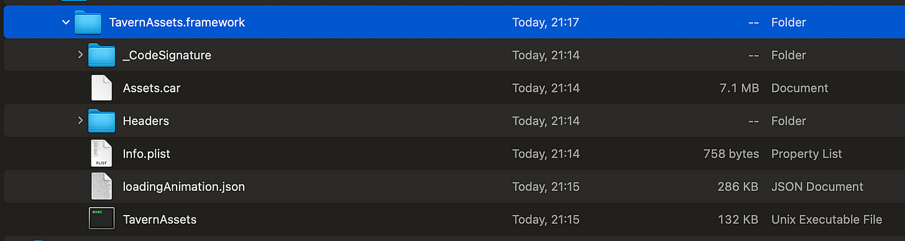
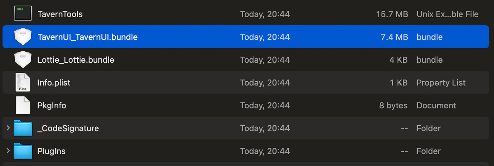
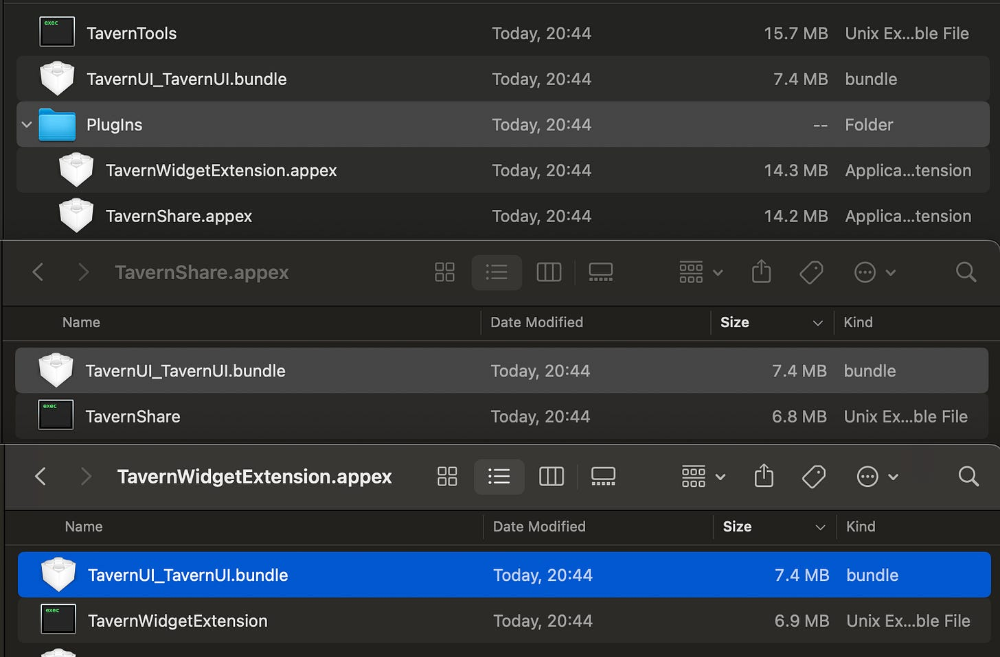
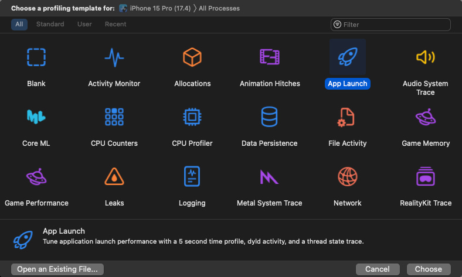
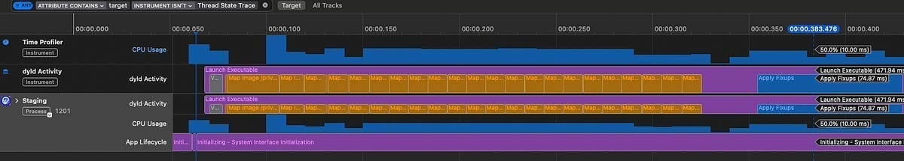
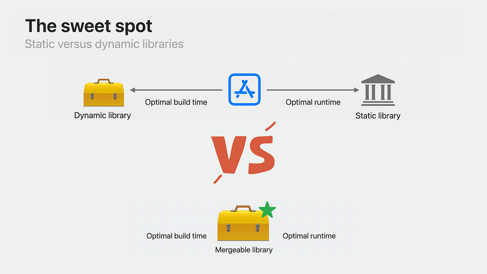

> 原文：[Static, Dynamic, Mergeable, oh, my!](https://blog.jacobstechtavern.com/p/static-dynamic-mergeable-oh-my)

# Static, Dynamic, Mergeable, oh, my!

### A theoretical guide to libraries, frameworks, and linking

[](https://substack.com/@jacobbartlett)

[Jacob Bartlett](https://substack.com/@jacobbartlett)

Nov 18, 2024


If you want to embarrass a senior iOS engineer, ask them to explain the difference between Dynamic Frameworks and Static Libraries.

These concepts are enormously important, but for years, they were packaged up in a box in my brain labelled _“I’ll learn about these one day, but until then, I’ll have impostor syndrome”_.

Unless you’re working to reduce app bundle size, simplify your dependency graph, optimise launch performance, or speed up build times, you won’t get to put this knowledge into practice.

> _Subscribe to Jacob’s Tech Tavern for free to get ludicrously in-depth articles on iOS, Swift, tech, & indie projects in your inbox every week._
> 
> _Full subscribers unlock **Quick Hacks**, my advanced tips series, and enjoy exclusive early access to my long-form articles._

Let’s change that with a primer on **libraries**, **frameworks**, and **linking**, and then let’s understand what is meant by **static** and **dynamic**. We’ll finish by learning about the new **mergeable** libraries available in Xcode.

### Libraries vs Frameworks

Libraries and Frameworks are actually very straightforward if you approach them with fresh eyes.

> _The main reason they feel confusing is because they are usually explained very poorly._

#### Libraries

**Libraries** are pure code. They can be imported into your projects to provide reusable classes and functions. Libraries can be static (`.a`) or dynamic (`.dylib`). We’ll look at the differences between static and dynamic libraries later in the section on linking.

#### Frameworks

**Frameworks** are folders which contain a library. This library can be either static or dynamic, which the folder inherits — it becomes a static framework if it contains a static library, and a dynamic framework if it contains a dylib.

Alongside the library, framework folders contain additional resources & metadata, including:

- Asset catalogues
- Strings, Nib files, Obj-C headers, & metadata
- Code signatures
- Documentation

Here’s what a real (dynamic) `.framework` folder looks like:



<sub>Dynamic framework folder containing assets, code signature, Info.plist, and Unix executable</sub>

You can see the assets, code signature, and `Info.plist` metadata. The code itself is packaged into a binary (Unix Executable File). This is compiled and ready to link to the app.

#### Library Assets & Bundles

Libraries themselves do not contain assets, but you can create them with a resource **bundle** (in Swift Packages this is named _Media_ by default). These resources are included in the app as part of a `.bundle` file.

This sample app includes a `TavernUI` library, containing a [design system](https://blog.jacobstechtavern.com/p/enums-and-design-systems) & assets. The code from the `TavernUI` library is linked directly into the main executable, `TavernTools`. The `TavernUI.bundle` file which contains the assets was packaged separately inside the main `.app` bundle.



<sub>An asset bundle from a library visible inside the .app bundle</sub>

### What is Linking?

In Computer Science, a **linker** combines compiled object files together into a single executable entity.

If you work for a company with a large, complex app, it probably consists of a main target (plus extensions), several feature modules, additional layers for core utilities, and third-party dependencies.

These modules are processed by the Swift Compiler, then the linker… well, _links_ these compiled modules together. They are ultimately merged into a single program that the OS can run: your app.

When does this linking happen? **It depends.**

### Static Linking

**Static linking** is the last stage of the Swift compiler. After processing Swift through [SIL](https://blog.jacobstechtavern.com/p/swift-intermediate-language), optimisations, and [LLVM IR](https://blog.jacobstechtavern.com/p/cow2llvm-the-isknownuniquelyreferenced), it ends up as machine code (a.k.a. ARM assembly) inside object files (`.o`) which look like this:

```
mov x0, #0x0   ; Move 0 into register x0
bl  _printf    ; Branch to the printf function
ret            ; Return from the function
```

This assembly code is represented in the object file as `TEXT`. As well as this finely-optimised machine code, object files also contain:

- A symbol table, which maps functions and variables to memory addresses in your running program.
- Global and static variables, represented in the file as `DATA`.
- Debug information, a.k.a. `DWARF`.

#### Static Copying

If your library or framework is static, then its compiled object files are copied into the main Unix executable during static linking.

This copying is critical to understand: **the performance characteristics of static vs dynamic linking are all downstream consequences of this compile-time copying**.

If you have large libraries, it takes a long time to copy them all into the binary. Even worse, if your app has a complex dependency graph, importing many inter-dependent libraries, this copying will happen repeatedly, even for incremental builds. **To developers, this manifests as a longer build time**.

After static linking finishes, we are left with a single Mach-O executable. This consists of the compiled object files in your main app, linked with the object files from all the static libraries & frameworks throughout your dependency graph.

This single statically-linked executable is loaded up by the OS to run your app. Since it’s just a single file, this launches pretty fast.

This makes static linking pretty great for end-users. This UX benefit is why non-system modules are statically linked into your app by default.

#### Static Bloat

If you have a big or complicated app, you may include extension targets such as widgets or a notification share extension.

If you’re not careful, you might experience the biggest drawback to static linking: static libraries & frameworks — alongside their associated resource bundles — are copied into **every target**.

This can dramatically bloat the size of your app.



<sub>TavernUI resource bundle copied into an app + each extension target</sub>

### **Dynamic Linking**

**Dynamically linked** libraries and frameworks are linked at **runtime** by a system called dyld.

During dynamic linking, a dynamic library or framework is loaded into the virtual memory address space for the app process. Its functions are mapped into memory just like the functions in the main executable.

At compile-time, dynamic libraries and frameworks largely undergo the exact same compilation steps as any Swift code. In the link phase, however, instead of copying the whole executable into the main executable, the **folder location** of the dynamically linked module is the only thing copied. This makes their incremental build times almost negligible.

> _I need to quickly dispel a very common misconception about dynamic libraries and frameworks: they are **NOT**linked on-demand._
> 
> _They are mapped into the process memory address space at launch, in the pre-_`main()`_phase before any of your code is executed. Therefore, dynamic frameworks may have a negative impact on launch time if you overuse them._

#### Performance Characteristics

Now that we understand the mechanics of dynamic linking, it’s straightforward to understand the performance characteristics we can observe compared to static linking.

- **Build time is quicker** with dynamic linking, because only a folder reference is embedded in the executable, rather than copying an entire module.
- **Launch time is slower**with dynamic linking, because dyld needs to map the code into the app process in the pre-main phase of app launch.
- **Duplication is reduced**with dynamic linking, because the same dynamic framework or library can be linked at runtime to each target which requires it.

How significant is this negative impact on launch time? You can profile this yourself using the App Launch instrument.



You’ll be able to measure and identify the pre-main launch time for each of your dynamic framework. In my experience, these can vary dramatically from a few hundred nanoseconds to tens of milliseconds per framework. First-time-ever launches tend to be slower than cold starts, due to [dyld caching optimisations](https://developer.apple.com/documentation/xcode/reducing-your-app-s-launch-time).



#### Dynamic Linking and Optimisations

There is another lesser-known factor to consider: dynamically-linked frameworks and libraries can be less **optimised**.

Since dynamically-linked modules are compiled independently from other modules rest of the app, they aren’t subject to [dead-code stripping](https://developer.apple.com/library/archive/documentation/Performance/Conceptual/CodeFootprint/Articles/CompilerOptions.html), because the Swift compiler can’t know at compile-time what functions will need to be mapped into the app process.

Therefore, dynamic frameworks and libraries aren’t guaranteed to be more space-efficient than statically linked modules, even if you’re importing them into multiple targets. This can lead to unexpected results that defy the standard dogma.

I recently had a situation where a small dependency, [Factory](https://github.com/hmlongco/Factory), was dynamically imported as a framework into multiple targets due to this naïve approach to size optimisation. However, this less optimised framework, alongside all its metadata, added up to **200kB** in total.

When linking it as a static library, it took up a tiny **15kB**, which meant I could marginally improve launch-time performance **and** save on bundle space.

The lesson here is to **profile your own app**!

#### System Frameworks

Apple system frameworks such as Foundation, SwiftUI, and CoreGraphics are dynamically linked to your app. This allows them to live in one place in the OS rather than being bundled with every single installed application.

> _System frameworks like Foundation are actually very modular internally, with “Foundation” being the moniker for the umbrella framework that wraps them._

These dynamic system frameworks are linked to your app process by dyld during the pre-main launch step, but Apple has very heavily optimised this linking using the _[dyld shared library cache](https://www.nowsecure.com/blog/2024/09/11/reversing-ios-system-libraries-using-radare2-a-deep-dive-into-dyld-cache-part-1/),_a pre-linked set of all major system libraries, which is mapped into the address space of your app process.

### Mergeable Libraries

Mergeable libraries are the hot new approach to linking strategies introduced Xcode 15. They are actually very straightforward, since we now understand the problems they’re trying to solve.

Mergeable libraries are designed to link**dynamically in** **debug** builds, and **statically** **in release** builds.

This ostensibly gives them the best of both worlds:

- The compile-time benefits of dynamic linking to improve developer experience & iteration speed.
- The production-user-facing launch-time advantages of static linking.



<sub>From WWDC Notes; [Meet Mergeable Libraries](https://wwdcnotes.com/documentation/wwdcnotes/wwdc23-10268-meet-mergeable-libraries/)</sub>

Any dynamic framework or library can be built as mergeable by setting the `MERGED_BINARY_TYPE` in Xcode build settings. This commands the static linker to generate metadata alongside the `.dylib` that allows it to be statically linked in release builds.

This metadata roughly doubles the size of the library, compelling a HackerNews user to [suggest that the module is simply bundling both a static and dynamic library together](https://news.ycombinator.com/item?id=36232861).

My honest take-home assessment is; mergeable libraries are designed to be **a good default** for engineering teams where understanding your dependency graph and optimising your build system isn’t a high priority. And, to be fair, this is probably most iOS teams (and indie devs).

[The Tuist guys](https://docs.tuist.io/en/guides/develop/projects/cost-of-convenience) have a more nuanced take on Mergeable Libraries:

> _Dynamic frameworks, while more flexible and easier to work with, have a negative impact in the launch time of apps. On the other side, static libraries are faster to launch, but impact the compilation time and are a bit harder to work with, specially in complex graph scenarios. Wouldn’t it be great if you could change between one or the other depending on the configuration? That’s what Apple must have thought when they decided to work on mergeable libraries. But once again, they moved more build-time inference to the build-time. If reasoning about a dependency graph, imagine having to do so when the static or dynamic nature of the target will be resolved at build-time based on some build settings in some targets. Good luck making that work reliably while ensuring features like SwiftUI previews don’t break._

While the benefits of mergeable libraries are obvious, they don’t factor in the other big trade-off which affects the choice between static & dynamic linking: **duplication of modules** between targets. This tends to be the main deciding factor when making a dependency or library dynamic or not, and is completely ignored.

I’d personally love an overhaul of the asset bundling system. To bundle shared assets into a framework, we need [painful, non-obvious workarounds](https://www.emergetools.com/blog/posts/make-your-ios-app-smaller-with-dynamic-frameworks). Right now, frameworks duplicate their assets into each target in a `.bundle` by default.

### Conclusion

I hope you learned a lot, and that you’re prepared to look dead clever in front of your team next time somebody asks why your module is dynamic.

Once you have a good grasp of how the linker works, you unlock skills that make you a priceless resource on any engineering team:

- App bundle size optimisation
- Dependency graph simplification
- Launch speed improvement
- Build time reduction

If there’s any real take-away I can give, it’s the age-old advice: **Profile Your App!** Don’t just blindly listen to some guy on the internet. Work out what’s best for your situation.

I’ve given you the tools, _now go apply them!_

> _Enjoying Jacob’s Tech Tavern? Share it! Refer a friend as a free subscriber to unlock a complimentary month of full subscription._

[Refer a friend](https://blog.jacobstechtavern.com/leaderboard?&utm_source=post)
