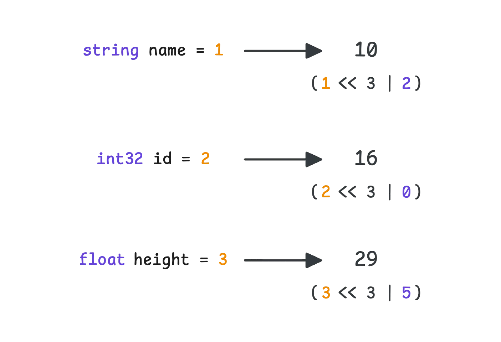
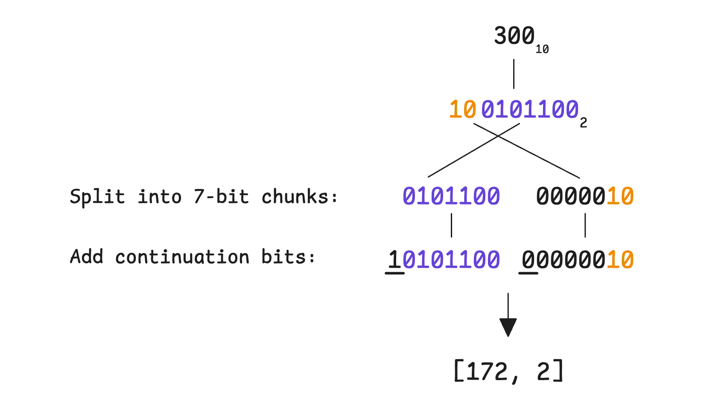
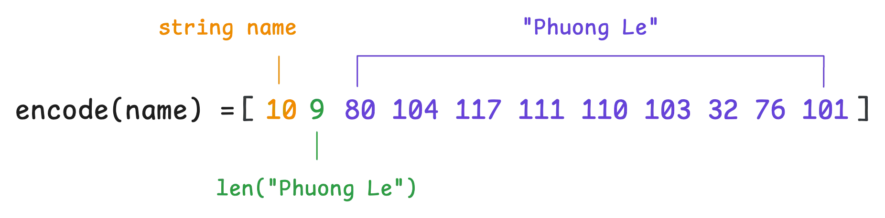
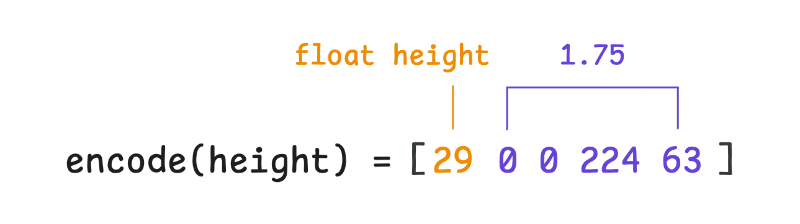
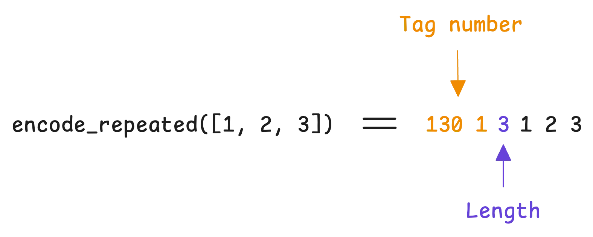
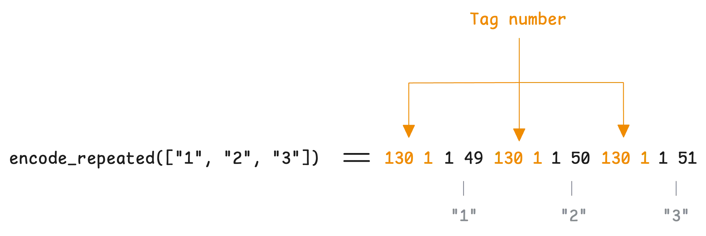

> 原文：[How Protobuf Works—The Art of Data Encoding](https://victoriametrics.com/blog/go-protobuf/)

This article is part of the series on communication protocols:

- [From net/rpc to gRPC in Go Applications](https://victoriametrics.com/blog/go-net-rpc/)
- [How HTTP/2 Works and How to Enable It in Go](https://victoriametrics.com/blog/go-http2/)
- [Practical Protobuf - From Basic to Best Practices](https://victoriametrics.com/blog/go-protobuf-basic/)
- How Protobuf Works—The Art of Data Encoding (We’re here)
- [gRPC in Go: Streaming RPCs, Interceptors, and Metadata](https://victoriametrics.com/blog/go-grpc-basic-streaming-interceptor/)

Protobuf (Protocol Buffers) is a way to serialize data into a compact binary format. This makes it smaller in size and faster to transmit over the network, though at the cost of being less human-readable.

It works by defining data structures in a `.proto` file—a blueprint specifying what fields exist, their types, the services, etc. From there, this file is used to generate code in different programming languages, allowing programs to efficiently encode and decode the data.

_“Does Protobuf take longer to serialize and deserialize data compared to JSON?”_

There are many compilers and implementations, so there’s no single definitive answer to this question. However, let’s run a simple benchmark comparing `google.golang.org/protobuf` and `encoding/json` in Go. While this isn’t a perfectly fair comparison, it does reflect common choices.

We also benchmarked another Protobuf-compatible solution, [easyproto](https://github.com/VictoriaMetrics/easyproto), which is designed for high performance and low memory usage with some trade-offs.

`easyproto` is just a simpler way to work with protobuf encoding without needing the `protoc` compiler or code generation. It follows the exact same wire format as protobuf (proto3).

The benchmark below was run on a local machine using Go 1.23.5, [libprotoc 29.2](https://github.com/protocolbuffers/protobuf/releases/tag/v29.2):

```go
Protocol Buffers serialized size: 99 bytes
JSON serialized size: 214 bytes
easyproto serialized size: 99 bytes
JSON content:
{"name":"John Doe","age":30,"email":"john.doe@example.com","phone_numbers":["+1234567890","+0987654321"],"status":"ACTIVE","address":{"street":"123 Main St","city":"New York","country":"USA","postal_code":"10001"}}

Field by field comparison:
goos: darwin
goarch: arm64
BenchmarkProtobufMarshal-14    9051836  133.0 ns/op  112 B/op  1 allocs/op
BenchmarkJSONMarshal-14        4950854  248.8 ns/op  224 B/op  1 allocs/op
BenchmarkProtobufUnmarshal-14  4461856  258.8 ns/op  384 B/op  12 allocs/op
BenchmarkJSONUnmarshal-14      899058    1318 ns/op  560 B/op  18 allocs/op
easyprotoMarshal-14            16046793 74.21 ns/op    0 B/op   0 allocs/op
easyprotoUnmarshal-14          17370272 70.61 ns/op  112 B/op   3 allocs/op
```

No surprise here—Protocol Buffers produces a much smaller output, 99 bytes compared to JSON’s 214 bytes for the same data structure. This difference only becomes more noticeable as the data grows.

Looking at serialization:

- `easyproto` serialization takes just 74.21 nanoseconds, with zero allocations.
- Protobuf (`proto.Marshal`) takes 133.0 nanoseconds and makes one memory allocation of 112 bytes.
- JSON (`encoding/json`) takes 248.8 nanoseconds with one allocation of 224 bytes.

Deserialization shows an even bigger gap:

- `easyproto` deserialization takes 70.61 nanoseconds, with 3 allocations using 112 bytes.
- Protobuf (`proto.Unmarshal`) takes 293.6 nanoseconds with 13 allocations using 448 bytes.
- JSON (`encoding/json`) takes 1457 nanoseconds with 18 allocations using 592 bytes.

In today’s discussion, we’ll break down how binary data is structured in Proto3 and examine the struct generated by `protoc`.

## Serialization

### Field Key (or Tag) Encoding

To encode a field, we need two things: where the field is in the message and what its value is. We’ll use the code snippet below along the way to explain the encoding process:

```go
message Person {
  string name = 1;
  int32  id = 2;
  float  height = 3; // in meters
}

p := Person{
  Name:   "Phuong Le",
  Id:     300,
  Height: 1.75,
}
```

The first thing to figure out is **how each field is identified**. Every field in the message has two parts: a unique number and a type (the actual name of the field doesn’t matter in this case):

- The **unique number** assigned to each field is known as the **tag number**.
- The **field’s type** determines something called the **wire type**, which tells the system how the value should be encoded (and how to decode it later).

Protobuf has 5 wire types:

- **Varint (0)**: Used for encoding integers (`int32`, `int64`, `uint32`, `uint64`, `sint32`, `sint64`), booleans (bool), and enumerations (`enum`)
- **64-bit (1)**: Used for fixed-length 64-bit data types such as `fixed64`, `sfixed64`, and `double`.
- **Length-delimited (2)**: Used for strings, byte arrays, embedded messages, and packed repeated fields.
- **Groups (3, 4)**: Were used for groups, but now deprecated.
- **32-bit (5)**: Used for fixed-length 32-bit data types such as `fixed32`, `sfixed32`, and `float`.

These two pieces—field number and wire type—are combined into a single unit called the **tag**. Protobuf uses this tag to figure out which field is being referenced in the message. The wire type takes up the least significant 3 bits (the rightmost ones), while the field number fills the rest:

```go
tag = (field_number << 3) | wire_type
```

This tag number will then be encoded using a technique called variable-length encoding or varint encoding. Since the numbers in our example are small enough, they are encoded as they are written in binary. Therefore, the tag values for those fields in our example would be:



<sub>How Protobuf assigns tags to message fields</sub>

### Value Encoding

Protobuf doesn’t use the same encoding for every type of value. Instead, it groups them into three categories: varint, length-delimited, and fixed-width encoding.

#### Varint Encoding for Wire Type 0

Storing small numbers like 1, 2, or 3 in a full 4-byte (`int32`) or 8-byte (`int64`) format would be wasteful—most of those bytes would just be zeros. Instead, Protobuf uses varint encoding, a technique where the number of bytes adjusts based on the size of the value. The smaller the number, the fewer bytes it takes.

There’s a trade-off, though. The leftmost bit of each byte is reserved as a continuation bit, which signals whether the number keeps going:

- If the most significant bit (MSB) is 1, more bytes follow.
- If the MSB is 0, that’s the last byte, and the number is complete.



<sub>Protobuf varint encoding process for the number 300</sub>

For larger numbers, more bytes are needed—up to 10 for a full 64-bit integer. But in most cases, numbers tend to be small, so the space savings are significant. That makes varint a good choice when working with values that usually stay within a lower range.

Here’s the problem: encoding a negative number, say -1. In a 32-bit integer, -1 is represented as:

```go
11111111111111111111111111111111  // 32 bits  
```

With varint encoding, that means 5 bytes are needed. With 64-bit integer, it’s 10 bytes:

```go
// 32-bit integer varint
11111111 11111111 11111111 11111111 00001111

// 64-bit integer varint
11111111 11111111 11111111 11111111 11111111 
11111111 11111111 11111111 11111111 00000001
```

This happens because varint treats numbers as unsigned, meaning negative values end up consuming extra space. Even worse, while your `int32` would typically consume around 4-6 bytes, using `-1` makes it take 10 bytes just like `int64`. This is because Protobuf doesn’t know your exact type—it only knows the wire type, and there is no distinction between `int32` and `int64` at the wire level.

Both `int32` and `int64` use the same wire type, and there is no distinction between them at the binary level. Therefore, `-1` will be encoded as 10 bytes.

To avoid this issue, Protobuf takes a different route for signed integers (`sint32`, `sint64`)—it uses zig-zag varint encoding.

As the name suggests, it zigzags between positive and negative numbers:

- A positive number `n` is encoded as `2 * n`.
- A negative number `n` is encoded as `2 * |n| - 1`.

This means:

- `-1` is encoded as `1`
- `1` is encoded as `2`
- `-2` is encoded as `3`
- `2` is encoded as `4`

Once converted, the number is encoded using varint as usual. This avoids the inefficiency of storing negative numbers as large multi-byte values.

In Go, you can try this yourself using the `protowire` package from `google.golang.org/protobuf`, or even the standard `encoding/binary` package. Go indeed supports both regular varint and zig-zag varint encoding. The `encoding/binary` package provides two sets of functions:

- Unsigned integers: `binary.PutUvarint` and `binary.Uvarint`.
- Signed integers: `binary.PutVarint` and `binary.Varint`.

Here’s a quick test with `-1`:

```go
func main() {
  var num int64 = -1

  fmt.Printf("- Binary representation of %d in varint: ", num)

  buf := make([]byte, binary.MaxVarintLen64)
  binary.PutUvarint(buf, uint64(num))
  for _, b := range buf {
    fmt.Printf("%08b ", b)
  }
  fmt.Println()

  fmt.Printf("- Binary representation of %d in zigzag varint: ", num)
  bufZigzag := make([]byte, 1)
  binary.PutVarint(bufZigzag, num)
  for _, b := range bufZigzag {
    fmt.Printf("%08b ", b)
  }
}
```

And the output:

```go
- Binary representation of -1 in varint: 11111111 11111111 11111111 
11111111 11111111 11111111 11111111 11111111 11111111 00000001 
- Binary representation of -1 in zigzag varint: 00000001
```

At this point, the `id` field equals to 300 can be fully represented in 3 bytes:


<sub>Protobuf varint encoding for the ID field</sub>

#### Length-Delimited Encoding for Wire Type 2

Length-delimited encoding is used for data types that **don’t have a fixed size**. This includes strings, byte arrays, embedded messages, and packed repeated fields.

The idea is straightforward, it breaks the value into two parts: first, a prefix that tells you the length (in bytes) of what’s coming next, and then the actual data. In binary format, it looks like this: `<length><data>`.

For example, in our case, the `name` field contains `"Phuong Le"`, which is 9 bytes long when encoded in UTF-8. That means the encoded value would be:



<sub>Protobuf length-delimited encoding for a string field</sub>

Note that the length of the bytes is also encoded using varint encoding.

We’re not getting into how UTF-8 encoding works here, but just like varint, it has its own way of handling multi-byte characters and continuation bits. That’s the general idea.

#### Fixed-Width Encoding for Wire Type 1, 5

Fixed-width encoding is used for fields with a set size, like `fixed32`, `sfixed32`, `fixed64`, `sfixed64`, and floating-point numbers (`float`, `double`). Nothing new here—these values are stored in a simple way without extra length prefixes or varint tricks.

That means the height field is encoded using IEEE 754 32-bit floating-point representation as usual:



<sub>Protobuf fixed-width encoding for a float field</sub>

Now, putting everything together, the final encoded message looks like this:

```go
protobuf.encode(person) = [10 9 80 104 117 111 110 103 32 76 101 16 172 2 29 0 0 224 63]
```

One last thing, if a field has a default value (`""`, `0`, `false`, etc.), it doesn’t get encoded at all. This works just like `omitempty` in JSON.

For more details on how Protobuf encodes and decodes data, you can refer to the [Protobuf documentation](https://protobuf.dev/programming-guides/encoding/).

#### Repeated Fields

Elements inside a `repeated` field are encoded using the techniques we’ve covered so far. However, the way the entire `repeated` field is serialized depends on its wire type.

For `repeated` fields containing **primitive numeric types**, Protobuf uses packed mode (enabled by default in `proto3`):



<sub>Protobuf packed repeated fields</sub>

In packed mode, the tag number appears only once in the serialized data. All elements in the `repeated` field share that single tag number, making the encoding more compact.

In contrast, in unpacked mode, the tag number is repeated for each element in the serialized data:



<sub>Protobuf unpacked repeated fields</sub>

## Deserialization (in Go)

Protobuf is built with both backward compatibility (newer systems can still read older messages) and forward compatibility (older systems can still handle newer messages).

To see how this works in practice, let’s look at how deserialization happens in Go.

When decoding a message, Protobuf reads the data byte by byte. For each field, it starts by reading a tag, which contains two things. You probably already know from the encoding part:

- The **wire type**, which tells the decoder how to interpret the next few bytes.
- The **field number**, which helps the decoder find the right field in the message definition.

If the field number matches one in the current message definition, the decoder processes it normally based on the field’s type. However, what happens when the decoder comes across a field number that isn’t in the message definition?

Instead of failing, Protobuf has a built-in way to handle this. It treats the field as **unknown** and skips over it using the wire type information to figure out how many bytes to ignore. These unknown fields aren’t just thrown away—they’re actually stored in a separate section of the message.

That’s why you’ll see an option in the unmarshal function called `DiscardUnknown`, which lets you choose whether to keep these unknown fields or drop them entirely.

_“Why don’t we just discard unknown fields?”_

If the message gets passed to newer code that does understand these fields, the data is still there and can be interpreted correctly:

```go
func main() {
	p := &Person{
		Name:   "Phuong Le",
		Id:    300,
		Height: 1.75,
	}
	bytes, _ := proto.Marshal(p)

	// unmarshal but keep the unknown fields
	p2 := &PersonWithoutHeight{}
	_ = proto.Unmarshal(bytes, p2)

	// unmarshal but discard the unknown fields
	p3 := &PersonWithoutHeight{}
	opts := proto.UnmarshalOptions{DiscardUnknown: true}
	_ = opts.Unmarshal(bytes, p3)

	fmt.Println(proto.Marshal(p2))
	fmt.Println(proto.Marshal(p3))
}
```

Even though we unmarshaled the message into the newer version `PersonWithoutHeight`, the `Height` field wasn’t lost. When re-encoded, it’s still there:

```bash
[10 9 80 104 117 111 110 103 32 76 101 16 172 2 29 0 0 224 63]
[10 9 80 104 117 111 110 103 32 76 101 16 172 2]
```

Now, if we reverse the situation: where a field exists in the current message definition but wasn’t present in the received message, the field simply gets its default value. This lines up with how Protobuf encodes data: fields with default values aren’t stored in the first place.

So what should we take away from this discussion?

- The order of fields doesn’t matter. What does matter is the **tag number** (and the **wire type**).
- To keep compatibility, don’t reuse or change tag numbers, and don’t change a field’s type.
- If you remove a field, reserve its **tag number** to prevent future reuse: `reserved 1, 2, 3;`.

_“What if I change a field’s type but keep the same wire type?”_

Even if two types use the same wire type, they don’t necessarily interpret the bytes the same way. A few examples make this clear:

- `int32` and `bool` both use varint encoding, but a nonzero `int32` value could be mistakenly read as true if interpreted as a boolean.
- `int32` and `uint32` also use varint encoding, but `int32` treats the bytes as signed, while `uint32` treats them as unsigned. That means a negative `int32` would show up as a huge positive number if read as `uint32`.

## The Message in .pb.go File

Let’s take a look at the Person struct and see how everything we’ve talked about starts to feel familiar:

```go
type Person struct {
	state         protoimpl.MessageState `protogen:"open.v1"`
	Name          string                 `protobuf:"bytes,1,opt,name=name,proto3" json:"name,omitempty"`
	Id            int32                  `protobuf:"varint,2,opt,name=id,proto3" json:"id,omitempty"`
	Height        float32                `protobuf:"fixed32,3,opt,name=height,proto3" json:"height,omitempty"`
	unknownFields protoimpl.UnknownFields
	sizeCache     protoimpl.SizeCache
}
```

Each field follows exactly what we expect based on its encoding:

- `Name` uses bytes encoding (length-delimited) with field number 1.
- `Id` uses varint encoding with field number 2.
- `Height` uses fixed32 encoding with field number 3.

Then, we have `unknownFields`, which—no surprise, stores any **unknown** fields that show up during deserialization. This is just a `[]byte` that holds data for fields the current message definition doesn’t recognize.

When you call `Marshal()` on a message for the first time, Protobuf calculates the size and saves it in `sizeCache`. Later, if you call `Marshal()` again without modifying the message with `UseCachedSize` option, it just reuses the cached size instead of recalculating everything.

What does `UseCachedSize` do?

This option tells Protobuf: “we’ve already calculated the size of this message before, so just use that cached size instead of recalculating it”. For it to work correctly, two things must be true: The size was already calculated before, and the message (and any submessages) hasn’t changed at all. If there’s any doubt, don’t use it—Protobuf will handle size calculations correctly on its own.

Caching the size of the message is good in 2 cases:

1. For message fields nested inside other messages, Protocol Buffers needs to write a length prefix before writing the actual message content.
2. Knowing the size upfront allows Protocol Buffers to allocate exactly the right amount of memory for the output buffer. Without knowing the size, it would need to continuously grow the buffer.

_“How about the `state` field?”_

Every time Protocol Buffers needs to do something with your message (like converting it to bytes), it uses the `state` field to find out how to handle that message. Every Protobuf message in Go needs to support **reflection** (introspection of its structure at runtime).

The `state` field provides a allocation-free way to implement this by leveraging the `unsafe` package—a technique that, while risky, improves performance by manipulating memory directly.

When you write `p := Message{}`, the `state` field isn’t there; it is lazily set and initialized when you encode or decode. Therefore, the first time you encode or decode, there might be a slight performance overhead.

And… that’s also the final part of this discussion on the way to understand how Protobuf works.

## Who We Are

If you want to monitor your services, track metrics, and see how everything performs, you might want to check out [VictoriaMetrics](https://docs.victoriametrics.com/). It’s a fast, **open-source**, and cost-saving way to keep an eye on your infrastructure.

And we’re Gophers, enthusiasts who love researching, experimenting, and sharing knowledge about Go and its ecosystem. If you spot anything that’s outdated or if you have questions, don’t hesitate to reach out. You can drop me a DM on [X(@func25)](https://twitter.com/func25).

Related articles:

- [Golang Series at VictoriaMetrics](https://victoriametrics.com/categories/go-@-victoriametrics)
- [How Go Arrays Work and Get Tricky with For-Range](https://victoriametrics.com/blog/go-array/)
- [Slices in Go: Grow Big or Go Home](https://victoriametrics.com/blog/go-slice/)
- [Go Maps Explained: How Key-Value Pairs Are Actually Stored](https://victoriametrics.com/blog/go-map/)
- [Golang Defer: From Basic To Traps](https://victoriametrics.com/blog/defer-in-go/)
- [Vendoring, or go mod vendor: What is it?](https://victoriametrics.com/blog/vendoring-go-mod-vendor/)
