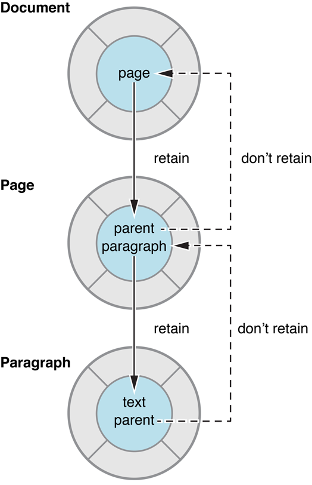

> 导航：[总目录](../../../README.md) · [documentation](../../../_indexes/documentation.md) · [Advanced Memory Management Programming Guide](About%20Memory%20Management.md)


[Next](Using%20Autorelease%20Pool%20Blocks.md)[Previous](Memory%20Management%20Policy.md)

# Practical Memory Management

Although the fundamental concepts described in [Memory Management Policy](Memory%20Management%20Policy.md#apple-f4xwc4dqnrsv64tfmyxwi33df52wszbpgiydambqhe4tilkciffeqrsci5ea) are straightforward, there are some practical steps you can take to make managing memory easier, and to help to ensure your program remains reliable and robust while at the same time minimizing its resource requirements.

If your class has a property that is an object, you must make sure that any object that is set as the value is not deallocated while you’re using it. You must therefore claim ownership of the object when it is set. You must also make sure you then relinquish ownership of any currently-held value.

Sometimes it might seem tedious or pedantic, but if you use accessor methods consistently, the chances of having problems with memory management decrease considerably. If you are using `retain` and `release` on instance variables throughout your code, you are almost certainly doing the wrong thing.

Consider a Counter object whose count you want to set.

```objc
@interface Counter : NSObject
@property (nonatomic, retain) NSNumber *count;
@end;
```

The [property](https://developer.apple.com/library/archive/documentation/General/Conceptual/DevPedia-CocoaCore/DeclaredProperty.html#//apple_ref/doc/uid/TP40008195-CH13) declares two accessor methods. Typically, you should ask the compiler to synthesize the methods; however, it’s instructive to see how they might be implemented.

In the “get” accessor, you just return the synthesized instance variable, so there is no need for `retain` or `release`:

```objc
- (NSNumber *)count {
    return _count;
}
```

In the “set” method, if everyone else is playing by the same rules you have to assume the new count may be disposed of at any time so you have to take ownership of the object—by sending it a `retain` message—to ensure it won’t be. You must also relinquish ownership of the old count object here by sending it a `release` message. (Sending a message to `nil` is allowed in Objective-C, so the implementation will still work if `_count` hasn’t yet been set.) You must send this after `[newCount retain]` in case the two are the same object—you don’t want to inadvertently cause it to be deallocated.

```objc
- (void)setCount:(NSNumber *)newCount {
    [newCount retain];
    [_count release];
    // Make the new assignment.
    _count = newCount;
}
```


Suppose you want to implement a method to reset the counter. You have a couple of choices. The first implementation creates the `NSNumber` instance with `alloc`, so you balance that with a `release`.

```objc
- (void)reset {
    NSNumber *zero = [[NSNumber alloc] initWithInteger:0];
    [self setCount:zero];
    [zero release];
}
```

The second uses a convenience constructor to create a new `NSNumber` object. There is therefore no need for `retain` or `release` messages

```objc
- (void)reset {
    NSNumber *zero = [NSNumber numberWithInteger:0];
    [self setCount:zero];
}
```

Note that both use the set accessor method.

The following will almost certainly work correctly for simple cases, but as tempting as it may be to eschew accessor methods, doing so will almost certainly lead to a mistake at some stage (for example, when you forget to retain or release, or if the memory management semantics for the instance variable change).

```objc
- (void)reset {
    NSNumber *zero = [[NSNumber alloc] initWithInteger:0];
    [_count release];
    _count = zero;
}
```

Note also that if you are using [key-value observing](https://developer.apple.com/library/archive/documentation/General/Conceptual/DevPedia-CocoaCore/KVO.html#//apple_ref/doc/uid/TP40008195-CH16), then changing the variable in this way is not KVO compliant.

The only places you shouldn’t use accessor methods to set an instance variable are in [initializer](https://developer.apple.com/library/archive/documentation/General/Conceptual/DevPedia-CocoaCore/MultipleInitializers.html#//apple_ref/doc/uid/TP40008195-CH33) methods and `dealloc`. To initialize a counter object with a number object representing zero, you might implement an `init` method as follows:

```
- init {
    self = [super init];
    if (self) {
        _count = [[NSNumber alloc] initWithInteger:0];
    }
    return self;
}
```

To allow a counter to be initialized with a count other than zero, you might implement an `initWithCount:` method as follows:

```
- initWithCount:(NSNumber *)startingCount {
    self = [super init];
    if (self) {
        _count = [startingCount copy];
    }
    return self;
}
```

Since the Counter class has an object instance variable, you must also implement a `dealloc` method. It should relinquish ownership of any instance variables by sending them a `release` message, and ultimately it should invoke super’s implementation:

```objc
- (void)dealloc {
    [_count release];
    [super dealloc];
}
```


Retaining an object creates a _strong reference_ to that object. An object cannot be deallocated until all of its strong references are released. A problem, known as a _retain cycle_, can therefore arise if two objects may have cyclical references—that is, they have a strong reference to each other (either directly, or through a chain of other objects each with a strong reference to the next leading back to the first).

The object relationships shown in [Figure 1](#apple-f4xwc4dqnrsv64tfmyxwi33df52wszbpkridimbqga2dinbxfuytambqha3dmlkcijbuusski5ba) illustrate a potential retain cycle. The Document object has a Page object for each page in the document. Each Page object has a property that keeps track of which document it is in. If the Document object has a strong reference to the Page object and the Page object has a strong reference to the Document object, neither object can ever be deallocated. The Document’s reference count cannot become zero until the Page object is released, and the Page object won’t be released until the Document object is deallocated.

__Figure 1__  An illustration of cyclical references



The solution to the problem of retain cycles is to use weak references. A _weak reference_ is a non-owning relationship where the source object does not retain the object to which it has a reference.

To keep the object graph intact, however, there must be strong references somewhere (if there were only weak references, then the pages and paragraphs might not have any owners and so would be deallocated). Cocoa establishes a convention, therefore, that a “parent” object should maintain strong references to its “children,” and that the children should have weak references to their parents.

So, in [Figure 1](#apple-f4xwc4dqnrsv64tfmyxwi33df52wszbpkridimbqga2dinbxfuytambqha3dmlkcijbuusski5ba) the document object has a strong reference to (retains) its page objects, but the page object has a weak reference to (does not retain) the document object.

Examples of weak references in Cocoa include, but are not restricted to, table data sources, outline view items, [notification](https://developer.apple.com/library/archive/documentation/General/Conceptual/DevPedia-CocoaCore/Notification.html#//apple_ref/doc/uid/TP40008195-CH35) observers, and miscellaneous targets and [delegates](https://developer.apple.com/library/archive/documentation/General/Conceptual/DevPedia-CocoaCore/Delegation.html#//apple_ref/doc/uid/TP40008195-CH14).

You need to be careful about sending messages to objects for which you hold only a weak reference. If you send a message to an object after it has been deallocated, your application will crash. You must have well-defined conditions for when the object is valid. In most cases, the weak-referenced object is aware of the other object’s weak reference to it, as is the case for circular references, and is responsible for notifying the other object when it deallocates. For example, when you register an object with a notification center, the notification center stores a weak reference to the object and sends messages to it when the appropriate notifications are posted. When the object is deallocated, you need to unregister it with the notification center to prevent the notification center from sending any further messages to the object, which no longer exists. Likewise, when a delegate object is deallocated, you need to remove the delegate link by sending a `setDelegate:` message with a `nil` argument to the other object. These messages are normally sent from the object’s `dealloc` method.

Cocoa’s ownership policy specifies that received objects should typically remain valid throughout the scope of the calling method. It should also be possible to return a received object from the current scope without fear of it being released. It should not matter to your application that the getter method of an object returns a cached instance variable or a computed value. What matters is that the object remains valid for the time you need it.

There are occasional exceptions to this rule, primarily falling into one of two categories.

1. When an object is removed from one of the fundamental [collection classes](https://developer.apple.com/library/archive/documentation/General/Conceptual/DevPedia-CocoaCore/Collection.html#//apple_ref/doc/uid/TP40008195-CH10).

```
heisenObject = [array objectAtIndex:n];
[array removeObjectAtIndex:n];
// heisenObject could now be invalid.
```

   When an object is removed from one of the fundamental collection classes, it is sent a `release` (rather than `autorelease`) message. If the collection was the only owner of the removed object, the removed object (`heisenObject` in the example ) is then immediately deallocated.
2. When a “parent object” is deallocated.

```
id parent = <#create a parent object#>;
// ...
heisenObject = [parent child] ;
[parent release]; // Or, for example: self.parent = nil;
// heisenObject could now be invalid.
```

   In some situations you retrieve an object from another object, and then directly or indirectly release the parent object. If releasing the parent causes it to be deallocated, and the parent was the only owner of the child, then the child (`heisenObject` in the example) will be deallocated at the same time (assuming that it is sent a `release` rather than an `autorelease` message in the parent’s `dealloc` method).

To protect against these situations, you retain `heisenObject` upon receiving it and you release it when you have finished with it. For example:

```
heisenObject = [[array objectAtIndex:n] retain];
[array removeObjectAtIndex:n];
// Use heisenObject...
[heisenObject release];
```


You should typically not manage scarce resources such as file descriptors, network connections, and buffers or caches in a `dealloc` method. In particular, you should not design classes so that `dealloc` will be invoked when you think it will be invoked. Invocation of `dealloc` might be delayed or sidestepped, either because of a bug or because of application tear-down.

Instead, if you have a class whose instances manage scarce resources, you should design your application such that you know when you no longer need the resources and can then tell the instance to “clean up” at that point. You would typically then release the instance, and `dealloc` would follow, but you will not suffer additional problems if it does not.

Problems may arise if you try to piggy-back resource management on top of `dealloc`. For example:

1. Order dependencies on [object graph](https://developer.apple.com/library/archive/documentation/General/Conceptual/DevPedia-CocoaCore/ObjectGraph.html#//apple_ref/doc/uid/TP40008195-CH54) tear-down.

   The object graph tear-down mechanism is inherently non-ordered. Although you might typically expect—and get—a particular order, you are introducing fragility. If an object is unexpectedly autoreleased rather than released for example, the tear-down order may change, which may lead to unexpected results.
2. Non-reclamation of scarce resources.

   Memory leaks are bugs that should be fixed, but they are generally not immediately fatal. If scarce resources are not released when you expect them to be released, however, you may run into more serious problems. If your application runs out of file descriptors, for example, the user may not be able to save data.
3. Cleanup logic being executed on the wrong thread.

   If an object is autoreleased at an unexpected time, it will be deallocated on whatever thread’s autorelease pool block it happens to be in. This can easily be fatal for resources that should only be touched from one thread.

When you add an object to a [collection](https://developer.apple.com/library/archive/documentation/General/Conceptual/DevPedia-CocoaCore/Collection.html#//apple_ref/doc/uid/TP40008195-CH10) (such as an array, dictionary, or set), the collection takes ownership of it. The collection will relinquish ownership when the object is removed from the collection or when the collection is itself released. Thus, for example, if you want to create an array of numbers you might do either of the following:

```
NSMutableArray *array = <#Get a mutable array#>;
NSUInteger i;
// ...
for (i = 0; i < 10; i++) {
    NSNumber *convenienceNumber = [NSNumber numberWithInteger:i];
    [array addObject:convenienceNumber];
}
```

In this case, you didn’t invoke `alloc`, so there’s no need to call `release`. There is no need to retain the new numbers (`convenienceNumber`), since the array will do so.

```
NSMutableArray *array = <#Get a mutable array#>;
NSUInteger i;
// ...
for (i = 0; i < 10; i++) {
    NSNumber *allocedNumber = [[NSNumber alloc] initWithInteger:i];
    [array addObject:allocedNumber];
    [allocedNumber release];
}
```

In this case, you _do_ need to send `allocedNumber` a `release` message within the scope of the `for` loop to balance the `alloc`. Since the array retained the number when it was added by `addObject:`, it will not be deallocated while it’s in the array.

To understand this, put yourself in the position of the person who implemented the collection class. You want to make sure that no objects you’re given to look after disappear out from under you, so you send them a `retain` message as they’re passed in. If they’re removed, you have to send a balancing `release` message, and any remaining objects should be sent a `release` message during your own `dealloc` method.

The ownership policy is implemented through reference counting—typically called “retain count” after the [retain](https://developer.apple.com/library/archive/documentation/LegacyTechnologies/WebObjects/WebObjects_3.5/Reference/Frameworks/ObjC/Foundation/Protocols/NSObject/Description.html#//apple_ref/occ/intfm/NSObject/retain) method. Each object has a retain count.

- When you create an object, it has a retain count of 1.
- When you send an object a `retain` message, its retain count is incremented by 1.
- When you send an object a [release](https://developer.apple.com/library/archive/documentation/LegacyTechnologies/WebObjects/WebObjects_3.5/Reference/Frameworks/ObjC/Foundation/Protocols/NSObject/Description.html#//apple_ref/occ/intfm/NSObject/release) message, its retain count is decremented by 1.

  When you send an object a [autorelease](https://developer.apple.com/library/archive/documentation/LegacyTechnologies/WebObjects/WebObjects_3.5/Reference/Frameworks/ObjC/Foundation/Protocols/NSObject/Description.html#//apple_ref/occ/intfm/NSObject/autorelease) message, its retain count is decremented by 1 at the end of the current autorelease pool block.
- If an object’s retain count is reduced to zero, it is deallocated.

[Next](Using%20Autorelease%20Pool%20Blocks.md)[Previous](Memory%20Management%20Policy.md)

