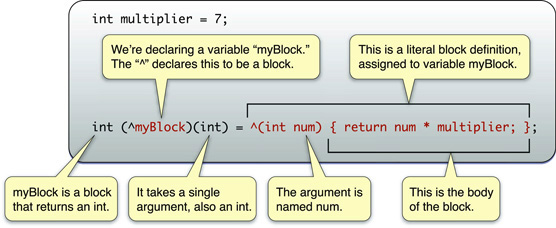

> 导航：[总目录](../../../README.md) · [documentation](../../../_indexes/documentation.md) · [Blocks Programming Topics](Introduction.md)


[Next](Conceptual%20Overview.md)[Previous](Introduction.md)

# Getting Started with Blocks

The following sections help you to get started with blocks using practical examples.

You use the `^` operator to declare a block variable and to indicate the beginning of a block literal. The body of the block itself is contained within `{}`, as shown in this example (as usual with C, `;` indicates the end of the statement):

```
int multiplier = 7;
int (^myBlock)(int) = ^(int num) {
    return num * multiplier;
};
```

The example is explained in the following illustration:



Notice that the block is able to make use of variables from the same scope in which it was defined.

If you declare a block as a variable, you can then use it just as you would a function:

```
int multiplier = 7;
int (^myBlock)(int) = ^(int num) {
    return num * multiplier;
};

printf("%d", myBlock(3));
// prints "21"
```


In many cases, you don’t need to declare block variables; instead you simply write a block literal inline where it’s required as an argument. The following example uses the `qsort_b` function. `qsort_b` is similar to the standard `qsort_r` function, but takes a block as its final argument.

```
char *myCharacters[3] = { "TomJohn", "George", "Charles Condomine" };

qsort_b(myCharacters, 3, sizeof(char *), ^(const void *l, const void *r) {
    char *left = *(char **)l;
    char *right = *(char **)r;
    return strncmp(left, right, 1);
});

// myCharacters is now { "Charles Condomine", "George", "TomJohn" }
```


Several methods in the [Cocoa](https://developer.apple.com/library/archive/documentation/General/Conceptual/DevPedia-CocoaCore/Cocoa.html#//apple_ref/doc/uid/TP40008195-CH9) [frameworks](https://developer.apple.com/library/archive/documentation/General/Conceptual/DevPedia-CocoaCore/Framework.html#//apple_ref/doc/uid/TP40008195-CH56) take a block as an argument, typically either to perform an operation on a collection of objects, or to use as a callback after an operation has finished. The following example shows how to use a block with the `NSArray` method [sortedArrayUsingComparator:](https://developer.apple.com/documentation/foundation/nsarray/1411195-sortedarray). The method takes a single argument—the block. For illustration, in this case the block is defined as an [NSComparator](https://developer.apple.com/documentation/foundation/nscomparator) local variable:

```
NSArray *stringsArray = @[ @"string 1",
                           @"String 21",
                           @"string 12",
                           @"String 11",
                           @"String 02" ];

static NSStringCompareOptions comparisonOptions = NSCaseInsensitiveSearch | NSNumericSearch |
        NSWidthInsensitiveSearch | NSForcedOrderingSearch;
NSLocale *currentLocale = [NSLocale currentLocale];

NSComparator finderSortBlock = ^(id string1, id string2) {

    NSRange string1Range = NSMakeRange(0, [string1 length]);
    return [string1 compare:string2 options:comparisonOptions range:string1Range locale:currentLocale];
};

NSArray *finderSortArray = [stringsArray sortedArrayUsingComparator:finderSortBlock];
NSLog(@"finderSortArray: %@", finderSortArray);

/*
Output:
finderSortArray: (
    "string 1",
    "String 02",
    "String 11",
    "string 12",
    "String 21"
)
*/
```


A powerful feature of blocks is that they can modify variables in the same lexical scope. You signal that a block can modify a variable using the `__block` storage type modifier. Adapting the example shown in [Blocks with Cocoa](#apple-f4xwc4dqnrsv64tfmyxwi33df52wszbpkridimbqga3tkmbsfvbuqnznknlti), you could use a block variable to count how many strings are compared as equal as shown in the following example. For illustration, in this case the block is used directly and uses `currentLocale` as a read-only variable within the block:

```
NSArray *stringsArray = @[ @"string 1",
                          @"String 21", // <-
                          @"string 12",
                          @"String 11",
                          @"Strîng 21", // <-
                          @"Striñg 21", // <-
                          @"String 02" ];

NSLocale *currentLocale = [NSLocale currentLocale];
__block NSUInteger orderedSameCount = 0;

NSArray *diacriticInsensitiveSortArray = [stringsArray sortedArrayUsingComparator:^(id string1, id string2) {

    NSRange string1Range = NSMakeRange(0, [string1 length]);
    NSComparisonResult comparisonResult = [string1 compare:string2 options:NSDiacriticInsensitiveSearch range:string1Range locale:currentLocale];

    if (comparisonResult == NSOrderedSame) {
        orderedSameCount++;
    }
    return comparisonResult;
}];

NSLog(@"diacriticInsensitiveSortArray: %@", diacriticInsensitiveSortArray);
NSLog(@"orderedSameCount: %d", orderedSameCount);

/*
Output:

diacriticInsensitiveSortArray: (
    "String 02",
    "string 1",
    "String 11",
    "string 12",
    "String 21",
    "Str\U00eeng 21",
    "Stri\U00f1g 21"
)
orderedSameCount: 2
*/
```

This is discussed in greater detail in [Blocks and Variables](Blocks%20and%20Variables.md#apple-f4xwc4dqnrsv64tfmyxwi33df52wszbpkridimbqga3tkmbsfvbuqnrnknltc).

[Next](Conceptual%20Overview.md)[Previous](Introduction.md)

