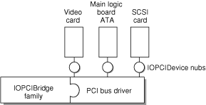
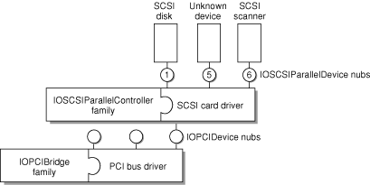
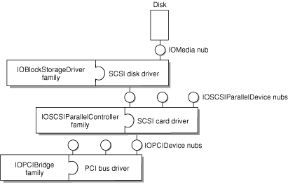

> 导航：[总目录](../../../README.md) · [documentation](../../../_indexes/documentation.md) · [Kernel Programming Guide](About%20This%20Document.md)

[Next](BSD%20Overview.md)[Previous](Bootstrap%20Contexts.md)

# I/O Kit Overview

Those of you who are already familiar with writing device drivers for Mac OS 9 or for BSD will discover that writing drivers for OS X requires some new ways of thinking. In creating OS X, Apple has completely redesigned the Macintosh I/O architecture, providing a framework for simplified driver development that supports many categories of devices. This framework is called the _I/O Kit_.

From a programming perspective, the I/O Kit provides an abstract view of the system hardware to the upper layers of OS X. The I/O Kit uses an object-oriented programming model, implemented in a restricted subset of C++ to promote increased code reuse.

By starting with properly designed base classes, you gain a head start in writing a new driver; with much of the driver code already written, you need only to fill in the specific code that makes your driver different. For example, all SCSI controllers deliver a fairly standard set of commands to a device, but do so via different low-level mechanisms. By properly using object-oriented programming methodology, a SCSI driver can implement those low-level transport portions without reimplementing the higher level SCSI protocol code. Similar opportunities for code reuse can be found in most types of drivers.

Part of the philosophy of the I/O Kit is to make the design completely open. Rather than hiding parts of the API in an attempt to protect developers from themselves, all of the I/O Kit source is available as part of Darwin. You can use the source code as an aid to designing (and debugging) new drivers.

Instead of hiding the interfaces, Apple’s designers have chosen to lead by example. Sample code and classes show the recommended (easy) way to write a driver. However, you are not prevented from doing things the hard way (or the wrong way). Instead, attention has been concentrated on making the “best” ways easy to follow.

You might ask why Apple chose to redesign the I/O model. At first glance, it might seem that reusing the model from Mac OS 9 or FreeBSD would have been an easier choice. There are several reasons for the decision, however.

Neither the Mac OS 9 driver model nor the FreeBSD model offered a feature set rich enough to meet the needs of OS X. The underlying operating-system technology of OS X is very different from that of Mac OS 9. The OS X kernel is significantly more advanced than the previous Mac OS system architecture; OS X needs to handle memory protection, preemption, multiprocessing, and other features not present (or substantially less pervasive) in previous versions of the Mac OS.

Although FreeBSD supports these features, the BSD driver model did not offer the automatic configuration, stacking, power management, or dynamic device-loading features required in a modern, consumer-oriented operating system.

By redesigning the I/O architecture, Apple’s engineers can take best advantage of the operating-system features in OS X. For example, virtual memory (VM) is not a fundamental part of the operating system in Mac OS 9. Thus, every driver writer must know about (and write for) VM. This has presented certain complications for developers. In contrast, OS X has simplified driver interaction with VM. VM capability is inherent in the OS X operating system and cannot be turned off by the user. Thus, VM capabilities can be abstracted into the I/O Kit, and the code for handling VM need not be written for every driver.

OS X offers an unprecedented opportunity to reuse code. In Mac OS 9, for example, all software development kits (SDKs) were independent of each other, duplicating functionality between them. In OS X, the I/O Kit is delivered as part of the basic developer tools, and code is shared among its various parts.

In contrast with traditional I/O models, the reusable code model provided by the I/O Kit can decrease your development work substantially. In porting drivers from Mac OS 9, for example, the OS X counterparts have been up to 75% smaller.

In general, all hardware support is provided directly by I/O Kit entities. One exception to this rule is imaging devices such as printers, scanners, and digital cameras (although these do make some use of I/O Kit functionality). Specifically, although communication with these devices is handled by the I/O Kit (for instance, under the FireWire or USB families), support for particular device characteristics is handled by user-space code (see [For More Information](#apple-f4xwc4dqnrsv64tfmyxwi33df52wszbpkridgmbqgaydsmbvfvbuqmrrgmwuerkiivduqrkh) for further discussion). If you need to support imaging devices, you should employ the appropriate imaging software development kit (SDK).

The I/O Kit attempts to represent, in software, the same hierarchy that exists in hardware. Some things are difficult to abstract, however. When the hardware hierarchy is difficult to represent (for example, if layering violations occur), then the I/O Kit abstractions provide less help for writing drivers.

In addition, all drivers exist to drive hardware; all hardware is different. Even with the reusable model provided by the I/O Kit, you still need to be aware of any hardware quirks that may impact a higher-level view of the device. The code to support those quirks still needs to be unique from driver to driver.

Although most developers should be able to take full advantage of I/O Kit device families (see [Families](#apple-f4xwc4dqnrsv64tfmyxwi33df52wszbpkridgmbqgaydsmbvfvbuqmrrgmwviucykjcummjqgi)), there will occasionally be some who cannot. Even those developers should be able to make use of parts of the I/O Kit, however. In any case, the source code is always available. You can replace functionality and modify the classes yourself if you need to do so.

In designing the I/O Kit, one goal has been to make developers’ lives easier. Unfortunately, it is not possible to make all developers’ lives uniformly easy. Therefore, a second goal of the I/O Kit design is to meet the needs of the majority of developers, without getting in the way of the minority who need lower level access to the hardware.

The I/O Kit provides a model of system hardware in an object-oriented framework. Each type of service or device is represented by a C++ class; each discrete service or device is represented by an instance (object) of that class.

There are three major conceptual elements of the I/O Kit architecture:

- [Families](#apple-f4xwc4dqnrsv64tfmyxwi33df52wszbpkridgmbqgaydsmbvfvbuqmrrgmwviucykjcummjqgi)
- [Drivers](#apple-f4xwc4dqnrsv64tfmyxwi33df52wszbpkridgmbqgaydsmbvfvbuqmrrgmwuerkiirbuircd)
- [Nubs](#apple-f4xwc4dqnrsv64tfmyxwi33df52wszbpkridgmbqgaydsmbvfvbuqmrrgmwviucykjcummjqgm)

A _family_ defines a collection of high-level abstractions common to all devices of a particular category that takes the form of C code and C++ classes. Families may include headers, libraries, sample code, test harnesses, and documentation. They provide the API, generic support code, and at least one example driver (in the documentation).

Families provide services for many different categories of devices. For example, there are protocol families (such as SCSI, USB, and FireWire), storage families (disk), network families, and families to describe human interface devices (mouse and keyboard). When devices have features in common, the software that supports those features is most likely found in a family.

Common abstractions are defined and implemented by the family, allowing all drivers in a family to share similar features easily. For example, all SCSI controllers have certain things they must do, such as scanning the SCSI bus. The SCSI family defines and implements the functionality that is common to SCSI controllers. Because this functionality has been included in the SCSI family, you do not need to include scanning code (for example) in your new SCSI controller driver.

Instead, you can concentrate on device-specific details that make your driver different from other SCSI drivers. The use of families means there is less code for you to write.

Families are dynamically loadable; they are loaded when needed and unloaded when no longer needed. Although some common families may be preloaded at system startup, all families should be considered to be dynamically loadable (and, therefore, potentially unloaded). See the [Connection Example](#apple-f4xwc4dqnrsv64tfmyxwi33df52wszbpkridgmbqgaydsmbvfvbuqmrrgmwviucykjcummjqgq) for an illustration.

A _driver_ is an I/O Kit object that manages a specific device or bus, presenting a more abstract view of that device to other parts of the system. When a driver is loaded, its required families are also loaded to provide necessary, common functionality. The request to load a driver causes all of its dependent requirements (and their requirements) to be loaded first. After all requirements are met, the requested driver is loaded as well. See [Connection Example](#apple-f4xwc4dqnrsv64tfmyxwi33df52wszbpkridgmbqgaydsmbvfvbuqmrrgmwviucykjcummjqgq) for an illustration.

Note that families are loaded upon demand of the driver, not the other way around. Occasionally, a family may already be loaded when a driver demands it; however, you should never assume this. To ensure that all requirements are met, each device driver should list all of its requirements in its _property list_.

Most drivers are in a client-provider relationship, wherein the driver must know about both the family from which it inherits and the family to which it connects. A SCSI _controller_ driver, for example, must be able to communicate with both the SCSI family and the PCI family (as a client of PCI and provider of SCSI). A SCSI _disk_ driver communicates with both the SCSI and storage families.

A _nub_ is an I/O Kit object that represents a point of connection for a driver. It represents a controllable entity such as a disk or a bus.

A nub is loaded as part of the family that instantiates it. Each nub provides access to the device or service that it represents and provides services such as matching, arbitration, and power management.

The concept of nubs can be more easily visualized by imagining a TV set. There is a wire attached to your wall that provides TV service from somewhere. For all practical purposes, it is permanently associated with that provider, the instantiating class (the cable company who installed the line). It can be attached to the TV to provide a service (cable TV). That wire is a nub.

Each nub provides a bridge between two drivers (and, by extension, between two families). It is most common that a driver publishes one nub for each individual device or service it controls. (In this example, imagine one wire for every home serviced by the cable company.)

It is also possible for a driver that controls only a single device or service to act as its own nub. (Imagine the antenna on the back of your TV that has a built-in wire.) See the [Connection Example](#apple-f4xwc4dqnrsv64tfmyxwi33df52wszbpkridgmbqgaydsmbvfvbuqmrrgmwviucykjcummjqgq) for an illustration of the relationship between nubs and drivers.

[Figure 12-1](#apple-f4xwc4dqnrsv64tfmyxwi33df52wszbpkridgmbqgaydsmbvfvbuqmrrgmwugskijbaukrcc) illustrates the I/O Kit architecture, using several example drivers and their corresponding nubs. Note that many different driver combinations are possible; this diagram shows only one possibility.

In this case, a SCSI stack is shown, with a PCI controller, a disk, and a SCSI scanner. The SCSI disk is controlled by a kernel-resident driver. The SCSI scanner is controlled by a driver that is part of a user application.

__Figure 12-1__  I/O Kit architecture

!

This example illustrates how a SCSI disk driver (Storage family) is connected to the PCI bus. The connection is made in several steps.

1. The PCI bus driver discovers a PCI device and announces its presence by creating a nub (`IOPCIDevice`). The nub’s class is defined by the PCI family.

   
2. The bus driver identifies (matches) the correct device driver and requests that the driver be loaded. At the end of this matching process, a SCSI controller driver has been found and loaded. Loading the controller driver causes all required families to be loaded as well. In this case, the SCSI family is loaded; the PCI family (also required) is already present. The SCSI controller driver is given a reference to the `IOPCIDevice` nub.
3. The SCSI controller driver scans the SCSI bus for devices. Upon finding a device, it announces the presence of the device by creating a nub (`IOSCSIDevice`). The class of this nub is defined by the SCSI family.

   
4. The controller driver identifies (matches) the correct device driver and requests that the driver be loaded. At the end of this matching process, a disk driver has been found and loaded. Loading the disk driver causes all required families to be loaded as well. In this case, the Storage family is loaded; the SCSI family (also required) is already present. The disk driver is given a reference to the `IOSCSIDevice` nub.

   

For more information on the I/O Kit, you should read the document _[IOKit Fundamentals](../../Device%20Drivers/IOKit%20Fundamentals/Introduction%20to%20I-O%20Kit%20Fundamentals.md#apple-f4xwc4dqnrsv64tfmyxwi33df52wszbpkridambqgaydcmi)_, available from Apple’s developer documentation website, [http://developer.apple.com/documentation](https://developer.apple.com/documentation). It provides a good general overview of the I/O Kit.

In addition to _[IOKit Fundamentals](../../Device%20Drivers/IOKit%20Fundamentals/Introduction%20to%20I-O%20Kit%20Fundamentals.md#apple-f4xwc4dqnrsv64tfmyxwi33df52wszbpkridambqgaydcmi)_, the website contains a number of HOWTO documents and topic-specific documents that describe issues specific to particular technology areas such as FireWire and USB.

[Next](BSD%20Overview.md)[Previous](Bootstrap%20Contexts.md)

