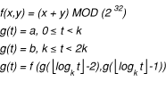

> 导航：[总目录](../../../README.md) · [documentation](../../../_indexes/documentation.md) · [Kernel Programming Guide](About%20This%20Document.md)


[Next](Performance%20Considerations.md)[Previous](The%20Early%20Boot%20Process.md)

# Security Considerations

Kernel-level security can mean many things, depending on what kind of kernel code you are writing. This chapter points out some common security issues at the kernel or near-kernel level and where applicable, describes ways to avoid them. These issues are covered in the following sections:

- [Security Implications of Paging](#apple-f4xwc4dqnrsv64tfmyxwi33df52wszbpkridgmbqgaydsmbvfvbuqmrqgywviucykjcummjqha)
- [Buffer Overflows and Invalid Input](#apple-f4xwc4dqnrsv64tfmyxwi33df52wszbpkridgmbqgaydsmbvfvbuqmrqgywviucykjcummjqhe)
- [User Credentials](#apple-f4xwc4dqnrsv64tfmyxwi33df52wszbpkridgmbqgaydsmbvfvbuqmrqgywviucykjcummjrga)
- [Remote Authentication](#apple-f4xwc4dqnrsv64tfmyxwi33df52wszbpkridgmbqgaydsmbvfvbuqmrqgywugrceijfemscd)
- [Temporary Files](#apple-f4xwc4dqnrsv64tfmyxwi33df52wszbpkridgmbqgaydsmbvfvbuqmrqgywviucykjcummjrgm)
- [/dev/mem and /dev/kmem](#apple-f4xwc4dqnrsv64tfmyxwi33df52wszbpkridgmbqgaydsmbvfvbuqmrqgywviucykjcummjrgq)
- [Key-based Authentication and Encryption](#apple-f4xwc4dqnrsv64tfmyxwi33df52wszbpkridgmbqgaydsmbvfvbuqmrqgywugrcejbeekrsd)
- [Console Debugging](#apple-f4xwc4dqnrsv64tfmyxwi33df52wszbpkridgmbqgaydsmbvfvbuqmrqgywviucykjcummjrgu)
- [Code Passing](#apple-f4xwc4dqnrsv64tfmyxwi33df52wszbpkridgmbqgaydsmbvfvbuqmrqgywviucykjcummjrgy)

Many of these issues are also relevant for application programming, but are crucial for programmers working in the kernel. Others are special considerations that application programers might not expect or anticipate.

In order to understand security in OS X, it is important to understand that there are two security models at work. One of these is the kernel security model, which is based on users, groups, and very basic per-user and per-group rights, which are, in turn, coupled with access control lists for increased flexibility. The other is a user-level security model, which is based on keys, keychains, groups, users, password-based authentication, and a host of other details that are beyond the scope of this document.

The user level of security contains two basic features that you should be aware of as a kernel programmer: Security Server and Keychain Manager.

The Security Server consists of a daemon and various access libraries for caching permission to do certain tasks, based upon various means of authentication, including passwords and group membership. When a program requests permission to do something, the Security Server basically says “yes” or “no,” and caches that decision so that further requests from that user (for similar actions within a single context) do not require reauthentication for a period of time.

The Keychain Manager is a daemon that provides services related to the keychain, a central repository for a user’s encryption/authentication keys. For more high level information on keys, see [Key-based Authentication and Encryption](#apple-f4xwc4dqnrsv64tfmyxwi33df52wszbpkridgmbqgaydsmbvfvbuqmrqgywugrcejbeekrsd).

The details of the user-level security model use are far beyond the scope of this document. However, if you are writing an application that requires services of this nature, you should consider taking advantage of the Security Server and Keychain Manager from the user-space portion of your application, rather than attempting equivalent services in the kernel. More information about these services can be found in Apple’s Developer Documentation website at [http://developer.apple.com/documentation](https://developer.apple.com/documentation).

Paging has long been a major problem for security-conscious programmers. If you are writing a program that does encryption, the existence of even a small portion of the cleartext of a document in a backing store could be enough to reduce the complexity of breaking that encryption by orders of magnitude.

Indeed, many types of data, such as hashes, unencrypted versions of sensitive data, and authentication tokens, should generally not be written to disk due to the potential for abuse. This raises an interesting problem. There is no good way to deal with this in user space (unless a program is running as `root`). However, for kernel code, it is possible to prevent pages from being written out to a backing store. This process is referred to as “wiring down” memory, and is described further in [Memory Mapping and Block Copying](Boundary%20Crossings.md#apple-f4xwc4dqnrsv64tfmyxwi33df52wszbpkridgmbqgaydsmbvfvbuqmrrg4wueqkcivceossk).

The primary purpose of wired memory is to allow DMA-based I/O. Since hardware DMA controllers generally do not understand virtual addressing, information used in I/O must be physically in memory at a particular location and must not move until the I/O operation is complete. This mechanism can also be used to prevent sensitive data from being written to a backing store.

Because wired memory can never be paged out (until it is unwired), wiring large amounts of memory has drastic performance repercussions, particularly on systems with small amounts of memory. For this reason, you should take care not to wire down memory indiscriminately and only wire down memory if you have a very good reason to do so.

In OS X, you can wire down memory at allocation time or afterwards. To wire memory at allocation time:

- In I/O Kit, call [IOMalloc](https://developer.apple.com/documentation/kernel/1575326-iomalloc) and [IOFree](https://developer.apple.com/documentation/kernel/1575290-iofree) to allocate and free wired memory.
- In other kernel extensions, call [OSMalloc](https://developer.apple.com/documentation/kernel/1398447-osmalloc) and [OSFree](https://developer.apple.com/documentation/kernel/1398441-osfree) and pass a tag type whose flags are set to [OSMT_DEFAULT](https://developer.apple.com/documentation/kernel/osmt_default).
- In user space code, allocate page-sized quantities with your choice of API, and then call [mlock](https://developer.apple.com/library/archive/documentation/System/Conceptual/ManPages_iPhoneOS/man2/mlock.2.html#//apple_ref/doc/man/2/mlock) to wire them.
- Inside the kernel itself (_not_ in kernel extensions), you can also use `kmem_alloc` and related functions.

For more information on wired memory, see [Memory Mapping and Block Copying](Boundary%20Crossings.md#apple-f4xwc4dqnrsv64tfmyxwi33df52wszbpkridgmbqgaydsmbvfvbuqmrrg4wueqkcivceossk).

Buffer overflows are one of the more common bugs in both application and kernel programming. The most common cause is failing to allocate space for the NULL character that terminates a string in C or C++. However, user input can also cause buffer overflows if fixed-size input buffers are used and appropriate care is not taken to prevent overflowing these buffers.

The most obvious protection, in this case, is the best one. Either don’t use fixed-length buffers or add code to reject or truncate input that overflows the buffer. The implementation details in either case depend on the type of code you are writing.

For example, if you are working with strings and truncation is acceptable, instead of using [strcpy](https://developer.apple.com/library/archive/documentation/System/Conceptual/ManPages_iPhoneOS/man3/strcpy.3.html#//apple_ref/doc/man/3/strcpy), you should use [strlcpy](https://developer.apple.com/library/archive/documentation/System/Conceptual/ManPages_iPhoneOS/man3/strlcpy.3.html#//apple_ref/doc/man/3/strlcpy) to limit the amount of data to copy. OS X provides length-limited versions of a number of string functions, including [strlcpy](https://developer.apple.com/library/archive/documentation/System/Conceptual/ManPages_iPhoneOS/man3/strlcpy.3.html#//apple_ref/doc/man/3/strlcpy), [strlcat](https://developer.apple.com/library/archive/documentation/System/Conceptual/ManPages_iPhoneOS/man3/strlcat.3.html#//apple_ref/doc/man/3/strlcat), [strncmp](https://developer.apple.com/library/archive/documentation/System/Conceptual/ManPages_iPhoneOS/man3/strncmp.3.html#//apple_ref/doc/man/3/strncmp), [snprintf](https://developer.apple.com/library/archive/documentation/System/Conceptual/ManPages_iPhoneOS/man3/snprintf.3.html#//apple_ref/doc/man/3/snprintf), and [vsnprintf](https://developer.apple.com/library/archive/documentation/System/Conceptual/ManPages_iPhoneOS/man3/vsnprintf.3.html#//apple_ref/doc/man/3/vsnprintf).

If truncation of data is not acceptable, you must explicitly call [strlen](https://developer.apple.com/library/archive/documentation/System/Conceptual/ManPages_iPhoneOS/man3/strlen.3.html#//apple_ref/doc/man/3/strlen) to determine the length of the input string and return an error if it exceeds the maximum length (one less than the buffer size).

Other types of invalid input can be somewhat harder to handle, however. As a general rule, you should be certain that switch statements have a default case unless you have listed every legal value for the width of the type.

A common mistake is assuming that listing every possible value of an `enum` type provides protection. An enum is generally implemented as either a `char` or an `int` internally. A careless or malicious programmer could easily pass any value to a kernel function, including those not explicitly listed in the type, simply by using a different prototype that defines the parameter as, for example, an `int`.

Another common mistake is to assume that you can dereference a pointer passed to your function by another function. You should always check for null pointers before dereferencing them. Starting a function with

```swift
int do_something(bufptr *bp, int flags) {
    char *token = bp->b_data;
```

is the surest way to guarantee that someone else will pass in a null buffer pointer, either maliciously or because of programmer error. In a user program, this is annoying. In a file system, it is devastating.

Security is particularly important for kernel code that draws input from a network. Assumptions about packet size are frequently the cause of security problems. Always watch for packets that are too big and handle them in a reasonable way. Likewise, always verify checksums on packets. This can help you determine if a packet was modified, damaged, or truncated in transit, though it is far from foolproof. If the validity of data from a network is of vital importance, you should use remote authentication, signing, and encryption mechanisms such as those described in [Remote Authentication](#apple-f4xwc4dqnrsv64tfmyxwi33df52wszbpkridgmbqgaydsmbvfvbuqmrqgywugrceijfemscd) and [Key-based Authentication and Encryption](#apple-f4xwc4dqnrsv64tfmyxwi33df52wszbpkridgmbqgaydsmbvfvbuqmrqgywugrcejbeekrsd).

As described in the introduction to this chapter, OS X has two different means of authenticating users. The user-level security model (including the Keychain Manager and the Security Server) is beyond the scope of this document. The kernel security model, however, is of greater interest to kernel developers, and is much more straightforward than the user-level model.

The kernel security model is based on two mechanisms: basic user credentials and ACL permissions. The first, basic user credentials , are passed around within the kernel to identify the current user and group of the calling process. The second authentication mechanism, access control lists (ACLs), provides access control at a finer level of granularity.

One of the most important things to remember when working with credentials is that they are per process, not per context. This is important because a process may not be running as the console user. Two examples of this are processes started from an `ssh` session (since ssh runs in the startup context) and `setuid` programs (which run as a different user in the _same_ login context).

It is crucial to be aware of these issues. If you are communicating with a `setuid root` GUI application in a user’s login context, and if you are executing another application or are reading sensitive data, you probably want to treat it as if it had the same authority as the console user, not the authority of the effective user ID caused by running `setuid`. This is particularly problematic when dealing with programs that run as `setuid root` if the console user is not in the admin group. Failure to perform reasonable checks can lead to major security holes down the road.

However, this is not a hard and fast rule. Sometimes it is not obvious whether to use the credentials of the running process or those of the console user. In such cases, it is often reasonable to have a helper application show a dialog box on the console to require interaction from the console user. If this is not possible, a good rule of thumb is to assume the lesser of the privileges of the current and console users, as it is almost always better to have kernel code occasionally fail to provide a needed service than to provide that service unintentionally to an unauthorized user or process.

It is generally easier to determine the console user from a user space application than from kernel space code. Thus, you should generally do such checks from user space. If that is not possible, however, the variable `console_user` (maintained by the VFS subsystem) will give you the uid of the last owner of `/dev/console` (maintained by a bit of code in the [chown](https://developer.apple.com/library/archive/documentation/System/Conceptual/ManPages_iPhoneOS/man2/chown.2.html#//apple_ref/doc/man/2/chown) system call). This is certainly not an ideal solution, but it does provide the most likely identity of the console user. Since this is only a “best guess,” however, you should use this only if you cannot do appropriate checking in user space.

Basic user credentials used in the kernel are stored in a variable of type `struct ucred`. These are mostly used in specialized parts of the kernel—generally in places where the determining factor in permissions is whether or not the caller is running as the root user.

This structure has four fields:

- `cr_ref`—reference count (used internally)
- `cr_uid`—user ID
- `cr_ngroups`—number of groups in `cr_groups`
- `cr_groups[NGROUPS]`—list of groups to which the user belongs

This structure has an internal reference counter to prevent unintentionally freeing the memory associated with it while it is still in use. For this reason, you should not indiscriminately copy this object but should instead either use `crdup` to duplicate it or use `crcopy` to duplicate it and (potentially) free the original. You should be sure to `crfree` any copies you might make. You can also create a new, empty `ucred` structure with `crget`.

The prototypes for these functions follow:

- `struct ucred *crdup(struct ucred *cr)`
- `struct ucred *crcopy(struct ucred *cr)`
- `struct ucred *crget(void)`
- `void crfree(struct ucred *cr)`

Access control lists are a new feature in OS X v10.4. Access control lists are primarily used in the file system portion of the OS X kernel, and are supported through the use of the `kauth` API.

The kauth API is described in the header file `/System/Library/Frameworks/Kernel.framework/Headers/sys/kauth.h`. Because this API is still evolving, detailed documentation is not yet available.

This is one of the more difficult problems in computer security: the ability to identify someone connecting to a computer remotely. One of the most secure methods is the use of public key cryptography, which is described in more detail in [Key-based Authentication and Encryption](#apple-f4xwc4dqnrsv64tfmyxwi33df52wszbpkridgmbqgaydsmbvfvbuqmrqgywugrcejbeekrsd). However, many other means of authentication are possible, with varying degrees of security.

Some other authentication schemes include:

- blind trust
- IP-only authentication
- password (shared secret) authentication
- combination of IP and password authentication
- one-time pads (challenge-response)
- time-based authentication

Most of these are obvious, and require no further explanation. However, one-time pads and time-based authentication may be unfamiliar to many people outside security circles, and are thus worth mentioning in more detail.

Based on the concept of “challenge-response” pairs, one-time pad (OTP) authentication requires that both parties have an identical list of pairs of numbers, words, symbols, or whatever, sorted by the first item. When trying to access a remote system, the remote system prompts the user with a challenge. The user finds the challenge in the first column, then sends back the matching response. Alternatively, this could be an automated exchange between two pieces of software.

For maximum security, no challenge should ever be issued twice. For this reason, and because these systems were initially implemented with a paper pad containing challenge-response, or CR pairs, such systems are often called one-time pads.

The one-time nature of OTP authentication makes it impossible for someone to guess the appropriate response to any one particular challenge by a brute force attack (by responding to that challenge repeatedly with different answers). Basically, the only way to break such a system, short of a lucky guess, is to actually know some portion of the contents of the list of pairs.

For this reason, one-time pads can be used over insecure communication channels. If someone snoops the communication, they can obtain that challenge-response pair. However, that information is of no use to them, since that particular challenge will never be issued again. (It does not even reduce the potential sample space for responses, since only the challenges must be unique.)

This is probably the least understood means of authentication, though it is commonly used by such technologies as SecurID. The concept is relatively straightforward. You begin with a mathematical function that takes a small number of parameters (two, for example) and returns a new parameter. A good example of such a function is the function that generates the set of Fibonacci numbers (possibly truncated after a certain number of bits, with arbitrary initial seed values).

Take this function, and add a third parameter, `t`, representing time in units of `k` seconds. Make the function be a generating function on `t`, with two seed values, a and b, where



In other words, every `k` seconds, you calculate a new value based on the previous two and some equation. Then discard the oldest value, replacing it with the second oldest value, and replace the second oldest value with the value that you just generated.

As long as both ends have the same notion of the current time and the original two numbers, they can then calculate the most recently generated number and use this as a shared secret. Of course, if you are writing code that does this, you should use a closed form of this equation, since calculating Fibonacci numbers recursively without additional storage grows at `O(2^(t/k))`, which is not practical when `t` is measured in years and `k` is a small constant measured in seconds.

The security of such a scheme depends on various properties of the generator function, and the details of such a function are beyond the scope of this document. For more information, you should obtain an introductory text on cryptography,. such as Bruce Schneier’s _Applied Cryptography_.

Temporary files are a major source of security headaches. If a program does not set permissions correctly and in the right order, this can provide a means for an attacker to arbitrarily modify or read these files. The security impact of such modifications depends on the contents of the files.

Temporary files are of much less concern to kernel programmers, since most kernel code does not use temporary files. Indeed, kernel code should generally not use files at all. However, many people programming in the kernel are doing so to facilitate the use of applications that may use temporary files. As such, this issue is worth noting.

The most common problem with temporary files is that it is often possible for a malicious third party to delete the temporary file and substitute a different one with relaxed permissions in its place. Depending on the contents of the file, this could range from being a minor inconvenience to being a relatively large security hole, particularly if the file contains a shell script that is about to be executed with the permissions of the program’s user.

One particularly painful surprise to people doing security programming in most UNIX or UNIX-like environments is the existence of `/dev/mem` and `/dev/kmem`. These device files allow the `root` user to arbitrarily access the contents of physical memory and kernel memory, respectively. There is absolutely nothing you can do to prevent this. From a kernel perspective, root is omnipresent and omniscient. If this is a security concern for your program, then you should consider whether your program should be used on a system controlled by someone else and take the necessary precautions.

Key-based authentication and encryption are ostensibly some of the more secure means of authentication and encryption, and can exist in many forms. The most common forms are based upon a shared secret. The DES, 3DES (triple-DES), IDEA, twofish, and blowfish ciphers are examples of encryption schemes based on a shared secret. Passwords are an example of an authentication scheme based on a shared secret.

The idea behind most key-based encryption is that you have an encryption key of some arbitrary length that is used to encode the data, and that same key is used in the opposite manner (or in some cases, in the same manner) to decode the data.

The problem with shared secret security is that the initial key exchange must occur in a secure fashion. If the integrity of the key is compromised during transmission, the data integrity is lost. This is not a concern if the key can be generated ahead of time and placed at both transport endpoints in a secure fashion. However, in many cases, this is not possible or practical because the two endpoints (be they physical devices or system tasks) are controlled by different people or entities. Fortunately, an alternative exists, known as zero-knowledge proofs.

The concept of a zero-knowledge proof is that two seemingly arbitrary key values, x and y, are created, and that these values are related by some mathematical function ƒ in such a way that

```
ƒ(ƒ(a,k1),k2) = a
```

That is, applying a well-known function to the original cleartext using the first key results in ciphertext which, when that same function is applied to the ciphertext using the second key returns the original data. This is also reversible, meaning that

```
ƒ(ƒ(a,k2),k1) = a
```

If the function `f` is chosen correctly, it is extremely difficult to derive x from y and vice-versa, which would mean that there is no function that can easily transform the ciphertext back into the cleartext based upon the key used to encode it.

An example of this is to choose the mathematical function to be

```
f(a,k)=((a*k) MOD 256) + ((a*k)/256)
```

where `a` is a byte of cleartext, and `k` is some key 8 bits in length. This is an extraordinarily weak cipher, since the function `f` allows you to easily determine one key from the other, but it is illustrative of the basic concept.

Pick `k1` to be `8` and `k2` to be `32`. So for `a=73`, `(a * 8)=584`. This takes two bytes, so add the bits in the high byte to the bits of the low byte, and you get `74`. Repeat this process with `32`. This gives you `2368`. Again, add the bits from the high byte to the bits of the low byte, and you have `73` again.

This mathematical concept (with very different functions), when put to practical use, is known as public key (PK) cryptography, and forms the basis for RSA and DSA encryption.

Public key encryption can be very powerful when used properly. However, it has a number of inherent weaknesses. A complete explanation of these weaknesses is beyond the scope of this document. However, it is important that you understand these weaknesses at a high level to avoid falling into some common traps. Some commonly mentioned weakness of public key cryptography include:

- Trust model for key exchange
- Pattern sensitivity
- Short data weakness

The most commonly discussed weakness of public key cryptography is the initial key exchange process itself. If someone manages to intercept a key during the initial exchange, he or she could instead give you his or her own public key and intercept messages going to the intended party. This is known as a man-in-the-middle attack.

For such services as `ssh`, most people either manually copy the keys from one server to another or simply assume that the initial key exchange was successful. For most purposes, this is sufficient.

In particularly sensitive situations, however, this is not good enough. For this reason, there is a procedure known as _key signing_. There are two basic models for key signing: the central authority model and the web of trust model.

The central authority model is straightforward. A central certifying agency signs a given key, and says that they believe the owner of the key is who he or she claims to be. If you trust that authority, then by association, you trust keys that the authority claims are valid.

The web of trust model is somewhat different. Instead of a central authority, individuals sign keys belonging to other individuals. By signing someone’s key, you are saying that you trust that the person is really who he or she claims to be and that you believe that the key really belongs to him or her. The methods you use for determining that trust will ultimately impact whether others trust your signatures to be valid.

There are many different ways of determining trust, and thus many groups have their own rules for who should and should not sign someone else’s key. Those rules are intended to make the trust level of a key depend on the trust level of the keys that have signed it.

The line between central authorities and web of trust models is not quite as clear-cut as you might think, however. Many central authorities are hierarchies of authorities, and in some cases, they are actually webs of trust among multiple authorities. Likewise, many webs of trust may include centralized repositories for keys. While those repositories don’t provide any certification of the keys, they do provide centralized access. Finally, centralized authorities can easily sign keys as part of a web of trust.

There are many websites that describe webs of trust and centralized certification schemes. A good general description of several such models can be found at [http://world.std.com/~cme/html/web.html](http://world.std.com/~cme/html/web.html).

Existing public key encryption algorithms do a good job at encrypting semi-random data. They fall short when encrypting data with certain patterns, as these patterns can inadvertently reveal information about the keys. The particular patterns depend on the encryption scheme. Inadvertently hitting such a pattern does not allow you to determine the private key. However, they can reduce the search space needed to decode a given message.

Short data weakness is closely related to pattern sensitivity. If the information you are encrypting consists of a single number, for example the number 1, you basically get a value that is closely related mathematically to the public key. If the intent is to make sure that only someone with the private key can get the original value, you have a problem.

In other words, public key encryption schemes generally do not encrypt all patterns equally well. For this reason (and because public key cryptography tends to be slower than single key cryptography), public keys are almost never used to encrypt end-user data. Instead, they are used to encrypt a _session key_. This session key is then used to encrypt the actual data using a shared secret mechanism such as 3DES, AES, blowfish, and so on.

Public key cryptography can be used in many ways. When both keys are private, it can be used to send data back and forth. However this use is no more useful than a shared secret mechanism. In fact, it is frequently weaker, for the reasons mentioned earlier in the chapter. Public key cryptography becomes powerful when one key is made public.

Assume that Ernie and Bert want to send coded messages. Ernie gives Bert his public key. Assuming that the key was not intercepted and replaced with someone else’s key, Bert can now send data to Ernie securely, because data encrypted with the public key can only be decrypted with the private key (which only Ernie has).

Bert uses this mechanism to send a shared secret. Bert and Ernie can now communicate with each other using a shared secret mechanism, confident in the knowledge that no third party has intercepted that secret. Alternately, Bert could give Ernie his public key, and they could both encrypt data using each other’s public keys, or more commonly by using those public keys to encrypt a session key and encrypting the data with that session key.

Public key cryptography can also be used for verification of identity. Kyle wants to know if someone on the Internet who claims to be Stan is really Stan. A few months earlier, Stan handed Kyle his public key on a floppy disk. Thus, since Kyle already has Stan’s public key (and trusts the source of that key), he can now easily verify Stan’s identity.

To achieve this, Kyle sends a cleartext message and asks Stan to encrypt it. Stan encrypts it with his private key. Kyle then uses Stan’s public key to decode the ciphertext. If the resulting cleartext matches, then the person on the other end must be Stan (unless someone else has Stan’s private key).

Finally, public key cryptography can be used for signing. Ahmed is in charge of meetings of a secret society called the Stupid Acronym Preventionists club. Abraham is a member of the club and gets a TIFF file containing a notice of their next meeting, passed on by way of a fellow member of the science club, Albert. Abraham is concerned, however, that the notice might have come from Bubba, who is trying to infiltrate the SAPs.

Ahmed, however, was one step ahead, and took a checksum of the original message and encrypted the checksum with his private key, and sent the encrypted checksum as an attachment. Abraham used Ahmed’s public key to decrypt the checksum, and found that the checksum did not match that of the actual document. He wisely avoided the meeting. Isaac, however, was tricked into revealing himself as a SAP because he didn’t remember to check the signature on the message.

The moral of this story? One should always beware of geeks sharing TIFFs—that is, if the security of some piece of data is important and if you do not have a direct, secure means of communication between two applications, computers, people, and so on, you must verify the authenticity of any communication using signatures, keys, or some other similar method. This may save your data and also save face.

Encryption is a powerful technique for keeping data secure if the initial key exchange occurs in a secure fashion. One means for this is to have a public key, stored in a well-known (and trusted) location. This allows for one-way encrypted communication through which a shared secret can be transferred for later two-way encrypted communication.

You can use encryption not only for protecting data, but also for verifying the authenticity of data by encrypting a checksum. You can also use it to verify the identity of a client by requiring that the client encrypt some random piece of data as proof that the client holds the appropriate encryption key.

Encryption, however, is not the final word in computer security. Because it depends on having some form of trusted key exchange, additional infrastructure is needed in order to achieve total security in environments where communication can be intercepted and modified.

In traditional UNIX and UNIX-like systems, the console is owned by root. Only root sees console messages. For this reason, print statements in the kernel are relatively secure.

In OS X, any user can run the Console application. This represents a major departure from other UNIX-like systems. While it is never a good idea to include sensitive information in kernel debugging statements, it is particularly important not to do so in OS X. You must assume that any information displayed to the console could potentially be read by any user on the system (since the console is virtualized in the form of a user-viewable window).

Printing any information involving sensitive data, including its location on disk or in memory, represents a security hole, however slight, and you should write your code accordingly. Obviously this is of less concern if that information is only printed when the user sets a debugging flag somewhere, but for normal use, printing potentially private information to the console is strongly discouraged.

You must also be careful not to inadvertently print information that you use for generating password hashes or encryption keys, such as seed values passed to a random number generator.

This is, by necessity, not a complete list of information to avoid printing to the console. You must use your own judgement when deciding whether a piece of information could be valuable if seen by a third party, and then decide if it is appropriate to print it to the console.

There are many ways of passing executable code into the kernel from user space. For the purposes of this section, executable code is not limited to compiled object code. It includes any instructions passed into the kernel that significantly affect control flow. Examples of passed-in executable code range from simple rules such as the filtering code uploaded in many firewall designs to bytecode uploads for a SCSI card.

If it is possible to execute your code in user space, you should not even contemplate pushing code into the kernel. For the rare occasion where no other reasonable solution exists, however, you may need to pass some form of executable code into the kernel. This section explains some of the security ramifications of pushing code into the kernel and the level of verification needed to ensure consistent operation.

Here are some guidelines to minimize the potential for security holes:

1. No raw object code.

   Direct execution of code passed in from user space is _very_ dangerous. Interpreted languages are the only reasonable solution for this sort of problem, and even this is fraught with difficulty. Traditional machine code can’t be checked sufficiently to ensure security compliance.
2. Bounds checking.

   Since you are in the kernel, you are responsible for making sure that any uploaded code does not randomly access memory and does not attempt to do direct hardware access. You would normally make this a feature of the language itself, restricting access to the data element on which the bytecode is operating.
3. Termination checking.

   With very, very few exceptions, the language chosen should be limited to code that can be verified to terminate, and you should verify accordingly. If your driver is stuck in a tightly rolled loop, it is probably unable to do its job, and may impact overall system performance in the process. A language that does not allow (unbounded) loops (for example, allowing `for` but not `while` or `goto` could be one way to ensure termination.
4. Validity checking.

   Your bytecode interpreter would be responsible for checking ahead for any potentially invalid operations and taking appropriate punitive actions against the uploaded code. For example, if uploaded code is allowed to do math, then proper protection must be in place to handle divide by zero errors.
5. Sanity checking.

   You should verify that the output is something remotely reasonable, if possible. It is not always possible to verify that the output is correct, but it is generally possible to create rules that prevent egregiously invalid output.

   For example, a network filter rule should output something resembling packets. If the checksums are bad, or if other information is missing or corrupt, clearly the uploaded code is faulty, and appropriate actions should be taken. It would be highly inappropriate for OS X to send out bad network traffic.

In general, the more restrictive the language set, the lower the security risk. For example, interpreting simple network routing policies is less likely to be a security problem than interpreting packet rewriting rules, which is less likely to be an issue than running Java bytecode in the kernel. As with anything else, you must carefully weigh the potential benefits against the potential drawbacks and make the best decision given the information available.

[Next](Performance%20Considerations.md)[Previous](The%20Early%20Boot%20Process.md)

