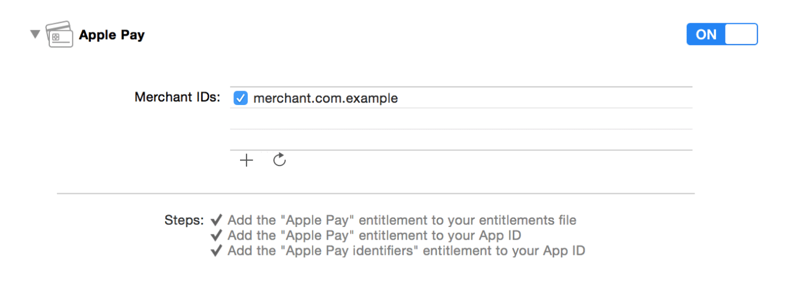

> 导航：[总目录](../../README.md) · [ApplePay_Guide](../../_indexes/ApplePay_Guide.md) · [Apple Pay Programming Guide](index.md)

## Configuring Your Environment

A merchant ID identifies you to Apple Pay as being able to accept payments. A Payment Processing certificate that is associated with your merchant ID is used to encrypt payment information. Before your app can use Apple Pay, you need to register a merchant ID and create its Payment Processing certificate.

__To register a Merchant ID__

1. In Member Center, select [Certificates, Identifiers & Profiles](https://developer.apple.com/account).
2. Under Identifiers, select Merchant IDs.
3. Click the Add button (+) in the upper-right corner.
4. Enter a description and identifier, and click Continue.
5. Review the settings, and click Register.
6. Click Done.

__To create a Payment Processing certificate__

1. In Member Center, select [Certificates, Identifiers & Profiles](https://developer.apple.com/account).
2. Under Identifiers, select Merchant IDs.
3. Select the merchant ID from the list, and click Edit.
4. In the Payment Processing Certificates section, click Create Certificate. Follow the instructions to obtain or generate your certificate signing request (CSR), and click Continue.
5. Click Choose File, select your CSR, and click Generate.
6. Download the certificate by clicking Download, and click Done.

If you see a warning in Keychain Access that the certificate was signed by an unknown authority or that it has an invalid issuer, make sure you have the WWDR intermediate certificate - G2 and the Apple Root CA - G2 installed in your keychain. You can download them from [apple.com/certificateauthority](https://www.apple.com/certificateauthority/).

To enable Apple Pay for your app in Xcode, open the Capabilities pane. Select the switch in the Apple Pay row, and then select the merchant IDs you want the app to use.

> [!NOTE]
> 

[About Apple Pay](index.md#apple-f4xwc4dqnrsv64tfmyxwi33df52wszbpkridimbqge2donrufvbuqmjnknltc)

[Creating Payment Requests](CreateRequest.md#apple-f4xwc4dqnrsv64tfmyxwi33df52wszbpkridimbqge2donrufvbuqmznknlte)
