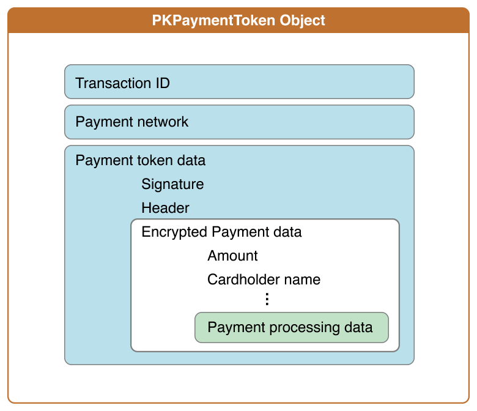

> 导航：[总目录](../../README.md) · [ApplePay_Guide](../../_indexes/ApplePay_Guide.md) · [Apple Pay Programming Guide](index.md)

## Processing Payments

Processing a payment involves several steps:

1. Sending the payment information to your server, along with other information needed to process the order
2. Verifying the hashes and signature of the payment data
3. Decrypting the encrypted payment data
4. Submitting payment data to the payment processing network
5. Submitting the order to your order-tracking system

You have two options for processing the payment: You can take advantage of a payment platform to process the payment, or you can implement the payment processing yourself. A payment processing platform typically handles most of the steps listed above.

Reading, verifying, and processing payment information requires an understanding of several areas of cryptography such as calculating an SHA–1 hash, reading and validating a PKCS #7 signature, and performing elliptic curve Diffie-Hellman key exchange. If you don’t have a background in cryptography, consider using a payment platform that performs these operations for you. For information about payment platforms that support Apple Pay, see [developer.apple.com/apple-pay/](https://developer.apple.com/apple-pay/).

The information used to process a payment has a nested data structure, as shown in Figure 5-1. A payment token is an instance of the [PKPaymentToken](https://developer.apple.com/documentation/passkit/pkpaymenttoken) class. The value of its [paymentData](https://developer.apple.com/documentation/passkit/pkpaymenttoken/1617000-paymentdata) property is a JSON dictionary, which has a header with information used for validation, and encrypted payment data. The encrypted data includes information such as the amount and cardholder name and other information used for the specific payment processing protocol.

__Figure 5-1__Payment data structure

For details on the format of the payment data structure, see _[Payment Token Format Reference](https://developer.apple.com/library/archive/documentation/PassKit/Reference/PaymentTokenJSON/PaymentTokenJSON.html#//apple_ref/doc/uid/TP40014929)_.

[Authorizing Payments](Authorization.md#apple-f4xwc4dqnrsv64tfmyxwi33df52wszbpkridimbqge2donrufvbuqnbnknltg)
