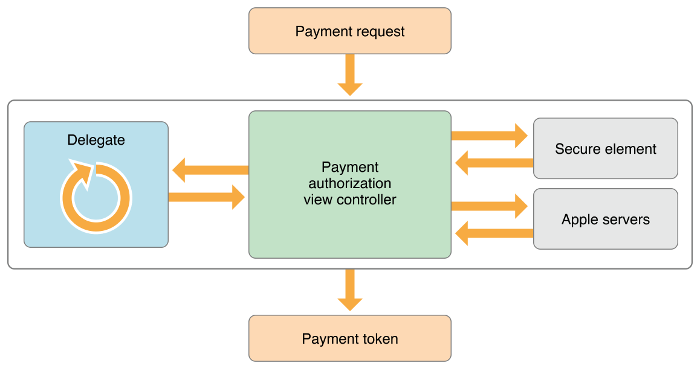

> 导航：[总目录](../../README.md) · [ApplePay_Guide](../../_indexes/ApplePay_Guide.md)

## About Apple Pay

Apple Pay is a mobile payment technology that provides an easy and secure way for users to pay for real-world goods and services in your iOS apps, watchOS apps, and websites on Safari. This programming guide discusses Apple Pay in iOS apps.

For Apple Pay on the web, see [Apple Pay JS](https://developer.apple.com/reference/applepayjs).

For digital goods and services delivered within the app, see _[In-App Purchase Programming Guide](https://developer.apple.com/library/archive/documentation/NetworkingInternet/Conceptual/StoreKitGuide/Introduction.html#//apple_ref/doc/uid/TP40008267)_.

### Working with Apple Pay

Apps that use Apple Pay need to enable the Apple Pay capabilities in Xcode. You also register a merchant ID and create a Payment Processing certificate, which is a cryptographic key that is used to securely send payment data to your server.

To initiate a payment, your app creates a payment request. This request includes the subtotal for the services and goods purchased, as well as any additional charges for tax, shipping, or discounts. Pass this request to a payment authorization view controller, which displays the request to the user and prompts for any needed information, such as a shipping or billing address. Your delegate is called to update the request as the user interacts with the view controller.

As soon as the user authorizes the payment, Apple Pay encrypts payment information to prevent an unauthorized third party from accessing it. On the device, Apple Pay sends the payment request to the Secure Element, which is a dedicated chip on the user’s device. The Secure Element adds the payment data for the specified card and merchant, creating an encrypted payment token. It then passes this token to Apple’s servers, where it is reencrypted using your Payment Processing certificate. Finally, the servers pass the token back to your app for processing.

The payment token is never accessed or stored on Apple’s servers. The servers simply reencrypt the token using your certificate. This process lets your app securely encrypt the payment information without it having to distribute your Payment Processing certificate as part of the app.

For more information about Apple Pay’s security, see [iOS Security Guide](https://www.apple.com/business/docs/iOS_Security_Guide.pdf).

In most cases, your app passes the encrypted payment token to a third-party payment solution provider to decrypt and process the payment. However, if your team has an existing payment infrastructure, you can decrypt and process the payment on your own server.

For information about payment solution providers that support Apple Pay, see [Apple Pay - Apple Developer](https://developer.apple.com/apple-pay/).

### Testing Apple Pay Transactions

Use the Apple Pay Sandbox environment to test your transactions with test payment cards.

1. In App Store Connect, create a test account. This account works for both App Store and Apple Pay testing.
2. On a valid test device, log into iCloud using the test account.
3. In the Wallet app, add a new card using manual entry.

Logging in and out of your iCloud account removes your cards. Test cards can only be used in the Sandbox environment. Additionally, the Sandbox environment tests only the connection between your app and the test card network. It does not test the connection between your app and your payment solution provider.

For more information, see [Apple Pay Sandbox Testing](https://developer.apple.com/support/apple-pay-sandbox/).

[Configuring Your Environment](Configuration.md#apple-f4xwc4dqnrsv64tfmyxwi33df52wszbpkridimbqge2donrufvbuqmrnknltc)
