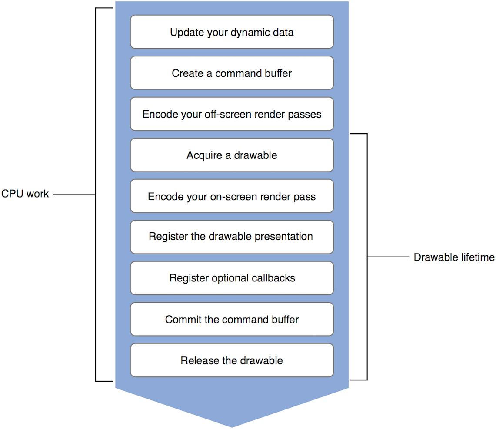

> 导航：[总目录](../../../README.md) · [documentation](../../../_indexes/documentation.md) · [Metal Best Practices Guide](index.md)

## Drawables

__Best Practice:__ Hold a drawable as briefly as possible.

Most Metal apps implement a layer-backed view defined by a [CAMetalLayer](https://developer.apple.com/documentation/quartzcore/cametallayer) object. This layer vends an efficient displayable resource conforming to the [CAMetalDrawable](https://developer.apple.com/documentation/quartzcore/cametaldrawable) protocol, commonly referred to as a _drawable_. A drawable provides a [MTLTexture](https://developer.apple.com/documentation/metal/mtltexture) object that is typically used as a displayable render target attached to a [MTLRenderPassDescriptor](https://developer.apple.com/documentation/metal/mtlrenderpassdescriptor) object, with the goal of being presented on the screen.

A drawable’s presentation is registered by calling a command buffer’s [presentDrawable:](https://developer.apple.com/documentation/metal/mtlcommandbuffer/1443029-present) method before calling its [commit](https://developer.apple.com/documentation/metal/mtlcommandbuffer/1443003-commit) method. However, the drawable itself is actually presented only after the command buffer has completed execution and the drawable has been rendered or written to.

A drawable tracks whether it has outstanding render or write requests on it and will not present until those requests have been completed. A command buffer registers its drawable requests only when it is scheduled for execution. Registering a drawable presentation after the command buffer is scheduled guarantees that all command buffer work will be completed before the drawable is actually presented. Do not wait for the command buffer to complete its GPU work before registering a drawable presentation; this will cause a considerable CPU stall.

> [!IMPORTANT]
> 

### Hold a Drawable as Briefly as Possible

Drawables are expensive system resources created and maintained by the Core Animation framework. They exist within a limited and reusable resource pool and may or may not be available when requested by your app. If there is no drawable available at the time of your request, the calling thread is blocked until a new drawable becomes available (which is usually at the next display refresh interval).

To hold a drawable as briefly as possible, follow these two steps:

1. Always acquire a drawable as late as possible; preferably, immediately before encoding an on-screen render pass. A frame’s CPU work may include dynamic data updates and off-screen render passes that you can perform before acquiring a drawable.
2. Always release a drawable as soon as possible; preferably, immediately after finalizing a frame’s CPU work. It is highly advisable to contain your rendering loop within an autorelease pool block to avoid possible deadlock situations with multiple drawables.

   > [!NOTE]
   > 

Figure 6-1 shows the lifetime of a drawable in relation to other CPU work.

__Figure 6-1__The lifetime of a drawable

### Use a MetalKit View to Interact with Drawables

Using an [MTKView](https://developer.apple.com/documentation/metalkit/mtkview) object is the preferred way to interact with drawables. An [MTKView](https://developer.apple.com/documentation/metalkit/mtkview) object is backed by a [CAMetalLayer](https://developer.apple.com/documentation/quartzcore/cametallayer) object and provides the [currentDrawable](https://developer.apple.com/documentation/metalkit/mtkview/1535971-currentdrawable) property to acquire the drawable for the current frame. The current frame renders into this drawable and the [presentDrawable:](https://developer.apple.com/documentation/metal/mtlcommandbuffer/1443029-present) method schedules the actual presentation to occur at the next display refresh interval. The [currentDrawable](https://developer.apple.com/documentation/metalkit/mtkview/1535971-currentdrawable) property is automatically updated at the end of every frame.

An [MTKView](https://developer.apple.com/documentation/metalkit/mtkview) object also provides the [currentRenderPassDescriptor](https://developer.apple.com/documentation/metalkit/mtkview/1536024-currentrenderpassdescriptor) convenience property that references the current drawable’s texture; use this property to create a render command encoder that renders into the current drawable. A call to the [currentRenderPassDescriptor](https://developer.apple.com/documentation/metalkit/mtkview/1536024-currentrenderpassdescriptor) property implicitly acquires the drawable for the current frame, which is then stored in the [currentDrawable](https://developer.apple.com/documentation/metalkit/mtkview/1535971-currentdrawable) property.

> [!NOTE]
> 

Listing 6-1 shows how to use a drawable with a MetalKit view.

__Listing 6-1__Using drawables with a MetalKit view

1. `- (void)render:(MTKView *)view {`
2. `// Update your dynamic data`
3. `[self update];`
5. `// Create a new command buffer`
6. `id <MTLCommandBuffer> commandBuffer = [_commandQueue commandBuffer];`
8. `// BEGIN encoding any off-screen render passes`
9. `/* ... */`
10. `// END encoding any off-screen render passes`
12. `// BEGIN encoding your on-screen render pass`
13. `// Acquire a render pass descriptor generated from the drawable's texture`
14. `// 'currentRenderPassDescriptor' implicitly acquires the drawable`
15. `MTLRenderPassDescriptor* renderPassDescriptor = view.currentRenderPassDescriptor;`
17. `// If there's a valid render pass descriptor, use it to render into the current drawable`
18. `if(renderPassDescriptor != nil) {`
19. `id<MTLRenderCommandEncoder> renderCommandEncoder = [commandBuffer renderCommandEncoderWithDescriptor:renderPassDescriptor];`
20. `/* Set render state and resources */`
21. `/* Issue draw calls */`
22. `[renderCommandEncoder endEncoding];`
23. `// END encoding your on-screen render pass`
25. `// Register the drawable presentation`
26. `[commandBuffer presentDrawable:view.currentDrawable];`
27. `}`
29. `/* Register optional callbacks */`
30. `// Finalize the CPU work and commit the command buffer to the GPU`
31. `[commandBuffer commit];`
32. `}`
34. `- (void)drawInMTKView:(MTKView *)view {`
35. `@autoreleasepool {`
36. `[self render:view];`
37. `}`
38. `}`

[Buffer Bindings](BufferBindings.md#apple-f4xwc4dqnrsv64tfmyxwi33df52wszbpkridimbqge3dmnbsfvbuqmryfvjvomy)

[Native Screen Scale (iOS and tvOS)](NativeScreenScale.md#apple-f4xwc4dqnrsv64tfmyxwi33df52wszbpkridimbqge3dmnbsfvbuqobnknltc)
