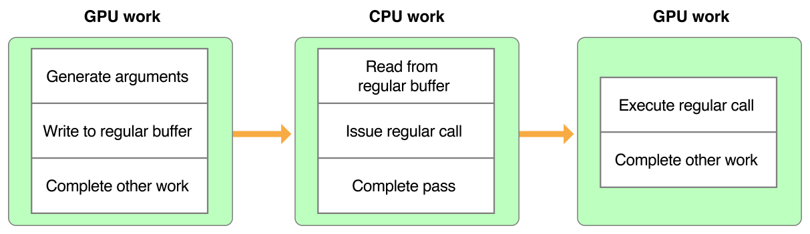
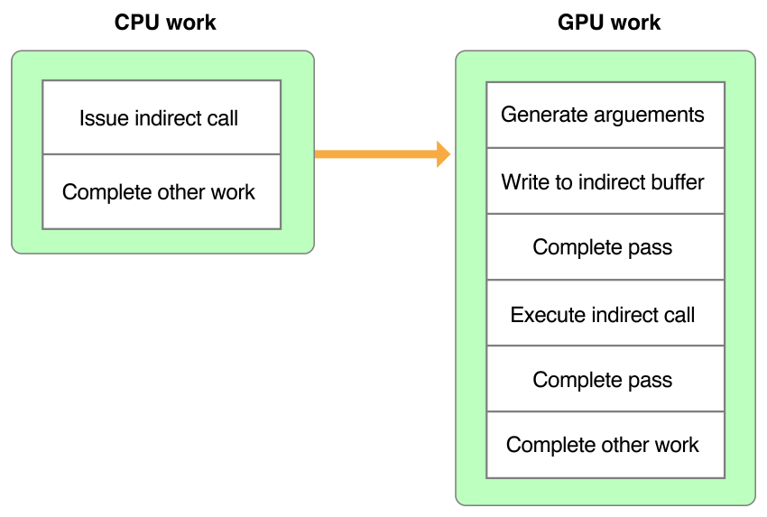

> 导航：[总目录](../../../README.md) · [documentation](../../../_indexes/documentation.md) · [Metal Best Practices Guide](index.md)

## Indirect Buffers

__Best Practice:__ Use indirect buffers if your draw or dispatch call arguments are dynamically generated by the GPU.

Indirect buffers are [MTLBuffer](https://developer.apple.com/documentation/metal/mtlbuffer) objects with a specific data layout representing draw or dispatch call arguments. The supported layouts are defined by the following structures:

- [MTLDrawPrimitivesIndirectArguments](https://developer.apple.com/documentation/metal/mtldrawprimitivesindirectarguments)
- [MTLDrawIndexedPrimitivesIndirectArguments](https://developer.apple.com/documentation/metal/mtldrawindexedprimitivesindirectarguments)
- [MTLDrawPatchIndirectArguments](https://developer.apple.com/documentation/metal/mtldrawpatchindirectarguments)
- [MTLDispatchThreadgroupsIndirectArguments](https://developer.apple.com/documentation/metal/mtldispatchthreadgroupsindirectarguments)

Indirect buffers allow you to issue calls that depend on dynamic arguments that are unknown at the time of the call. These arguments can be dynamically generated after the call is issued, but they must always be available by the time their associated render or compute pass begins execution. Dynamic arguments are typically generated by the GPU; for example, a patch kernel can dynamically generate the arguments for a patch draw call to a post-tessellation vertex function.

### Eliminate Unnecessary Data Transfers and Reduce Processor Idle Time

Without an indirect buffer, the GPU generates and writes the call arguments to a regular buffer. The CPU must wait until the GPU completes all of its work before it can read the arguments from the regular buffer and issue the call. The GPU must then wait until the CPU completes all of its work before it can execute the call. This inefficient sequence is shown in Figure 12-1.

__Figure 12-1__Issuing a call without an indirect buffer

With an indirect buffer, the CPU doesn’t need to wait for any values and can immediately issue a draw call that references an indirect buffer. After the CPU completes all of its work, the GPU can then generate the arguments, write them to the indirect buffer in one pass, and execute the call associated with them in another pass. This improved sequence is shown in Figure 12-2.

__Figure 12-2__Issuing a call with an indirect buffer

An indirect buffer eliminates unnecessary data transfers between the CPU and the GPU, which results in reduced processor idle time. Use an indirect buffer if the CPU doesn’t need to access the dynamic arguments of a draw or dispatch call.

[Command Buffers](CommandBuffers.md#apple-f4xwc4dqnrsv64tfmyxwi33df52wszbpkridimbqge3dmnbsfvbuqmrzfvjvomi)

[Functions and Libraries](FunctionsandLibraries.md#apple-f4xwc4dqnrsv64tfmyxwi33df52wszbpkridimbqge3dmnbsfvbuqmrufvjvomi)
