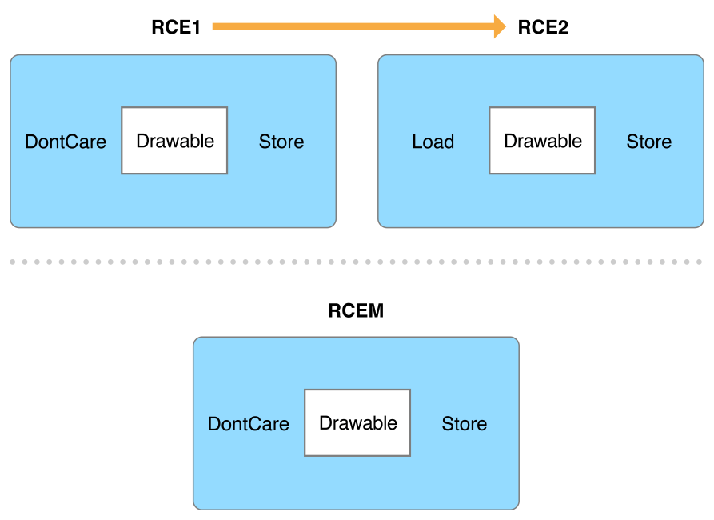
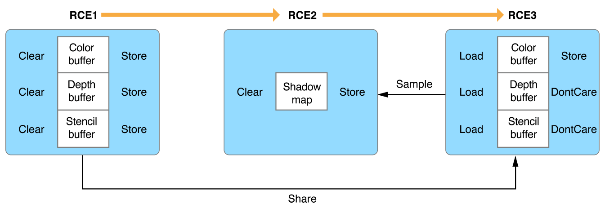
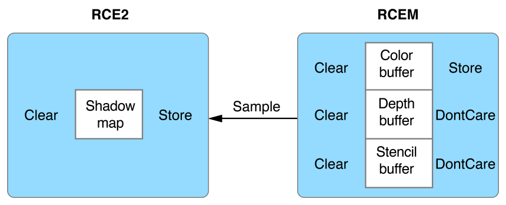
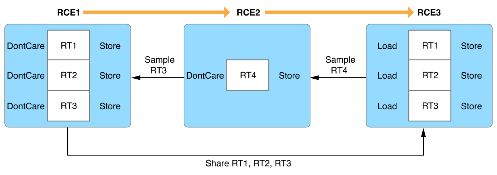

> 导航：[总目录](../../../README.md) · [documentation](../../../_indexes/documentation.md) · [Metal Best Practices Guide](index.md)

## Render Command Encoders (iOS and tvOS)

__Best Practice:__ Merge render command encoders when possible.

Eliminating unnecessary render command encoders reduces memory bandwidth and increases performance. You can achieve these goals by merging render command encoders into a single rendering pass, when possible. To determine whether two render command encoders are merge-compatible or not, you must carefully evaluate their render targets, load and store actions, relationships, and dependencies. The simplest criteria for two merge-compatible render command encoders, `RCE1` and `RCE2`, are as follows:

- `RCE1` and `RCE2` are created in the same frame.
- `RCE1` and `RCE2` are created from the same command buffer.
- `RCE1` is created before `RCE2`.
- `RCE2` shares the same render targets as `RCE1`.
- `RCE2` does not sample from any render targets in `RCE1`.
- `RCE1`’s render target store actions are either [Store](https://developer.apple.com/documentation/metal/mtlstoreaction/store) or [DontCare](https://developer.apple.com/documentation/metal/mtlstoreaction/dontcare), and `RCE2`’s render target load actions are either [Load](https://developer.apple.com/documentation/metal/mtlloadaction/load) or [DontCare](https://developer.apple.com/documentation/metal/mtlloadaction/dontcare).
- No other render command encoders have been created between `RCE1` and `RCE2`.

If these criteria are met, `RCE1` and `RCE2` can be merged into a single render command encoder, `RCEM`, as shown in Figure 10-1.

__Figure 10-1__A simple render command encoder merge

Additionally, if `RCE1` can merge with a render command encoder created before it (`RCE0`) and `RCE2` can merge with a render command encoder created after it (`RCE3`), then `RCE0`, `RCE1`, `RCE2`, and `RCE3` can all be merged.

The following sections provide guidelines for evaluating merge compatibility between render command encoders, assuming all other criteria are met.

> [!NOTE]
> 

### Evaluate Rendering Pass Order

Some apps may begin encoding into a render command encoder (`RCE1`) and prematurely end the initial rendering pass if they require additional dynamic data to proceed. The dynamic data is then generated in a separate rendering pass with a second render command encoder (`RCE2`). The initial rendering pass then continues with a third render command encoder (`RCE3`). Figure 10-2 shows this inefficient order, including the separated render command encoders.

__Figure 10-2__An inefficient order of rendering passes

If `RCE2` does not depend on `RCE1`, then `RCE2` doesn’t need to be encoded after `RCE1`. Encoding `RCE2` first allows `RCE1` and `RCE3` to be merged into `RCEM` because they represent the same rendering pass, and their dynamic data dependencies are guaranteed to be available at the start of the rendering pass. Figure 10-3 shows this improved order, including the merged render command encoders.

__Figure 10-3__An improved order of rendering passes

### Evaluate Sampling Dependencies

Render command encoders cannot be merged if there are any sampling dependencies between them. For render command encoders that share the same render targets, these dependencies may be introduced by additional render command encoders in between them, as shown in Figure 10-4.

__Figure 10-4__Sampling dependencies between render command encoders

`RCE1` and `RCE3` share the same render targets, `RT1`, `RT2`, and `RT3`. Furthermore, the actions between `RCE1` and `RCE3` indicate a continuation of a rendering pass. However, these render command encoders cannot be merged due to the sampling dependencies introduced by `RCE2`. `RCE2` renders to a separate render target, `RT4`, which is sampled by `RCE3`. Additionally, `RCE2` samples `RT3` after it is rendered by `RCE1`. These sampling dependencies define a strict rendering pass order that prevents merging these render command encoders.

### Evaluate Actions Between Rendering Passes

The store and load actions between render command encoder render targets are not as important as other criteria, but there are a few notable cases where additional consideration is due. Use the following guidelines to further understand merge compatibility between render command encoders `RCE1` and `RCE2`, based on their shared render targets:

- If the store action in `RCE1` is [Store](https://developer.apple.com/documentation/metal/mtlstoreaction/store) and the load action in `RCE2` is [Load](https://developer.apple.com/documentation/metal/mtlloadaction/load), the render target is merge-compatible and is typically continuing a rendering pass.
- If the store action in `RCE1` is [DontCare](https://developer.apple.com/documentation/metal/mtlstoreaction/dontcare) and the load action in `RCE2` is [DontCare](https://developer.apple.com/documentation/metal/mtlloadaction/dontcare), the render target is merge-compatible and is typically being used as an intermediary resource.
- If the load action in `RCE2` is [Clear](https://developer.apple.com/documentation/metal/mtlloadaction/clear), the render target is merge-compatible if a primitive clear operation can be performed in the merged render command encoder by first rendering clear values into a display-aligned quad.

> [!NOTE]
> 

[Load and Store Actions](LoadandStoreActions.md#apple-f4xwc4dqnrsv64tfmyxwi33df52wszbpkridimbqge3dmnbsfvbuqmrqfvjvomi)

[Command Buffers](CommandBuffers.md#apple-f4xwc4dqnrsv64tfmyxwi33df52wszbpkridimbqge3dmnbsfvbuqmrzfvjvomi)
