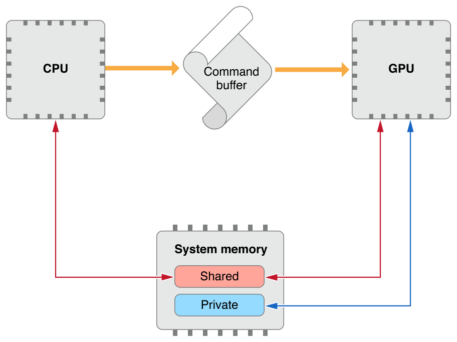
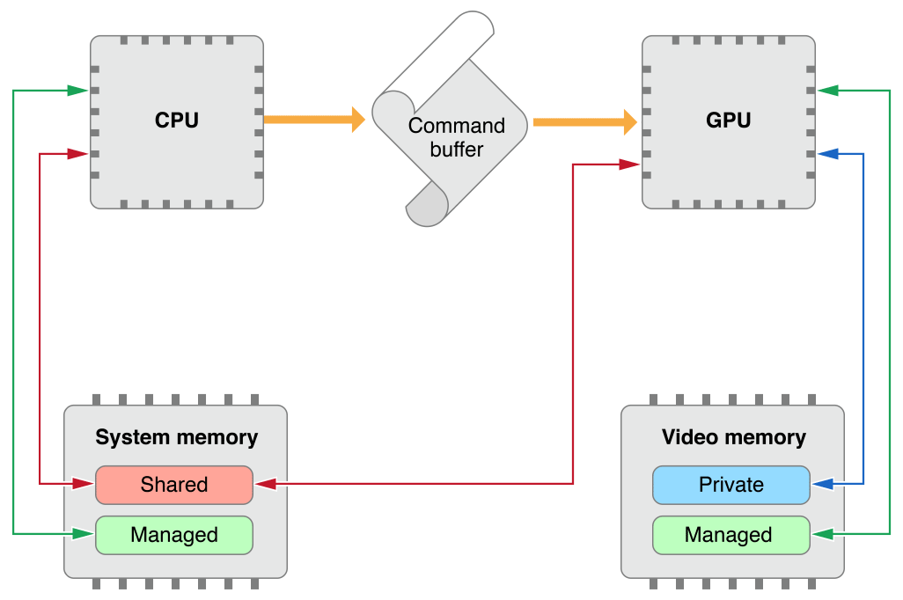

> 导航：[总目录](../../../README.md) · [documentation](../../../_indexes/documentation.md) · [Metal Best Practices Guide](index.md)

## Resource Options

__Best Practice:__ Set appropriate resource storage modes and texture usage options.

Your Metal resources must be configured appropriately to take advantage of fast memory access and driver performance optimizations. Resource storage modes allow you to define the storage location and access permissions for your [MTLBuffer](https://developer.apple.com/documentation/metal/mtlbuffer) and [MTLTexture](https://developer.apple.com/documentation/metal/mtltexture) objects. Texture usage options allow you to explicitly declare how you intend to use your [MTLTexture](https://developer.apple.com/documentation/metal/mtltexture) objects.

### Familiarize Yourself with Device Memory Models

Device memory models vary by operating system. iOS and tvOS devices support a _unified_ memory model in which the CPU and the GPU share system memory. macOS devices support a _discrete_ memory model with CPU-accessible system memory and GPU-accessible video memory.

> [!IMPORTANT]
> 

### Choose an Appropriate Resource Storage Mode (iOS and tvOS)

In iOS and tvOS, the [Shared](https://developer.apple.com/documentation/metal/mtlstoragemode/mtlstoragemodeshared) mode defines system memory accessible to both the CPU and the GPU, whereas the [Private](https://developer.apple.com/documentation/metal/mtlstoragemode/private) mode defines system memory accessible only to the GPU.

The [Shared](https://developer.apple.com/documentation/metal/mtlstoragemode/mtlstoragemodeshared) mode is usually the correct choice for iOS and tvOS resources. Choose the [Private](https://developer.apple.com/documentation/metal/mtlstoragemode/private) mode only if the CPU never accesses your resource.

> [!NOTE]
> 

__Figure 3-1__Resource storage modes in iOS and tvOS

### Choose an Appropriate Resource Storage Mode (macOS)

In macOS, the [Shared](https://developer.apple.com/documentation/metal/mtlstoragemode/mtlstoragemodeshared) mode defines system memory accessible to both the CPU and the GPU, whereas the [Private](https://developer.apple.com/documentation/metal/mtlstoragemode/private) mode defines video memory accessible only to the GPU.

Additionally, macOS implements the [Managed](https://developer.apple.com/documentation/metal/mtlstoragemode/managed) mode that defines a synchronized memory pair for a resource, with one copy in system memory and another in video memory. Managed resources benefit from fast CPU and GPU access to each copy of the resource, with minimal API calls needed to synchronize these copies.

__Figure 3-2__Resource storage modes in macOS

> [!IMPORTANT]
> 

__Buffer Storage Mode (macOS)__

Use the following guidelines to determine the appropriate storage mode for a particular buffer.

- If the buffer is accessed by the GPU exclusively, choose the [Private](https://developer.apple.com/documentation/metal/mtlstoragemode/private) mode. This is a common case for GPU-generated data, such as per-patch tessellation factors.
- If the buffer is accessed by the CPU exclusively, choose the [Shared](https://developer.apple.com/documentation/metal/mtlstoragemode/mtlstoragemodeshared) mode. This is a rare case and is usually an intermediary step in a blit operation.
- If the buffer is accessed by both the CPU and the GPU, as is the case with most vertex data, consider the following points and refer to [Table 3-1](#apple-f4xwc4dqnrsv64tfmyxwi33df52wszbpkridimbqge3dmnbsfvbuqmjxfvjvona):

  - For small-sized data that changes frequently, choose the [Shared](https://developer.apple.com/documentation/metal/mtlstoragemode/mtlstoragemodeshared) mode. The overhead of copying data to video memory may be more expensive than the overhead of the GPU accessing system memory directly.
  - For medium-sized data that changes infrequently, choose the [Managed](https://developer.apple.com/documentation/metal/mtlstoragemode/managed) mode. Always call an appropriate synchronization method after modifying the contents of a managed buffer.

    After performing a CPU write, call the [didModifyRange:](https://developer.apple.com/documentation/metal/mtlbuffer/1516121-didmodifyrange) method to notify Metal about the specific range of data that was modified; this allows Metal to update only that specific range in the video memory copy.

    After encoding a GPU write, encode a blit operation that includes a call to the [synchronizeResource:](https://developer.apple.com/documentation/metal/mtlblitcommandencoder/1400775-synchronize) method; this allows Metal to update the system memory copy after the associated command buffer has completed execution.
  - For large-sized data that never changes, choose the [Private](https://developer.apple.com/documentation/metal/mtlstoragemode/private) mode. Initialize and populate a source buffer with a [Shared](https://developer.apple.com/documentation/metal/mtlstoragemode/mtlstoragemodeshared) mode and then blit its data into a destination buffer with a [Private](https://developer.apple.com/documentation/metal/mtlstoragemode/private) mode. This is an optimal operation with a one-time cost.

__Table 3-1__Choosing a storage mode for buffer data accessed by both the CPU and the GPU

| Data size | Resource dirtiness | Update frequency | Storage mode |
| --- | --- | --- | --- |
| Small | Full | Every frame | [Shared](https://developer.apple.com/documentation/metal/mtlstoragemode/mtlstoragemodeshared) |
| Medium | Partial | Every _n_ frames | [Managed](https://developer.apple.com/documentation/metal/mtlstoragemode/managed) |
| Large | N/A | Once | [Private](https://developer.apple.com/documentation/metal/mtlstoragemode/private)  (After a blit from a shared source buffer) |

__Texture Storage Mode (macOS)__

In macOS, the default storage mode for textures is [Managed](https://developer.apple.com/documentation/metal/mtlstoragemode/managed). Use the following guidelines to determine the appropriate storage mode for a particular texture.

- If the texture is accessed by the GPU exclusively, choose the [Private](https://developer.apple.com/documentation/metal/mtlstoragemode/private) mode. This is a common case for GPU-generated data, such as displayable render targets.
- If the texture is accessed by the CPU exclusively, choose the [Managed](https://developer.apple.com/documentation/metal/mtlstoragemode/managed) mode. This is a rare case and is usually an intermediary step in a blit operation.
- If the texture is initialized once by the CPU and accessed frequently by the GPU, initialize a source texture with a [Managed](https://developer.apple.com/documentation/metal/mtlstoragemode/managed) mode and then blit its data into a destination texture with a [Private](https://developer.apple.com/documentation/metal/mtlstoragemode/private) mode. This is a common case for static textures, such as diffuse maps.
- If the texture is accessed frequently by both the CPU and GPU, choose the [Managed](https://developer.apple.com/documentation/metal/mtlstoragemode/managed) mode. This is a common case for dynamic textures, such as image filters. Always call an appropriate synchronization method after modifying the contents of a managed texture.

  To perform a CPU write to a specific region of data and simultaneously notify Metal about the change, call either of the following methods. This allows Metal to update only that specific region in the video memory copy.

  - [replaceRegion:mipmapLevel:withBytes:bytesPerRow:](https://developer.apple.com/documentation/metal/mtltexture/1515464-replaceregion)
  - [replaceRegion:mipmapLevel:slice:withBytes:bytesPerRow:bytesPerImage:](https://developer.apple.com/documentation/metal/mtltexture/1515679-replaceregion)

  After encoding a GPU write, encode a blit operation that includes a call to either of the following methods. This allows Metal to update the system memory copy after the associated command buffer has completed execution.

  - [synchronizeResource:](https://developer.apple.com/documentation/metal/mtlblitcommandencoder/1400775-synchronize)
  - [synchronizeTexture:slice:level:](https://developer.apple.com/documentation/metal/mtlblitcommandencoder/1400757-synchronizetexture)

### Set Appropriate Texture Usage Flags

Metal can optimize GPU operations for a given texture, based on its intended use. Always declare explicit texture usage options if you know them in advance. Do not rely on the [Unknown](https://developer.apple.com/documentation/metal/mtltextureusage/mtltextureusageunknown) option; although this option provides the most flexibility for your textures, it incurs a significant performance cost. The driver cannot perform any optimizations if it does not know how you intend to use your texture. For a description of available texture usage options, see the [MTLTextureUsage](https://developer.apple.com/documentation/metal/mtltextureusage) reference.

[Persistent Objects](PersistentObjects.md#apple-f4xwc4dqnrsv64tfmyxwi33df52wszbpkridimbqge3dmnbsfvbuqnbnknltc)

[Triple Buffering](TripleBuffering.md#apple-f4xwc4dqnrsv64tfmyxwi33df52wszbpkridimbqge3dmnbsfvbuqnjnknltc)
