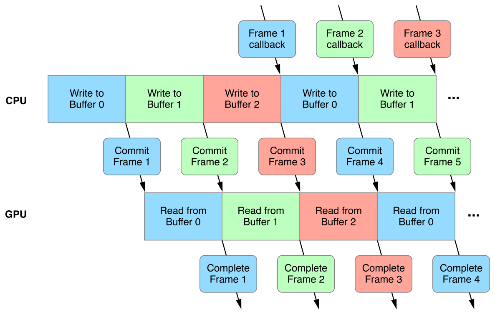

> 导航：[总目录](../../../README.md) · [documentation](../../../_indexes/documentation.md) · [Metal Best Practices Guide](index.md)

## Triple Buffering

__Best Practice:__ Implement a triple buffering model to update dynamic buffer data.

Dynamic buffer data refers to frequently updated data stored in a buffer. To avoid creating new buffers per frame and to minimize processor idle time between frames, implement a triple buffering model.

### Prevent Access Conflicts and Reduce Processor Idle Time

Dynamic buffer data is typically written by the CPU and read by the GPU. An access conflict occurs if these operations happen at the same time; the CPU must finish writing the data before the GPU can read it, and the GPU must finish reading that data before the CPU can overwrite it. If dynamic buffer data is stored in a single buffer, this causes extended periods of processor idle time when either the CPU is stalled or the GPU is starved. For the processors to work in parallel, the CPU should be working at least one frame ahead of the GPU. This solution requires multiple instances of dynamic buffer data, so the CPU can write the data for frame `n+1` while the GPU reads the data for frame `n`.

### Reduce Memory Overhead and Frame Latency

You can manage multiple instances of dynamic buffer data with a FIFO queue of reusable buffers. However, allocating too many buffers increases memory overhead and may limit memory allocation for other resources. Additionally, allocating too many buffers increases frame latency if the CPU work is too far ahead of the GPU work.

> [!IMPORTANT]
> 

### Allow Time for Command Buffer Transactions

Dynamic buffer data is encoded and bound to a transient command buffer. It takes a certain amount of time to transfer this command buffer from the CPU to the GPU after it has been committed for execution. Similarly, it takes a certain amount of time for the GPU to notify the CPU that it has completed the execution of this command buffer. This sequence is detailed below, for a single frame:

1. The CPU writes to the dynamic data buffer and encodes commands into a command buffer.
2. The CPU schedules a completion handler ([addCompletedHandler:](https://developer.apple.com/documentation/metal/mtlcommandbuffer/1442997-addcompletedhandler)), commits the command buffer ([commit](https://developer.apple.com/documentation/metal/mtlcommandbuffer/1443003-commit)), and transfers the command buffer to the GPU.
3. The GPU executes the command buffer and reads from the dynamic data buffer.
4. The GPU completes its execution and calls the command buffer completion handler ([MTLCommandBufferHandler](https://developer.apple.com/documentation/metal/mtlcommandbufferhandler)).

This sequence can be parallelized with two dynamic data buffers, but the command buffer transactions may cause the CPU to stall or the GPU to starve if either processor is waiting on a busy dynamic data buffer.

### Implement a Triple Buffering Model

Adding a third dynamic data buffer is the ideal solution when considering processor idle time, memory overhead, and frame latency. Figure 4-1 shows a triple buffering timeline, and Listing 4-1 shows a triple buffering implementation.

__Figure 4-1__Triple buffering timeline

__Listing 4-1__Triple buffering implementation

1. `static const NSUInteger kMaxInflightBuffers = 3;`
2. `/* Additional constants */`
4. `@implementation Renderer`
5. `{`
6. `dispatch_semaphore_t _frameBoundarySemaphore;`
7. `NSUInteger _currentFrameIndex;`
8. `NSArray <id <MTLBuffer>> _dynamicDataBuffers;`
9. `/* Additional variables */`
10. `}`
12. `- (void)configureMetal`
13. `{`
14. `// Create a semaphore that gets signaled at each frame boundary.`
15. `// The GPU signals the semaphore once it completes a frame's work, allowing the CPU to work on a new frame`
16. `_frameBoundarySemaphore = dispatch_semaphore_create(kMaxInflightBuffers);`
17. `_currentFrameIndex = 0;`
18. `/* Additional configuration */`
19. `}`
21. `- (void)makeResources`
22. `{`
23. `// Create a FIFO queue of three dynamic data buffers`
24. `// This ensures that the CPU and GPU are never accessing the same buffer simultaneously`
25. `MTLResourceOptions bufferOptions = /* ... */;`
26. `NSMutableArray *mutableDynamicDataBuffers = [NSMutableArray arrayWithCapacity:kMaxInflightBuffers];`
27. `for(int i = 0; i < kMaxInflightBuffers; i++)`
28. `{`
29. `// Create a new buffer with enough capacity to store one instance of the dynamic buffer data`
30. `id <MTLBuffer> dynamicDataBuffer = [_device newBufferWithLength:sizeof(DynamicBufferData) options:bufferOptions];`
31. `[mutableDynamicDataBuffers addObject:dynamicDataBuffer];`
32. `}`
33. `_dynamicDataBuffers = [mutableDynamicDataBuffers copy];`
34. `}`
36. `- (void)update`
37. `{`
38. `// Advance the current frame index, which determines the correct dynamic data buffer for the frame`
39. `_currentFrameIndex = (_currentFrameIndex + 1) % kMaxInflightBuffers;`
41. `// Update the contents of the dynamic data buffer`
42. `DynamicBufferData *dynamicBufferData = [_dynamicDataBuffers[_currentFrameIndex] contents];`
43. `/* Perform updates */`
44. `}`
46. `- (void)render`
47. `{`
48. `// Wait until the inflight command buffer has completed its work`
49. `dispatch_semaphore_wait(_frameBoundarySemaphore, DISPATCH_TIME_FOREVER);`
51. `// Update the per-frame dynamic buffer data`
52. `[self update];`
54. `// Create a command buffer and render command encoder`
55. `id <MTLCommandBuffer> commandBuffer = [_commandQueue commandBuffer];`
56. `id <MTLRenderCommandEncoder> renderCommandEncoder = [commandBuffer renderCommandEncoderWithDescriptor:_renderPassDescriptor];`
58. `// Set the dynamic data buffer for the frame`
59. `[renderCommandEncoder setVertexBuffer:_dynamicDataBuffers[_currentFrameIndex] offset:0 atIndex:0];`
60. `/* Additional encoding */`
61. `[renderCommandEncoder endEncoding];`
63. `// Schedule a drawable presentation to occur after the GPU completes its work`
64. `[commandBuffer presentDrawable:view.currentDrawable];`
66. `__weak dispatch_semaphore_t semaphore = _frameBoundarySemaphore;`
67. `[commandBuffer addCompletedHandler:^(id<MTLCommandBuffer> commandBuffer) {`
68. `// GPU work is complete`
69. `// Signal the semaphore to start the CPU work`
70. `dispatch_semaphore_signal(semaphore);`
71. `}];`
73. `// CPU work is complete`
74. `// Commit the command buffer and start the GPU work`
75. `[commandBuffer commit];`
76. `}`
78. `@end`

[Resource Options](ResourceOptions.md#apple-f4xwc4dqnrsv64tfmyxwi33df52wszbpkridimbqge3dmnbsfvbuqmjxfvjvomi)

[Buffer Bindings](BufferBindings.md#apple-f4xwc4dqnrsv64tfmyxwi33df52wszbpkridimbqge3dmnbsfvbuqmryfvjvomy)
