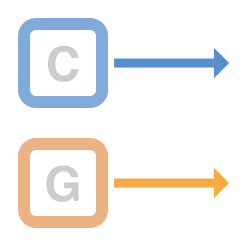
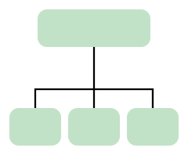

> 导航：[总目录](../../../README.md) · [documentation](../../../_indexes/documentation.md)

## Fundamental Concepts

Metal provides the lowest-overhead access to the GPU, enabling you to maximize the graphics and compute potential of your app on iOS, macOS, and tvOS. Every millisecond and every bit is integral to a Metal app and the user experience–it’s your responsibility to make sure your Metal app performs as efficiently as possible by following the best practices described in this guide. Unless otherwise stated, these best practices apply to all platforms that support Metal.

An efficient Metal app requires:

__Low CPU overhead.__ Metal is designed to reduce or eliminate many CPU-side performance bottlenecks. Your app can benefit from this design only if you use the Metal API as recommended.

__Optimal GPU performance.__ Metal allows you to create and submit commands to the GPU. To optimize GPU performance, your app should optimize the configuration and organization of these commands.

__Continuous processor parallelism.__ Metal is designed to maximize CPU and GPU parallelism. Your app should keep these processors busy and working simultaneously.

__Effective resource management.__ Metal provides simple yet powerful interfaces to your resource objects. Your app should manage these resources effectively to reduce memory consumption and increase access speed.

[Persistent Objects](PersistentObjects.md#apple-f4xwc4dqnrsv64tfmyxwi33df52wszbpkridimbqge3dmnbsfvbuqnbnknltc)
