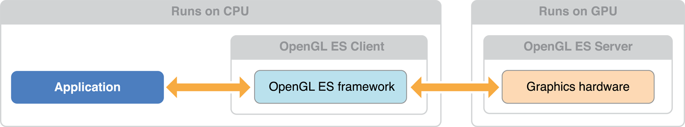

> 导航：[总目录](../../../README.md) · [documentation](../../../_indexes/documentation.md)

[Next](Checklist%20for%20Building%20OpenGL%20ES%20Apps%20for%20iOS.md)

# About OpenGL ES

The _Open Graphics Library (OpenGL)_ is used for visualizing 2D and 3D data. It is a multipurpose open-standard graphics library that supports applications for 2D and 3D digital content creation, mechanical and architectural design, virtual prototyping, flight simulation, video games, and more. You use OpenGL to configure a 3D graphics pipeline and submit data to it. Vertices are transformed and lit, assembled into primitives, and rasterized to create a 2D image. OpenGL is designed to translate function calls into graphics commands that can be sent to underlying graphics hardware. Because this underlying hardware is dedicated to processing graphics commands, OpenGL drawing is typically very fast.

_OpenGL for Embedded Systems (OpenGL ES)_ is a simplified version of OpenGL that eliminates redundant functionality to provide a library that is both easier to learn and easier to implement in mobile graphics hardware.

OpenGL ES allows an app to harness the power of the underlying graphics processor. The GPU on iOS devices can perform sophisticated 2D and 3D drawing, as well as complex shading calculations on every pixel in the final image. You should use OpenGL ES if the design requirements of your app call for the most direct and comprehensive access possible to GPU hardware. Typical clients for OpenGL ES include video games and simulations that present 3D graphics.

OpenGL ES is a low-level, hardware-focused API. Though it provides the most powerful and flexible graphics processing tools, it also has a steep learning curve and a significant effect on the overall design of your app. For apps that require high-performance graphics for more specialized uses, iOS provides several higher-level frameworks:

- The Sprite Kit framework provides a hardware-accelerated animation system optimized for creating 2D games. (See _[SpriteKit Programming Guide](../../Graphics%20Animation/SpriteKit%20Programming%20Guide/About%20SpriteKit.md#apple-f4xwc4dqnrsv64tfmyxwi33df52wszbpkridimbqgeztanbt)_.)
- The Core Image framework provides real-time filtering and analysis for still and video images. (See _[Core Image Programming Guide](../../Graphics%20Imaging/Core%20Image%20Programming%20Guide/About%20Core%20Image.md#apple-f4xwc4dqnrsv64tfmyxwi33df52wszbpkridgmbqgaytcobv)_.)
- Core Animation provides the hardware-accelerated graphics rendering and animation infrastructure for all iOS apps, as well as a simple declarative programming model that makes it simple to implement sophisticated user interface animations. (See _[Core Animation Programming Guide](../../Cocoa/Core%20Animation%20Programming%20Guide/About%20Core%20Animation.md#apple-f4xwc4dqnrsv64tfmyxwi33df52wszbpkridimbqga2dkmju)_.)
- You can add animation, physics-based dynamics, and other special effects to Cocoa Touch user interfaces using features in the UIKit framework.

### OpenGL ES Is a Platform-Neutral API Implemented in iOS

Because OpenGL ES is a C-based API, it is extremely portable and widely supported. As a C API, it integrates seamlessly with Objective-C Cocoa Touch apps. The OpenGL ES specification does not define a windowing layer; instead, the hosting operating system must provide functions to create an OpenGL ES _rendering context_, which accepts commands, and a _framebuffer_, where the results of any drawing commands are written to. Working with OpenGL ES on iOS requires using iOS classes to set up and present a drawing surface and using platform-neutral API to render its contents.

### GLKit Provides a Drawing Surface and Animation Support

Views and view controllers, defined by the UIKit framework, control the presentation of visual content on iOS. The GLKit framework provides OpenGL ES–aware versions of these classes. When you develop an OpenGL ES app, you use a [GLKView](https://developer.apple.com/documentation/glkit/glkview) object to render your OpenGL ES content. You can also use a [GLKViewController](https://developer.apple.com/documentation/glkit/glkviewcontroller) object to manage your view and support animating its contents.

### iOS Supports Alternative Rendering Targets

Besides drawing content to fill an entire screen or part of a view hierarchy, you can also use OpenGL ES framebuffer objects for other rendering strategies. iOS implements standard OpenGL ES framebuffer objects, which you can use for rendering to an offscreen buffer or to a texture for use elsewhere in an OpenGL ES scene. In addition, OpenGL ES on iOS supports rendering to a Core Animation layer (the [CAEAGLLayer](https://developer.apple.com/documentation/quartzcore/caeagllayer) class), which you can then combine with other layers to build your app’s user interface or other visual displays.

### Apps Require Additional Performance Tuning

Graphics processors are parallelized devices optimized for graphics operations. To get great performance in your app, you must carefully design your app to feed data and commands to OpenGL ES so that the graphics hardware runs in parallel with your app. A poorly tuned app forces either the CPU or the GPU to wait for the other to finish processing commands.

You should design your app to efficiently use the OpenGL ES API. Once you have finished building your app, use Instruments to fine tune your app’s performance. If your app is bottlenecked inside OpenGL ES, use the information provided in this guide to optimize your app’s performance.

Xcode provides tools to help you improve the performance of your OpenGL ES apps.

### OpenGL ES May Not Be Used in Background Apps

Apps that are running in the background may not call OpenGL ES functions. If your app accesses the graphics processor while it is in the background, it is automatically terminated by iOS. To avoid this, your app should flush any pending commands previously submitted to OpenGL ES prior to being moved into the background and avoid calling OpenGL ES until it is moved back to the foreground.

### OpenGL ES Places Additional Restrictions on Multithreaded Apps

Designing apps to take advantage of concurrency can be useful to help improve your app’s performance. If you intend to add concurrency to an OpenGL ES app, you must ensure that it does not access the same context from two different threads at the same time.

Begin by reading the first three chapters: [Checklist for Building OpenGL ES Apps for iOS](Checklist%20for%20Building%20OpenGL%20ES%20Apps%20for%20iOS.md#apple-f4xwc4dqnrsv64tfmyxwi33df52wszbpkridimbqga4doojtfvbuqmjqgewvgvzr), [Configuring OpenGL ES Contexts](Configuring%20OpenGL%20ES%20Contexts.md#apple-f4xwc4dqnrsv64tfmyxwi33df52wszbpkridimbqga4doojtfvbuqmrnknltc), [Drawing with OpenGL ES and GLKit](Drawing%20with%20OpenGL%20ES%20and%20GLKit.md#apple-f4xwc4dqnrsv64tfmyxwi33df52wszbpkridimbqga4doojtfvbuqnjqgmwvgvzr). These chapters provide an overview of how OpenGL ES integrates into iOS and all the details necessary to get your first OpenGL ES apps up and running on an iOS device.

If you’re familiar with the basics of using OpenGL ES in iOS, read [Drawing to Other Rendering Destinations](Drawing%20to%20Other%20Rendering%20Destinations.md#apple-f4xwc4dqnrsv64tfmyxwi33df52wszbpkridimbqga4doojtfvbuqmjqgmwvgvzr) and [Multitasking, High Resolution, and Other iOS Features](Multitasking%2C%20High%20Resolution%2C%20and%20Other%20iOS%20Features.md#apple-f4xwc4dqnrsv64tfmyxwi33df52wszbpkridimbqga4doojtfvbuqnjnknltc) for important platform-specific guidelines. Developers familiar with using OpenGL ES in iOS versions before 5.0 should study [Drawing with OpenGL ES and GLKit](Drawing%20with%20OpenGL%20ES%20and%20GLKit.md#apple-f4xwc4dqnrsv64tfmyxwi33df52wszbpkridimbqga4doojtfvbuqnjqgmwvgvzr) for details on new features for streamlining OpenGL ES development.

Finally, read [OpenGL ES Design Guidelines](OpenGL%20ES%20Design%20Guidelines.md#apple-f4xwc4dqnrsv64tfmyxwi33df52wszbpkridimbqga4doojtfvbuqnrnknltc), [Tuning Your OpenGL ES App](Tuning%20Your%20OpenGL%20ES%20App.md#apple-f4xwc4dqnrsv64tfmyxwi33df52wszbpkridimbqga4doojtfvbuqmjqguwvgvzr), and the following chapters to dig deeper into how to design efficient OpenGL ES apps.

Unless otherwise noted, OpenGL ES code examples in this book target OpenGL ES 3.0. You may need to make changes to use these code examples with other OpenGL ES versions.

Before attempting use OpenGL ES, you should already be familiar with general iOS app architecture. See _[Start Developing iOS Apps Today (Retired)](https://developer.apple.com/library/archive/referencelibrary/GettingStarted/RoadMapiOS-Legacy/index.html#//apple_ref/doc/uid/TP40011343)_.

This document is not a complete tutorial or a reference for the cross-platform OpenGL ES API. To learn more about OpenGL ES, consult the references below.

OpenGL ES is an open standard defined by the Khronos Group. For more information about the OpenGL ES standard, please consult their web page at [http://www.khronos.org/opengles/](http://www.khronos.org/opengles/).

- _OpenGL® ES 3.0 Programming Guide_, published by Addison-Wesley, provides a comprehensive introduction to OpenGL ES concepts.
- _OpenGL® Shading Language, Third Edition_, also published by Addison-Wesley, provides many shading algorithms useable in your OpenGL ES app. You may need to modify some of these algorithms to run efficiently on mobile graphics processors.
- [OpenGL ES API Registry](http://www.khronos.org/registry/gles/) is the official repository for the OpenGL ES specifications, the OpenGL ES shading language specifications, and documentation for OpenGL ES extensions.
- _[OpenGL ES Framework Reference](https://developer.apple.com/documentation/opengles)_ describes the platform-specific functions and classes provided by Apple to integrate OpenGL ES into iOS.
- _[iOS Device Compatibility Reference](../../iOS%20Device%20Compatibility%20Reference/Introduction.md#apple-f4xwc4dqnrsv64tfmyxwi33df52wszbpkridimbqgeztkojz)_ provides more detailed information on the hardware and software features available to your app.
- _[GLKit Framework Reference](https://developer.apple.com/documentation/glkit)_ describes a framework provided by Apple to make it easier to develop OpenGL ES 2.0 and 3.0 apps.
[Next](Checklist%20for%20Building%20OpenGL%20ES%20Apps%20for%20iOS.md)

