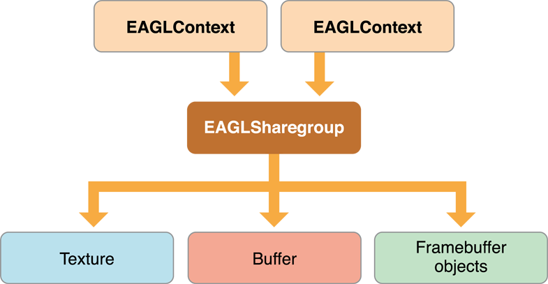

> 导航：[总目录](../../../README.md) · [documentation](../../../_indexes/documentation.md) · [OpenGL ES Programming Guide](About%20OpenGL%20ES.md)


[Next](Drawing%20with%20OpenGL%20ES%20and%20GLKit.md)[Previous](Checklist%20for%20Building%20OpenGL%20ES%20Apps%20for%20iOS.md)

# Configuring OpenGL ES Contexts

Every implementation of OpenGL ES provides a way to create rendering contexts to manage the state required by the OpenGL ES specification. By placing this state in a context, multiple apps can easily share the graphics hardware without interfering with the other’s state.

This chapter details how to create and configure contexts on iOS.

Before your app can call any OpenGL ES functions, it must initialize an [EAGLContext](https://developer.apple.com/documentation/opengles/eaglcontext) object. The `EAGLContext` class also provides methods used to integrate OpenGL ES content with Core Animation.

Every thread in an iOS app has a current context; when you call an OpenGL ES function, this is the context whose state is changed by the call.

To set a thread’s current context, call the `EAGLContext` class method [setCurrentContext:](https://developer.apple.com/documentation/opengles/eaglcontext/1624882-setcurrentcontext) when executing on that thread.

```
[EAGLContext setCurrentContext: myContext];
```

Call the `EAGLContext` class method [currentContext](https://developer.apple.com/documentation/opengles/eaglcontext/1624880-currentcontext) to retrieve a thread’s current context.

OpenGL ES holds a strong reference to the `EAGLContext` object corresponding to the current context. (If you are using manual reference counting, OpenGL ES retains this object.) When you call the [setCurrentContext:](https://developer.apple.com/documentation/opengles/eaglcontext/1624882-setcurrentcontext) method to change the current context, OpenGL ES no longer references the previous context. (If you are using manual reference counting, OpenGL ES releases the `EAGLContext` object.) To prevent `EAGLContext` objects from being deallocated when not the current context, your app must keep strong references to (or retain) these objects.

An [EAGLContext](https://developer.apple.com/documentation/opengles/eaglcontext) object supports only one version of OpenGL ES. For example, code written for OpenGL ES 1.1 is not compatible with an OpenGL ES 2.0 or 3.0 context. Code using core OpenGL ES 2.0 features is compatible with a OpenGL ES 3.0 context, and code designed for OpenGL ES 2.0 extensions can often be used in an OpenGL ES 3.0 context with minor changes. Many new OpenGL ES 3.0 features and increased hardware capabilities require an OpenGL ES 3.0 context.

Your app decides which version of OpenGL ES to support when it [creates](https://developer.apple.com/library/archive/documentation/General/Conceptual/DevPedia-CocoaCore/ObjectCreation.html#//apple_ref/doc/uid/TP40008195-CH39) and [initializes](https://developer.apple.com/library/archive/documentation/General/Conceptual/DevPedia-CocoaCore/Initialization.html#//apple_ref/doc/uid/TP40008195-CH21) the [EAGLContext](https://developer.apple.com/documentation/opengles/eaglcontext) object. If the device does not support the requested version of OpenGL ES, the [initWithAPI:](https://developer.apple.com/documentation/opengles/eaglcontext/1624895-initwithapi) method returns `nil`. Your app must test to ensure that a context was initialized successfully before using it.

To support multiple versions of OpenGL ES as rendering options in your app, you should first attempt to initialize a rendering context of the newest version you want to target. If the returned object is `nil`, initialize a context of an older version instead. Listing 2-1 demonstrates how to do this.

__Listing 2-1__  Supporting multiple versions of OpenGL ES in the same app

```
EAGLContext* CreateBestEAGLContext()
{
   EAGLContext *context = [[EAGLContext alloc] initWithAPI:kEAGLRenderingAPIOpenGLES3];
   if (context == nil) {
      context = [[EAGLContext alloc] initWithAPI:kEAGLRenderingAPIOpenGLES2];
   }
   return context;
}
```

A context’s [API](https://developer.apple.com/documentation/opengles/eaglcontext/1624885-api) property states which version of OpenGL ES the context supports. Your app should test the context’s [API](https://developer.apple.com/documentation/opengles/eaglcontext/1624885-api) property and use it to choose the correct rendering path. A common pattern for implementing this behavior is to create a class for each rendering path. Your app tests the context and creates a renderer once, on initialization.

Although the context holds the OpenGL ES state, it does not directly manage OpenGL ES objects. Instead, OpenGL ES objects are created and maintained by an [EAGLSharegroup](https://developer.apple.com/documentation/opengles/eaglsharegroup) object. Every context contains an [EAGLSharegroup](https://developer.apple.com/documentation/opengles/eaglsharegroup) object that it delegates object creation to.

The advantage of a sharegroup becomes obvious when two or more contexts refer to the same sharegroup, as shown in Figure 2-1. When multiple contexts are connected to a common sharegroup, OpenGL ES objects created by any context are available on all contexts; if you bind to the same object identifier on another context than the one that created it, you reference the _same_ OpenGL ES object. Resources are often scarce on mobile devices; creating multiple copies of the same content on multiple contexts is wasteful. Sharing common resources makes better use of the available graphics resources on the device.

A sharegroup is an opaque object; it has no methods or properties that your app can call. Contexts that use the sharegroup object keep a strong reference to it.

__Figure 2-1__  Two contexts sharing OpenGL ES objects



Sharegroups are most useful under two specific scenarios:

- When most of the resources shared between the contexts are unchanging.
- When you want your app to be able to create new OpenGL ES objects on a thread other than the main thread for the renderer. In this case, a second context runs on a separate thread and is devoted to fetching data and creating resources. After the resource is loaded, the first context can bind to the object and use it immediately. The [GLKTextureLoader](https://developer.apple.com/documentation/glkit/glktextureloader) class uses this pattern to provide asynchronous texture loading.

To create multiple contexts that reference the same sharegroup, the first context is initialized by calling [initWithAPI:](https://developer.apple.com/documentation/opengles/eaglcontext/1624895-initwithapi); a sharegroup is automatically created for the context. The second and later contexts are initialized to use the first context’s sharegroup by calling the [initWithAPI:sharegroup:](https://developer.apple.com/documentation/opengles/eaglcontext/1624877-initwithapi) method instead. Listing 2-2 shows how this would work. The first context is created using the convenience function defined in [Listing 2-1](#apple-f4xwc4dqnrsv64tfmyxwi33df52wszbpkridimbqga4doojtfvbuqmrnknlte). The second context is created by extracting the API version and sharegroup from the first context.

__Listing 2-2__  Creating two contexts with a common sharegroup

```
EAGLContext* firstContext = CreateBestEAGLContext();
EAGLContext* secondContext = [[EAGLContext alloc] initWithAPI:[firstContext API] sharegroup: [firstContext sharegroup]];
```

It is your app’s responsibility to manage state changes to OpenGL ES objects when the sharegroup is shared by multiple contexts. Here are the rules:

- Your app may access the object across multiple contexts simultaneously provided the object is not being modified.
- While the object is being modified by commands sent to a context, the object must not be read or modified on any other context.
- After an object has been modified, all contexts must rebind the object to see the changes. The contents of the object are undefined if a context references it before binding it.

Here are the steps your app should follow to update an OpenGL ES object:

1. Call `glFlush` on every context that may be using the object.
2. On the context that wants to modify the object, call one or more OpenGL ES functions to change the object.
3. Call `glFlush` on the context that received the state-modifying commands.
4. On every other context, rebind the object identifier.

[Next](Drawing%20with%20OpenGL%20ES%20and%20GLKit.md)[Previous](Checklist%20for%20Building%20OpenGL%20ES%20Apps%20for%20iOS.md)

