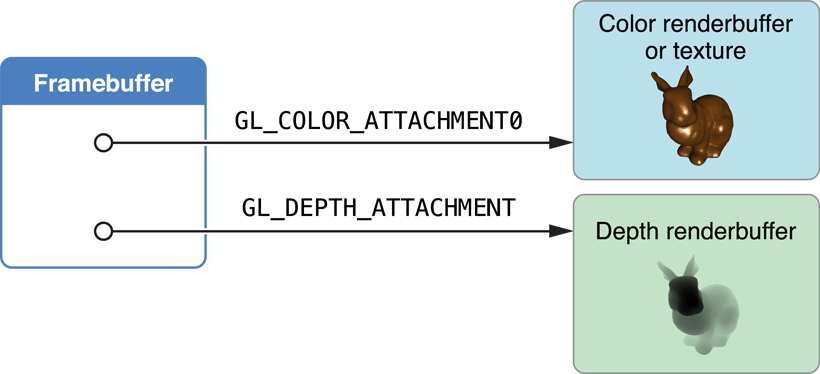
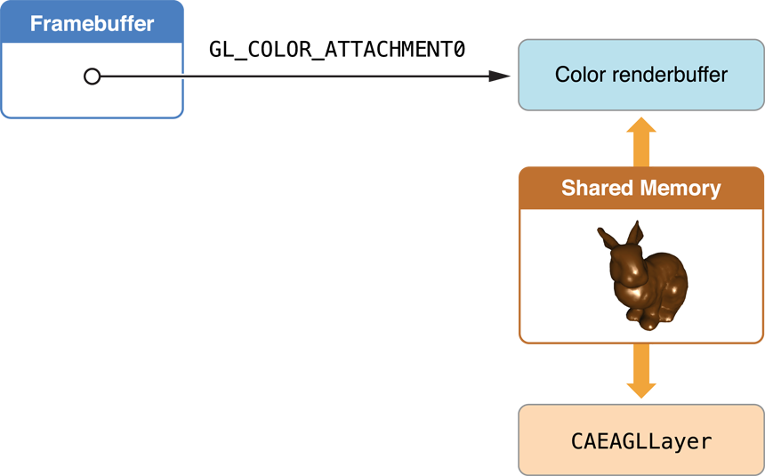

> 导航：[总目录](../../../README.md) · [documentation](../../../_indexes/documentation.md) · [OpenGL ES Programming Guide](About%20OpenGL%20ES.md)


[Next](Multitasking%2C%20High%20Resolution%2C%20and%20Other%20iOS%20Features.md)[Previous](Drawing%20with%20OpenGL%20ES%20and%20GLKit.md)

# Drawing to Other Rendering Destinations

Framebuffer objects are the destination for rendering commands. When you create a framebuffer object, you have precise control over its storage for color, depth, and stencil data. You provide this storage by attaching images to the framebuffer, as shown in Figure 4-1. The most common image attachment is a renderbuffer object. You can also attach an OpenGL ES texture to the color attachment point of a framebuffer, which means that any drawing commands are rendered into the texture. Later, the texture can act as an input to future rendering commands. You can also create multiple framebuffer objects in an single rendering context. You might do this so that you can share the same rendering pipeline and OpenGL ES resources between multiple framebuffers.

__Figure 4-1__  Framebuffer with color and depth renderbuffers



All of these approaches require manually creating framebuffer and renderbuffer objects to store the rendering results from your OpenGL ES context, as well as writing additional code to present their contents to the screen and (if needed) run an animation loop.

Depending on what task your app intends to perform, your app configures different objects to attach to the framebuffer object. In most cases, the difference in configuring the framebuffer is in what object is attached to the framebuffer object’s color attachment point:

- To use the framebuffer for offscreen image processing, attach a renderbuffer. See [Creating Offscreen Framebuffer Objects](#apple-f4xwc4dqnrsv64tfmyxwi33df52wszbpkridimbqga4doojtfvbuqmjqgmwvgvzw).
- To use the framebuffer image as an input to a later rendering step, attach a texture. See [Using Framebuffer Objects to Render to a Texture](#apple-f4xwc4dqnrsv64tfmyxwi33df52wszbpkridimbqga4doojtfvbuqmjqgmwvgvzx).
- To use the framebuffer in a Core Animation layer composition, use a special Core Animation–aware renderbuffer. See [Rendering to a Core Animation Layer](#apple-f4xwc4dqnrsv64tfmyxwi33df52wszbpkridimbqga4doojtfvbuqmjqgmwvgvzy).

A framebuffer intended for offscreen rendering allocates all of its attachments as OpenGL ES renderbuffers. The following code allocates a framebuffer object with color and depth attachments.

1. Create the framebuffer and bind it.

```
GLuint framebuffer;
glGenFramebuffers(1, &framebuffer);
glBindFramebuffer(GL_FRAMEBUFFER, framebuffer);
```
2. Create a color renderbuffer, allocate storage for it, and attach it to the framebuffer’s color attachment point.

```
GLuint colorRenderbuffer;
glGenRenderbuffers(1, &colorRenderbuffer);
glBindRenderbuffer(GL_RENDERBUFFER, colorRenderbuffer);
glRenderbufferStorage(GL_RENDERBUFFER, GL_RGBA8, width, height);
glFramebufferRenderbuffer(GL_FRAMEBUFFER, GL_COLOR_ATTACHMENT0, GL_RENDERBUFFER, colorRenderbuffer);
```
3. Create a depth or depth/stencil renderbuffer, allocate storage for it, and attach it to the framebuffer’s depth attachment point.

```
GLuint depthRenderbuffer;
glGenRenderbuffers(1, &depthRenderbuffer);
glBindRenderbuffer(GL_RENDERBUFFER, depthRenderbuffer);
glRenderbufferStorage(GL_RENDERBUFFER, GL_DEPTH_COMPONENT16, width, height);
glFramebufferRenderbuffer(GL_FRAMEBUFFER, GL_DEPTH_ATTACHMENT, GL_RENDERBUFFER, depthRenderbuffer);
```
4. Test the framebuffer for completeness. This test only needs to be performed when the framebuffer’s configuration changes.

```
GLenum status = glCheckFramebufferStatus(GL_FRAMEBUFFER) ;
if(status != GL_FRAMEBUFFER_COMPLETE) {
    NSLog(@"failed to make complete framebuffer object %x", status);
}
```

After drawing to an offscreen renderbuffer, you can return its contents to the CPU for further processing using the `glReadPixels` function.

The code to create this framebuffer is almost identical to the offscreen example, but now a texture is allocated and attached to the color attachment point.

1. Create the framebuffer object (using the same procedure as in [Creating Offscreen Framebuffer Objects](#apple-f4xwc4dqnrsv64tfmyxwi33df52wszbpkridimbqga4doojtfvbuqmjqgmwvgvzw)).
2. Create the destination texture, and attach it to the framebuffer’s color attachment point.

```
// create the texture
GLuint texture;
glGenTextures(1, &texture);
glBindTexture(GL_TEXTURE_2D, texture);
glTexParameteri(GL_TEXTURE_2D, GL_TEXTURE_MIN_FILTER, GL_LINEAR);
glTexImage2D(GL_TEXTURE_2D, 0, GL_RGBA8,  width, height, 0, GL_RGBA, GL_UNSIGNED_BYTE, NULL);
glFramebufferTexture2D(GL_FRAMEBUFFER, GL_COLOR_ATTACHMENT0, GL_TEXTURE_2D, texture, 0);
```
3. Allocate and attach a depth buffer (as before).
4. Test the framebuffer for completeness (as before).

Although this example assumes you are rendering to a color texture, other options are possible. For example, using the [OES_depth_texture](http://www.khronos.org/registry/gles/extensions/OES/OES_depth_texture.txt) extension, you can attach a texture to the depth attachment point to store depth information from the scene into a texture. You might use this depth information to calculate shadows in the final rendered scene.

Core Animation is the central infrastructure for graphics rendering and animation on iOS. You can compose your app’s user interface or other visual displays using layers that host content rendered using different iOS subsystems, such as UIKit, Quartz 2D, and OpenGL ES. OpenGL ES connects to Core Animation through the [CAEAGLLayer](https://developer.apple.com/documentation/quartzcore/caeagllayer) class, a special type of Core Animation layer whose contents come from an OpenGL ES renderbuffer. Core Animation composites the renderbuffer’s contents with other layers and displays the resulting image on screen.

__Figure 4-2__  Core Animation shares the renderbuffer with OpenGL ES



The [CAEAGLLayer](https://developer.apple.com/documentation/quartzcore/caeagllayer) provides this support to OpenGL ES by providing two key pieces of functionality. First, it allocates shared storage for a renderbuffer. Second, it presents the renderbuffer to Core Animation, replacing the layer’s previous contents with data from the renderbuffer. An advantage of this model is that the contents of the Core Animation layer do not need to be drawn in every frame, only when the rendered image changes.

To use a Core Animation layer for OpenGL ES rendering:

1. Create a [CAEAGLLayer](https://developer.apple.com/documentation/quartzcore/caeagllayer) object and configure its [properties](https://developer.apple.com/library/archive/documentation/General/Conceptual/DevPedia-CocoaCore/DeclaredProperty.html#//apple_ref/doc/uid/TP40008195-CH13).

   For optimal performance, set the value of the layer’s [opaque](https://developer.apple.com/documentation/quartzcore/calayer/1410763-isopaque) property to `YES`. See [Be Aware of Core Animation Compositing Performance](Tuning%20Your%20OpenGL%20ES%20App.md#apple-f4xwc4dqnrsv64tfmyxwi33df52wszbpkridimbqga4doojtfvbuqmjqguwvgvzy).

   Optionally, configure the surface properties of the rendering surface by assigning a new dictionary of values to the [drawableProperties](https://developer.apple.com/documentation/quartzcore/caeagllayer/1805302-drawableproperties) property of the `CAEAGLLayer` object. You can specify the pixel format for the renderbuffer and specify whether the renderbuffer’s contents are discarded after they are sent to Core Animation. For a list of the permitted keys, see _[EAGLDrawable Protocol Reference](https://developer.apple.com/documentation/opengles/eagldrawable)_.
2. Allocate an OpenGL ES context and make it the current context. See [Configuring OpenGL ES Contexts](Configuring%20OpenGL%20ES%20Contexts.md#apple-f4xwc4dqnrsv64tfmyxwi33df52wszbpkridimbqga4doojtfvbuqmrnknltc).
3. Create the framebuffer object (as in [Creating Offscreen Framebuffer Objects](#apple-f4xwc4dqnrsv64tfmyxwi33df52wszbpkridimbqga4doojtfvbuqmjqgmwvgvzw) above).
4. Create a color renderbuffer, allocating its storage by calling the context’s [renderbufferStorage:fromDrawable:](https://developer.apple.com/documentation/opengles/eaglcontext/1622262-renderbufferstorage) method and passing the layer object as the parameter. The width, height and pixel format are taken from the layer and used to allocate storage for the renderbuffer.

```
GLuint colorRenderbuffer;
glGenRenderbuffers(1, &colorRenderbuffer);
glBindRenderbuffer(GL_RENDERBUFFER, colorRenderbuffer);
[myContext renderbufferStorage:GL_RENDERBUFFER fromDrawable:myEAGLLayer];
glFramebufferRenderbuffer(GL_FRAMEBUFFER, GL_COLOR_ATTACHMENT0, GL_RENDERBUFFER, colorRenderbuffer);
```
5. Retrieve the height and width of the color renderbuffer.

```
GLint width;
GLint height;
glGetRenderbufferParameteriv(GL_RENDERBUFFER, GL_RENDERBUFFER_WIDTH, &width);
glGetRenderbufferParameteriv(GL_RENDERBUFFER, GL_RENDERBUFFER_HEIGHT, &height);
```

   In earlier examples, the width and height of the renderbuffers were explicitly provided to allocate storage for the buffer. Here, the code retrieves the width and height from the color renderbuffer after its storage is allocated. Your app does this because the actual dimensions of the color renderbuffer are calculated based on the layer’s bounds and scale factor. Other renderbuffers attached to the framebuffer must have the same dimensions. In addition to using the height and width to allocate the depth buffer, use them to assign the OpenGL ES viewport and to help determine the level of detail required in your app’s textures and models. See [Supporting High-Resolution Displays](Multitasking%2C%20High%20Resolution%2C%20and%20Other%20iOS%20Features.md#apple-f4xwc4dqnrsv64tfmyxwi33df52wszbpkridimbqga4doojtfvbuqnjnknltm).
6. Allocate and attach a depth buffer (as before).
7. Test the framebuffer for completeness (as before).
8. Add the [CAEAGLLayer](https://developer.apple.com/documentation/quartzcore/caeagllayer) object to your Core Animation layer hierarchy by passing it to the [addSublayer:](https://developer.apple.com/documentation/quartzcore/calayer/1410833-addsublayer) method of a visible layer.

Now that you have a framebuffer object, you need to fill it. This section describes the steps required to render new frames and present them to the user. Rendering to a texture or offscreen framebuffer acts similarly, differing only in how your app uses the final frame.

You must choose when to draw your OpenGL ES content when rendering to a Core Animation layer, just as when drawing with GLKit views and view controllers. If rendering to an offscreen framebuffer or texture, draw whenever is appropriate to the situations where you use those types of framebuffers.

For on-demand drawing, implement your own method to draw into and present your renderbuffer, and call it whenever you want to display new content.

To draw with an animation loop, use a [CADisplayLink](https://developer.apple.com/documentation/quartzcore/cadisplaylink) object. A display link is a kind of timer provided by Core Animation that lets you synchronize drawing to the refresh rate of a screen. [Listing 4-1](#apple-f4xwc4dqnrsv64tfmyxwi33df52wszbpkridimbqga4doojtfvbuqmjqgmwvgvzs) shows how you can retrieve the screen showing a view, use that screen to create a new display link object and add the display link object to the run loop.

__Listing 4-1__  Creating and starting a display link

```
displayLink = [myView.window.screen displayLinkWithTarget:self selector:@selector(drawFrame)];
[displayLink addToRunLoop:[NSRunLoop currentRunLoop] forMode:NSDefaultRunLoopMode];
```

Inside your implementation of the `drawFrame` method, read the display link’s [timestamp](https://developer.apple.com/documentation/quartzcore/cadisplaylink/1621257-timestamp) property to get the timestamp for the next frame to be rendered. It can use that value to calculate the positions of objects in the next frame.

Normally, the display link object is fired every time the screen refreshes; that value is usually 60 Hz, but may vary on different devices. Most apps do not need to update the screen 60 times per second. You can set the display link’s [frameInterval](https://developer.apple.com/documentation/quartzcore/cadisplaylink/1621231-frameinterval) property to the number of actual frames that go by before your method is called. For example, if the frame interval was set to `3`, your app is called every third frame, or roughly 20 frames per second.

Figure 4-3 shows the steps an OpenGL ES app should take on iOS to render and present a frame. These steps include many hints to improve performance in your app.

__Figure 4-3__  iOS OpenGL Rendering Steps

!

At the start of every frame, erase the contents of all framebuffer attachments whose contents from a previous frames are not needed to draw the next frame. Call the `glClear` function, passing in a bit mask with all of the buffers to clear, as shown in Listing 4-2.

__Listing 4-2__  Clear framebuffer attachments

```
glBindFramebuffer(GL_FRAMEBUFFER, framebuffer);
glClear(GL_DEPTH_BUFFER_BIT | GL_COLOR_BUFFER_BIT);
```

Using `glClear` “hints” to OpenGL ES that the existing contents of a renderbuffer or texture can be discarded, avoiding costly operations to load the previous contents into memory.

These two steps encompass most of the key decisions you make in designing your app’s architecture. First, you decide what you want to display to the user and configure the corresponding OpenGL ES objects—such as vertex buffer objects, textures, shader programs and their input variables—for uploading to the GPU. Next, you submit drawing commants that tell the GPU how to use those resources for rendering a frame.

Renderer design is covered in more detail in [OpenGL ES Design Guidelines](OpenGL%20ES%20Design%20Guidelines.md#apple-f4xwc4dqnrsv64tfmyxwi33df52wszbpkridimbqga4doojtfvbuqnrnknltc). For now, the most important performance optimization to note is that your app runs faster if it modifies OpenGL ES objects only at the start of rendering a new frame. Although your app can alternate between modifying objects and submitting drawing commands (as shown by the dotted line in [Figure 4-3](#apple-f4xwc4dqnrsv64tfmyxwi33df52wszbpkridimbqga4doojtfvbuqmjqgmwvgvzrgi)), it runs faster if it performs each step only once per frame.

This step takes the objects you prepared in the previous step and submits drawing commands to use them. Designing this portion of your rendering code to run efficiently is covered in detail in [OpenGL ES Design Guidelines](OpenGL%20ES%20Design%20Guidelines.md#apple-f4xwc4dqnrsv64tfmyxwi33df52wszbpkridimbqga4doojtfvbuqnrnknltc). For now, the most important performance optimization to note is that your app runs faster if it only modifies OpenGL ES objects at the start of rendering a new frame. Although your app can alternate between modifying objects and submitting drawing commands (as shown by the dotted line), it runs faster if it only performs each step once.

If your app uses multisampling to improve image quality, your app must resolve the pixels before they are presented to the user. Multisampling is covered in detail in [Using Multisampling to Improve Image Quality](#apple-f4xwc4dqnrsv64tfmyxwi33df52wszbpkridimbqga4doojtfvbuqmjqgmwvgvzu).

A _discard_ operation is a performance hint that tells OpenGL ES that the contents of one or more renderbuffers are no longer needed. By hinting to OpenGL ES that you do not need the contents of a renderbuffer, the data in the buffers can be discarded and expensive tasks to keep the contents of those buffers updated can be avoided.

At this stage in the rendering loop, your app has submitted all of its drawing commands for the frame. While your app needs the color renderbuffer to display to the screen, it probably does not need the depth buffer’s contents. Listing 4-3 discards the contents of the depth buffer.

__Listing 4-3__  Discarding the depth framebuffer

```
const GLenum discards[]  = {GL_DEPTH_ATTACHMENT};
glBindFramebuffer(GL_FRAMEBUFFER, framebuffer);
glDiscardFramebufferEXT(GL_FRAMEBUFFER,1,discards);
```


At this step, the color renderbuffer holds the completed frame, so all you need to do is present it to the user. [Listing 4-4](#apple-f4xwc4dqnrsv64tfmyxwi33df52wszbpkridimbqga4doojtfvbuqmjqgmwvgvzsgm) binds the renderbuffer to the context and presents it. This causes the completed frame to be handed to Core Animation.

__Listing 4-4__  Presenting the finished frame

```
glBindRenderbuffer(GL_RENDERBUFFER, colorRenderbuffer);
[context presentRenderbuffer:GL_RENDERBUFFER];
```

By default, you must assume that the contents of the renderbuffer are _discarded_ after your app presents the renderbuffer. This means that every time your app presents a frame, it must completely re-create the frame’s contents when it renders a new frame. The code above always erases the color buffer for this reason.

If your app wants to preserve the contents of the color renderbuffer between frames, add the [kEAGLDrawablePropertyRetainedBacking](https://developer.apple.com/documentation/opengles/keagldrawablepropertyretainedbacking) key to the dictionary stored in the `drawableProperties` property of the `CAEAGLLayer` object, and remove the `GL_COLOR_BUFFER_BIT` constant from the earlier `glClear` function call. Retained backing may require iOS to allocate additional memory to preserve the buffer’s contents, which may reduce your app’s performance.

Multisampling is a form of _antialiasing_ that smooths jagged edges and improves image quality in most 3D apps. OpenGL ES 3.0 includes multisampling as part of the core specification, and iOS provides it in OpenGL ES 1.1 and 2.0 through the [APPLE_framebuffer_multisample](http://www.khronos.org/registry/gles/extensions/APPLE/APPLE_framebuffer_multisample.txt) extension. Multisampling uses more memory and fragment processing time to render the image, but it may improve image quality at a lower performance cost than using other approaches.

Figure 4-4 shows how multisampling works. Instead of creating one framebuffer object, your app creates two. The _multisampling buffer_ contains all attachments necessary to render your content (typically color and depth buffers). The _resolve buffer_ contains only the attachments necessary to display a rendered image to the user (typically a color renderbuffer, but possibly a texture), created using the appropriate procedure from [Creating a Framebuffer Object](#apple-f4xwc4dqnrsv64tfmyxwi33df52wszbpkridimbqga4doojtfvbuqmjqgmwvgvzv). The multisample renderbuffers are allocated using the same dimensions as the resolve framebuffer, but each includes an additional parameter that specifies the number of samples to store for each pixel. Your app performs all of its rendering to the multisampling buffer and then generates the final antialiased image by _resolving_ those samples into the resolve buffer.

__Figure 4-4__  How multisampling works

!

Listing 4-5 shows the code to create the multisampling buffer. This code uses the width and height of the previously created buffer. It calls the `glRenderbufferStorageMultisampleAPPLE` function to create multisampled storage for the renderbuffer.

__Listing 4-5__  Creating the multisample buffer

```
glGenFramebuffers(1, &sampleFramebuffer);
glBindFramebuffer(GL_FRAMEBUFFER, sampleFramebuffer);

glGenRenderbuffers(1, &sampleColorRenderbuffer);
glBindRenderbuffer(GL_RENDERBUFFER, sampleColorRenderbuffer);
glRenderbufferStorageMultisampleAPPLE(GL_RENDERBUFFER, 4, GL_RGBA8_OES, width, height);
glFramebufferRenderbuffer(GL_FRAMEBUFFER, GL_COLOR_ATTACHMENT0, GL_RENDERBUFFER, sampleColorRenderbuffer);

glGenRenderbuffers(1, &sampleDepthRenderbuffer);
glBindRenderbuffer(GL_RENDERBUFFER, sampleDepthRenderbuffer);
glRenderbufferStorageMultisampleAPPLE(GL_RENDERBUFFER, 4, GL_DEPTH_COMPONENT16, width, height);
glFramebufferRenderbuffer(GL_FRAMEBUFFER, GL_DEPTH_ATTACHMENT, GL_RENDERBUFFER, sampleDepthRenderbuffer);

if (glCheckFramebufferStatus(GL_FRAMEBUFFER) != GL_FRAMEBUFFER_COMPLETE)
    NSLog(@"Failed to make complete framebuffer object %x", glCheckFramebufferStatus(GL_FRAMEBUFFER));
```

Here are the steps to modify your rendering code to support multisampling:

1. During the Clear Buffers step, you clear the multisampling framebuffer’s contents.

```
glBindFramebuffer(GL_FRAMEBUFFER, sampleFramebuffer);
glViewport(0, 0, framebufferWidth, framebufferHeight);
glClear(GL_COLOR_BUFFER_BIT | GL_DEPTH_BUFFER_BIT);
```
2. After submitting your drawing commands, you resolve the contents from the multisampling buffer into the resolve buffer. The samples stored for each pixel are combined into a single sample in the resolve buffer.

```
glBindFramebuffer(GL_DRAW_FRAMEBUFFER_APPLE, resolveFrameBuffer);
glBindFramebuffer(GL_READ_FRAMEBUFFER_APPLE, sampleFramebuffer);
glResolveMultisampleFramebufferAPPLE();
```
3. In the Discard step, you can discard both renderbuffers attached to the multisample framebuffer. This is because the contents you plan to present are stored in the resolve framebuffer.

```
const GLenum discards[]  = {GL_COLOR_ATTACHMENT0,GL_DEPTH_ATTACHMENT};
glDiscardFramebufferEXT(GL_READ_FRAMEBUFFER_APPLE,2,discards);
```
4. In the Present Results step, you present the color renderbuffer attached to the resolve framebuffer.

```
glBindRenderbuffer(GL_RENDERBUFFER, colorRenderbuffer);
[context presentRenderbuffer:GL_RENDERBUFFER];
```

Multisampling is not free; additional memory is required to store the additional samples, and resolving the samples into the resolve framebuffer takes time. If you add multisampling to your app, always test your app’s performance to ensure that it remains acceptable.

[Next](Multitasking%2C%20High%20Resolution%2C%20and%20Other%20iOS%20Features.md)[Previous](Drawing%20with%20OpenGL%20ES%20and%20GLKit.md)

