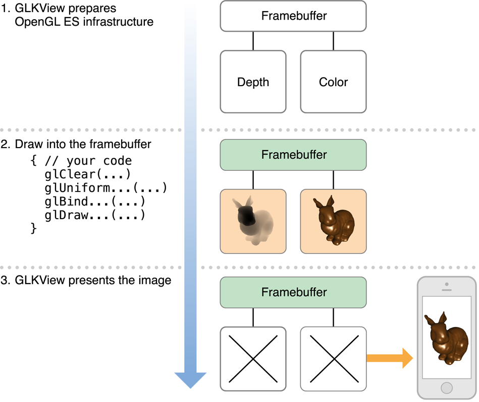

> 导航：[总目录](../../../README.md) · [documentation](../../../_indexes/documentation.md) · [OpenGL ES Programming Guide](About%20OpenGL%20ES.md)


[Next](Drawing%20to%20Other%20Rendering%20Destinations.md)[Previous](Configuring%20OpenGL%20ES%20Contexts.md)

# Drawing with OpenGL ES and GLKit

The GLKit framework provides view and view controller classes that eliminate the setup and maintenance code that would otherwise be required for drawing and animating OpenGL ES content. The [GLKView](https://developer.apple.com/documentation/glkit/glkview) class manages OpenGL ES infrastructure to provide a place for your drawing code, and the [GLKViewController](https://developer.apple.com/documentation/glkit/glkviewcontroller) class provides a rendering loop for smooth animation of OpenGL ES content in a GLKit view. These classes extend the standard UIKit design patterns for drawing view content and managing view presentation. As a result, you can focus your efforts primarily on your OpenGL ES rendering code and get your app up and running quickly. The GLKit framework also provides other features to ease OpenGL ES 2.0 and 3.0 development.

The [GLKView](https://developer.apple.com/documentation/glkit/glkview) class provides an OpenGL ES–based equivalent of the standard `UIView` drawing cycle. A [UIView](https://developer.apple.com/documentation/uikit/uiview) instance automatically configures its graphics context so that your [drawRect:](https://developer.apple.com/documentation/uikit/uiview/1622529-draw) implementation need only perform Quartz 2D drawing commands, and a [GLKView](https://developer.apple.com/documentation/glkit/glkview) instance automatically configures itself so that your drawing method need only perform OpenGL ES drawing commands. The [GLKView](https://developer.apple.com/documentation/glkit/glkview) class provides this functionality by maintaining a framebuffer object that holds the results of your OpenGL ES drawing commands, and then automatically presents them to Core Animation once your drawing method returns.

Like a standard UIKit view, a GLKit view renders its content on demand. When your view is first displayed, it calls your drawing method—Core Animation caches the rendered output and displays it whenever your view is shown. When you want to change the contents of your view, call its [setNeedsDisplay](https://developer.apple.com/documentation/uikit/uiview/1622437-setneedsdisplay) method and the view again calls your drawing method, caches the resulting image, and presents it on screen. This approach is useful when the data used to render an image changes infrequently or only in response to user action. By rendering new view contents only when you need to, you conserve battery power on the device and leave more time for the device to perform other actions.

__Figure 3-1__  Rendering OpenGL ES content with a GLKit view



You can create and configure a `GLKView` object either programmatically or using Interface Builder. Before you can use it for drawing, you must associate it with an [EAGLContext](https://developer.apple.com/documentation/opengles/eaglcontext) object (see [Configuring OpenGL ES Contexts](Configuring%20OpenGL%20ES%20Contexts.md#apple-f4xwc4dqnrsv64tfmyxwi33df52wszbpkridimbqga4doojtfvbuqmrnknltc)).

- When creating a view programmatically, first create a context and then pass it to the view’s [initWithFrame:context:](https://developer.apple.com/documentation/glkit/glkview/1615609-initwithframe) method.
- After loading a view from a storyboard, create a context and set it as the value of the view’s [context](https://developer.apple.com/documentation/glkit/glkview/1615597-context) property.

A GLKit view automatically creates and configures its own OpenGL ES framebuffer object and renderbuffers. You control the attributes of these objects using the view’s drawable properties, as illustrated in Listing 3-1. If you change the size, scale factor, or drawable properties of a GLKit view, it automatically deletes and re-creates the appropriate framebuffer objects and renderbuffers the next time its contents are drawn.

__Listing 3-1__  Configuring a GLKit view

```objc
- (void)viewDidLoad
{
    [super viewDidLoad];

    // Create an OpenGL ES context and assign it to the view loaded from storyboard
    GLKView *view = (GLKView *)self.view;
    view.context = [[EAGLContext alloc] initWithAPI:kEAGLRenderingAPIOpenGLES2];

    // Configure renderbuffers created by the view
    view.drawableColorFormat = GLKViewDrawableColorFormatRGBA8888;
    view.drawableDepthFormat = GLKViewDrawableDepthFormat24;
    view.drawableStencilFormat = GLKViewDrawableStencilFormat8;

    // Enable multisampling
    view.drawableMultisample = GLKViewDrawableMultisample4X;
}
```

You can enable multisampling for a [GLKView](https://developer.apple.com/documentation/glkit/glkview) instance using its [drawableMultisample](https://developer.apple.com/documentation/glkit/glkview/1615601-drawablemultisample) property. Multisampling is a form of _antialiasing_ that smooths jagged edges, improving image quality in most 3D apps at the cost of using more memory and fragment processing time—if you enable multisampling, always test your app’s performance to ensure that it remains acceptable.

[Figure 3-1](#apple-f4xwc4dqnrsv64tfmyxwi33df52wszbpkridimbqga4doojtfvbuqnjqgmwvgvzu) outlines the three steps for drawing OpenGL ES content: preparing OpenGL ES infrastructure, issuing drawing commands, and presenting the rendered content to Core Animation for display. The [GLKView](https://developer.apple.com/documentation/glkit/glkview) class implements the first and third steps. For the second step, you implement a drawing method like the example in Listing 3-2.

__Listing 3-2__  Example drawing method for a GLKit view

```objc
- (void)drawRect:(CGRect)rect
{
    // Clear the framebuffer
    glClearColor(0.0f, 0.0f, 0.1f, 1.0f);
    glClear(GL_COLOR_BUFFER_BIT | GL_DEPTH_BUFFER_BIT);

    // Draw using previously configured texture, shader, uniforms, and vertex array
    glBindTexture(GL_TEXTURE_2D, _planetTexture);
    glUseProgram(_diffuseShading);
    glUniformMatrix4fv(_uniformModelViewProjectionMatrix, 1, 0, _modelViewProjectionMatrix.m);
    glBindVertexArrayOES(_planetMesh);
    glDrawElements(GL_TRIANGLE_STRIP, 256, GL_UNSIGNED_SHORT);
}
```

The `GLKView` class is able to provide a simple interface for OpenGL ES drawing because it manages the standard parts of the OpenGL ES rendering process:

- Before invoking your drawing method, the view:

  - Makes its [EAGLContext](https://developer.apple.com/documentation/opengles/eaglcontext) object the current context
  - Creates a framebuffer object and renderbuffers based on its current size, scale factor, and drawable properties (if needed)
  - Binds the framebuffer object as the current destination for drawing commands
  - Sets the OpenGL ES viewport to match the framebuffer size
- After your drawing method returns, the view:

  - Resolves multisampling buffers (if multisampling is enabled)
  - Discards renderbuffers whose contents are no longer needed
  - Presents renderbuffer contents to Core Animation for caching and display

Many OpenGL ES apps implement rendering code in a custom class. An advantage of this approach is that it allows you to easily support multiple rendering algorithms by defining a different renderer class for each. Rendering algorithms that share common functionality can inherit it from a superclass. For example, you might use different renderer classes to support both OpenGL ES 2.0 and 3.0 (see [Configuring OpenGL ES Contexts](Configuring%20OpenGL%20ES%20Contexts.md#apple-f4xwc4dqnrsv64tfmyxwi33df52wszbpkridimbqga4doojtfvbuqmrnknltc)). Or you might use them to customize rendering for better image quality on devices with more powerful hardware.

GLKit is well suited to this approach—you can make your renderer object the delegate of a standard [GLKView](https://developer.apple.com/documentation/glkit/glkview) instance. Instead of subclassing [GLKView](https://developer.apple.com/documentation/glkit/glkview) and implementing the [drawRect:](https://developer.apple.com/documentation/uikit/uiview/1622529-draw) method, your renderer class adopts the [GLKViewDelegate](https://developer.apple.com/documentation/glkit/glkviewdelegate) protocol and implements the [glkView:drawInRect:](https://developer.apple.com/documentation/glkit/glkviewdelegate/1615595-glkview) method. Listing 3-3 demonstrates choosing a renderer class based on hardware features at app launch time.

__Listing 3-3__  Choosing a renderer class based on hardware features

```objc
- (BOOL)application:(UIApplication *)application didFinishLaunchingWithOptions:(NSDictionary *)launchOptions
{
    // Create a context so we can test for features
    EAGLContext *context = [[EAGLContext alloc] initWithAPI:kEAGLRenderingAPIOpenGLES2];
    [EAGLContext setCurrentContext:context];

    // Choose a rendering class based on device features
    GLint maxTextureSize;
    glGetIntegerv(GL_MAX_TEXTURE_SIZE, &maxTextureSize);
    if (maxTextureSize > 2048)
        self.renderer = [[MyBigTextureRenderer alloc] initWithContext:context];
    else
        self.renderer = [[MyRenderer alloc] initWithContext:context];

    // Make the renderer the delegate for the view loaded from the main storyboard
    GLKView *view = (GLKView *)self.window.rootViewController.view;
    view.delegate = self.renderer;

    // Give the OpenGL ES context to the view so it can draw
    view.context = context;

    return YES;
}
```


By default, a [GLKView](https://developer.apple.com/documentation/glkit/glkview) object renders its contents on demand. That said, a key advantage to drawing with OpenGL ES is its ability to use graphics processing hardware for continuous animation of complex scenes—apps such as games and simulations rarely present static images. For these cases, the GLKit framework provides a view controller class that maintains an animation loop for the [GLKView](https://developer.apple.com/documentation/glkit/glkview) object it manages. This loop follows a design pattern common in games and simulations, with two phases: _update_ and _display_. Figure 3-2 shows a simplified example of an animation loop.

__Figure 3-2__  The animation loop


For the update phase, the view controller calls its own `update` method (or its delegate’s [glkViewControllerUpdate:](https://developer.apple.com/documentation/glkit/glkviewcontrollerdelegate/1620710-glkviewcontrollerupdate) method). In this method, you should prepare for drawing the next frame. For example, a game might use this method to determine the positions of player and enemy characters based on input events received since the last frame, and a scientific visualization might use this method to run a step of its simulation. If you need timing information to determine your app’s state for the next frame, use one of the view controller’s timing properties such as the [timeSinceLastUpdate](https://developer.apple.com/documentation/glkit/glkviewcontroller/1620726-timesincelastupdate) property. In Figure 3-2, the update phase increments an `angle` variable and uses it to calculate a transformation matrix.

For the display phase, the view controller calls its view’s [display](https://developer.apple.com/documentation/glkit/glkview/1615571-display) method, which in turn calls your drawing method. In your drawing method, you submit OpenGL ES drawing commands to the GPU to render your content. For optimal performance, your app should modify OpenGL ES objects at the start of rendering a new frame, and submit drawing commands afterward. In Figure 3-2, the display phase sets a uniform variable in a shader program to the matrix calculated in the update phase, and then submits a drawing command to render new content.

The animation loop alternates between these two phases at the rate indicated by the view controller’s [framesPerSecond](https://developer.apple.com/documentation/glkit/glkviewcontroller/1620723-framespersecond) property. You can use the [preferredFramesPerSecond](https://developer.apple.com/documentation/glkit/glkviewcontroller/1620702-preferredframespersecond) property to set a desired frame rate—to optimize performance for the current display hardware, the view controller automatically chooses an optimal frame rate close to your preferred value.

Listing 3-4 demonstrates a typical strategy for rendering animated OpenGL ES content using a [GLKViewController](https://developer.apple.com/documentation/glkit/glkviewcontroller) subclass and [GLKView](https://developer.apple.com/documentation/glkit/glkview) instance.

__Listing 3-4__  Using a GLKit view and view controller to draw and animate OpenGL ES content

```objc
@implementation PlanetViewController // subclass of GLKViewController

- (void)viewDidLoad
{
    [super viewDidLoad];

    // Create an OpenGL ES context and assign it to the view loaded from storyboard
    GLKView *view = (GLKView *)self.view;
    view.context = [[EAGLContext alloc] initWithAPI:kEAGLRenderingAPIOpenGLES2];

    // Set animation frame rate
    self.preferredFramesPerSecond = 60;

    // Not shown: load shaders, textures and vertex arrays, set up projection matrix
    [self setupGL];
}

- (void)update
{
    _rotation += self.timeSinceLastUpdate * M_PI_2; // one quarter rotation per second

    // Set up transform matrices for the rotating planet
    GLKMatrix4 modelViewMatrix = GLKMatrix4MakeRotation(_rotation, 0.0f, 1.0f, 0.0f);
    _normalMatrix = GLKMatrix3InvertAndTranspose(GLKMatrix4GetMatrix3(modelViewMatrix), NULL);
    _modelViewProjectionMatrix = GLKMatrix4Multiply(_projectionMatrix, modelViewMatrix);
}

- (void)glkView:(GLKView *)view drawInRect:(CGRect)rect
{
    // Clear the framebuffer
    glClearColor(0.0f, 0.0f, 0.1f, 1.0f);
    glClear(GL_COLOR_BUFFER_BIT | GL_DEPTH_BUFFER_BIT);

    // Set shader uniforms to values calculated in -update
    glUseProgram(_diffuseShading);
    glUniformMatrix4fv(_uniformModelViewProjectionMatrix, 1, 0, _modelViewProjectionMatrix.m);
    glUniformMatrix3fv(_uniformNormalMatrix, 1, 0, _normalMatrix.m);

    // Draw using previously configured texture and vertex array
    glBindTexture(GL_TEXTURE_2D, _planetTexture);
    glBindVertexArrayOES(_planetMesh);
    glDrawElements(GL_TRIANGLE_STRIP, 256, GL_UNSIGNED_SHORT, 0);
}

@end
```

In this example, an instance of the `PlanetViewController` class (a custom [GLKViewController](https://developer.apple.com/documentation/glkit/glkviewcontroller) subclass) is loaded from a storyboard, along with a standard [GLKView](https://developer.apple.com/documentation/glkit/glkview) instance and its drawable properties. The `viewDidLoad` method creates an OpenGL ES context and provides it to the view, and also sets the frame rate for the animation loop.

The view controller is automatically the delegate of its view, so it implements both the update and display phases of the animation loop. In the `update` method, it calculates the transformation matrices needed to display a rotating planet. In the `glkView:drawInRect:` method, it provides those matrices to a shader program and submits drawing commands to render the planet geometry.

In addition to view and view controller infrastructure, the GLKit framework provides several other features to ease OpenGL ES development on iOS.

OpenGL ES 2.0 and later doesn’t provide built-in functions for creating or specifying transformation matrices. Instead, programmable shaders provide vertex transformation, and you specify shader inputs using generic uniform variables. The GLKit framework includes a comprehensive library of vector and matrix types and functions, optimized for high performance on iOS hardware. (See _[GLKit Framework Reference](https://developer.apple.com/documentation/glkit)_.)

OpenGL ES 2.0 and later removes all functionality associated with the OpenGL ES 1.1 fixed-function graphics pipeline. The [GLKBaseEffect](https://developer.apple.com/documentation/glkit/glkbaseeffect) class provides an Objective-C analog to the transformation, lighting and shading stages of the OpenGL ES 1.1 pipeline, and the [GLKSkyboxEffect](https://developer.apple.com/documentation/glkit/glkskyboxeffect) and [GLKReflectionMapEffect](https://developer.apple.com/documentation/glkit/glkreflectionmapeffect) classes add support for common visual effects. See the reference documentation for these classes for details.

The [GLKTextureLoader](https://developer.apple.com/documentation/glkit/glktextureloader) class provides a simple way to load texture data from any image format supported by iOS into an OpenGL ES context, synchronously or asynchronously. (See [Use the GLKit Framework to Load Texture Data](Best%20Practices%20for%20Working%20with%20Texture%20Data.md#apple-f4xwc4dqnrsv64tfmyxwi33df52wszbpkridimbqga4doojtfvbuqmjqgqwvgvzrga).)

[Next](Drawing%20to%20Other%20Rendering%20Destinations.md)[Previous](Configuring%20OpenGL%20ES%20Contexts.md)

