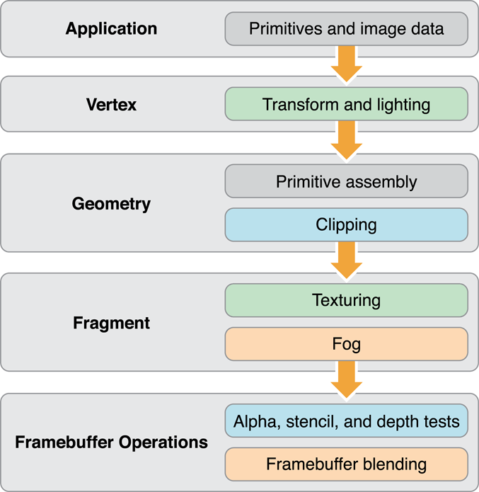
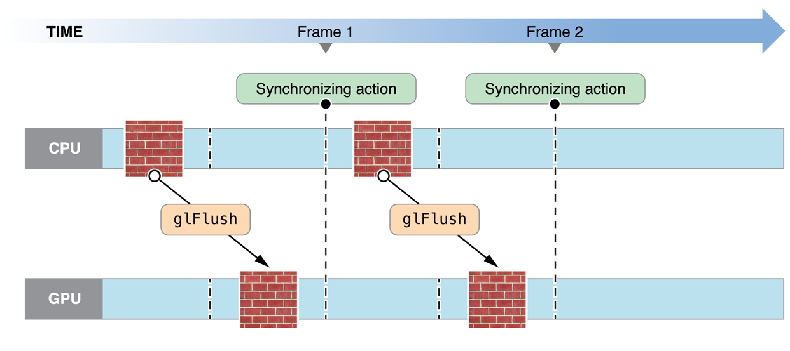
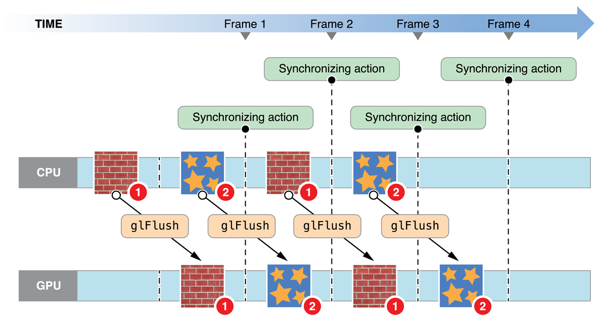

> 导航：[总目录](../../../README.md) · [documentation](../../../_indexes/documentation.md) · [OpenGL ES Programming Guide](About%20OpenGL%20ES.md)


[Next](Tuning%20Your%20OpenGL%20ES%20App.md)[Previous](Multitasking%2C%20High%20Resolution%2C%20and%20Other%20iOS%20Features.md)

# OpenGL ES Design Guidelines

Now that you’ve mastered the basics of using OpenGL ES in an iOS app, use the information in this chapter to help you design your app’s rendering engine for better performance. This chapter introduces key concepts of renderer design; later chapters expand on this information with specific best practices and performance techniques.

This section describes two perspectives for visualizing the design of OpenGL ES: as a client-server architecture and as a pipeline. Both perspectives can be useful in planning and evaluating the architecture of your app.

Figure 6-1 visualizes OpenGL ES as a client-server architecture. Your app communicates state changes, texture and vertex data, and rendering commands to the OpenGL ES client. The client translates this data into a format that the graphics hardware understands, and forwards them to the GPU. These processes add overhead to your app’s graphics performance.

__Figure 6-1__  OpenGL ES client-server architecture

!!

Achieving great performance requires carefully managing this overhead. A well-designed app reduces the frequency of calls it makes to OpenGL ES, uses hardware-appropriate data formats to minimize translation costs, and carefully manages the flow of data between itself and OpenGL ES.

Figure 6-2 visualizes OpenGL ES as a graphics pipeline. Your app configures the graphics pipeline, and then executes drawing commands to send vertex data down the pipeline. Successive stages of the pipeline run a vertex shader to process the vertex data, assemble vertices into primitives, rasterize primitives into fragments, run a fragment shader to compute color and depth values for each fragment, and blend fragments into a framebuffer for display.

__Figure 6-2__  OpenGL ES graphics pipeline



Use the pipeline as a mental model to identify what work your app performs to generate a new frame. Your renderer design consists of writing shader programs to handle the vertex and fragment stages of the pipeline, organizing the vertex and texture data that you feed into these programs, and configuring the OpenGL ES state machine that drives fixed-function stages of the pipeline.

Individual stages in the graphics pipeline can calculate their results simultaneously—for example, your app might prepare new primitives while separate portions of the graphics hardware perform vertex and fragment calculations on previously submitted geometry. However, later stages depend on the output of earlier stages. If any pipeline stage performs too much work or performs too slowly, other pipeline stages sit idle until the slowest stage completes its work. A well-designed app balances the work performed by each pipeline stage according to graphics hardware capabilities.

iOS supports three versions of OpenGL ES. Newer versions provide more flexibility, allowing you to implement rendering algorithms that include high-quality visual effects without compromising performance..

OpenGL ES 3.0 is new in iOS 7. Your app can use features introduced in OpenGL ES 3.0 to implement advanced graphics programming techniques—previously available only on desktop-class hardware and game consoles—for faster graphics performance and compelling visual effects.

Some key features of OpenGL ES 3.0 are highlighted below. For a complete overview, see the _OpenGL ES 3.0 Specification_ in the [OpenGL ES API Registry](http://www.khronos.org/registry/gles/).

GLSL ES 3.0 adds new features such as uniform blocks, 32-bit integers, and additional integer operations, for performing more general-purpose computing tasks within vertex and fragment shader programs. To use the new language in a shader program, your shader source code must begin with the `#version 330 es` directive. OpenGL ES 3.0 contexts remain compatible with shaders written for OpenGL ES 2.0.

For more details, see [Adopting OpenGL ES Shading Language version 3.0](Adopting%20OpenGL%20ES%203.0.md#apple-f4xwc4dqnrsv64tfmyxwi33df52wszbpkridimbqga4doojtfvbuqnjqgqwvgvzrha) and the _OpenGL ES Shading Language 3.0 Specification_ in the [OpenGL ES API Registry](http://www.khronos.org/registry/gles/).

By enabling multiple render targets, you can create fragment shaders that write to multiple framebuffer attachments simultaneously.

This feature enables the use of advanced rendering algorithms such as _deferred shading_, in which your app first renders to a set of textures to store geometry data, then performs one or more shading passes that read from those textures and perform lighting calculations to output a final image. Because this approach precomputes the inputs to lighting calculations, the incremental performance cost for adding larger numbers of lights to a scene is much smaller. Deferred shading algorithms require multiple render target support, as shown in Figure 6-3, to achieve reasonable performance. Otherwise, rendering to multiple textures requires a separate drawing pass for each texture.

__Figure 6-3__  Example of fragment shader output to multiple render targets

!

You set up multiple render targets with an addition to the process described in [Creating a Framebuffer Object](Drawing%20to%20Other%20Rendering%20Destinations.md#apple-f4xwc4dqnrsv64tfmyxwi33df52wszbpkridimbqga4doojtfvbuqmjqgmwvgvzv). Instead of creating a single color attachment for a framebuffer, you create several. Then, call the `glDrawBuffers` function to specify which framebuffer attachments to use in rendering, as shown in Listing 6-1.

__Listing 6-1__  Setting up multiple render targets

```
// Attach (previously created) textures to the framebuffer.
glFramebufferTexture2D(GL_DRAW_FRAMEBUFFER, GL_COLOR_ATTACHMENT0, GL_TEXTURE_2D, _colorTexture, 0);
glFramebufferTexture2D(GL_DRAW_FRAMEBUFFER, GL_COLOR_ATTACHMENT1, GL_TEXTURE_2D, _positionTexture, 0);
glFramebufferTexture2D(GL_DRAW_FRAMEBUFFER, GL_COLOR_ATTACHMENT2, GL_TEXTURE_2D, _normalTexture, 0);
glFramebufferTexture2D(GL_DRAW_FRAMEBUFFER, GL_DEPTH_STENCIL_ATTACHMENT, GL_TEXTURE_2D, _depthTexture, 0);

// Specify the framebuffer attachments for rendering.
GLenum targets[] = {GL_COLOR_ATTACHMENT0, GL_COLOR_ATTACHMENT1, GL_COLOR_ATTACHMENT2};
glDrawBuffers(3, targets);
```

When your app issues drawing commands, your fragment shader determines what color (or non-color data) is output for each pixel in each render target. Listing 6-2 shows a basic fragment shader that renders to multiple targets by assigning to fragment output variables whose locations match those set in Listing 6-1.

__Listing 6-2__  Fragment shader with output to multiple render targets

```
#version 300 es

uniform lowp sampler2D myTexture;
in mediump vec2 texCoord;
in mediump vec4 position;
in mediump vec3 normal;

layout(location = 0) out lowp vec4 colorData;
layout(location = 1) out mediump vec4 positionData;
layout(location = 2) out mediump vec4 normalData;

void main()
{
    colorData = texture(myTexture, texCoord);
    positionData = position;
    normalData = vec4(normalize(normal), 1.0);
}
```

Multiple render targets can also be useful for other advanced graphics techniques, such as real-time reflections, screen-space ambient occlusion, and volumetric lighting.

Graphics hardware uses a highly parallelized architecture optimized for vector processing. You can make better use of this hardware with the new transform feedback feature, which lets you capture output from a vertex shader into a buffer object in GPU memory. You can capture data from one rendering pass to use in another, or disable parts of the graphics pipeline and use transform feedback for general-purpose computation.

One technique that benefits from transform feedback is animated particle effects. A general architecture for rendering a particle system is illustrated in Figure 6-4. First, the app sets up the initial state of the particle simulation. Then, for each frame rendered, the app runs a step of its simulation, updating the position, orientation, and velocity of each simulated particle, and then draws visual assets representing the current state of the particles.

__Figure 6-4__  Overview of a particle system animation

!

Traditionally, apps implementing particle systems run their simulations on the CPU, storing the results of the simulation in a vertex buffer to be used in rendering particle art. However, transferring the contents of the vertex buffer to GPU memory is time-consuming. Transform feedback, by optimizing the power of parallel architecture available in modern GPU hardware, solves the problem more efficiently.

With transform feedback, you can design your rendering engine to solve this problem more efficiently. Figure 6-5 shows an overview of how your app might configure the OpenGL ES graphics pipeline to implement a particle system animation. Because OpenGL ES represents each particle and its state as a vertex, the GPU’s vertex shader stage can run the simulation for several particles at once. Because the vertex buffer containing particle state data is reused between frames, the expensive process of transferring that data to GPU memory only happens once, at initialization time.

__Figure 6-5__  Example graphics pipeline configuration using transform feedback

!!

1. At initialization time, create a vertex buffer and fill it with data containing the initial state of all particles in the simulation.
2. Implement your particle simulation in a GLSL vertex shader program, and run it each frame by drawing the contents of the vertex buffer containing particle position data.

   - To render with transform feedback enabled, call the `glBeginTransformFeedback` function. (Call `glEndTransformFeedback()` before resuming normal drawing.)
   - Use the `glTransformFeedbackVaryings` function to specify which shader outputs should be captured by transform feedback, and use the `glBindBufferBase` or `glBindBufferRange` function and `GL_TRANSFORM_FEEDBACK_BUFFER` buffer type to specify the buffer they will be captured into.
   - Disable rasterization (and subsequent stages of the pipeline) by calling `glEnable(GL_RASTERIZER_DISCARD)`.
3. To render the simulation results for display, use the vertex buffer containing particle positions as an input to second drawing pass, with rasterization (and the rest of the pipeline) once again enabled and using vertex and fragment shaders appropriate for rendering your app’s visual content.
4. On the next frame, use the vertex buffer output by the last frame’s simulation step as input to the next simulation step.

Other graphics programming techniques that can benefit from transform feedback include skeletal animation (also known as skinning) and ray marching.

OpenGL ES 2.0 provides a flexible graphics pipeline with programmable shaders, and is available on all current iOS devices. Many features formally introduced in the OpenGL ES 3.0 specification are available to iOS devices through OpenGL ES 2.0 extensions, so you can implement many advanced graphics programming techniques while remaining compatible with most devices.

OpenGL ES 1.1 provides only a basic fixed-function graphics pipeline. iOS supports OpenGL ES 1.1 primarily for backward compatibility. If you are maintaining an OpenGL ES 1.1 app, consider updating your code for newer OpenGL ES versions.

The GLKit framework can assist you in transitioning from the OpenGL ES 1.1 fixed-function pipeline to later versions. For details, read [Using GLKit to Develop Your Renderer](Drawing%20with%20OpenGL%20ES%20and%20GLKit.md#apple-f4xwc4dqnrsv64tfmyxwi33df52wszbpkridimbqga4doojtfvbuqnjqgmwvgvzrgu).

To summarize, a well-designed OpenGL ES app needs to:

- Exploit parallelism in the OpenGL ES pipeline.
- Manage data flow between the app and the graphics hardware.

Figure 6-6 suggests a process flow for an app that uses OpenGL ES to perform animation to the display.

__Figure 6-6__  App model for managing resources

!

When the app launches, the first thing it does is initialize resources that it does not intend to change over the lifetime of the app. Ideally, the app encapsulates those resources into OpenGL ES objects. The goal is to create any object that can remain unchanged for the runtime of the app (or even a portion of the app’s lifetime, such as the duration of a level in a game), trading increased initialization time for better rendering performance. Complex commands or state changes should be replaced with OpenGL ES objects that can be used with a single function call. For example, configuring the fixed-function pipeline can take dozens of function calls. Instead, compile a graphics shader at initialization time, and switch to it at runtime with a single function call. OpenGL ES objects that are expensive to create or modify should almost always be created as static objects.

The rendering loop processes all of the items you intend to render to the OpenGL ES context, then presents the results to the display. In an animated scene, some data is updated for every frame. In the inner rendering loop shown in Figure 6-6, the app alternates between updating rendering resources (creating or modifying OpenGL ES objects in the process) and submitting drawing commands that use those resources. The goal of this inner loop is to balance the workload so that the CPU and GPU are working in parallel, preventing the app and OpenGL ES from accessing the same resources simultaneously. On iOS, modifying an OpenGL ES object can be expensive when the modification is not performed at the start or the end of a frame.

An important goal for this inner loop is to avoid copying data back from OpenGL ES to the app. Copying results from the GPU to the CPU can be very slow. If the copied data is also used later as part of the process of rendering the current frame, as shown in the middle rendering loop, your app blocks until all previously submitted drawing commands are completed.

After the app submits all drawing commands needed in the frame, it presents the results to the screen. A non-interactive app would copy the final image to app memory for further processing.

Finally, when your app is ready to quit, or when it finishes with a major task, it frees OpenGL ES objects to make additional resources available, either for itself or for other apps.

To summarize the important characteristics of this design:

- Create static resources whenever practical.
- The inner rendering loop alternates between modifying dynamic resources and submitting rendering commands. Try to avoid modifying dynamic resources except at the beginning or the end of a frame.
- Avoid reading intermediate rendering results back to your app.

The rest of this chapter provides useful OpenGL ES programming techniques to implement the features of this rendering loop. Later chapters demonstrate how to apply these general techniques to specific areas of OpenGL ES programming.

- [Avoid Synchronizing and Flushing Operations](#apple-f4xwc4dqnrsv64tfmyxwi33df52wszbpkridimbqga4doojtfvbuqnrnknltg)
- [Avoid Querying OpenGL ES State](#apple-f4xwc4dqnrsv64tfmyxwi33df52wszbpkridimbqga4doojtfvbuqnrnknltcnq)
- [Use OpenGL ES to Manage Your Resources](#apple-f4xwc4dqnrsv64tfmyxwi33df52wszbpkridimbqga4doojtfvbuqnrnknlti)
- [Use Double Buffering to Avoid Resource Conflicts](#apple-f4xwc4dqnrsv64tfmyxwi33df52wszbpkridimbqga4doojtfvbuqnrnknltk)
- [Be Mindful of OpenGL ES State](#apple-f4xwc4dqnrsv64tfmyxwi33df52wszbpkridimbqga4doojtfvbuqnrnknltm)
- [Encapsulate State with OpenGL ES Objects](#apple-f4xwc4dqnrsv64tfmyxwi33df52wszbpkridimbqga4doojtfvbuqnrnknlto)

The OpenGL ES specification doesn’t require implementations to execute commands immediately. Often, commands are queued to a command buffer and executed by the hardware at a later time. Usually, OpenGL ES waits until the app has queued many commands before sending the commands to the hardware—batch processing is usually more efficient. However, some OpenGL ES functions must flush the command buffer immediately. Other functions not only flush the command buffer but also block until previously submitted commands have completed before returning control over the app. Use flushing and synchronizing commands only when that behavior is necessary. Excessive use of flushing or synchronizing commands may cause your app to stall while it waits for the hardware to finish rendering.

These situations require OpenGL ES to submit the command buffer to the hardware for execution.

- The function `glFlush` sends the command buffer to the graphics hardware. It blocks until commands are submitted to the hardware but does not wait for the commands to finish executing.
- The function `glFinish` flushes the command buffer and then waits for all previously submitted commands to finish executing on the graphics hardware.
- Functions that retrieve framebuffer content (such as `glReadPixels`) also wait for submitted commands to complete.
- The command buffer is full.

On some desktop OpenGL implementations, it can be useful to periodically call the `glFlush` function to efficiently balance CPU and GPU work, but this is not the case in iOS. The Tile-Based Deferred Rendering algorithm implemented by iOS graphics hardware depends on buffering all vertex data in a scene at once, so it can be optimally processed for hidden surface removal. Typically, there are only two situations where an OpenGL ES app should call the `glFlush` or `glFinish` functions.

- You should flush the command buffer when your app moves to the background, because executing OpenGL ES commands on the GPU while your app is in the background causes iOS to terminate your app. (See [Implementing a Multitasking-Aware OpenGL ES App](Multitasking%2C%20High%20Resolution%2C%20and%20Other%20iOS%20Features.md#apple-f4xwc4dqnrsv64tfmyxwi33df52wszbpkridimbqga4doojtfvbuqnjnknltk).)
- If your app shares OpenGL ES objects (such as vertex buffers or textures) between multiple contexts, you should call the `glFlush` function to synchronize access to these resources. For example, you should call the `glFlush` function after loading vertex data in one context to ensure that its contents are ready to be retrieved by another context. This advice also applies when sharing OpenGL ES objects with other iOS APIs such as Core Image.

Calls to `glGet*()`, including `glGetError()`, may require OpenGL ES to execute previous commands before retrieving any state variables. This synchronization forces the graphics hardware to run lockstep with the CPU, reducing opportunities for parallelism. To avoid this, maintain your own copy of any state you need to query, and access it directly, rather than calling OpenGL ES.

When errors occur, OpenGL ES sets an error flag. These and other errors appear in OpenGL ES Frame Debugger in Xcode or OpenGL ES Analyzer in Instruments. You should use those tools instead of the `glGetError` function, which degrades performance if called frequently. Other queries such as `glCheckFramebufferStatus()`, `glGetProgramInfoLog()` and `glValidateProgram()` are also generally only useful while developing and debugging. You should omit calls to these functions in Release builds of your app.

Many pieces of OpenGL data can be stored directly inside the OpenGL ES rendering context and its associated sharegroup object. The OpenGL ES implementation is free to transform the data into a format that is optimal for the graphics hardware. This can significantly improve performance, especially for data that changes infrequently. Your app can also provide hints to OpenGL ES about how it intends to use the data. An OpenGL ES implementation can use these hints to process the data more efficiently. For example, static data might be placed in memory that the graphics processor can readily fetch, or even into dedicated graphics memory.

Resource conflicts occur when your app and OpenGL ES access an OpenGL ES object at the same time. When one participant attempts to modify an OpenGL ES object being used by the other, they may block until the object is no longer in use. Once they begin modifying the object, the other participant may not access the object until the modifications are complete. Alternatively, OpenGL ES may implicitly duplicate the object so that both participants can continue to execute commands. Either option is safe, but each can end up as a bottleneck in your app. Figure 6-7 shows this problem. In this example, there is a single texture object, which both OpenGL ES and your app want to use. When the app attempts to change the texture, it must wait until previously submitted drawing commands complete—the CPU synchronizes to the GPU.

__Figure 6-7__  Single-buffered texture data



To solve this problem, your app could perform additional work between changing the object and drawing with it. But, if your app does not have additional work it can perform, it should explicitly create two identically sized objects; while one participant reads an object, the other participant modifies the other. Figure 6-8 illustrates the double-buffered approach. While the GPU operates on one texture, the CPU modifies the other. After the initial startup, neither the CPU or GPU sits idle. Although shown for textures, this solution works for almost any type of OpenGL ES object.

__Figure 6-8__  Double-buffered texture data



Double buffering is sufficient for most apps, but it requires that both participants finish processing commands in roughly the same time. To avoid blocking, you can add more buffers; this implements a traditional producer-consumer model. If the producer finishes before the consumer finishes processing commands, it takes an idle buffer and continues to process commands. In this situation, the producer idles only if the consumer falls badly behind.

Double and triple buffering trade off consuming additional memory to prevent the pipeline from stalling. The additional use of memory may cause pressure on other parts of your app. On an iOS device, memory can be scarce; your design may need to balance using more memory with other app optimizations.

OpenGL ES implementations maintain a complex set of state data, including switches you set with the `glEnable` or `glDisable` functions, the current shader program and its uniform variables, currently bound texture units, and currently bound vertex buffers and their enabled vertex attributes. The hardware has one current state, which is compiled and cached lazily. Switching state is expensive, so it's best to design your app to minimize state switches.

Don't set a state that's already set. Once a feature is enabled, it does not need to be enabled again. For instance, if you call a `glUniform` function with the same arguments more than once, OpenGL ES may not check to see if the same uniform state is already set. It simply updates the state value even if that value is identical to the current value.

Avoid setting a state more than necessary by using dedicated setup or shutdown routines rather than putting such calls in a drawing loop. Setup and shutdown routines are also useful for turning on and off features that achieve a specific visual effect—for example, when drawing a wire-frame outline around a textured polygon.

To reduce state changes, create objects that collect multiple OpenGL ES state changes into an object that can be bound with a single function call. For example, vertex array objects store the configuration of multiple vertex attributes into a single object. See [Consolidate Vertex Array State Changes Using Vertex Array Objects](Best%20Practices%20for%20Working%20with%20Vertex%20Data.md#apple-f4xwc4dqnrsv64tfmyxwi33df52wszbpkridimbqga4doojtfvbuqmjqg4wvgvzrgq).

Changing OpenGL ES state has no immediate effect. Instead, when you issue a drawing command, OpenGL ES performs the work necessary to draw with a set of state values. You can reduce the CPU time spent reconfiguring the graphics pipeline by minimizing state changes. For example, keep a state vector in your app, and set the corresponding OpenGL ES state only if your state changes between draw calls. Another useful algorithm is state sorting—keep track of the drawing operations you need to do and the amount of state change necessary for each, then sort them to perform operations using the same state consecutively.

The iOS implementation of OpenGL ES can cache some of the configuration data it needs for efficient switching between states, but the initial configuration for each unique state set takes longer. For consistent performance, you can “prewarm” each state set you plan to use during a setup routine:

1. Enable a state configuration or shader you plan to use.
2. Draw a trivial number of vertices using that state configuration.
3. Flush the OpenGL ES context so that drawing during this prewarm phase is not displayed.

[Next](Tuning%20Your%20OpenGL%20ES%20App.md)[Previous](Multitasking%2C%20High%20Resolution%2C%20and%20Other%20iOS%20Features.md)

