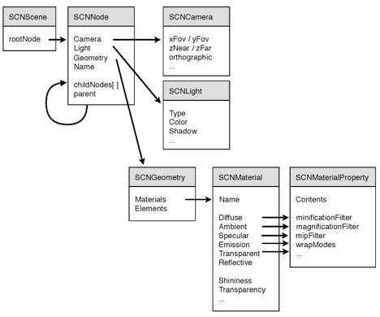

> 导航：[总目录](../../../README.md) · [documentation](../../../_indexes/documentation.md)


[Next](Document%20Revision%20History.md)

# Introduction to Scene Kit

Scene Kit is a 3D-rendering Objective-C framework that combines a high-performance rendering engine with a high-level, descriptive API. Scene Kit supports the import, manipulation, and rendering of 3D assets without requiring the exact steps to render a scene the way OpenGL does.

With Scene Kit you can:

- Import 3D objects and build scenes composed by cameras, lights, and meshes.
- Manipulate the bounding volumes, geometry, and materials used in a scene.
- Load 3D content using an interexchange format supported by all major content creations apps (using DAE (digital asset exchange) files.
- Add live interaction with loaded 3D content.
- Integrate your app with other OS X technologies such as Core Animation and GLKit to add overlays and textures for the 3D objects in your scenes.
- Use Xcode to preview, inspect, and adjust DAE files for Scene Kit to help integrate them into your app.

### Scene Kit is a Supporting Technology

Scene Kit sits below Cocoa and above OpenGL in the graphics architecture. It is a peer to technologies such as Quartz, Core Animation, and GL Kit and integrates with other graphics technologies, allowing you to use multiple technologies to achieve a wide range of results.

Because Scene Kit integrates with Image Kit and Core Animation, you do not need advanced 3D graphical programming skills. For example, you can embed a 3D scene into a layer and then use Core Animation compositing capabilities to add overlays and backgrounds. You can also use Core Animation layers as textures for your 3D objects in 3D scenes.

### Scene Kit Enables 3D Assets in Your App

Scene Kit enables 3D rendering within your app, allowing you to perform the following sorts of tasks.

#### Loading Assets

Most 3D models cannot be designed programmatically. They have to be modeled in 3D authoring tools (such as 3ds max, Maya, and SketchUp) and then imported in the application. Scene Kit enables you to load 3D content using DAE files. This interexchange format is supported by all the major content creation apps.

After a 3D file is loaded, you can use Scene Kit to access all the information for a scene, including geometry data (in a format suitable for OpenGL), objects transforms, animations, colors, and textures.

#### Manipulating and Rendering 3D Scenes

The Scene Kit framework offers a flexible, scene graph–based system to create and render virtual 3D scenes. With its node-based design, the Scene Kit scene graph lets you abstract most of the underlying internals of the used components from the user. Scene Kit does all the work underneath that is needed to render the scene efficiently using all the potential of the GPU.

Scene Kit provides three ways to render 3D scenes: a view (SCNView), a layer (SCNLayer) and a renderer (SCNRenderer).

- SCNView is directly accessible in interface builder. It simplifies the integration of your app in the Cocoa GUI.
- SCNLayer lets you integrate a 3D scene into a layer tree, taking advantage of Core Animation’s layout and compositing engine.
- SCNRenderer lets you render into an arbitrary low-level OpenGL context when you need to render offscreen.

#### Animating 3D Scenes

Scene Kit can animate 3D scenes with the same power and flexibility as Core Animation but without introducing a new set of concepts. Scene Kit uses the existing Core Animation APIs to support both implicit and explicit animations. Using Core Animation APIs, you can animate implicitly and create explicit animations or retrieve complex animations designed in a 3D authoring tool and then apply them when needed based on user events.

There are several ways to integrate Scene Kit in an application. You may decide to use Scene Kit to load geometry and scene information and then render it yourself with your own rendering engine. Or you may decide to use the built-in SCNView and SCNLayer classes to present 3D scenes to your users. Finally, you may decide to use the entire API to add live interaction with the 3D assets in the scene.

### Scene Graph Layout

A scene graph in Scene Kit has a tree structure, as shown here.



The base element for the tree structure of the scene graph is SCNNode. SCNNode encapsulates a transform that represents the position, rotation, and scale of a node. All subnode transforms are relative to their parent node transforms. Clients of the API use SCNNode objects to control the structure of their scene.

An SCNGeometry object represents a piece of geometry (a set of vertex and polygons) attachable to a node. A single pieces geometry can be attached to several nodes, allowing Scene Kit to share potentially large buffers between several nodes in the scene. An SCNGeometry object has an array of materials that describes the appearance of the surface via high level properties—diffuse, ambient, specular, and so forth. Scene Kit also provides a set of parametric geometries that developers can instantiate programmatically. Parametric geometries are a set of subclasses of SCNGeometry. Each subclass defines a specific shape that can be configured with a set of parameters.

An SCNCamera object represents a point of view. It can also be attached to any node.

An SCNLight object represents a light source. It is attachable to any node, and it lights up the entire scene from its attached node.

### Mixing Scene Kit and OpenGL

You don’t need to know OpenGL in order to use Scene Kit. If you are already familiar with OpenGL, you can still integrate Scene Kit into your app. As mentioned earlier, you can use Scene Kit to load a scene and then render it with your own renderer. But if you want to benefit from Scene Kit’s own rendering, there are three ways to mix your OpenGL code with the rendering in Scene Kit.

#### Setting a Renderer Delegate to a Node

Set a renderer delegate to a node like this:

```
node.rendererDelegate = aController;
```

When a delegate is set, it controls the rendering for the particular node. Scene Kit passes all the transformation information to the delegate for this node. The delegate then executes the custom OpenGL code in the Scene Kit OpenGL context.

For example, imagine you have a 3D scene of a ship flying. The designer can add an empty node on the reactor, and using OpenGL, you can set a renderer delegate to this node to render its own particle effect.

#### Setting Your Own Program on a Material

If you want to have a finer control on the rendering, set your own program on a material. A program is a GLSL shader, one that overrides the SCNMaterial properties. You can write your own vertex and fragment shaders that Scene Kit then uses to draw the geometry.

#### Using a Delegate to Render Your Own OpenGL Code

The SCNView, SCNLayer and SCNRenderer objects all accept a delegate to let you execute your own openGL code before and after rendering the scene. This delegate behavior can be useful if you want to use OpenGL to, for example, draw some custom background or overlays.

### Using Xcode to Simplify Your Work

Xcode integrates a tool to preview, inspect and adjust DAE files for Scene Kit.

The goal of this tool is to help you:

- Integrate DAE files into your app. The tool allows such things as inspecting the scene graph, seeing the names of the assets, and checking the size of the geometries and textures.
- Let designers preview their 3D scene just as they will render it on the targeted platform. Here, you can verify that the lighting behaves as expected, see how the materials render, play back the embedded animations, and test the performance for a given scene.

The tool is designed to look as much as possible like Interface Builder.

- The sidebar on the left shows the scene graph and the scene library (a list of assets sorted by kind, such as geometry, lights, and images).
- The sidebar on the right contains a list of inspectors:

  - The Node Atrributes inspector shows SCNNode properties such as its position, opacity, and visibility. The inspector also shows properties of node attributes such as light, camera, and geometry, when applicable (for example, when the node has such attributes attached).
  - The Material inspector shows the different colors and images for every material property.
- The main view gives a preview of the scene as it will render in the application.
- A timeline at the bottom allows playing of the animation that is included in the DAE file.

See Scene Kit Framework Reference for detailed information, including explanations of parameters and return values, examples, and notes.

[Next](Document%20Revision%20History.md)

