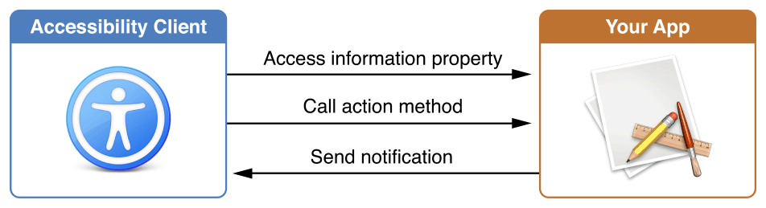
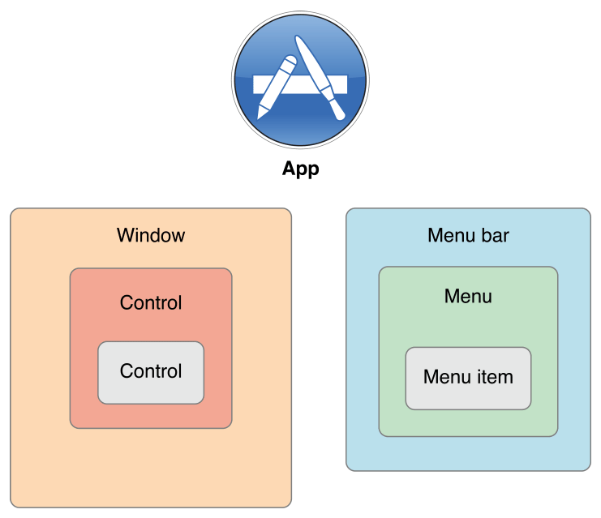
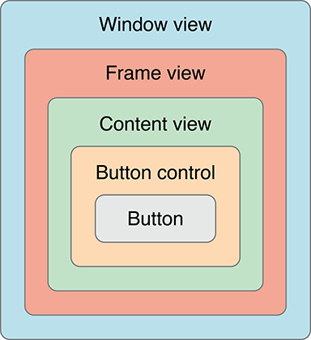
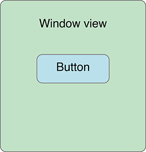

> 导航：[总目录](../../README.md) · [documentation](../../_indexes/documentation.md) · [Accessibility Programming Guide for OS X](index.md)

## The OS X Accessibility Model

The OS X accessibility model defines how accessibility clients interact with your app. There are two main components to this model. The first is the interface used to communicate with your app. The second is the hierarchy of accessible elements that your app presents.

### Communicating with an Accessibility Client

To be accessible, an app must provide information to the accessibility client about its user interface and capabilities. There are three different ways that apps and accessibility clients interact (see Figure 3-1).

- __Informational properties.__ The [NSAccessibility](https://developer.apple.com/documentation/appkit/nsaccessibility) protocol defines a number of properties that provide information about your view or control. If you are working with a subclass of a standard AppKit view or control, you can either set the desired property or override its getters and setters. By default, overriding only the getter tells the accessibility client that it has read-only access to the property. Overriding the setter tells the accessibility client that it also has write access to the property.
- __Action methods.__ The [NSAccessibility](https://developer.apple.com/documentation/appkit/nsaccessibility) protocol also defines a number of methods that simulate button presses, mouse clicks and selections in your view or control. By implementing these methods, you give accessibility clients the ability to drive your view or control.
- __Notifications.__ Your view or control may need to let the accessibility client know that changes have occurred. Constants in _[NSAccessibility Protocol Reference](https://developer.apple.com/documentation/appkit/nsaccessibility)_ define a number of notifications that you can send using the [NSAccessibilityPostNotification](https://developer.apple.com/documentation/appkit/1529733-nsaccessibilitypostnotification) method. These notifications are not included in the role-specific protocols; however, standard AppKit controls already send appropriate messages for their standard usage patterns. You typically need to send your own notifications only when you are creating a custom control or when you are using a standard control in a nonstandard way.

__Figure 3-1__Communication between your app and an accessibility client

Although access-enabling a view or control might sound to you like a lot of work, it is actually quite easy. If you are using standard AppKit controls, much of the work has been done for you. Typically, access-enabling these controls is a matter of fine-tuning the default values stored in the information properties. For more information on using standard AppKit controls, see [Enhancing the Accessibility of Standard AppKit Controls](EnhancingtheAccessibilityofStandardAppKitControls.md#apple-f4xwc4dqnrsv64tfmyxwi33df52wszbpkridimbqgaytanzyfvbuqmrvg4wvgvzr).

If you are using custom views or controls, you need to add the appropriate informational properties, action methods and notifications. Fortunately, the accessibility API includes a wide range of role-specific protocols that guide you through the steps necessary to access-enable your views and controls. For more information, see [Implementing Accessibility for Custom Controls](ImplementingAccessibilityforCustomControls.md#apple-f4xwc4dqnrsv64tfmyxwi33df52wszbpkridimbqgaytanzyfvbuqmrvgywvgvzr).

### The Accessibility Hierarchy

The OS X accessibility model represents an app’s user interface as a hierarchy of accessible elements. For the most part, the hierarchy is defined by parent-child relationships. For example, an app’s dialog window might contain several buttons. The accessible element representing the dialog contains a list of child accessible elements, each representing a button in the dialog. In turn, each button is aware that its parent is the accessible element representing the dialog.

Of course, the accessible elements representing the menu bar and windows in an app are children of the application-level accessible element. Even the application-level accessible element has a parent, which is the systemwide accessible element. An app never needs to worry about its systemwide parent because it is out of the app’s scope. However, an accessibility client might query the systemwide accessible element to find out which running app has keyboard focus.

Figure 3-2 shows the hierarchy of accessible elements in a simple app.

__Figure 3-2__The accessible element hierarchy

A strength of the accessible element hierarchy is that it can leave out implementation-specific details that are irrelevant to an accessibility client and, by extension, to the user. For example, in Cocoa, a button in a window is usually implemented as a button cell within a button control, which is in a content view within a window. A user has no interest in this detailed containment hierarchy; she only needs to know that there’s a button in a window. If the app’s accessibility hierarchy contains an accessible element for each of these intermediate objects, however, an accessibility client has no choice but to present them to the user. This results in a poor user experience because the user is forced to take several steps to get from the window to the button. Figure 3-3 shows how such an inheritance hierarchy might look.

__Figure 3-3__The complete inheritance hierarchy of a button in a window

To exclude this unnecessary information, the accessibility API lets you specify that an object should be ignored. When you set an accessible element’s [accessibilityElement](https://developer.apple.com/documentation/appkit/nsaccessibility/1535002-accessibilityelement) property to `NO``false`, the accessibility clients ignore it. [NSView](https://developer.apple.com/documentation/appkit/nsview) sets this property to `NO``false` by default, because users typically aren’t interested in the view, they only want to know about the view’s contents.

The ability to hide elements lets an app present only the significant parts of the user interface to an accessibility client. Figure 3-4 shows how the same hierarchy shown in [Figure 3-3](#apple-f4xwc4dqnrsv64tfmyxwi33df52wszbpkridimbqgaytanzyfvbuqmrqhawugsceineeersi) might be presented to an accessibility client.

__Figure 3-4__An appropriate accessibility hierarchy of a button in a window

An accessibility clients also helps a user perform tasks by telling the accessible elements to perform actions. For the most part, actions correspond to things a user can do with a single mouse click. Each accessible element implements action methods that correspond to the actions it supports, if any. For example, the accessible element representing a button supports the press action. When a user wants to press a button, he communicates this to the accessibility client. The client then determines whether the button’s accessible element implements the [accessibilityPerformPress](https://developer.apple.com/documentation/appkit/nsaccessibility/1526358-accessibilityperformpress) method. If it does, the accessibility client calls this method.

The NSAccessibility protocol defines only a handful of actions that accessible elements can support. At first, this definition might seem restrictive, because apps can perform huge numbers of tasks. It’s essential to remember, however, that an accessibility client helps a user drive their app’s user interface, it does not simulate the app’s functions. Therefore, an accessibility client has no interest in how your app responds to a button press, for example. Its job is to tell the user that the button exists and to tell the app when the user presses the button. It’s up to your app to respond appropriately to that button press, just as it would if a user clicked on the button with the mouse.

### An Example of Accessibility

This example describes how a fictitious screen reader with speech recognition and speech synthesis capability might communicate with your app:

1. The user says, “Open Preferences window.”
2. The screen reader sends a message to the app’s accessible element, asking for a reference to the menu bar accessible element. It then queries the menu bar for a list of its children and queries each child for its title. As soon as it finds the one whose title matches app’s name (that is, the application menu). A second iteration lets it find the Preferences menu item within the application menu. Finally, the screen reader tells the Preferences menu item to perform the press action.
3. The app opens the Preferences window, and the window sends a notification broadcasting that a new window is now visible and active.
4. The screen reader queries the window for its list of children.
5. For each child, the screen reader queries the child’s label, role, role description and children.
6. Among the responses, the screen reader learns that the pane contains several children (for example, three buttons).
7. The screen reader queries each button, asking for the following:

   - A label (defaults to the button’s title)
   - A role (`button` in this case)
   - A role description (“button”)
   - A value (none in this case)
   - Children (none in this case)
8. After the screen reader has determined which objects are available, it reports this information to the user using speech synthesis.
9. The user might then ask for more information about one of the buttons.
10. The screen reader queries the specified button for its help text. It reports this string to the user using speech synthesis.
11. The user then tells the screen reader to activate the button.
12. The screen reader sends a press message to the button.
13. The app broadcasts any notifications triggered due to the changes made by the button press.

[Designing an Accessible OS X App](OSXAXDeveloping.md#apple-f4xwc4dqnrsv64tfmyxwi33df52wszbpkridimbqgaytanzyfvbuqmrqg4wueqkci5fegr2h)

[Enhancing the Accessibility of Standard AppKit Controls](EnhancingtheAccessibilityofStandardAppKitControls.md#apple-f4xwc4dqnrsv64tfmyxwi33df52wszbpkridimbqgaytanzyfvbuqmrvg4wvgvzr)
