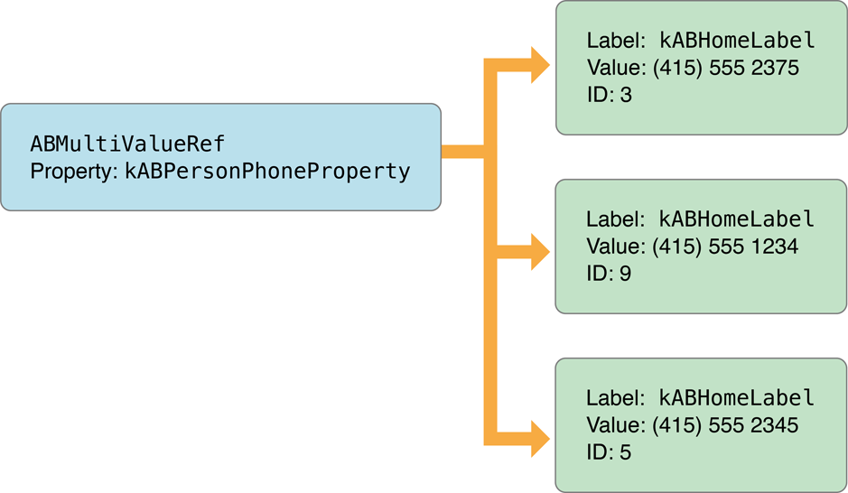

> 导航：[总目录](../../README.md) · [documentation](../../_indexes/documentation.md) · [Address Book Programming Guide for iOS](Introduction.md)


[Next](User%20Interaction-%20Prompting%20for%20and%20Displaying%20Data.md)[Previous](Quick%20Start%20Tutorial.md)

# Building Blocks: Working with Records and Properties

There are four basic kinds of objects that you need to understand in order to interact fully with the Address Book database: address books, records, single-value properties, and multivalue properties. This chapter discusses how data is stored in these objects and describes the functions used to interact with them.

For information on how to interact directly with the Address Book database (for example to add or remove person records), see [Direct Interaction: Programmatically Accessing the Database](Direct%20Interaction-%20Programmatically%20Accessing%20the%20Database.md#apple-f4xwc4dqnrsv64tfmyxwi33df52wszbpkridimbqga3tonbufvbuqnrnknltc).

Address books objects let you interact with the Address Book database. To use an address book, declare an instance of [ABAddressBookRef](https://developer.apple.com/documentation/addressbook/abaddressbook-kkq) and set it to the value returned from the function [ABAddressBookCreate](https://developer.apple.com/documentation/addressbook/1621998-abaddressbookcreate). You can create multiple address book objects, but they are all backed by the same shared database.

After you have created an address book reference, your application can read data from it and save changes to it. To save the changes, use the function [ABAddressBookSave](https://developer.apple.com/documentation/addressbook/1621996-abaddressbooksave); to abandon them, use the function [ABAddressBookRevert](https://developer.apple.com/documentation/addressbook/1621997-abaddressbookrevert). To check whether there are unsaved changes, use the function [ABAddressBookHasUnsavedChanges](https://developer.apple.com/documentation/addressbook/1621990-abaddressbookhasunsavedchanges).

The following code listing illustrates a common coding pattern for making and saving changes to the address book database:

```
ABAddressBookRef addressBook;
bool wantToSaveChanges = YES;
bool didSave;
CFErrorRef error = NULL;

addressBook = ABAddressBookCreate();

/* ... Work with the address book. ... */

if (ABAddressBookHasUnsavedChanges(addressBook)) {
    if (wantToSaveChanges) {
        didSave = ABAddressBookSave(addressBook, &error);
        if (!didSave) {/* Handle error here. */}
    } else {
        ABAddressBookRevert(addressBook);
    }
}

CFRelease(addressBook);
```

Your application can request to receive a notification when another application (or another thread in the same application) makes changes to the Address Book database. In general, you should register for a notification if you are displaying existing contacts and you want to update the UI to reflect changes to the contacts that may happen while your application is running.

Use the function [ABAddressBookRegisterExternalChangeCallback](https://developer.apple.com/documentation/addressbook/1621989-abaddressbookregisterexternalcha) to register a function of the prototype [ABExternalChangeCallback](https://developer.apple.com/documentation/addressbook/abexternalchangecallback). You may register multiple change callbacks by calling `ABAddressBookRegisterExternalChangeCallback` multiple times with different callbacks or contexts. You can also unregister the function using [ABAddressBookUnregisterExternalChangeCallback](https://developer.apple.com/documentation/addressbook/1622004-abaddressbookunregisterexternalc).

When you receive a change callback, there are two things you can do: If you have no unsaved changes, your code should simply revert your address book to get the most up-to-date data. If you have unsaved changes, you may not want to revert and lose those changes. If this is the case you should save, and the Address Book database will do its best to merge your changes with the external changes. However, you should be prepared to take other appropriate action if the changes cannot be merged and the save fails.

In the Address Book database, information is stored in records, represented by [ABRecordRef](https://developer.apple.com/documentation/addressbook/abrecordref) objects. Each record represents a person or group. The function [ABRecordGetRecordType](https://developer.apple.com/documentation/addressbook/1614736-abrecordgetrecordtype) returns [kABPersonType](https://developer.apple.com/documentation/addressbook/kabpersontype) if the record is a person, and [kABGroupType](https://developer.apple.com/documentation/addressbook/1614747-record_types/kabgrouptype) if it is a group. Developers familiar with the Address Book technology on Mac OS should note that there are not separate classes for different types of records; both person objects and group objects are instances of the same class.

Even though records are usually part of the Address Book database, they can also exist outside of it. This makes them a useful way to store contact information your application is working with.

Within a record, the data is stored as a collection of properties. The properties available for group and person objects are different, but the functions used to access them are the same. The functions [ABRecordCopyValue](https://developer.apple.com/documentation/addressbook/1430135-abrecordcopyvalue) and [ABRecordSetValue](https://developer.apple.com/documentation/addressbook/1430168-abrecordsetvalue) get and set properties, respectively. Properties can also be removed completely, using the function [ABRecordRemoveValue](https://developer.apple.com/documentation/addressbook/1430090-abrecordremovevalue).

Person records are made up of both single-value and multivalue properties. Properties that a person can have only one of, such as first name and last name, are stored as single-value properties. Other properties that a person can have more that one of, such as street address and phone number, are multivalue properties. The properties for person records are listed in several sections in Constants.

For more information about functions related to directly editing the contents of person records, see [Working with Person Records](Direct%20Interaction-%20Programmatically%20Accessing%20the%20Database.md#apple-f4xwc4dqnrsv64tfmyxwi33df52wszbpkridimbqga3tonbufvbuqnrnknltg).

Users may organize their contacts into groups for a variety of reasons. For example, a user may create a group containing coworkers involved in a project, or members of a sports team they play on. Your application can use groups to allow the user to perform an action for several contacts in their address book at the same time.

Group records have only one property, [kABGroupNameProperty](https://developer.apple.com/documentation/addressbook/kabgroupnameproperty), which is the name of the group. To get all the people in a group, use the function [ABGroupCopyArrayOfAllMembers](https://developer.apple.com/documentation/addressbook/1430149-abgroupcopyarrayofallmembers) or [ABGroupCopyArrayOfAllMembersWithSortOrdering](https://developer.apple.com/documentation/addressbook/1616126-abgroupcopyarrayofallmemberswith), which return a `CFArrayRef` of [ABRecordRef](https://developer.apple.com/documentation/addressbook/abrecordref) objects.

For more information about functions related to directly editing the contents of group records, see [Working with Group Records](Direct%20Interaction-%20Programmatically%20Accessing%20the%20Database.md#apple-f4xwc4dqnrsv64tfmyxwi33df52wszbpkridimbqga3tonbufvbuqnrnknlti).

There are two basic types of properties, single-value and multivalue. Single-value properties contain data that can only have a single value, such as a person’s name. Multivalue properties contain data that can have multiple values, such as a person’s phone number. Multivalue properties can be either mutable or immutable.

For a list of the properties for person records, see many of the sections within Constants. For properties of group records, see Group Properties.

The following code listing illustrates getting and setting the value of a single-value property:

```
ABRecordRef aRecord = ABPersonCreate();
CFErrorRef anError = NULL;
bool didSet;

didSet = ABRecordSetValue(aRecord, kABPersonFirstNameProperty, CFSTR("Katie"), &anError);
if (!didSet) {/* Handle error here. */}

didSet = ABRecordSetValue(aRecord, kABPersonLastNameProperty, CFSTR("Bell"), &anError);
if (!didSet) {/* Handle error here. */}

CFStringRef firstName, lastName;
firstName = ABRecordCopyValue(aRecord, kABPersonFirstNameProperty);
lastName  = ABRecordCopyValue(aRecord, kABPersonLastNameProperty);

/* ... Do something with firstName and lastName. ... */

CFRelease(aRecord);
CFRelease(firstName);
CFRelease(lastName);
```


Multivalue properties consist of a list of values. Each value has a text label and an identifier associated with it. There can be more than one value with the same label, but the identifier is always unique. There are constants defined for some commonly used text labels—see Generic Property Labels.

For example, Figure 2-1 shows a phone number property. Here, a person has multiple phone numbers, each of which has a text label, such as home or work, and an identifier. Note that there are two home phone numbers in this example; they have the same label but different identifiers.

__Figure 2-1__  Multivalue properties



The individual values of a multivalue property are referred to by identifier or by index, depending on the context. Use the functions [ABMultiValueGetIndexForIdentifier](https://developer.apple.com/documentation/addressbook/1624566-abmultivaluegetindexforidentifie) and [ABMultiValueGetIdentifierAtIndex](https://developer.apple.com/documentation/addressbook/1624563-abmultivaluegetidentifieratindex) to convert between indices and multivalue identifiers.

To keep a reference to a particular value in the multivalue property, store its identifier. The index will change if values are added or removed. The identifier is guaranteed not to change except across devices.

The following functions let you read the contents of an individual value, which you specify by its index:

- [ABMultiValueCopyLabelAtIndex](https://developer.apple.com/documentation/addressbook/1430131-abmultivaluecopylabelatindex) and [ABMultiValueCopyValueAtIndex](https://developer.apple.com/documentation/addressbook/1430101-abmultivaluecopyvalueatindex) copy individual values.
- [ABMultiValueCopyArrayOfAllValues](https://developer.apple.com/documentation/addressbook/1624554-abmultivaluecopyarrayofallvalues) copies all of the values into an array.

Multivalue objects are immutable; to change one you need to make a mutable copy using the function [ABMultiValueCreateMutableCopy](https://developer.apple.com/documentation/addressbook/1430159-abmultivaluecreatemutablecopy). You can also create a new mutable multivalue object using the function [ABMultiValueCreateMutable](https://developer.apple.com/documentation/addressbook/1430166-abmultivaluecreatemutable).

The following functions let you modify mutable multivalue properties:

- [ABMultiValueAddValueAndLabel](https://developer.apple.com/documentation/addressbook/1624556-abmultivalueaddvalueandlabel) and [ABMultiValueInsertValueAndLabelAtIndex](https://developer.apple.com/documentation/addressbook/1624555-abmultivalueinsertvalueandlabela) add values.
- [ABMultiValueReplaceValueAtIndex](https://developer.apple.com/documentation/addressbook/1624562-abmultivaluereplacevalueatindex) and [ABMultiValueReplaceLabelAtIndex](https://developer.apple.com/documentation/addressbook/1624564-abmultivaluereplacelabelatindex) change values.
- [ABMultiValueRemoveValueAndLabelAtIndex](https://developer.apple.com/documentation/addressbook/1624561-abmultivalueremovevalueandlabela) removes values.

The following code listing illustrates getting and setting a multivalue property:

```
ABMutableMultiValueRef multi =
        ABMultiValueCreateMutable(kABMultiStringPropertyType);
CFErrorRef anError = NULL;
ABMultiValueIdentifier multivalueIdentifier;
bool didAdd, didSet;

// Here, multivalueIdentifier is just for illustration purposes; it isn't
// used later in the listing.  Real-world code can use this identifier to
// reference the newly-added value.
didAdd = ABMultiValueAddValueAndLabel(multi, @"(555) 555-1234",
                      kABPersonPhoneMobileLabel, &multivalueIdentifier);
if (!didAdd) {/* Handle error here. */}

didAdd = ABMultiValueAddValueAndLabel(multi, @"(555) 555-2345",
                      kABPersonPhoneMainLabel, &multivalueIdentifier);
if (!didAdd) {/* Handle error here. */}

ABRecordRef aRecord = ABPersonCreate();
didSet = ABRecordSetValue(aRecord, kABPersonPhoneProperty, multi, &anError);
if (!didSet) {/* Handle error here. */}
CFRelease(multi);

/* ... */

CFStringRef phoneNumber, phoneNumberLabel;
multi = ABRecordCopyValue(aRecord, kABPersonPhoneProperty);

for (CFIndex i = 0; i < ABMultiValueGetCount(multi); i++) {
    phoneNumberLabel = ABMultiValueCopyLabelAtIndex(multi, i);
    phoneNumber      = ABMultiValueCopyValueAtIndex(multi, i);

    /* ... Do something with phoneNumberLabel and phoneNumber. ... */

    CFRelease(phoneNumberLabel);
    CFRelease(phoneNumber);
}

CFRelease(aRecord);
CFRelease(multi);
```


Street addresses are represented as a multivalue of dictionaries. All of the above discussion of multivalues still applies to street addresses. Each of the values has a label, such as home or work (see Generic Property Labels), and each value in the multivalue is a street address stored as a dictionary. Within the value, the dictionary contains keys for the different parts of a street address, which are listed in Address Property.

The following code listing shows how to set and display a street address:

```
ABMutableMultiValueRef address =
        ABMultiValueCreateMutable(kABDictionaryPropertyType);

// Set up keys and values for the dictionary.
CFStringRef keys[5];
CFStringRef values[5];
keys[0] = kABPersonAddressStreetKey;
keys[1] = kABPersonAddressCityKey;
keys[2] = kABPersonAddressStateKey;
keys[3] = kABPersonAddressZIPKey;
keys[4] = kABPersonAddressCountryKey;
values[0] = CFSTR("1234 Laurel Street");
values[1] = CFSTR("Atlanta");
values[2] = CFSTR("GA");
values[3] = CFSTR("30303");
values[4] = CFSTR("USA");

CFDictionaryRef aDict = CFDictionaryCreate(
        kCFAllocatorDefault,
        (void *)keys,
        (void *)values,
        5,
        &kCFCopyStringDictionaryKeyCallBacks,
        &kCFTypeDictionaryValueCallBacks
);

// Add the street address to the multivalue.
ABMultiValueIdentifier identifier;
bool didAdd;
didAdd = ABMultiValueAddValueAndLabel(address, aDict, kABHomeLabel, &identifier);
if (!didAdd) {/* Handle error here. */}
CFRelease(aDict);

/* ... Do something with the multivalue, such as adding it to a person record. ...*/

CFRelease(address);
```

[Next](User%20Interaction-%20Prompting%20for%20and%20Displaying%20Data.md)[Previous](Quick%20Start%20Tutorial.md)

