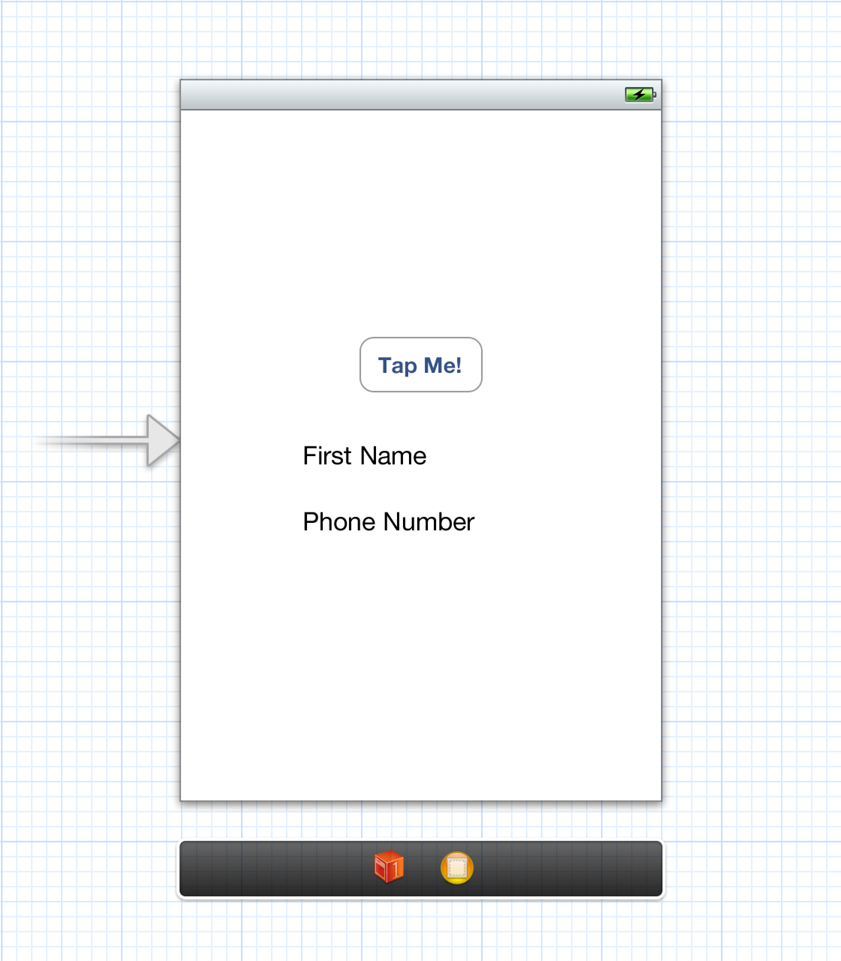

> 导航：[总目录](../../README.md) · [documentation](../../_indexes/documentation.md) · [Address Book Programming Guide for iOS](Introduction.md)


[Next](Building%20Blocks-%20Working%20with%20Records%20and%20Properties.md)[Previous](Introduction.md)

# Quick Start Tutorial

In this tutorial, you will build a simple application that prompts the user to choose a person from his or her contacts list and then shows the chosen person’s first name and phone number.

1. In Xcode, create a new project from the Single View Application template.
2. Link the Address Book UI and Address Book frameworks to your project.

While you are creating the user interface, you will take advantage of Xcode’s ability to declare the necessary actions and properties, creating the majority of the header file for you.

1. Open the main storyboard file (`MainStoryboard.storyboard`).
2. Add a button and two labels to the view by dragging them in from the library panel. Arrange them as shown in Figure 1-1.
3. Open the assistant editor.
4. Connect the button to a new action method called `showPicker:` on the view controller.

   This sets the target and action of the button in the storyboard, adds a declaration of the method to the header file, and adds a stub implementation of the method to the implementation file. You will fill in the stub implementation later.
5. Connect the two labels to two new properties called `firstName` and `phoneNumber` of the view controller.

   This creates a connection in the storyboard and adds a declaration of the properties to the header file.`@synthesize` line for the properties in the implementation file.

__Figure 1-1__  Laying out the interface



At this point `ViewController.h`, the header file for the view controller, is almost finished. At the end of the `@interface` line, declare that the view controller class adopts the `ABPeoplePickerNavigationControllerDelegate` protocol by adding the following:

`<ABPeoplePickerNavigationControllerDelegate>`

Listing 1-1 shows the finished header file.

__Listing 1-1__  The finished header file

```objc
#import <UIKit/UIKit.h>
#import <AddressBookUI/AddressBookUI.h>

@interface ViewController : UIViewController <ABPeoplePickerNavigationControllerDelegate>

@property (weak, nonatomic) IBOutlet UILabel *firstName;
@property (weak, nonatomic) IBOutlet UILabel *phoneNumber;

- (IBAction)showPicker:(id)sender;

@end
```


In `ViewController.m`, the implementation file for the view controller, Xcode has already created a stub implementation of the `showPicker:` method. Listing 1-2 shows the full implementation which creates a new people picker, sets the view controller as its delegate, and presents the picker as a modal view controller.

__Listing 1-2__  Presenting the people picker

```objc
- (IBAction)showPicker:(id)sender
{
    ABPeoplePickerNavigationController *picker =
            [[ABPeoplePickerNavigationController alloc] init];
    picker.peoplePickerDelegate = self;

    [self presentModalViewController:picker animated:YES];
}
```

The people picker calls methods on its delegate in response to the user’s actions.Listing 1-3 shows the implementation of these methods. If the user cancels, the first method is called to dismiss the people picker. If the user selects a person, the second method is called to copy the first name and phone number of the person into the labels and dismiss the people picker.

The people picker calls the third method when the user taps on a property of the selected person in the picker. In this app, the people picker is always dismissed when the user selects a person, so there is no way for the user to select a property of that person. This means that the method will never be called. However if it were left out, the implementation of the protocol would be incomplete.

__Listing 1-3__  Responding to user actions in the people picker

```objc
- (void)peoplePickerNavigationControllerDidCancel:
            (ABPeoplePickerNavigationController *)peoplePicker
{
    [self dismissModalViewControllerAnimated:YES];
}


- (BOOL)peoplePickerNavigationController:
            (ABPeoplePickerNavigationController *)peoplePicker
      shouldContinueAfterSelectingPerson:(ABRecordRef)person {

    [self displayPerson:person];
    [self dismissModalViewControllerAnimated:YES];

    return NO;
}

- (BOOL)peoplePickerNavigationController:
            (ABPeoplePickerNavigationController *)peoplePicker
      shouldContinueAfterSelectingPerson:(ABRecordRef)person
                                property:(ABPropertyID)property
                              identifier:(ABMultiValueIdentifier)identifier
{
    return NO;
}
```

The last method to implement is shown in Listing 1-4, which displays the name and phone number. Note that the code for the first name and the phone number is different. The first name is a string property—person records have exactly one first name, which may be `NULL`. The phone number is a multivalue property—person records have zero, one, or multiple phone numbers. In this example, the first phone number in the list is used.

__Listing 1-4__  Displaying a person’s information

```objc
- (void)displayPerson:(ABRecordRef)person
{
    NSString* name = (__bridge_transfer NSString*)ABRecordCopyValue(person,
                                               kABPersonFirstNameProperty);
    self.firstName.text = name;

    NSString* phone = nil;
    ABMultiValueRef phoneNumbers = ABRecordCopyValue(person,
                                    kABPersonPhoneProperty);
    if (ABMultiValueGetCount(phoneNumbers) > 0) {
       phone = (__bridge_transfer NSString*)
               ABMultiValueCopyValueAtIndex(phoneNumbers, 0);
    } else {
        phone = @"[None]";
    }
    self.phoneNumber.text = phone;
    CFRelease(phoneNumbers);
}
```


When you run the application, the first thing you see is a button and two empty text labels. Tapping the button brings up the people picker. When you select a person, the people picker goes away and the first name and phone number of the person you selected are displayed in the labels.

[Next](Building%20Blocks-%20Working%20with%20Records%20and%20Properties.md)[Previous](Introduction.md)

