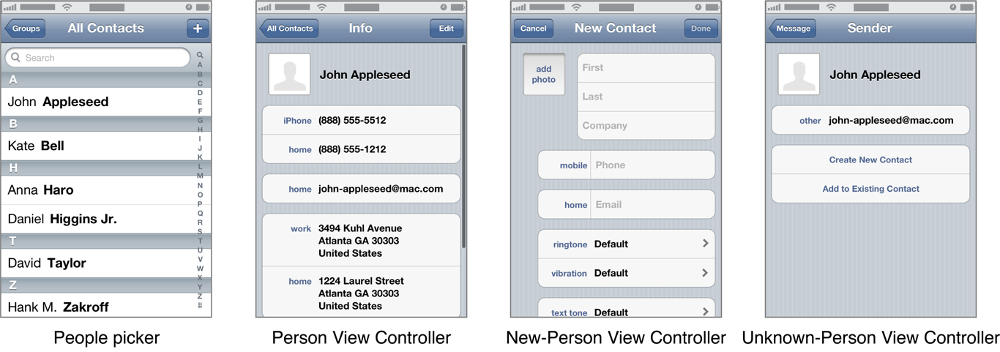

> 导航：[总目录](../../README.md) · [documentation](../../_indexes/documentation.md) · [Address Book Programming Guide for iOS](Introduction.md)


[Next](Direct%20Interaction-%20Programmatically%20Accessing%20the%20Database.md)[Previous](Building%20Blocks-%20Working%20with%20Records%20and%20Properties.md)

# User Interaction: Prompting for and Displaying Data

The Address Book UI framework provides three view controllers and one navigation controller for common tasks related to working with the Address Book database and contact information. By using these controllers rather than creating your own, you reduce the amount of work you have to do and provide your users with a more consistent experience.

This chapter includes some short code listings you can use as a starting point. For a fully worked example, see _[QuickContacts](../../samplecode/QuickContacts/QuickContacts.md#apple-f4xwc4dqnrsv64tfmyxwi33df52wszbpirkfgnbqgaydsnbxgu)_.

The Address Book UI framework provides four controllers:

- `ABPeoplePickerNavigationController` prompts the user to select a person record from their address book.
- `ABPersonViewController` displays a person record to the user and optionally allows editing.
- `ABNewPersonViewController` prompts the user create a new person record.
- `ABUnknownPersonViewController` prompts the user to complete a partial person record, optionally allows them to add it to the address book.



To use these controllers, you must set a [delegate](https://developer.apple.com/library/archive/documentation/General/Conceptual/DevPedia-CocoaCore/Delegation.html#//apple_ref/doc/uid/TP40008195-CH14) for them which implements the appropriate delegate [protocol](https://developer.apple.com/library/archive/documentation/General/Conceptual/DevPedia-CocoaCore/Protocol.html#//apple_ref/doc/uid/TP40008195-CH45). You should not need to subclass these controllers; the expected way to modify their behavior is by your implementation of their delegate. In this chapter, you will learn more about these controllers and how to use them.

The [ABPeoplePickerNavigationController](https://developer.apple.com/documentation/addressbookui/abpeoplepickernavigationcontroller) class allows users to browse their list of contacts and select a person and, at your option, one of that person’s properties. To use a people picker, do the following:

1. Create and initialize an instance of the class.
2. Set the delegate, which must adopt the [ABPeoplePickerNavigationControllerDelegate](https://developer.apple.com/documentation/addressbookui/abpeoplepickernavigationcontrollerdelegate) protocol.
3. Optionally, set `displayedProperties` to the array of properties you want displayed. The relevant constants are defined as integers; wrap them in an [NSNumber](https://developer.apple.com/library/archive/documentation/LegacyTechnologies/WebObjects/WebObjects_3.5/Reference/Frameworks/ObjC/Foundation/Classes/NSNumber/Description.html#//apple_ref/occ/cl/NSNumber) object using the [numberWithInt:](https://developer.apple.com/library/archive/documentation/LegacyTechnologies/WebObjects/WebObjects_3.5/Reference/Frameworks/ObjC/Foundation/Classes/NSNumber/Description.html#//apple_ref/occ/clm/NSNumber/numberWithInt:) method to get an object that can be put in an array.
4. Present the people picker as a modal view controller using the [presentModalViewController:animated:](https://developer.apple.com/documentation/uikit/uiviewcontroller/1621465-presentmodalviewcontroller) method. It is recommended that you present it using animation.

The following code listing shows how a view controller which implements the `ABPeoplePickerNavigationControllerDelegate` protocol can present a people picker:

```
ABPeoplePickerNavigationController *picker =
        [[ABPeoplePickerNavigationController alloc] init];
picker.peoplePickerDelegate = self;
[self presentModalViewController:picker animated:YES];
```

The people picker calls one of its delegate’s methods depending on the user’s action:

- If the user cancels, the people picker calls the method [peoplePickerNavigationControllerDidCancel:](https://developer.apple.com/documentation/addressbookui/abpeoplepickernavigationcontrollerdelegate/1614415-peoplepickernavigationcontroller) of the delegate, which should dismiss the people picker.
- If the user selects a person, the people picker calls the method [peoplePickerNavigationController:shouldContinueAfterSelectingPerson:](https://developer.apple.com/documentation/addressbookui/abpeoplepickernavigationcontrollerdelegate/1614405-peoplepickernavigationcontroller) of the delegate to determine if the people picker should continue. To prompt the user to choose a specific property of the selected person, return `YES`. Otherwise return `NO` and dismiss the picker.
- If the user selects a property, the people picker calls the method [peoplePickerNavigationController:shouldContinueAfterSelectingPerson:property:identifier:](https://developer.apple.com/documentation/addressbookui/abpeoplepickernavigationcontrollerdelegate/1614408-peoplepickernavigationcontroller) of the delegate to determine if it should continue. To perform the default action (dialing a phone number, starting a new email, etc.) for the selected property, return `YES`. Otherwise return `NO` and dismiss the picker using the [dismissModalViewControllerAnimated:](https://developer.apple.com/documentation/uikit/uiviewcontroller/1621369-dismissmodalviewcontrolleranimat) method. It is recommended that you dismiss it using animation..

The [ABPersonViewController](https://developer.apple.com/documentation/addressbookui/abpersonviewcontroller) class displays a record to the user. To use this controller, do the following:

1. Create and initialize an instance of the class.
2. Set the delegate, which must adopt the [ABPersonViewControllerDelegate](https://developer.apple.com/documentation/addressbookui/abpersonviewcontrollerdelegate) protocol. To allow the user to edit the record, set `allowsEditing` to `YES`.
3. Set the `displayedPerson` property to the person record you want to display.
4. Optionally, set `displayedProperties` to the array of properties you want displayed. The relevant constants are defined as integers; wrap them in an [NSNumber](https://developer.apple.com/library/archive/documentation/LegacyTechnologies/WebObjects/WebObjects_3.5/Reference/Frameworks/ObjC/Foundation/Classes/NSNumber/Description.html#//apple_ref/occ/cl/NSNumber) object using the [numberWithInt:](https://developer.apple.com/library/archive/documentation/LegacyTechnologies/WebObjects/WebObjects_3.5/Reference/Frameworks/ObjC/Foundation/Classes/NSNumber/Description.html#//apple_ref/occ/clm/NSNumber/numberWithInt:) method to get an object that can be put in an array.
5. Display the person view controller using the [pushViewController:animated:](https://developer.apple.com/documentation/uikit/uinavigationcontroller/1621887-pushviewcontroller) method of the current navigation controller. It is recommended that you present it using animation.

The following code listing shows how a navigation controller can present a person view controller:

```
ABPersonViewController *view = [[ABPersonViewController alloc] init];

view.personViewDelegate = self;
view.displayedPerson = person; // Assume person is already defined.

[self.navigationController pushViewController:view animated:YES];
```

If the user taps on a property in the view, the person view controller calls the [personViewController:shouldPerformDefaultActionForPerson:property:identifier:](https://developer.apple.com/documentation/addressbookui/abpersonviewcontrollerdelegate/1622200-personviewcontroller) method of the delegate to determine if the default action for that property should be taken. To perform the default action for the selected property, such as dialing a phone number or composing a new email, return `YES`; otherwise return `NO`.

The [ABNewPersonViewController](https://developer.apple.com/documentation/addressbookui/abnewpersonviewcontroller) class allows users to create a new person. To use it, do the following:

1. Create and initialize an instance of the class.
2. Set the delegate, which must adopt the [ABNewPersonViewControllerDelegate](https://developer.apple.com/documentation/addressbookui/abnewpersonviewcontrollerdelegate) protocol. To populate fields, set the value of `displayedPerson`. To put the new person in a particular group, set `parentGroup`.
3. Create and initialize a new navigation controller, and set its root view controller to the new-person view controller
4. Present the navigation controller as a modal view controller using the [presentModalViewController:animated:](https://developer.apple.com/documentation/uikit/uiviewcontroller/1621465-presentmodalviewcontroller) method. It is recommended that you present it using animation.

The following code listing shows how a navigation controller can present a new person view controller:

```
ABNewPersonViewController *view = [[ABNewPersonViewController alloc] init];
view.newPersonViewDelegate = self;

UINavigationController *newNavigationController = [[UINavigationController alloc]
                                                  initWithRootViewController:view];
[self presentModalViewController:newNavigationController
                        animated:YES];
```

When the user taps the Save or Cancel button, the new-person view controller calls the method [newPersonViewController:didCompleteWithNewPerson:](https://developer.apple.com/documentation/addressbookui/abnewpersonviewcontrollerdelegate/1624261-newpersonviewcontroller) of the delegate, with the resulting person record. If the user saved, the new record is first added to the address book. If the user cancelled, the value of `person` is `NULL`. The delegate must dismiss the new-person view controller using the navigation controller’s [dismissModalViewControllerAnimated:](https://developer.apple.com/documentation/uikit/uiviewcontroller/1621369-dismissmodalviewcontrolleranimat) method. It is recommended that you dismiss it using animation.

The [ABUnknownPersonViewController](https://developer.apple.com/documentation/addressbookui/abunknownpersonviewcontroller) class allows the user to add data to an existing person record or to create a new person record for the data. To use it, do the following:

1. Create and initialize an instance of the class.
2. Create a new person record and populate the properties to be displayed.
3. Set `displayedPerson` to the new person record you created in the previous step.
4. Set the delegate, which must adopt the [ABUnknownPersonViewControllerDelegate](https://developer.apple.com/documentation/addressbookui/abunknownpersonviewcontrollerdelegate) protocol.
5. To allow the user to add the information displayed by the unknown-person view controller to an existing contact or to create a new contact with them, set `allowsAddingToAddressBook` to `YES`.
6. Display the unknown-person view controller using the [pushViewController:animated:](https://developer.apple.com/documentation/uikit/uinavigationcontroller/1621887-pushviewcontroller) method of the navigation controller. It is recommended that you present it using animation.

The following code listing shows how you can present an unknown-person view controller:

```
ABUnknownPersonViewController *view = [[ABUnknownPersonViewController alloc] init];

view.unknownPersonViewDelegate = self;
view.displayedPerson = person; // Assume person is already defined.
view.allowsAddingToAddressBook = YES;

[self.navigationController pushViewController:view animated:YES];
```

When the user finishes creating a new contact or adding the properties to an existing contact, the unknown-person view controller calls the method [unknownPersonViewController:didResolveToPerson:](https://developer.apple.com/documentation/addressbookui/abunknownpersonviewcontrollerdelegate/1621814-unknownpersonviewcontroller) of the delegate with the resulting person record. If the user canceled, the value of `person` is `NULL`.

[Next](Direct%20Interaction-%20Programmatically%20Accessing%20the%20Database.md)[Previous](Building%20Blocks-%20Working%20with%20Records%20and%20Properties.md)

