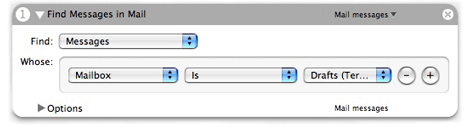
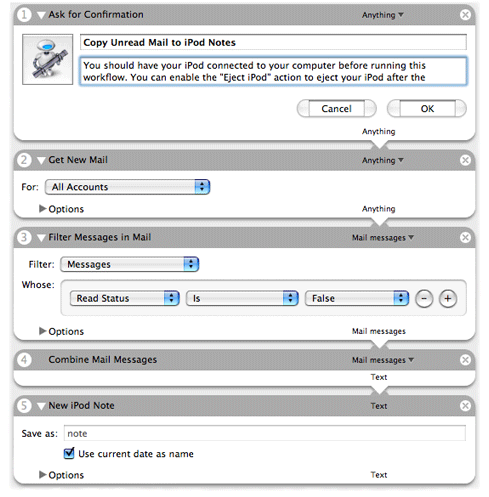
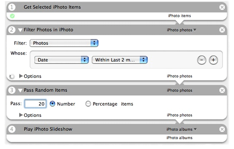

> 导航：[总目录](../../../README.md) · [documentation](../../../_indexes/documentation.md) · [Automator AppleScript Actions Tutorial](Introduction%20to%20Automator%20AppleScript%20Actions%20Tutorial.md)

[Next](Creating%20the%20Project.md)[Previous](Introduction%20to%20Automator%20AppleScript%20Actions%20Tutorial.md)

# Before You Start

In this tutorial you are going to learn the basic steps for constructing an Automator action using AppleScript as the development language. In the process of learning, you will create a action that you can productively use in workflows. But before you begin, let’s take a moment to review what an action is and to look at the action you will create.

Most people are familiar with the notion of building blocks. By placing small but well-defined units in certain relationships with each other, one can compose complex and even elegant structures. An Automator action is such a building block. An action is a small, discrete functional unit; it performs a well-defined operation usually on data of a specific type, such as copying a file or adding photos to an iPhoto album. It often offers the user a simple user interface for setting certain parameters of the operation. For example, the action in Figure 1-1 selects certain Mail messages based on specified criteria.

__Figure 1-1__  The Find Messages in Mail action

By itself, an action cannot do much. For one thing, it requires the Automator application to provide the context for its execution. But, more importantly, an action’s very discreteness limits its usefulness; an action is designed to complete a small, well-defined task, and nothing more. To be effective, an action must be placed in a meaningful sequence of other actions. This sequence of actions is called a workflow. In a workflow the output of one action is usually (but not always) passed to the next action in the workflow as input. Automator orchestrates this process by starting each action in turn and passing it the output of the previous action. A workflow expresses a operation that can be arbitrarily complex, and the final product of that operation is usually the output of the last action. For example, the workflow in Figure 1-2 gets a user’s unread mail and downloads the messages to the Notes section of a connected iPod.

__Figure 1-2__  The Copy Unread Mail to iPod Notes workflow

As an Automator workflow (such as the one above) illustrates, an action is usually designed to accept input and produce output of specific data types (although some actions will take and provide any type of data). Thus some actions may be incompatible with other actions; the Combine Mail Messages action, for instance, could not accept Address Book data. But there can be what are called conversion actions to bridge between actions with incompatible types of data.

From a development perspective, an action is a loadable bundle installed in one of four locations:

- `/System/Library/Automator` (Apple-provided actions)
- `/Library/Automator` (third-party actions, general access)
- `~/Library/Automator` (per-user access)
- Inside an application bundle (access determined by access to application)

The action bundle can contain executable code, AppleScript scripts, shell scripts, and localized strings, nib files, and other resources. When Automator is launched, the application extracts configuration information from the action bundles and displays some of this information in its user interface. It also loads the bundles of the actions placed in a workflow at some point before the execution of the workflow (the exact moment differs for actions based on Objective-C and actions based on AppleScript). For a complete description of the architecture of Automator actions and workflows, see “[How Automator Works](https://developer.apple.com/library/archive/documentation/AppleApplications/Conceptual/AutomatorConcepts/Articles/HowAutomatorWorks.html#//apple_ref/doc/uid/TP40001509)” in the _[Automator Programming Guide](../Automator%20Programming%20Guide/Introduction%20to%20Automator%20Programming%20Guide.md#apple-f4xwc4dqnrsv64tfmyxwi33df52wszbpkridimbqgaytinjq)_.

In this tutorial you will create an action named Pass Random Items. The action accepts a list of items (of any type) from the previous action and passes a random subset of those items to the next action. Users can specify the number or percentage of items to pass in the action’s user interface. Figure 1-3 shows the Pass Random Items action in a workflow.

__Figure 1-3__  The Pass Random Items action in a workflow

In this workflow, the Filter Photos in iPhoto action passes all selected photos taken within the last two months to Pass Random Items. This action, in turn, passes 20 random photos from that initial selection to an action that plays them in a slide show.

After you complete this tutorial and before you attempt developing any action on your own, you should take time to consider the design of the action. Read “[Design Guidelines for Actions](https://developer.apple.com/library/archive/documentation/AppleApplications/Conceptual/AutomatorConcepts/Articles/AMDesignGuidelines.html#//apple_ref/doc/uid/TP40001510)” in _[Automator Programming Guide](../Automator%20Programming%20Guide/Introduction%20to%20Automator%20Programming%20Guide.md#apple-f4xwc4dqnrsv64tfmyxwi33df52wszbpkridimbqgaytinjq)_ for a summary of pertinent design guidelines.

[Next](Creating%20the%20Project.md)[Previous](Introduction%20to%20Automator%20AppleScript%20Actions%20Tutorial.md)

