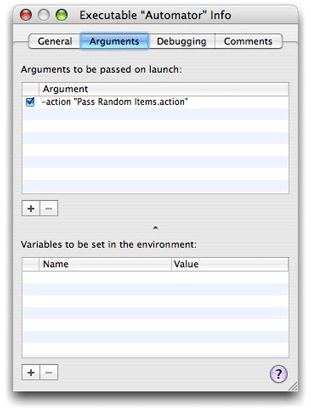
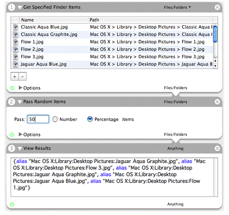
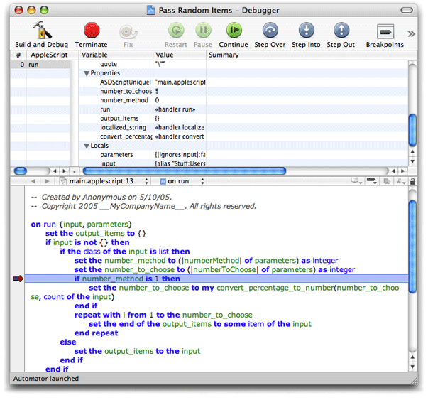

> 导航：[总目录](../../../README.md) · [documentation](../../../_indexes/documentation.md) · [Automator AppleScript Actions Tutorial](Introduction%20to%20Automator%20AppleScript%20Actions%20Tutorial.md)

[Next](Document%20Revision%20History.md)[Previous](Writing%20the%20Action%20Script.md)

# Building and Testing the Action

You have completed the steps required to develop the Pass Random Items action. You’ve created the user interface, established bindings, specified the `Info.plist` properties, and written the script. It’s time to build and test the action.

But before you begin, look at how an action project sets up its executable for testing. Choose Edit Active Executable ‘Automator’ from the Project menu to display the Executable Info window. In the General pane of this window, you can see that the executable path is initialized to /Applications/Automator.app. Then click the tab for the Arguments pane; as Figure 7-1 shows, the `-action` argument passed to Automator tells it to load the Pass Random Items action.

__Figure 7-1__  Executable settings for the Pass Random Items action

To build and test the action in Xcode, choose Build and Run from the Build menu. Xcode builds the action and then launches Automator. As part of the build process, Xcode runs the `amlint` utility to perform a number of action-specific tests. The results of these tests appear along with all other build results.

Assuming the action builds without error or warning and Automator launches, the next thing you should do is compose a workflow in which users would likely include the Pass Random Items action. Figure 7-2 shows a possible workflow. The Get Specified Finder Items actions allows you to select a collection of Finder items and then passes it to the Pass Random Items action. You can view the output of your action using the View Results action. Check to see if the correct number or percentage was passed and if the selection is truly random.

__Figure 7-2__  Testing the Pass Random Items action in a workflow

Automator has its own set of actions that are useful in testing. To see them, disclose the Applications folder under the Library column of the application and select Automator. View Results is one of these actions. Others that you might find useful in action development and testing are the following:

- Run AppleScript — Enables you to prototype a script before using it in an action.
- Wait For User Action — Displays a message informing users what must be done at this point for the workflow; if the action isn’t completed by a specified period, it stops the workflow.
- Confirmation Dialog — Allows you to pause or cancel execution of the workflow.

If Xcode displays errors and warnings when you attempt to build the action, or if the action doesn’t behave as expected, and you cannot readily pinpoint the cause of the problem, you can either debug the action (using a special AppleScript debugger) or add log statements. To debug an AppleScript action:

1. In the Xcode script editor, set a breakpoint in the script.

   Click in the gray strip next to the line you want the debugger to break on. A black breakpoint indicator appears in the gray strip.
2. Choose Build and Debug from the Build menu.
3. When Automator launches, construct a workflow with your action in it and execute it.

   When your action runs, the Xcode AppleScript debugger shows a debugging window similar to the one in Figure 7-3.

__Figure 7-3__  The AppleScript debugger

The debugger lets you step through the script and shows the values of globals, locals, and properties.

You can also insert `log` or `display dialog` statements in the script at points where you want to display current values. If the log statement is inside an application `tell` block, use the `tell me to log` expression instead of the simple `log`. The output of these statements appears in the Console log (not in the Automator log).

For additional debugging information, see the section “Frequently Asked Questions About Debugging Automator Actions” in “[Developing an Action](https://developer.apple.com/library/archive/documentation/AppleApplications/Conceptual/AutomatorConcepts/Articles/DevelopAction.html#//apple_ref/doc/uid/TP40001511)” in _[Automator Programming Guide](../Automator%20Programming%20Guide/Introduction%20to%20Automator%20Programming%20Guide.md#apple-f4xwc4dqnrsv64tfmyxwi33df52wszbpkridimbqgaytinjq)_.

[Next](Document%20Revision%20History.md)[Previous](Writing%20the%20Action%20Script.md)

